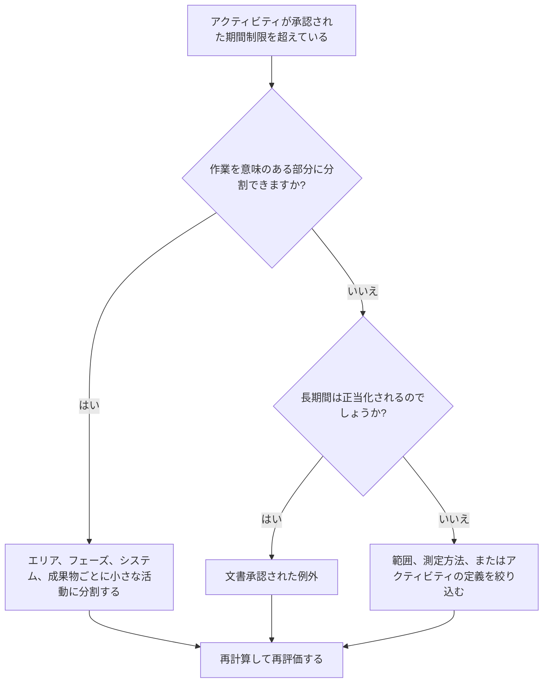

## 目的

このガイドは、スケジューラが承認されたプロジェクトのしきい値を超える期間のアクティビティを確認し、改善するのに役立ちます。許容可能な期間は、プロジェクトの種類、詳細レベル、報告サイクル、契約要件、および長時間のアクティビティに対するクライアントの感度によって異なります。

## 始める前に

アクションを実行する前に、次の情報を収集してください。

- このメトリクスの現在の評価結果。
- プロジェクトまたはスケジュール レベルの承認された最大アクティビティ期間。
- 期間のしきい値を超えるアクティビティのリスト。
- 元の期間、残りの期間、アクティビティ タイプ、ステータス、WBS、カレンダー、および合計フロート。
- ベースライン要件、クライアントのレポートに対する期待、PMO スケジュールの品質ルール。
- 先読み計画期間、進捗更新サイクル、規律またはパッケージの所有権。
- 調達、修復、納品、レビュー、テスト、または努力レベルのアクティビティなどの正当な例外。

## 結果を理解する

強力な結果は、承認された長期しきい値を超える未解決のアクティビティがゼロであることです。

許容可能な結果には、特に合理的に分割できないアクティビティや、要約のような制御アクティビティとして意図的に管理されているアクティビティの場合、文書化された例外が含まれる場合があります。これらは制限され、明確に正当化される必要があります。

結果が弱い場合は、効果的な計画と制御を行うには範囲が広すぎるアクティビティがスケジュールに多数含まれていることを意味します。これにより、進捗状況の可視性が低下し、実際にどの作業がスケジュールを推進しているのかを理解することが難しくなる可能性があります。

## 改善目標

目標は、承認された期間制限を超える未解決のアクティビティが 0 であることです。

目標は、より適切な制御が必要な場合には、長いアクティビティをより小さく意味のあるアクティビティに分割し、長期間が適切な場合には有効な例外を文書化することです。

## 行動計画

### ステップ 1: 主要な問題を特定する

プロジェクト定義の期間しきい値を超えるアクティビティをリストする P6 レイアウトまたはレポートを作成します。アクティビティ ID、アクティビティ名、WBS、アクティビティ タイプ、元の期間、残りの期間、開始、終了、カレンダー、合計フロート、アクティビティ ステータスが含まれます。

それぞれのアクティビティを確認し、次のことを尋ねます。

- アクティビティの期間は、このプロジェクト タイプおよびスケジュール レベルの承認されたしきい値よりも長いですか?
- アクティビティは複数の作業ステップ、場所、システム、エリア、または成果物をカバーしていますか?
- 各更新サイクル中に進捗状況を客観的に測定できますか?
- クライアントまたは PMO は継続時間が長いことに敏感であるため、アクティビティにはさらに詳細な情報が必要ですか?
- そのアクティビティは、長く存続すべき有効な例外ですか?

### ステップ 2: 推奨される修正を適用する

作業をより小さな部分に計画および測定できる場合は、長いアクティビティを分割します。一般的な内訳方法には、場所、WBS エリア、分野、システム、成果物、フェーズ、作業員の順序、または報告期間が含まれます。

アクティビティを分割するときは、実際のロジック シーケンスを保持します。適切な先行者と後続者を追加し、正しいカレンダーを割り当て、新しいアクティビティが実際の作業の実行方法を反映していることを確認します。

指標を満たすためだけにアクティビティを分割しないでください。この内訳により、管理、進捗状況の測定、先取り計画、またはレポートの明確さが向上します。

### ステップ 3: 一般的なブロッカーを削除する

一般的な阻害要因としては、不完全なスコープ定義、脆弱な WBS 構造、フィールド入力の制限、アクティビティ数を低く抑える圧力などが挙げられます。これらを解決するには、責任ある規律、パッケージ所有者、または構築リーダーとともに長期にわたるアクティビティをレビューします。

もう 1 つの阻害要因は、シーケンスとして計画する必要がある作業を表すために 1 つの長いアクティビティを使用していることです。アクティビティに複数の引き継ぎ、作業面、成果物、または制御ポイントが含まれている場合は、おそらくより詳細な情報が必要になります。

### ステップ 4: 変更を検証する

長いアクティビティを分割または調整した後、スケジュールを再計算します。それぞれの新しいアクティビティに適切なロジック、期間、カレンダー、および進行状況の測定があることを確認します。

合計フロート、クリティカル パス、最長パス、マイルストーンの日付を確認します。内訳によって基準日が変更された場合は、その理由をプロジェクト管理リーダーまたは PMO レビュー担当者に伝えます。

## 改善スケジュール

### 1 日目: 確認と診断

メトリクスを実行し、期間のしきい値を確認し、アクティビティを分割候補、有効な例外、および所有者の入力が必要な項目に分離します。

### 2 ～ 3 日目: 優先アクションの実施

クリティカルなアクティビティ、クリティカルに近いアクティビティ、およびクライアントに依存するアクティビティを最初に修正します。広範なアクティビティを分類し、有効な例外を文書化します。

### 4 ～ 5 日目: 初期の結果を監視する

スケジュールを再計算し、フロート、最長パス、マイルストーンの日付、および先読みの可視性の動きを確認します。

### 6日目: 最終調整

残りの不確実な項目は、責任ある分野、パッケージ所有者、またはプロジェクト管理リーダーと協力して解決してください。

### 7 日目: 再評価と比較

評価を再度実行し、結果をターゲットしきい値と比較します。

## 進捗状況の追跡

シンプルなトラッカーを使用して修正と承認を管理します。

| 日付 | 講じられたアクション | 予想される影響 | 結果・観察 | 次のステップ |
| --- | --- | --- | --- | --- |
| [日付] | 長期にわたる活動の見直し | 細分化が必要なアクティビティを特定する | 【観察結果】 | 所有者の割り当て |
| [日付] | アクティビティを小さな作業ステップに分割する | 進捗状況の可視性の向上 | 【観察結果】 | スケジュールを再計算する |
| [日付] | 文書化された有効な例外 | レビューのトレーサビリティを向上させる | 【観察結果】 | 指標を再評価する |

## 結果が改善しない場合

結果が改善しない場合は、期間のしきい値が不明瞭でないか、一貫性なく適用されているか、スケジュール レベルと一致していないかを確認してください。また、長時間にわたるアクティビティが特定の WBS 領域、専門分野、またはプロジェクトのフェーズに集中していないかどうかも確認します。

長期にわたる未解決のアクティビティが、重要な作業、重要な作業に近い作業、契約上の作業、レポート作業、またはクライアントに依存する作業に影響を与える場合は、エスカレーションします。

## メンテナンス

スケジュールの更新、ベースラインの開発、および主要な再順序付けの実行のたびに、このメトリクスを確認してください。プロジェクトが別のフェーズまたは詳細レベルに移行する場合は、しきい値を更新します。

## 概要チェックリスト

- [ ] 現在の結果をレビューしました
- [ ] 目標閾値を確認しました
- [ ] 特定された主な問題
- [ ] 長期にわたる活動の見直し
- [ ] 分割候補者を特定
- [ ] 役立つ部分に分けられたアクティビティ
- [ ] 有効な例外が文書化されている
- [ ] スケジュールが再計算されました
- [ ] 結果の監視
- [ ] 評価の繰り返し
- [ ] 次のステップの文書化
## 関連コンテンツ
- [ブログテンプレート](03_blog_template.md)
- [スケジュールとは](../../12b_blogs_jp/01_WHAT%20A%20SCHEDULE%20IS/01_blog.md)
- [堅牢なロジック](../../12b_blogs_jp/02_ROBUST%20LOGIC/02_ROBUST%20LOGIC.md)
