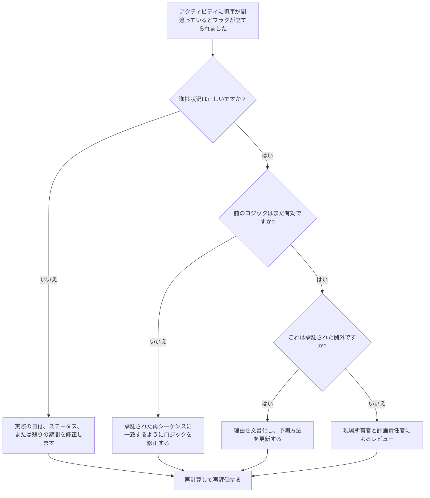

## 目的

このガイドは、スケジューラーが Primavera P6 で順序が正しくないアクティビティを確認して修正するのに役立ちます。これは、必要な先行ロジックが満たされる前にアクティビティが開始または進行した場合に適用されます。

## 始める前に

アクションを実行する前に、次の情報を収集してください。

- このメトリクスの現在の評価結果。
- 順序が間違っているとフラグが立てられたアクティビティのリスト。
- 最新の更新で使用されたデータの日付。
- 実際の開始、実際の終了、残りの期間、およびアクティビティのステータス。
- 関係タイプとラグを含む、先行および後続関係の詳細。
- 計算設定、特に保持されるロジックと進行状況のオーバーライドをスケジュールします。
- 計画されたロジックが完了する前に作業が進んだ理由に関するフィールドの説明。

## 結果を理解する

強力な結果は、未解決のシーケンス外のアクティビティがゼロであることです。

許容可能な結果には、作業が意図的に再順序付けされ、新しい計画を反映するためにスケジュール ロジックが更新された、文書化された例外が含まれる場合があります。

弱い結果は、スケジュールの更新に既存の論理ネットワークと競合する進行状況が含まれていることを意味します。これは、不正確なステータス、実績値の欠落、古いロジック、または予測にまだ反映されていない実際のフィールドの再順序付けを示している可能性があります。

## 改善目標

目標は、未解決のシーケンス外アクティビティが 0 件であることです。

目標は、各項目がステータス エラー、論理エラー、または実際の再順序付けイベントであるかどうかを判断し、現在の計画を表すようにスケジュールを修正することです。

## 行動計画

### ステップ 1: 主要な問題を特定する

P6 レイアウトを作成するか、シーケンス外のアクティビティをリストしたレポートを作成します。アクティビティ ID、アクティビティ名、WBS、ステータス、実際の開始、実際の終了、残り期間、開始、終了、合計フロート、先行者、後続者、関係タイプ、ラグ、駆動関係インジケーターが含まれます。

それぞれのアクティビティを確認し、次のことを尋ねます。

- アクティビティは、その前の要件が満たされる前に実際に開始されましたか?
- 前のステータスは正しいですか?
- 後継者のステータスは正しいですか？
- フィールドの順序を変更した後も関係は有効ですか?
- スケジュールのロジックを変更する必要がありますか、それとも進捗状況の更新を修正する必要がありますか?
- P6 スケジューリング オプションのうち、保持されたロジックと進行状況のオーバーライドのどちらが使用されていますか?

### ステップ 2: 推奨される修正を適用する

まずステータスエラーを修正してください。実際の開始、実際の終了、残り期間、または先行ステータスが間違っている場合は、ロジックを変更する前にアクティビティ データを更新します。

フィールドの順序が変更された場合は、承認された最新計画を表すようにロジックを修正します。メトリクスをクリアするために単に先行関係を削除しないでください。古いロジックを実際の実行シーケンスと一致する関係に置き換えます。

保持されているロジックと進行状況の上書き設定を確認します。保持ロジックは通常、残りの作業のために元の先行ロジックを保存しますが、進行状況オーバーライドでは、不完全な先行ロジックにもかかわらず残りの作業を続行できる場合があります。設定はプロジェクト管理手順と一致しており、結果を報告する前に理解されている必要があります。

### ステップ 3: 一般的なブロッカーを削除する

一般的な阻害要因には、フィールドの更新の遅れ、実際の日付の不完全さ、ロジックのレビューなしで進行状況を受け入れなければならないというプレッシャー、スケジュール計算オプションに関する混乱などが含まれます。

もう 1 つの阻害要因は、順序通りでない進行状況を単なるソフトウェアの問題として扱うことです。本当の問題は、プロジェクトが作業の順序を変更したかどうか、そしてスケジュールがその承認された順序を反映しているかどうかです。

### ステップ 4: 変更を検証する

修正後にスケジュールを再計算します。順序不一致チェックを再実行し、残りの各項目が修正、正当化、またはフォローアップ用に割り当てられていることを確認します。

合計フロート、最長パス、クリティカル パス、および短期的なマイルストーンを確認します。順序を外れた修正によって予測日が変更される可能性があるため、プロジェクト管理リーダーまたは PMO レビュー担当者に意味のある影響を伝えてください。

## 改善スケジュール

### 1 日目: 確認と診断

メトリクスを実行し、データ日付を確認し、結果をステータス エラー、ロジック エラー、実際の再順序付け、および考えられる例外に分類します。

### 2 ～ 3 日目: 優先アクションの実施

クリティカル、クリティカルに近いアクティビティ、および先読みアクティビティを最初に修正します。ステータスを更新し、古いロジックを修正し、承認された再順序付けを文書化します。

### 4 ～ 5 日目: 初期の結果を監視する

スケジュールを再計算し、フロート、最長パス、クリティカル パス、マイルストーンの日付での動きを確認します。

### 6日目: 最終調整

残りの項目は、現場リーダー、分野責任者、または計画マネージャーと解決してください。

### 7 日目: 再評価と比較

評価を再度実行し、結果をターゲットしきい値と比較します。

## 進捗状況の追跡

シンプルなトラッカーを使用して修正と承認を管理します。

| 日付 | 講じられたアクション | 予想される影響 | 結果・観察 | 次のステップ |
| --- | --- | --- | --- | --- |
| [日付] | 順序外のアクティビティをレビューしました | ステータスまたはロジックの問題を特定する | 【観察結果】 | 所有者の割り当て |
| [日付] | ステータスまたは実際の日付を修正しました | 更新精度の向上 | 【観察結果】 | スケジュールを再計算する |
| [日付] | 承認された再順序付けのための改訂されたロジック | 予測の信頼性を向上させる | 【観察結果】 | 指標を再評価する |

## 結果が改善しない場合

結果が改善しない場合は、同じ作業領域が繰り返し順番どおりに進行していないかどうかを確認してください。これは、弱い更新規律、非現実的なロジック、不完全なフィールド調整、または頻繁な未承認の再シーケンスを示している可能性があります。

未解決の項目がクリティカル、クリティカルに近い、契約上の、アクセス、引き継ぎ、またはクライアントに依存する作業に影響を及ぼす場合は、エスカレーションします。

## メンテナンス

スケジュールを発行する前に、更新サイクルごとにこのメトリックを確認してください。スケジュール レポートを PMO レポート、遅延分析、または復旧計画に使用する前に、順序どおりでない進行状況が解決されていることを確認します。

## 概要チェックリスト

- [ ] 現在の結果をレビューしました
- [ ] 目標閾値を確認しました
- [ ] データ日付が確認されました
- [ ] 特定された主な問題
- [ ] ステータスエラーが修正されました
- [ ] 論理エラーを修正しました
- [ ] 承認された再配列の文書化
- [ ] スケジュール計算設定の見直し
- [ ] スケジュールが再計算されました
- [ ] 結果の監視
- [ ] 評価の繰り返し
- [ ] 次のステップの文書化
## 関連コンテンツ
- [ブログテンプレート](03_blog_template.md)
- [スケジュールとは](../../12b_blogs_jp/01_WHAT%20A%20SCHEDULE%20IS/01_blog.md)
- [堅牢なロジック](../../12b_blogs_jp/02_ROBUST%20LOGIC/02_ROBUST%20LOGIC.md)
