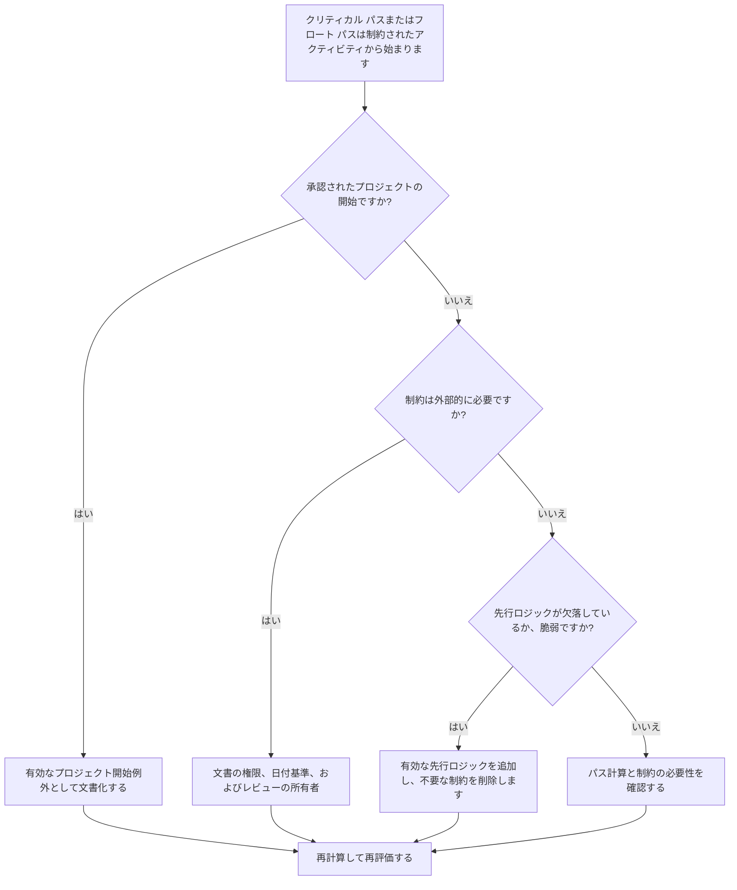

## 目的

このガイドは、スケジューラーが制約付きアクティビティで始まるクリティカル パスまたはフロート パス チェーンをレビューするのに役立ちます。承認されたプロジェクトの開始は通常、有効な例外です。問題は、ダウンストリーム パスが論理シーケンスではなく制約から始まる場合です。

## 始める前に

アクションを実行する前に、次の情報を収集してください。

- このメトリクスの現在の評価結果。
- Primavera P6 からのクリティカル パスまたはフロート パス レポート。
- フラグが立てられた各パスの最初のアクティビティ。
- 制約タイプ、制約日付、および予想される日付。
- パス開始アクティビティの先行および後続関係。
- データ日付、プロジェクト開始マイルストーン、ベースライン要件、および PMO またはクライアントのスケジュール ルール。
- 承認された外部制約に関する説明。

## 結果を理解する

強力な結果は、承認されたプロジェクトの開始を除き、制約で始まる未解決のクリティカル パスまたはフロート パスがゼロであることです。

許容可能な結果には、続行の通知、所有者アクセスの解除、許可の解除、または契約上の保留ポイントなど、文書化された外部制約が含まれる場合があります。これらは明確に正当化されるべきです。

弱い結果は、パスがネットワーク ロジックではなく強制された日付によって制御されている可能性があることを意味します。これにより、クリティカル パスまたはフロート パスの信頼性が、予測、レポート、遅延分析において低下する可能性があります。

## 改善目標

ターゲットは、制約で始まる 0 個の未解決パスです。

目的は、パスが承認されたプロジェクトの開始から開始すべきか、有効な先行ロジックから開始すべきか、文書化された外部制約から開始すべきかを確認することです。

## 行動計画

### ステップ 1: 主要な問題を特定する

クリティカル パスと選択したフロート パスを表示する P6 レイアウトまたはレポートを作成します。各パスの最初のアクティビティについては、アクティビティ ID、アクティビティ名、WBS、開始、終了、合計フロート、フリー フロート、主制約、制約日付、先行者、後続者、およびアクティビティ ステータスを含めます。

フラグが立てられた各パスを確認し、次のように尋ねます。

- これは承認されたプロジェクトの開始または続行通知アクティビティですか?
- 制約は契約上、または外部的に必要ですか?
- アクティビティに先行ロジックが欠落していませんか?
- 制約マスクは弱い、または不完全なスケジュール ネットワークですか?
- 制約が削除されると、パスの開始点は変わりますか?
- 制約された開始は PMO またはクライアントのレビュー用に文書化されていますか?

### ステップ 2: 推奨される修正を適用する

制約されたアクティビティが承認されたプロジェクトの開始である場合は、それを有効な例外として文書化し、それがパスの意図された開始点であることを確認します。

制約が外部から必要な場合は、その理由が明らかな場合にのみ制約を保持してください。契約のマイルストーン、アクセスの解放、許可、所有者の指示、規制要件などのソースを文書化します。

制約が不要な場合は、制約を削除し、アクティビティが以前の作業、承認、引き継ぎ、調達、またはアクセスに依存する有効な先行ロジックを追加します。スケジュールを再計算し、パスがロジック駆動になっていることを確認します。

### ステップ 3: 一般的なブロッカーを削除する

一般的な阻害要因には、古いベースラインから継承された制約、日付を強制するために使用される制約、インターフェイス ロジックの欠落、外部日付の所有権の不明確などが含まれます。

別のブロッカーは、P6 がクリティカル パスを識別するという理由だけでクリティカル パスが信頼できると想定しています。パスが不必要な制約で始まる場合、パスは真の CPM ロジックではなく日付制御を反映している可能性があります。

### ステップ 4: 変更を検証する

制約またはロジックを変更した後、スケジュールを再計算します。クリティカル パス、最長パス、選択したフロート パス、合計フロート、および主要なマイルストーンの日付を確認します。

パスが大幅に変更された場合は、その理由を文書化し、プロジェクト管理責任者、PMO レビュー担当者、またはクライアントのスケジューラに影響を伝えます。

## 改善スケジュール

### 1 日目: 確認と診断

メトリクスを実行し、制約のあるパス開始アクティビティを特定し、結果をプロジェクト開始例外、有効な外部制約、欠落しているロジック、および不要な制約に分類します。

### 2 ～ 3 日目: 優先アクションの実施

クリティカルなパスとクライアント依存のパスを最初に修正します。不要な制約を削除し、不足しているロジックを追加し、承認された例外を文書化します。

### 4 ～ 5 日目: 初期の結果を監視する

スケジュールを再計算し、クリティカル パス、最長パス、フロート パス、マイルストーンの日付の動きを確認します。

### 6日目: 最終調整

残りの制約されたパスの解決は、責任ある所有者、プロジェクト管理リーダー、またはクライアントのレビュー担当者から始まります。

### 7 日目: 再評価と比較

評価を再度実行し、結果をターゲットしきい値と比較します。

## 進捗状況の追跡

シンプルなトラッカーを使用して修正と承認を管理します。

| 日付 | 講じられたアクション | 予想される影響 | 結果・観察 | 次のステップ |
| --- | --- | --- | --- | --- |
| [日付] | 制約付きパススタートアクティビティの見直し | 日付ベースのパスの開始点を特定する | 【観察結果】 | 所有者の割り当て |
| [日付] | 不要な制約を削除しました | ロジック駆動パスの復元 | 【観察結果】 | スケジュールを再計算する |
| [日付] | 文書化された承認された例外 | レビューのトレーサビリティを向上させる | 【観察結果】 | 指標を再評価する |

## 結果が改善しない場合

結果が改善しない場合は、制約が特定の WBS 領域、インターフェイス パッケージ、またはプロジェクト フェーズに集中していないかどうかを確認してください。繰り返し発見されることは、スケジュールが完全なロジックではなく、強制された日付によって制御されていることを示している可能性があります。

未解決の制約付きパスのエスカレーションは、クリティカル、クリティカルに近い、契約上の、クライアントに依存する、アクセス、またはハンドオーバー関連の作業に影響を与えるときに開始されます。

## メンテナンス

スケジュールの更新、ベースラインのレビュー、および主要な再順序付けの実行のたびに、このメトリクスを確認してください。復旧計画、クライアントの日付変更、またはインターフェイスの改訂後は特に注意してください。

## 概要チェックリスト

- [ ] 現在の結果をレビューしました
- [ ] 目標閾値を確認しました
- [ ] クリティカル パス レポートまたはフロート パス レポートのレビュー
- [ ] プロジェクト開始の例外が特定されました
- [ ] 制約の基礎がチェックされました
- [ ] 欠落していたロジックを修正しました
- [ ] 不要な制約を削除
- [ ] 承認された例外を文書化
- [ ] スケジュールが再計算されました
- [ ] 結果の監視
- [ ] 評価の繰り返し
- [ ] 次のステップの文書化
## 関連コンテンツ
- [ブログテンプレート](03_blog_template.md)
- [スケジュールとは](../../12b_blogs_jp/01_WHAT%20A%20SCHEDULE%20IS/01_blog.md)
- [堅牢なロジック](../../12b_blogs_jp/02_ROBUST%20LOGIC/02_ROBUST%20LOGIC.md)
