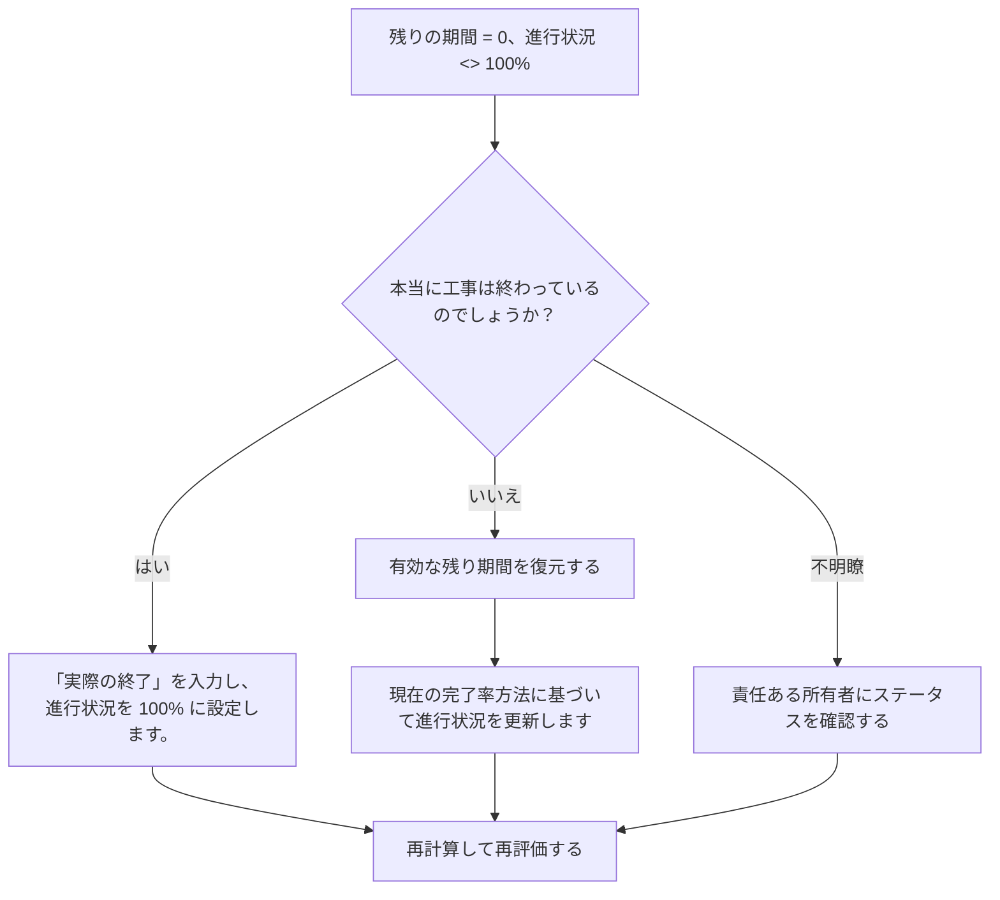

## 目的

このガイドは、スケジューラが残り期間が 0 であるが進捗が 100% ではないアクティビティを確認して修正するのに役立ちます。残り期間、進捗率、実際の終了状況、アクティビティ ステータスを調整することで、よりクリーンな Primavera P6 ステータス更新をサポートします。

## 始める前に

アクションを実行する前に、次の情報を収集してください。

- このメトリクスの現在の評価結果。
- 残り期間 = 0、進行状況 <> 100% のアクティビティのリスト。
- アクティビティのステータス、実際の開始時間、実際の終了時間、元の期間、残りの期間、および完了時の期間。
- 完了率タイプおよび関連する進行状況フィールド。
- 物理的な完了率、期間の完了率、ユニットの完了率、およびアクティビティの完了率。
- データの日付と最新の進捗状況の更新メモ。
- 作業が完了したか、まだ作業が残っているかを現場で確認します。

## 結果を理解する

良好な結果は、残存期間 = 0 でアクティビティがゼロで、進捗が 100% 以下または 100% 以上であることです。

許容可能な結果には、特定の完了率方法によって一時的なレポートの差異が生じるという文書化されたまれなケースが含まれる場合がありますが、これらは正式なレポートの前に解決する必要があります。

弱い結果は、残りの作業と進捗状況が一致しないアクティビティがスケジュールに含まれていることを意味します。これにより、不正確なレポート、獲得価値の問題、または誤解を招く完了ステータスが発生する可能性があります。

## 改善目標

目標は、残り期間 = 0、進捗度 <> 100% の未解決アクティビティが 0 件であることです。

目標は、各アクティビティが完了しているか、進捗状況が誤って更新されているか、またはレビューが必要な完了率方法を使用しているかどうかを確認することです。

## 行動計画

### ステップ 1: 主要な問題を特定する

残り期間が 0 に等しく、進捗状況が 100% ではないアクティビティをフィルターする P6 レイアウトまたはレポートを作成します。アクティビティ ID、アクティビティ名、WBS、アクティビティ ステータス、実際の開始時間、実際の終了時間、元の期間、残りの期間、完了率タイプ、物理的な完了率、期間の完了率、単位の完了率、およびアクティビティの完了率が含まれます。

それぞれのアクティビティを確認し、次のことを尋ねます。

- 本当に工事は終わっているのでしょうか？
- 完了している場合、実際の終了が表示されませんか?
- 完了していない場合、残り期間が 0 になるのはなぜですか?
- どのパーセント完了タイプが使用されていますか?
- 進行状況の値は、物理的な進行状況、持続時間、または単位の進行状況から取得されますか?
- これはステータス更新エラーですか、それとも進行状況の計算の問題ですか?

### ステップ 2: 推奨される修正を適用する

作業が完了した場合は、アクティビティを完了として更新します。プロジェクトの更新手順に従って、実際の終了時間を入力し、残り期間が 0 であることを確認し、進捗状況が 100% であることを確認します。

作業が完了していない場合は、適切な残り期間を復元します。責任のある所有者に残りの作業を確認し、アクティビティの完了率タイプに基づいて関連する進捗フィールドを更新します。

問題の原因が完了率の方法である場合は、アクティビティで「物理的な完了率」、「期間の完了率」、または「単位の完了率」を使用する必要があるかどうかを確認してください。完了率のタイプを不用意に変更しないでください。プロジェクト管理手順に合わせて調整します。

### ステップ 3: 一般的なブロッカーを削除する

一般的な阻害要因としては、不完全なフィールド更新、実際の終了日の欠落、物理的な完了率と期間の完了率の混同、検証なしで外部システムからインポートされた進行状況などが挙げられます。

別のブロッカーは、残りの期間を進行状況フィールドとして扱っています。残りの期間は、単に完了したと報告された作業量ではなく、アクティビティを完了するまでにまだ必要な時間を表す必要があります。

### ステップ 4: 変更を検証する

修正後にスケジュールを再計算します。メトリクスを再実行し、残りの各項目が修正されているか、フォローアップ用に割り当てられていることを確認します。

完了したアクティビティ、実際の終了日、進捗レポート、達成額出力、および先読みレポートをレビューして、修正によって新たな不一致が生じていないことを確認します。

## 改善スケジュール

### 1 日目: 確認と診断

メトリクスを実行し、データ日付を確認し、結果を完了した作業の欠落ステータス、残り期間がゼロの未完了の作業、および完了率メソッドの問題に分類します。

### 2 ～ 3 日目: 優先アクションの実施

まずレポートに使用されるアクティビティを修正します。必要に応じて、実際の終了を更新し、残りの期間を復元するか、進行状況の値を修正します。

### 4 ～ 5 日目: 初期の結果を監視する

スケジュールを再計算し、進捗レポート、完了したアクティビティ リスト、および獲得価値の出力を確認します。

### 6日目: 最終調整

残りの不確実な項目は、担当分野、フィールドリーダー、またはプロジェクト管理リーダーと協力して解決してください。

### 7 日目: 再評価と比較

評価を再度実行し、結果をターゲットしきい値と比較します。

## 進捗状況の追跡

シンプルなトラッカーを使用して修正と承認を管理します。

| 日付 | 講じられたアクション | 予想される影響 | 結果・観察 | 次のステップ |
| --- | --- | --- | --- | --- |
| [日付] | RD 0 をレビューしましたが、アクティビティの進行状況が 100 ではありませんでした | ステータスの不一致を特定する | 【観察結果】 | 所有者の割り当て |
| [日付] | 実際の終了を入力し、進行状況を修正しました | 完了ステータスを揃える | 【観察結果】 | スケジュールを再計算する |
| [日付] | 復元された残りの持続時間 | 未完了アクティビティのステータスを修正する | 【観察結果】 | 指標を再評価する |

## 結果が改善しない場合

結果が改善されない場合は、進捗状況の更新が一貫性なくインポート、コピー、または計算されているかどうかを確認してください。チームごとに異なる完了率方法を使用していないか、更新ワークフローに実際の終了日が含まれていないかを確認してください。

未解決の項目がクリティカル、クリティカルに近い、稼得額、クライアントのレポート、支払い、または引き継ぎ関連の作業に影響を及ぼす場合は、エスカレーションします。

## メンテナンス

レポートを発行する前に、更新サイクルごとにこのメトリックを確認してください。これは、実際の日付、残りの期間、完了率、アクティビティ ステータスのチェックとともに、標準的な更新検証の一部である必要があります。

## 概要チェックリスト

- [ ] 現在の結果をレビューしました
- [ ] 目標閾値を確認しました
- [ ] データ日付が確認されました
- [ ] 特定された主な問題
- [ ] 完了したアクティビティが正しく更新されました
- [ ] 必要に応じて実際の終了日を入力
- [ ] 作業が完了していない場合は残りの期間が復元されます
- [ ] 完了率タイプのレビュー
- [ ] スケジュールが再計算されました
- [ ] 結果の監視
- [ ] 評価の繰り返し
- [ ] 次のステップの文書化
## 関連コンテンツ
- [ブログテンプレート](03_blog_template.md)
- [スケジュールとは](../../12b_blogs_jp/01_WHAT%20A%20SCHEDULE%20IS/01_blog.md)
- [堅牢なロジック](../../12b_blogs_jp/02_ROBUST%20LOGIC/02_ROBUST%20LOGIC.md)
