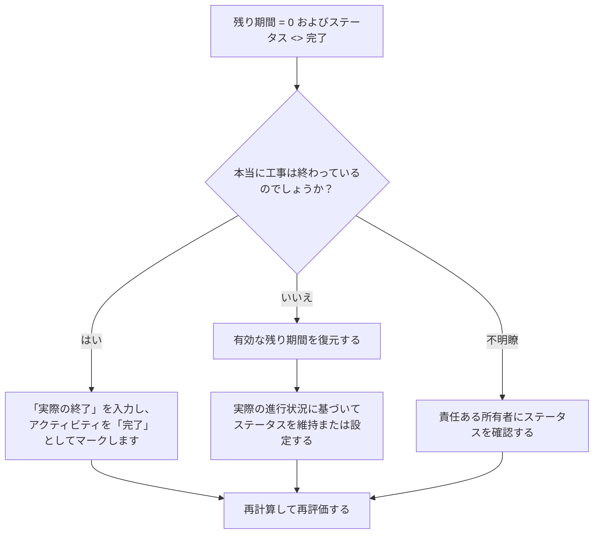

# 残り期間が 0 でステータスが未完了のアクティビティ - 改善ガイド

## 目的

このガイドは、残り期間が 0 であるがアクティビティ ステータスが完了していないアクティビティをスケジューラが確認して修正するのに役立ちます。残りの期間、実際の終了時間、およびアクティビティのステータスを調整することで、クリーンな Primavera P6 アップデートをサポートします。

## 始める前に

アクションを実行する前に、次の情報を収集してください。

- このメトリクスの現在の評価結果。
- 残り期間 = 0、アクティビティ ステータス <> 完了のアクティビティのリスト。
- アクティビティのステータス、実際の開始時間、実際の終了時間、元の期間、残りの期間、および完了時の期間。
- 完了率タイプと主要な進捗フィールド。
- データの日付と最新の更新メモ。
- 作業が完了したか、まだ作業が残っているかを現場で確認します。

## 結果を理解する

強力な結果は、残存期間 = 0 でステータスが完了ではない、アクティビティがゼロであることです。

許容可能な結果には、まれに一時的な更新ケースが含まれる場合がありますが、これらは正式なレポートの前に解決する必要があります。

弱い結果は、残り時間と完了ステータスが一致しないアクティビティがスケジュールに含まれていることを意味します。これにより、誤解を招く進捗レポート、不完全な実現、信頼性の低い先読みまたは達成額の出力が作成される可能性があります。

## 改善目標

目標は、残り期間 = 0 およびアクティビティ ステータス <> 完了の未解決アクティビティが 0 件であることです。

目的は、各アクティビティが完了して終了する必要があるか、または未完了で有効な残り期間を復元する必要があるかを確認することです。

## 行動計画

### ステップ 1: 主要な問題を特定する

残り期間が 0 でアクティビティ ステータスが完了していないアクティビティをフィルタリングする P6 レイアウトまたはレポートを作成します。アクティビティ ID、アクティビティ名、WBS、アクティビティ ステータス、実際の開始、実際の終了、元の期間、残りの期間、完了率タイプ、アクティビティの完了率、開始、終了、および合計フロートが含まれます。

それぞれのアクティビティを確認し、次のことを尋ねます。

- 本当に工事は終わっているのでしょうか？
- 完了している場合、アクティビティステータスが完了していないのはなぜですか?
- 実際の仕上げがありませんか?
- 作業が完了していない場合、残り期間が 0 になるのはなぜですか?
- ステータスは手動でインポートまたは更新されましたか?
- そのアクティビティは、マイルストーン、努力レベル、またはその他の特別なアクティビティ タイプですか?

### ステップ 2: 推奨される修正を適用する

作業が完了した場合は、アクティビティを「完了」として更新します。実際の終了値を入力し、残り期間が 0 であることを確認し、進行状況の値がプロジェクトの更新手順に従っていることを確認します。

作業が完了していない場合は、適切な残り期間を復元します。責任ある所有者に残りの作業を確認し、実際の進行状況に基づいてアクティビティのステータスを「進行中」または「未開始」として維持します。

問題がインポートされた進行状況データに起因する場合は、インポート マッピングを確認し、ワークフローを更新します。更新プロセスでは、残り時間がゼロの未完了ステータスのアクティビティを残すべきではありません。

### ステップ 3: 一般的なブロッカーを削除する

一般的な阻害要因としては、実際の終了日の欠落、不完全なフィールド確認、インポートされた更新データ、期間ステータスとアクティビティ ステータスの混同などが挙げられます。

もう 1 つのブロッカーは、アクティビティを正式に完了せずに残りの期間を終了することです。残りの期間とアクティビティのステータスからも、作業が残っているかどうかについて同じことがわかります。

### ステップ 4: 変更を検証する

修正後にスケジュールを再計算します。メトリクスを再実行し、残りの各項目が修正されているか、フォローアップ用に割り当てられていることを確認します。

完了したアクティビティ リスト、実際の終了日、進捗レポート、達成額出力、および先読みレポートを確認して、修正によって新たな不一致が生じていないことを確認します。

## 改善スケジュール

### 1 日目: 確認と診断

メトリクスを実行し、データ日付を確認し、結果を完了ステータスが欠落している完了作業、残り期間がゼロの未完了作業、インポートまたはワークフローの問題に分類します。

### 2 ～ 3 日目: 優先アクションの実施

まずレポートに使用されるアクティビティを修正します。必要に応じて、実際の終了を入力するか、アクティビティを完了としてマークするか、残りの期間を復元します。

### 4 ～ 5 日目: 初期の結果を監視する

スケジュールを再計算し、完了したアクティビティ レポート、進捗レポート、および獲得価値の出力を確認します。

### 6日目: 最終調整

残りの不確実な項目は、担当分野、フィールドリーダー、またはプロジェクト管理リーダーと協力して解決してください。

### 7 日目: 再評価と比較

評価を再度実行し、結果をターゲットしきい値と比較します。

## 進捗状況の追跡

シンプルなトラッカーを使用して修正と承認を管理します。

| 日付 | 講じられたアクション | 予想される影響 | 結果・観察 | 次のステップ |
| --- | --- | --- | --- | --- |
| [日付] | RD 0 をレビューしましたが、アクティビティのステータスが完了していません | ステータスの不一致を特定する | 【観察結果】 | 所有者の割り当て |
| [日付] | 「実際の終了」を入力し、「完了」とマーク付け | 完了ステータスを揃える | 【観察結果】 | スケジュールを再計算する |
| [日付] | 復元された残りの持続時間 | 未完了アクティビティのステータスを修正する | 【観察結果】 | 指標を再評価する |

## 結果が改善しない場合

結果が改善されない場合は、進行状況の更新がインポート、コピー、または手動で矛盾して編集されていないかどうかを確認してください。実際の終了日が更新ワークフローに欠落していないか、またはユーザーがアクティビティを完了せずに残り期間を 0 に設定していないかを確認してください。

未解決の項目がクリティカル、クリティカルに近い、稼得額、クライアントのレポート、支払い、または引き継ぎ関連の作業に影響を及ぼす場合は、エスカレーションします。

## メンテナンス

レポートを発行する前に、更新サイクルごとにこのメトリックを確認してください。これは、実際の日付、残りの期間、完了率、アクティビティ ステータスのチェックとともに、標準的な更新検証の一部である必要があります。

## 概要チェックリスト

- [ ] 現在の結果をレビューしました
- [ ] 目標閾値を確認しました
- [ ] データ日付が確認されました
- [ ] 特定された主な問題
- [ ] 完了したアクティビティに正しくマークが付けられた
- [ ] 必要に応じて実際の終了日を入力
- [ ] 作業が完了していない場合は残りの期間が復元されます
- [ ] ワークフローのインポートまたは更新をチェック済み
- [ ] スケジュールが再計算されました
- [ ] 結果の監視
- [ ] 評価の繰り返し
- [ ] 次のステップの文書化
## 関連コンテンツ
- [残り期間が 0 でステータスが未完了のアクティビティ - 概要](01_overview_template.md)
- [ブログテンプレート](03_blog_template.md)
- [スケジュールとは](../../12b_blogs_jp/01_WHAT%20A%20SCHEDULE%20IS/01_blog.md)
- [堅牢なロジック](../../12b_blogs_jp/02_ROBUST%20LOGIC/02_ROBUST%20LOGIC.md)
