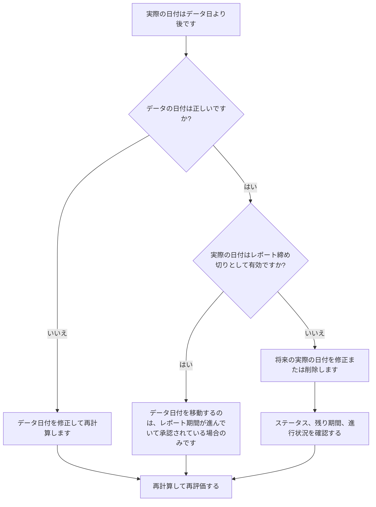

## 目的

このガイドは、スケジューラーが実際の日付が Primavera P6 データ日より後のアクティビティを確認して修正するのに役立ちます。実際のパフォーマンスを更新境界内または更新境界より前に維持することで、クリーンな更新規律をサポートします。

## 始める前に

アクションを実行する前に、次の情報を収集してください。

- このメトリクスの現在の評価結果。
- 最新のスケジュール更新で使用されるプロジェクト データの日付。
- 実際の日付がデータ日付よりも後のアクティビティのリスト。
- [実際の開始]、[実際の終了]、[アクティビティ ステータス]、[残りの期間]、および [完了率] フィールド。
- 進捗状況の更新のソース (フィールド レポート、インポート ファイル、タイムシート、手動更新など)。
- プロジェクト更新の締め切りルールとレポート期間。
- 既知の将来日付の作業エントリまたはデータ インポートの問題。

## 結果を理解する

強力な結果は、実際の日付がデータ日付より後のアクティビティがゼロであるということです。

許容可能な結果は依然としてゼロであるはずです。データ日付より後の実際の日付は、通常、更新エラーまたはデータ日付が間違っていることを示します。

弱い結果は、スケジュールに将来の実績が含まれていることを意味します。これにより、更新期間が実際にその日付に達する前に、スケジュール レポートが完了または開始されたものとして機能する可能性があります。

## 改善目標

目標は、実際の日付がデータ日よりも古い未解決のアクティビティが 0 件であることです。

目的は、実際の日付が間違っているか、データ日付が間違っているか、または更新インポート プロセスで将来の実績が許可されているかどうかを確認することです。

## 行動計画

### ステップ 1: 主要な問題を特定する

実際の開始日、実際の終了日、またはデータ日付より後のその他の実際の日付を持つアクティビティをフィルターする P6 レイアウトまたはレポートを作成します。アクティビティ ID、アクティビティ名、WBS、アクティビティ ステータス、実際の開始日、実際の終了日、開始日、終了日、残りの期間、完了率、カレンダー、およびデータ日付の参照が含まれます。

それぞれのアクティビティを確認し、次のことを尋ねます。

- プロジェクトのデータ日付は正しいですか?
- 実際の日付は正しいですか?
- 更新には締切日以降の進捗状況が含まれていましたか?
- インポート ファイルは将来の実際の日付をロードしましたか?
- 実際の日付を変更する必要がありますか、それともデータ日付を移動する必要がありますか?
- アクティビティのステータスは修正された実際の日付と一致していますか?

### ステップ 2: 推奨される修正を適用する

データ日付が間違っている場合は、承認されたレポート期間に従って修正し、スケジュールを再計算します。

実際の日付が間違っている場合は、実際の開始日または実際の終了日を適切な日付に修正します。データ日付までに作業が実際に開始または終了していない場合は、将来の実績を削除し、ステータス、残りの期間、および完了率を正しく更新します。

問題がインポートに起因する場合は、インポート ファイルとマッピングを確認してください。スケジュール レポートが発行される前に、将来の実際の日付がブロックまたはチェックされていることを確認します。

### ステップ 3: 一般的なブロッカーを削除する

一般的な阻害要因としては、レポート締切日を過ぎた日付をカバーする進捗ファイル、データ日付を確認せずに入力された手動更新、実際の日付と予測日の混同などが挙げられます。

もう 1 つの障害は、将来の実績値を受け入れるためだけにデータ日付を移動することです。データ日付は、承認された更新境界を表す必要があり、ステータス エラーを隠すために無造作に変更しないでください。

### ステップ 4: 変更を検証する

修正後にスケジュールを再計算します。メトリクスを再実行し、データ日付以降に実際の日付が残っていないことを確認します。

完了したアクティビティ リスト、進行中のアクティビティ リスト、達成額出力、およびスケジュール比較レポートをレビューして、修正によってその他のステータスの不一致が生じていないことを確認します。

## 改善スケジュール

### 1 日目: 確認と診断

メトリクスを実行し、データ日付を確認し、結果を誤った実際の日付、誤ったデータ日付、インポートの問題、および更新の締め切りの問題に分けます。

### 2 ～ 3 日目: 優先アクションの実施

まずレポートに使用されるアクティビティを修正します。実際の日付を修正し、ステータスを更新し、インポートの問題に対処します。

### 4 ～ 5 日目: 初期の結果を監視する

スケジュールを再計算し、進捗レポート、完了したアクティビティ リスト、獲得価値の出力、マイルストーンの日付を確認します。

### 6日目: 最終調整

残りの不確実な項目は、担当分野、フィールドリーダー、またはプロジェクト管理リーダーと協力して解決してください。

### 7 日目: 再評価と比較

評価を再度実行し、結果をターゲットしきい値と比較します。

## 進捗状況の追跡

シンプルなトラッカーを使用して修正と承認を管理します。

| 日付 | 講じられたアクション | 予想される影響 | 結果・観察 | 次のステップ |
| --- | --- | --- | --- | --- |
| [日付] | データ日以降の実際の日付を確認しました | 将来の実績を特定する | 【観察結果】 | 所有者の割り当て |
| [日付] | 修正された実際の開始または実際の終了 | 有効なステータス境界を復元する | 【観察結果】 | スケジュールを再計算する |
| [日付] | インポートプロセスの見直し | 今後の実績の繰り返しを防止する | 【観察結果】 | 指標を再評価する |

## 結果が改善しない場合

結果が改善しない場合は、インポート、タイムシート、または手動更新ワークフローを通じて将来の実績値が繰り返し導入されているかどうかを確認してください。更新の打ち切り手順を確認し、データの日付がすべての投稿者に明確に伝えられていることを確認してください。

未解決の項目がクリティカル、クリティカルに近い、稼得額、クライアントのレポート、支払い、または引き継ぎ関連の作業に影響を及ぼす場合は、エスカレーションします。

## メンテナンス

レポートを発行する前に、更新サイクルごとにこのメトリックを確認してください。これは、実際の日付、データ日付、残り期間、完了率、およびアクティビティ ステータスのチェックとともに、標準のステータス検証の一部である必要があります。

## 概要チェックリスト

- [ ] 現在の結果をレビューしました
- [ ] 目標閾値を確認しました
- [ ] データ日付が確認されました
- [ ] 特定された主な問題
- [ ] 将来の実際の日付が修正されました
- [ ] 活動状況を確認しました
- [ ] 残り時間と進行状況を確認
- [ ] インポートまたは更新ワークフローのレビュー
- [ ] スケジュールが再計算されました
- [ ] 結果の監視
- [ ] 評価の繰り返し
- [ ] 次のステップの文書化
## 関連コンテンツ
- [ブログテンプレート](03_blog_template.md)
- [スケジュールとは](../../12b_blogs_jp/01_WHAT%20A%20SCHEDULE%20IS/01_blog.md)
- [堅牢なロジック](../../12b_blogs_jp/02_ROBUST%20LOGIC/02_ROBUST%20LOGIC.md)
