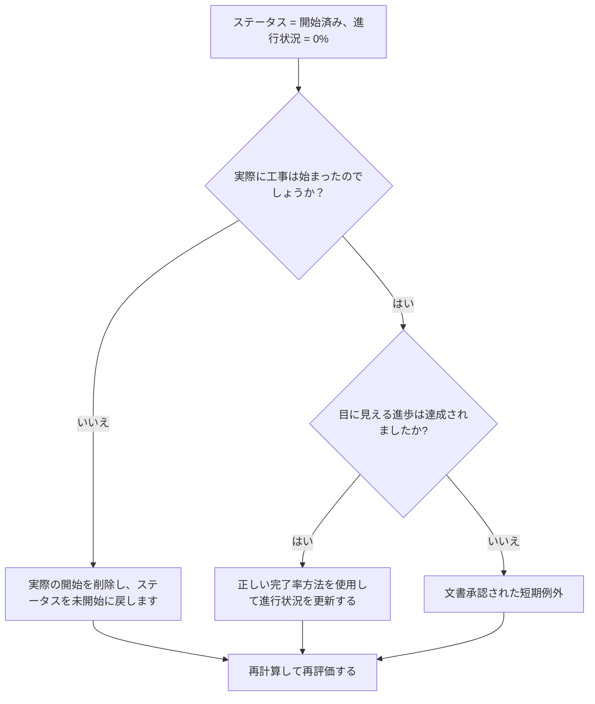

# Primavera P6 進捗 0% からスタートした活動 - 改善ガイド

## 目的

このガイドは、スケジューラがアクティビティ ステータスが開始済みだが進捗状況が 0% であるアクティビティを確認して修正するのに役立ちます。実際の開始、アクティビティのステータス、完了率、残りの期間を調整することで、よりクリーンな Primavera P6 アップデートをサポートします。

## 始める前に

アクションを実行する前に、次の情報を収集してください。

- このメトリクスの現在の評価結果。
- アクティビティ ステータス = 開始済み、進行状況 = 0% のアクティビティのリスト。
- 実際の開始、実際の終了、残りの期間、元の期間、およびアクティビティのステータス。
- 完了率タイプおよび関連する進行状況フィールド。
- 物理的な完了率、期間の完了率、ユニットの完了率、およびアクティビティの完了率。
- データの日付と最新の更新メモ。
- 実際に工事が始まったか、進捗状況を現場で確認。

## 結果を理解する

良好な結果は、「開始済み」ステータスのアクティビティがゼロで、進捗率が 0% であることです。

許容可能な結果には、更新期間の最後の時点でアクティビティが開始され、まだ測定可能な進捗が得られていないという、文書化されたまれなケースが含まれる場合があります。このようなケースは限定し、明確に説明する必要があります。

弱い結果は、開始ステータスと進行状況の値が一致しないアクティビティがスケジュールに含まれていることを意味します。これにより、誤解を招く進捗レポート、獲得価値の問題、先読みの混乱が生じる可能性があります。

## 改善目標

目標は、アクティビティ ステータス = 開始済み、進行状況 = 0% の未解決アクティビティが 0 件であることです。

目的は、各アクティビティが本当に開始されたかどうか、進行状況が失われていないか、アクティビティを未開始に戻す必要があるかどうかを確認することです。

## 行動計画

### ステップ 1: 主要な問題を特定する

ステータスが開始済みで進捗状況が 0% のアクティビティをフィルターする P6 レイアウトまたはレポートを作成します。アクティビティ ID、アクティビティ名、WBS、アクティビティ ステータス、実際の開始、実際の終了、元の期間、残りの期間、完了率タイプ、物理的な完了率、期間の完了率、単位の完了率、アクティビティの完了率、開始、終了、および合計フロートが含まれます。

それぞれのアクティビティを確認し、次のことを尋ねます。

- 実際に工事は始まったのでしょうか？
- 作業が開始された場合、どのような測定可能な進歩が達成されましたか?
- 実際のスタートは正しいですか?
- どのパーセント完了タイプが使用されていますか?
- 正しいフィールドに進捗状況がありませんか?
- この活動は実際の作業が開始されることなく管理的に開始されたのでしょうか?

### ステップ 2: 推奨される修正を適用する

作業が実際に開始されなかった場合は、間違った実際の開始を削除し、アクティビティを未開始に戻します。残りの期間と予測日がまだ有効であることを確認します。

作業が開始され、進捗が達成された場合は、完了率タイプに基づいて正しい進捗フィールドを更新します。 [物理的な完了率] に、物理的な進捗状況を入力します。 [期間の完了率] で、[残りの期間] に実行された作業が反映されていることを確認します。 [ユニットの完了率] については、ユニットの進行状況が更新されていることを確認します。

作業が開始されたものの、目に見える進歩が得られなかった場合は、その理由を文書化してください。これはまれで一時的なものである必要があります。たとえば、更新の終了近くに記録された動員の開始がまだ進行状況を獲得していない場合などです。

### ステップ 3: 一般的なブロッカーを削除する

一般的な阻害要因としては、フィールド数量の欠落、進捗値のないインポートされた実績開始、完了率タイプに関する混乱、測定可能な進捗が得られる前に作業を開始済みとして表示する必要があるというプレッシャーなどが挙げられます。

もう 1 つの障害は、実際の開始をステータス事実ではなく計画シグナルとして扱うことです。 「実際の開始」は、すぐに開始するつもりではなく、実際の作業の開始を表す必要があります。

### ステップ 4: 変更を検証する

修正後にスケジュールを再計算します。メトリクスを再実行し、残りの各項目が修正、正当化、またはフォローアップのために割り当てられていることを確認します。

進捗レポート、獲得額出力、先読みレポート、および進行中のアクティビティ リストを確認して、修正によって新たな不一致が生じていないことを確認します。

## 改善スケジュール

### 1 日目: 確認と診断

メトリクスを実行し、データ日付を確認し、結果を間違った開始、進捗状況の欠落、メソッドの完了率の問題、および考えられる例外に分類します。

### 2 ～ 3 日目: 優先アクションの実施

まずレポートに使用されるアクティビティを修正します。不正な実際の開始を削除するか、進行状況の値を更新するか、有効な例外を文書化してください。

### 4 ～ 5 日目: 初期の結果を監視する

スケジュールを再計算し、進捗レポート、稼得額出力、進行中のアクティビティ リスト、および先読みレポートを確認します。

### 6日目: 最終調整

残りの不確実な項目は、担当分野、フィールドリーダー、またはプロジェクト管理リーダーと協力して解決してください。

### 7 日目: 再評価と比較

評価を再度実行し、結果をターゲットしきい値と比較します。

## 進捗状況の追跡

シンプルなトラッカーを使用して修正と承認を管理します。

| 日付 | 講じられたアクション | 予想される影響 | 結果・観察 | 次のステップ |
| --- | --- | --- | --- | --- |
| [日付] | 開始されたアクティビティをレビューしましたが、進捗率は 0% でした | ステータスの不一致を特定する | 【観察結果】 | 所有者の割り当て |
| [日付] | 誤った実際の開始を削除しました | 正確なステータスを復元する | 【観察結果】 | スケジュールを再計算する |
| [日付] | 更新された進行状況の値 | 開始ステータスを進行状況に合わせる | 【観察結果】 | 指標を再評価する |

## 結果が改善しない場合

結果が改善しない場合は、実際のスタートが進行状況の値と一致せずにインポートされているかどうか、またはチームがスタートとしてカウントするものについて異なるルールを使用していないかどうかを確認してください。更新の打ち切り手順と完了率の方法を確認してください。

未解決の項目がクリティカル、クリティカルに近い、稼得額、クライアントのレポート、支払い、または引き継ぎ関連の作業に影響を及ぼす場合は、エスカレーションします。

## メンテナンス

レポートを発行する前に、更新サイクルごとにこのメトリックを確認してください。これは、実際の日付、残り期間、完了率、アクティビティ ステータスのチェックとともに、標準的な更新検証の一部である必要があります。

## 概要チェックリスト

- [ ] 現在の結果をレビューしました
- [ ] 目標閾値を確認しました
- [ ] データ日付が確認されました
- [ ] 特定された主な問題
- [ ] 間違った実際の開始が削除されました
- [ ] 不足している進捗状況が更新されました
- [ ] 完了率タイプのレビュー
- [ ] 有効な例外が文書化されている
- [ ] スケジュールが再計算されました
- [ ] 結果の監視
- [ ] 評価の繰り返し
- [ ] 次のステップの文書化
## 関連コンテンツ
- [Primavera P6 進捗 0% からスタートした活動 - 概要](01_overview_template.md)
- [ブログテンプレート](03_blog_template.md)
- [スケジュールとは](../../12b_blogs_jp/01_WHAT%20A%20SCHEDULE%20IS/01_blog.md)
- [堅牢なロジック](../../12b_blogs_jp/02_ROBUST%20LOGIC/02_ROBUST%20LOGIC.md)
