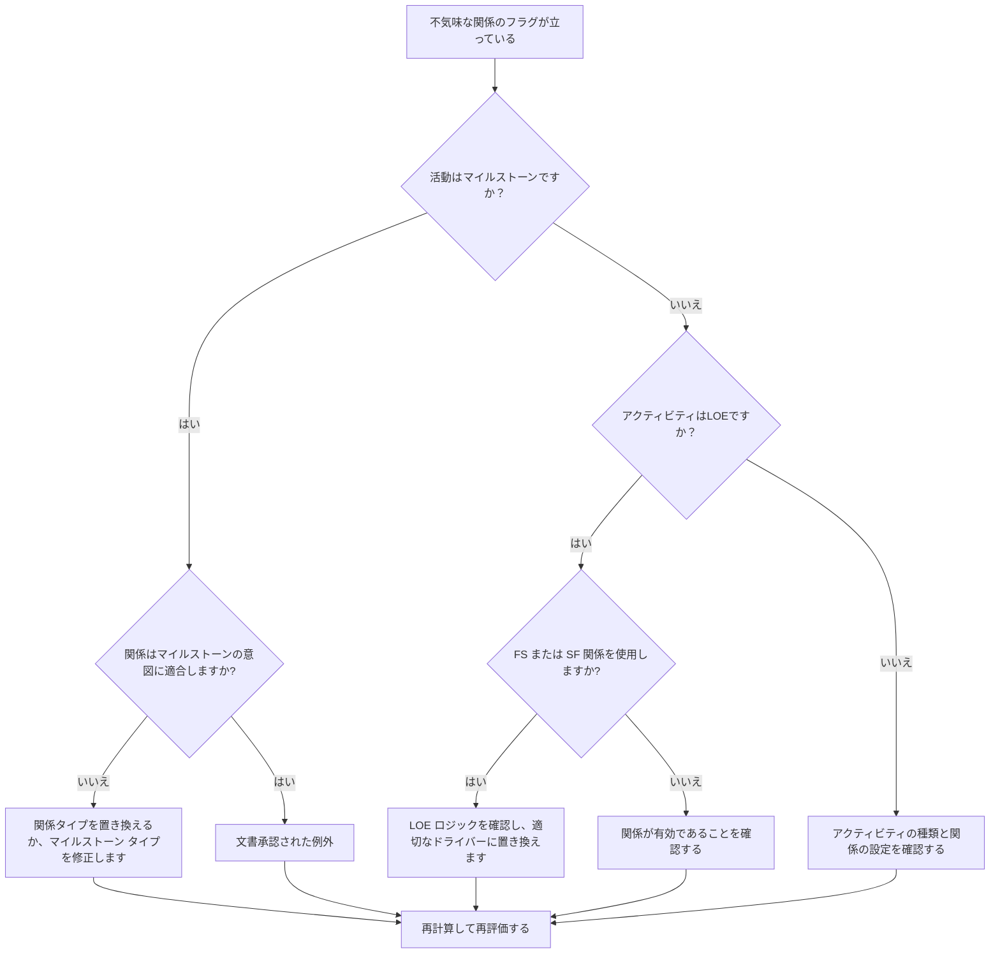

## 目的

このガイドは、スケジューラが、Primavera P6 の終了マイルストーン、開始マイルストーン、およびレベル オブ エフォート (LOE) アクティビティに関連する見苦しい関係を確認し、修正するのに役立ちます。

## 始める前に

アクションを実行する前に、次の情報を収集してください。

- このメトリクスの現在の評価結果。
- 先行者、後続者、アクティビティ タイプ、および関係タイプ別のフラグ付き関係のリスト。
- アクティビティ ID、アクティビティ名、WBS、アクティビティ タイプ、開始、終了、合計フロート、およびクリティカルまたは最長パスのステータス。
- 関係タイプ、ラグ、先行アクティビティのタイプ、および後続アクティビティのタイプ。
- マイルストーンの目的、LOE の目的、および関連する報告要件。
- データ日付と最新のスケジュール計算出力。

## 結果を理解する

強力な結果は、未解決の見苦しい関係がゼロになることです。

メトリクスは次のようなケースにフラグを立てる必要があります。

- SS または SF の後継者でマイルストーンを完了します。
- SS の先行者でマイルストーンを完了します。
- FF または SF の前作からマイルストーンを開始します。
- FS または FF の後継機でマイルストーンを開始します。
- LOEとFSの関係。
- LOEとSF関係。

まれな例外が存在する可能性がありますが、それらは文書化され、スケジュールのレビュー中に簡単に説明できるようにする必要があります。

## 改善目標

目標は未解決の醜い関係0です。

目標は、日付を強制したり弱いロジックを隠したりすることなく、各マイルストーンと LOE の関係を意図したスケジュール動作と一致させることです。

## 行動計画

### ステップ 1: 主要な問題を特定する

すべてのマイルストーンおよび LOE アクティビティを先行および後続の詳細とともに表示する P6 レイアウトまたはレポートを作成します。アクティビティ タイプ、関係タイプ、ラグ、開始、終了、合計フロート、およびクリティカル パスまたは最長パスのインジケーターが含まれます。

フラグが立てられた関係をそれぞれ確認し、次のように尋ねます。

- アクティビティの種類は正しいですか?
- 関係タイプはマイルストーンまたは LOE の目的と一致しますか?
- 関係は開始日、終了日、または報告日を強制しようとしていますか?
- 通常の FS、SS、または FF 関係の方がロジックをより適切に表現できますか?
- この関係は承認された例外ですか?

### ステップ 2: 推奨される修正を適用する

終了マイルストーンについては、ロジックが完了を推進しているか、完了に応答していることを確認します。 SS または SF 関係が実際の終了ベースの依存関係を表していない場合は、SS または SF 関係を置き換えます。

[開始マイルストーン] については、ロジックが開始イベントをサポートしていることを確認します。レポート日付を強制するために使用されている FF、SF、FS 後継、またはその他の不適切な関係を置き換えます。

LOE アクティビティの場合は、FS または SF 関係によって LOE ドライブが誤って個別に動作していないかどうかを確認してください。 LOE 活動は通常、他の作業を要約したり、他の作業にまたがったりするため、それらの関係は慎重に扱う必要があります。

関係が契約、クライアントの方法、または特別なスケジュール設計によって有効である場合は、その理由と承認を文書化します。

### ステップ 3: 一般的なブロッカーを削除する

一般的な阻害要因としては、古いスケジュールからのロジックのコピー、マイルストーン動作の誤解、ショートカットとしての SF 関係の使用、個別のアクティビティによって推進されるべき作業を制御するための LOE アクティビティの使用などが挙げられます。

もう一つの障害は、人間関係の清算を表面的なものとして扱うことです。これらのリンクは、フロート、クリティカル パスのレポート、マイルストーンの日付、およびスケジュールの信頼性に影響を与える可能性があります。

### ステップ 4: 変更を検証する

修正後にスケジュールを再計算します。メトリクスを再実行し、残りの各項目が修正、正当化、またはフォローアップのために割り当てられていることを確認します。

マイルストーンの日付、LOE の日付、合計フロート、クリティカルまたは最長のパス、および主要なレポート出力を確認して、修正によって新たな問題が発生していないことを確認します。

## 改善スケジュール

### 1 日目: 確認と診断

メトリクスを実行し、アクティビティの種類と関係パターンごとに結果をグループ化します。

### 2 ～ 3 日目: 優先アクションの実施

最初に、重要なマイルストーン、ほぼクリティカルなマイルストーン、契約上のマイルストーン、引き継ぎのマイルストーン、および顧客対応のマイルストーンにおける関係を修正します。

### 4 ～ 5 日目: 初期の結果を監視する

スケジュールを再計算し、フロート、クリティカル パス、マイルストーンの動き、LOE の動作を確認します。

### 6日目: 最終調整

残りの例外は、スケジューラ、プロジェクト管理リーダー、または PMO レビュー担当者と協力して解決します。

### 7 日目: 再評価と比較

評価を再度実行し、結果をターゲットしきい値と比較します。

## 進捗状況の追跡

シンプルなトラッカーを使用して修正と承認を管理します。

| 日付 | 講じられたアクション | 予想される影響 | 結果・観察 | 次のステップ |
| --- | --- | --- | --- | --- |
| [日付] | 見苦しい人間関係を見直した | 人間関係の問題を特定する | 【観察結果】 | 所有者の割り当て |
| [日付] | マイルストーン関係を修正 | マイルストーンの目的に合わせてロジックを調整する | 【観察結果】 | スケジュールを再計算する |
| [日付] | LOE 関係の見直し | LOE によるディスクリート作業の誤った駆動を防止する | 【観察結果】 | 指標を再評価する |

## 結果が改善しない場合

結果が改善しない場合は、インポート、ロジックのコピー、グローバル変更、または外部スケジュール統合を通じて同じ関係が再導入されているかどうかを確認してください。

未解決の項目が契約上のマイルストーン、クリティカル パスのレポート、クライアントの提出物、支払いイベント、または引き継ぎ日に影響を与える場合は、エスカレーションします。

## メンテナンス

このメトリクスは、各更新サイクル中およびベースラインの承認前に確認してください。これは、スケジュールのインポート、フラグネットのコピー、メジャーな再シーケンス、マイルストーンのリビジョンの後に特に役立ちます。

## 概要チェックリスト

- [ ] 現在の結果をレビューしました
- [ ] 目標閾値を確認しました
- [ ] マイルストーンと LOE アクティビティ タイプのレビュー
- [ ] フラグ付きの関係タイプがチェックされています
- [ ] 間違った関係が修正されました
- [ ] 有効な例外が文書化されている
- [ ] スケジュールが再計算されました
- [ ] フロートパスとクリティカルパスの見直し
- [ ] 結果の監視
- [ ] 評価の繰り返し
- [ ] 次のステップの文書化
## 関連コンテンツ
- [03_blog_template](../14_unusual_relations/03_blog_template.md)
- [スケジュールとは](../../12b_blogs_jp/01_WHAT%20A%20SCHEDULE%20IS/01_blog.md)
- [堅牢なロジック](../../12b_blogs_jp/02_ROBUST%20LOGIC/02_ROBUST%20LOGIC.md)
