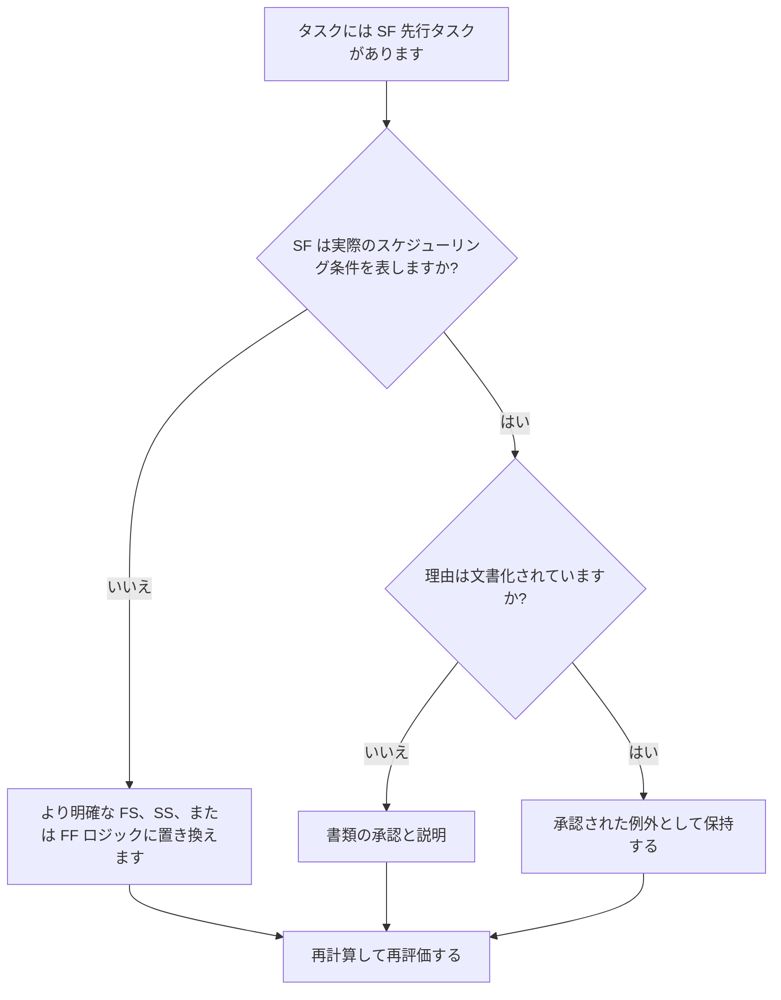

# Primavera P6 における SF の先駆者とのタスク アクティビティ - 改善ガイド

## 目的

このガイドは、スケジューラーが Primavera P6 の開始から終了 (SF) 先行関係を持つタスク アクティビティを確認して修正するのに役立ちます。

## 始める前に

アクションを実行する前に、次の情報を収集してください。

- このメトリクスの現在の評価結果。
- 少なくとも 1 つの SF 先行タスクを持つタスク アクティビティのリスト。
- アクティビティ ID、アクティビティ名、WBS、アクティビティ タイプ、開始、終了、合計フロート、およびクリティカルまたは最長パスのステータス。
- 先行アクティビティ ID、先行アクティビティ タイプ、関係タイプ、およびラグ。
- 制約、カレンダー、予想される終了条件、および関連する更新メモ。
- データ日付と最新のスケジュール計算出力。

## 結果を理解する

強力な結果は、SF 先行関係を持つ未解決のタスク アクティビティがゼロになることです。

SF 関係は、先行アクティビティが開始されるまで後続アクティビティが終了できないことを意味します。これは、通常の建設、エンジニアリング、調達、試運転ロジックでは珍しいことです。ほとんどのタスク関係は、実際のシーケンスを反映する場合、FS、SS、または FF ロジックで表す必要があります。

弱い結果は、タスク アクティビティの終了が、正当化するのが難しいロジック、またはスケジュールの別の部分からレビューせずにコピーされたロジックによって制御されている可能性があることを意味します。

## 改善目標

目標は、タスク アクティビティ上の未解決の SF 先行関係が 0 であることです。

目標は、各 SF 関係が有効なスケジューリング モデルであるか、より明確なロジックに置き換えるべきかを確認することです。

## 行動計画

### ステップ 1: 主要な問題を特定する

SF 先行タスクを使用してタスク アクティビティをフィルタリングする P6 レイアウトまたはレポートを作成します。先行 ID と後続 ID、アクティビティ タイプ、関係タイプ、ラグ、開始、終了、合計フロート、制約、およびクリティカル パスまたは最長パスのインジケーターが含まれます。

それぞれの関係を確認し、次のように尋ねます。

- SF関係はどのような実態を表現しようとしているのでしょうか？
- 本当に前任者の開始が後続の終了を制御する必要がありますか?
- FS、SS、または FF ロジックはシーケンスをより明確に記述しますか?
- 日付を強制するためにラグが使用されていますか?
- 関係は危機的な状況にありますか? それとも危機的状況に近い状況ですか?
- SF を使用する文書化された理由はありますか?

### ステップ 2: 推奨される修正を適用する

SF 関係が実際の状態を表していない場合は、シーケンスを最もよく表す関係タイプに置き換えます。先行処理の完了後に後続処理を開始する必要がある場合は FS を使用し、開始がリンクされている場合は SS を使用し、終了位置合わせが目的のロジックである場合は FF を使用します。

終了日を制御するために SF 関係が追加された場合は、代わりにスケジュールに適切な先行作業、マイルストーン、制約のレビュー、またはアクティビティの分割が必要かどうかを確認してください。

SF 関係が有効な場合は、それが必要な理由と誰が承認したかを文書化します。これはまれな例外であり、一般的なスケジュール パターンではありません。

### ステップ 3: 一般的なブロッカーを削除する

一般的な阻害要因としては、関係のコピー、外部ロジックのインポート、SF の動作の誤解、終了日を強制するためのラグのある SF の使用などが挙げられます。

もう 1 つの障害は、計算された日付が許容範囲に見えるため、関係を離れることです。この関係は依然として論理的に防御可能である必要があります。

### ステップ 4: 変更を検証する

修正後にスケジュールを再計算します。メトリックを再実行し、残りの各 SF 先行タスクが修正、正当化、またはフォローアップ用に割り当てられていることを確認します。

合計フロート、クリティカルまたは最長のパス、影響を受けるマイルストーン、および先読み出力を確認して、ロジックの変更によって新たな問題が発生していないことを確認します。

## 改善スケジュール

### 1 日目: 確認と診断

メトリクスを実行し、データ日付を確認し、結果を無効な SF 関係、考えられる例外、および所有者の入力が必要な項目に分けます。

### 2 ～ 3 日目: 優先アクションの実施

まず、クリティカル、クリティカルに近い、契約上の、および短期的なアクティビティに関する SF 関係を修正します。

### 4 ～ 5 日目: 初期の結果を監視する

スケジュールを再計算し、フロート、クリティカル パス、先読み日付、マイルストーンの移動を確認します。

### 6日目: 最終調整

残りの例外は、スケジューラ、規律リーダー、プロジェクト管理リーダー、または PMO レビュー担当者と協力して解決します。

### 7 日目: 再評価と比較

評価を再度実行し、結果をターゲットしきい値と比較します。

## 進捗状況の追跡

シンプルなトラッカーを使用して修正と承認を管理します。

| 日付 | 講じられたアクション | 予想される影響 | 結果・観察 | 次のステップ |
| --- | --- | --- | --- | --- |
| [日付] | SF の前任者とのタスク アクティビティのレビュー | 異常な関係ロジックを特定する | 【観察結果】 | 所有者の割り当て |
| [日付] | 無効な SF 関係を置き換えました | ロジックの明瞭性の向上 | 【観察結果】 | スケジュールを再計算する |
| [日付] | 文書化された有効な SF 例外 | 承認された特別なロジックを保持する | 【観察結果】 | 指標を再評価する |

## 結果が改善しない場合

結果が改善しない場合は、インポート、フラグネットのコピー、グローバル変更、または外部スケジュール統合を通じて SF 関係が再導入されているかどうかを確認してください。

未解決の項目がクリティカル パス、契約上のマイルストーン、クライアントの提出物、支払いイベント、または短期的な実行作業に影響を与える場合は、エスカレーションします。

## メンテナンス

このメトリクスは、更新サイクルごとに、ベースラインの承認前に確認してください。これは、スケジュールのインポート、大規模な再順序付け、およびロジックのクリーンアップ演習の後に特に役立ちます。

## 概要チェックリスト

- [ ] 現在の結果をレビューしました
- [ ] 目標閾値を確認しました
- [ ] SF先行リストが生成されました
- [ ] 重要項目およびほぼ重要項目の優先順位付け
- [ ] 無効なSF関係を修正
- [ ] 有効な例外が文書化されている
- [ ] スケジュールが再計算されました
- [ ] フロートパスとクリティカルパスの見直し
- [ ] 結果の監視
- [ ] 評価の繰り返し
- [ ] 次のステップの文書化
## 関連コンテンツ
- [Primavera P6 における SF の先駆者とのタスク アクティビティ - 概要](01_overview_template.md)
- [Primavera P6 における SF の先駆者とのタスク アクティビティ](03_blog_template.md)
- [スケジュールとは](../../12b_blogs_jp/01_WHAT%20A%20SCHEDULE%20IS/01_blog.md)
- [堅牢なロジック](../../12b_blogs_jp/02_ROBUST%20LOGIC/02_ROBUST%20LOGIC.md)
