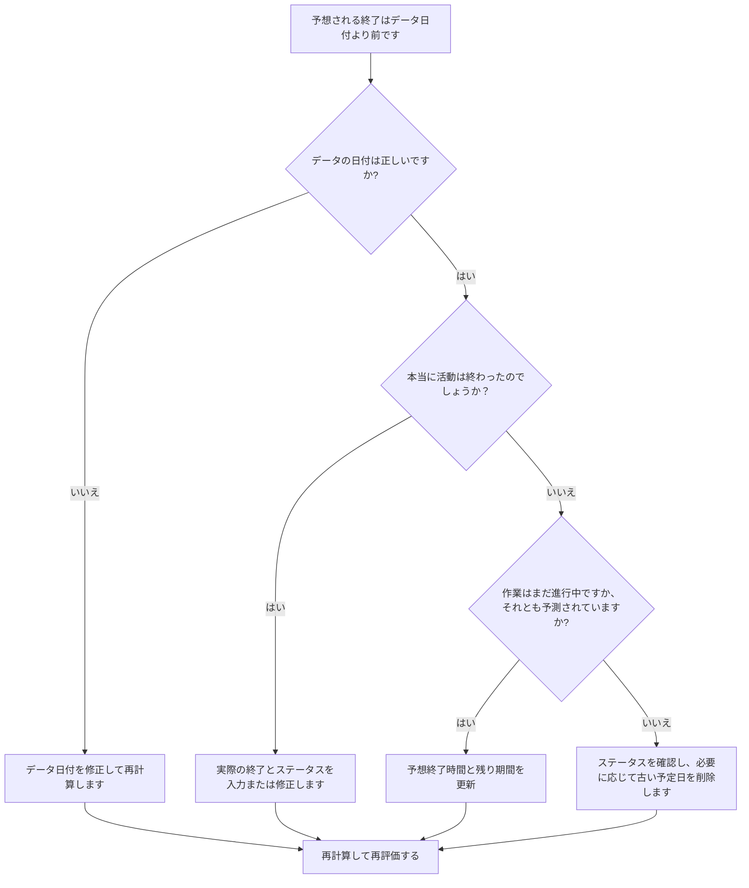

## 目的

このガイドは、スケジューラが予想終了日が Primavera P6 データ日より前のアクティビティを確認して修正するのに役立ちます。予想される日付を現在のレポート境界に合わせて維持することで、よりクリーンな更新規律をサポートします。

## 始める前に

アクションを実行する前に、次の情報を収集してください。

- このメトリクスの現在の評価結果。
- 最新のスケジュール更新で使用されるプロジェクト データの日付。
- 予想終了日がデータ日よりも早いアクティビティのリスト。
- アクティビティのステータス、実際の開始、実際の終了、残りの期間、完了率、開始、終了、および合計フロート。
- 予期される終了ソース (手動入力、インポート ファイル、フィールド予測、P6 更新ワークフローなど)。
- プロジェクト更新の打ち切りルールと最新の進捗メモ。

## 結果を理解する

良好な結果は、データ日付よりも早く終了が予想されるアクティビティがゼロであることです。

データ日付より前の予想終了は、通常、スケジュールが前倒しされたときに予測または予想される終了情報が更新されなかったことを意味します。また、アクティビティの実際の終了、修正された残り期間、または修正されたステータスを持つ必要があることを示す場合もあります。

弱い結果は、スケジュールに現在の更新境界よりも過去の予想完了日が含まれていることを意味します。

## 改善目標

目標は、データ日付より前に終了が予想される未解決のアクティビティが 0 件であることです。

目的は、各アクティビティが完了したか、まだ進行中か、開始されていないか、または正しく更新されていないかを確認することです。

## 行動計画

### ステップ 1: 主要な問題を特定する

予想終了日がデータ日付より前のアクティビティをフィルターする P6 レイアウトまたはレポートを作成します。アクティビティ ID、アクティビティ名、WBS、アクティビティ ステータス、予想終了日、実際の開始日、実際の終了日、残り期間、完了率、開始日、終了日、フロート合計、カレンダーが含まれます。

それぞれのアクティビティを確認し、次のことを尋ねます。

- データの日付は正しいですか?
- アクティビティは実際にデータ日付より前に終了しましたか?
- 終了した場合、実際の終了は表示されませんか?
- 完了しなかった場合は、「期待される終了値」を更新する必要がありますか?
- 残りの期間はまだ残っている作業を表しますか?
- インポートまたは手動更新により、古い予想終了値が残されましたか?

### ステップ 2: 推奨される修正を適用する

データ日付が間違っている場合は、承認されたレポート期間に従って修正し、スケジュールを再計算します。

アクティビティがデータ日付より前に終了した場合は、実際の終了値を入力または修正し、アクティビティのステータス、完了率、および残りの期間が一致していることを確認します。

アクティビティがまだアクティブであるか、完了していない場合は、「予想終了日」をデータ日以降の有効な日付に更新します。残りの期間と予測日に最新のフィールド情報が反映されていることを確認します。

予想終了日がインポートによって導入された場合は、古い予想日が繰り返し読み込まれないように、インポート ファイルとマッピングを確認してください。

### ステップ 3: 一般的なブロッカーを削除する

一般的な阻害要因としては、古いフィールド予測、完了率は更新されるが予定日ではない進捗状況のインポート、予想終了、予測終了、実際の終了の間の混乱などが挙げられます。

もう 1 つの阻害要因は、スケジュールされた日付が許容範囲に見えるため、期待される終了を無視することです。 P6 では、設定やワークフローに応じて予定日がスケジュール計算に影響を与える可能性があるため、古い値を見直す必要があります。

### ステップ 4: 変更を検証する

修正後にスケジュールを再計算します。メトリクスを再実行し、データ日付より前に未解決の予想終了日が残っていないことを確認します。

進行中のアクティビティ、短期先取り、合計フロート、マイルストーン日付、およびスケジュール比較レポートをレビューして、修正によって新たな不一致が生じていないことを確認します。

## 改善スケジュール

### 1 日目: 確認と診断

メトリクスを実行し、データの日付を確認し、結果を完了した作業、古い予定日、残りの期間の問題、およびインポートの問題に分けます。

### 2 ～ 3 日目: 優先アクションの実施

まずレポートに使用されるアクティビティを修正します。必要に応じて、実際の終了時間、予想される終了時間、残りの期間、完了率、またはアクティビティのステータスを更新します。

### 4 ～ 5 日目: 初期の結果を監視する

スケジュールを再計算し、先読みレポート、進行中のアクティビティ リスト、マイルストーンの移動、およびフロートの変更を確認します。

### 6日目: 最終調整

残りの不確実な項目は、担当分野、フィールドリーダー、またはプロジェクト管理リーダーと協力して解決してください。

### 7 日目: 再評価と比較

評価を再度実行し、結果をターゲットしきい値と比較します。

## 進捗状況の追跡

シンプルなトラッカーを使用して修正と承認を管理します。

| 日付 | 講じられたアクション | 予想される影響 | 結果・観察 | 次のステップ |
| --- | --- | --- | --- | --- |
| [日付] | データ日付の前に予想される終了値を確認しました | 古い予定日を特定する | 【観察結果】 | 所有者の割り当て |
| [日付] | 予想終了値または実際の終了値を更新しました | ステータスを更新境界に合わせる | 【観察結果】 | スケジュールを再計算する |
| [日付] | インポートプロセスの見直し | 古い予定日が繰り返されるのを防ぐ | 【観察結果】 | 指標を再評価する |

## 結果が改善しない場合

結果が改善されない場合は、期待される日付が検証なしでフィールド システム、スプレッドシート、または以前の更新ファイルからインポートされているかどうかを確認してください。更新ワークフローを確認し、予想される終了更新の所有者を確認します。

未解決の項目がクリティカル、クリティカルに近い、クライアントの報告、支払い、引き継ぎ、または短期の実行作業に影響を及ぼす場合は、エスカレーションします。

## メンテナンス

レポートを発行する前に、更新サイクルごとにこのメトリックを確認してください。これは、データ日付、実際の日付、残り期間、完了率、およびアクティビティ ステータスのチェックとともに、標準のステータス検証の一部である必要があります。

## 概要チェックリスト

- [ ] 現在の結果をレビューしました
- [ ] 目標閾値を確認しました
- [ ] データ日付が確認されました
- [ ] 予想終了リストが生成されました
- [ ] 「実際の終了」を指定して完了した作業
- [ ] 古い終了予定日が更新されました
- [ ] 残りの持続時間を確認しました
- [ ] アクティビティステータスと完了率のチェック
- [ ] インポートまたは更新ワークフローのレビュー
- [ ] スケジュールが再計算されました
- [ ] 評価の繰り返し
- [ ] 次のステップの文書化
## 関連コンテンツ
- [プリマベーラ P6 のデータ日付より前の終了予想](03_blog_template.md)
- [スケジュールとは](../../12b_blogs_jp/01_WHAT%20A%20SCHEDULE%20IS/01_blog.md)
- [堅牢なロジック](../../12b_blogs_jp/02_ROBUST%20LOGIC/02_ROBUST%20LOGIC.md)
