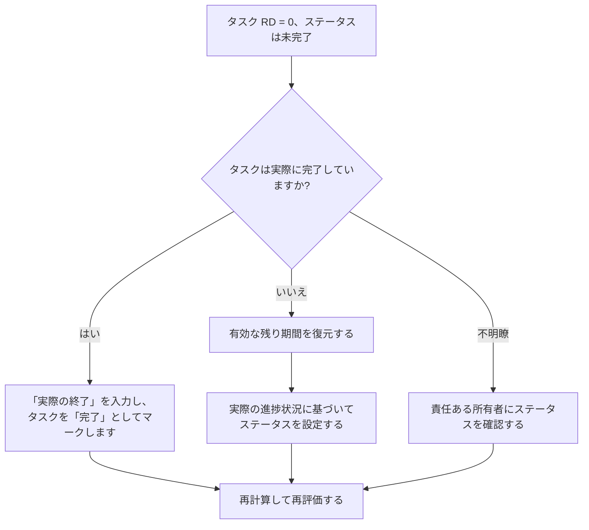

# ステータスが完了していない間、タスクの残り期間がゼロになる - 改善ガイド

## 目的

このガイドは、スケジューラが残り期間が 0 であるがタスク ステータスが完了ではないタスク アクティビティを確認して修正するのに役立ちます。残りの作業、実際の終了、アクティビティステータスを調整することで、クリーンな Primavera P6 アップデートをサポートします。

## 始める前に

アクションを実行する前に、次の情報を収集してください。

- このメトリクスの現在の評価結果。
- 残り期間 = 0 でステータスが完了ではないタスク アクティビティのリスト。
- アクティビティ ID、アクティビティ名、WBS、アクティビティ タイプ、アクティビティ ステータス、実際の開始時間、実際の終了時間、元の期間、残りの期間、および完了時期間。
- 完了率タイプと主要な進捗フィールド。
- データの日付と最新の更新メモ。
- タスクが完了したか、作業がまだ残っているかを現場で確認します。

## 結果を理解する

強い結果は、残り期間 = 0 でステータスが完了ではない、タスク アクティビティがゼロであることです。

この指標はタスク アクティビティに限定されているため、レビューはマイルストーンや LOE 記録ではなく、通常の作業アクティビティに焦点を当てています。残り期間がゼロのタスクには通常、完了ステータスと実際の終了が表示されます。

結果が弱い場合は、残り時間と完了ステータスが一致しないタスクがスケジュールに含まれていることを意味します。

## 改善目標

目標は、残り期間 = 0 でステータスが完了ではない未解決のタスク アクティビティが 0 件であることです。

目的は、各タスクが完了してクローズする必要があるか、または未完了で有効な残り期間を復元する必要があるかを確認することです。

## 行動計画

### ステップ 1: 主要な問題を特定する

残り期間が 0 でアクティビティ ステータスが完了ではないタスク アクティビティをフィルタリングする P6 レイアウトまたはレポートを作成します。アクティビティ ID、アクティビティ名、WBS、アクティビティ タイプ、アクティビティ ステータス、実際の開始、実際の終了、元の期間、残りの期間、完了率タイプ、アクティビティの完了率、開始、終了、および合計フロートが含まれます。

各タスクを確認し、次のことを尋ねます。

- タスクは実際に完了していますか?
- 完了した場合、ステータスが完了しないのはなぜですか?
- 実際の仕上げがありませんか?
- 作業が完了していない場合、残り期間が 0 になるのはなぜですか?
- ステータスは手動でインポートまたは更新されましたか?
- 完了率の方法は行われた更新と一致していますか?

### ステップ 2: 推奨される修正を適用する

タスクが完了した場合は、アクティビティを「完了」として更新します。実際の終了値を入力し、残り期間が 0 であることを確認し、進行状況の値がプロジェクトの更新手順に従っていることを確認します。

タスクが完了していない場合は、適切な残り期間を復元します。責任ある所有者に残りの作業を確認し、実際の進行状況に基づいてタスクのステータスを「進行中」または「未開始」として維持します。

問題がインポートされた進行状況データに起因する場合は、インポート マッピングを確認し、ワークフローを更新します。更新プロセスでは、タスク アクティビティが残り時間がゼロの未完了ステータスのままになってはなりません。

### ステップ 3: 一般的なブロッカーを削除する

一般的な阻害要因としては、実際の終了日の欠落、不完全なフィールド確認、インポートされた更新データ、期間ステータスとアクティビティ ステータスの混同などが挙げられます。

もう 1 つの問題は、タスクを正式に完了せずに、残りの期間を 0 に減らして進行状況を表示することです。残りの期間とアクティビティのステータスからも、作業が残っているかどうかについて同じことがわかります。

### ステップ 4: 変更を検証する

修正後にスケジュールを再計算します。メトリクスを再実行し、残りの各項目が修正されているか、フォローアップ用に割り当てられていることを確認します。

完了したタスクのリスト、実際の終了日、進捗レポート、達成額の出力、および先読みレポートを確認して、修正によって新たな不一致が生じていないことを確認します。

## 改善スケジュール

### 1 日目: 確認と診断

メトリクスを実行し、データ日付を確認し、結果を「完了」ステータスのない完了タスク、残り期間がゼロの不完了タスク、インポートまたはワークフローの問題に分けます。

### 2 ～ 3 日目: 優先アクションの実施

まずレポートに使用されるタスクを修正します。必要に応じて、「実績終了」を入力し、タスクに「完了」のマークを付けるか、「残り期間」を復元します。

### 4 ～ 5 日目: 初期の結果を監視する

スケジュールを再計算し、完了したタスク レポート、進捗レポート、達成額の出力、および先読みレポートを確認します。

### 6日目: 最終調整

残りの不確実な項目は、担当分野、フィールドリーダー、またはプロジェクト管理リーダーと協力して解決してください。

### 7 日目: 再評価と比較

評価を再度実行し、結果をターゲットしきい値と比較します。

## 進捗状況の追跡

シンプルなトラッカーを使用して修正と承認を管理します。

| 日付 | 講じられたアクション | 予想される影響 | 結果・観察 | 次のステップ |
| --- | --- | --- | --- | --- |
| [日付] | タスク RD 0 を確認しましたが、ステータスは未完了です | タスクのステータスの不一致を特定する | 【観察結果】 | 所有者の割り当て |
| [日付] | 「実際の終了」を入力し、「完了」とマーク付け | 完了ステータスを揃える | 【観察結果】 | スケジュールを再計算する |
| [日付] | 復元された残りの持続時間 | 未完了タスクのステータスを修正する | 【観察結果】 | 指標を再評価する |

## 結果が改善しない場合

結果が改善されない場合は、進行状況の更新がインポート、コピー、または手動で矛盾して編集されていないかどうかを確認してください。実際の終了日が更新ワークフローに欠落していないか、またはユーザーがタスクを完了せずに残り期間を 0 に設定していないかを確認してください。

未解決の項目がクリティカル、クリティカルに近い、稼得額、クライアントのレポート、支払い、または引き継ぎ関連の作業に影響を及ぼす場合は、エスカレーションします。

## メンテナンス

レポートを発行する前に、更新サイクルごとにこのメトリックを確認してください。これは、実際の日付、残り期間、完了率、アクティビティ ステータスのチェックと合わせて、標準的なタスク ステータスの検証の一部である必要があります。

## 概要チェックリスト

- [ ] 現在の結果をレビューしました
- [ ] 目標閾値を確認しました
- [ ] データ日付が確認されました
- [ ] タスクのみのフィルターが確認されました
- [ ] 特定された主な問題
- [ ] 完了したタスクに正しくマークが付けられた
- [ ] 必要に応じて実際の終了日を入力
- [ ] 作業が完了していない場合は残りの期間が復元されます
- [ ] ワークフローのインポートまたは更新をチェック済み
- [ ] スケジュールが再計算されました
- [ ] 評価の繰り返し
- [ ] 次のステップの文書化
## 関連コンテンツ
- [ステータスが完了していない間、タスクの残り期間がゼロになる - 概要](01_overview_template.md)
- [ステータスが完了していない間、タスクの残り期間がゼロになる](03_blog_template.md)
- [スケジュールとは](../../12b_blogs_jp/01_WHAT%20A%20SCHEDULE%20IS/01_blog.md)
- [堅牢なロジック](../../12b_blogs_jp/02_ROBUST%20LOGIC/02_ROBUST%20LOGIC.md)
