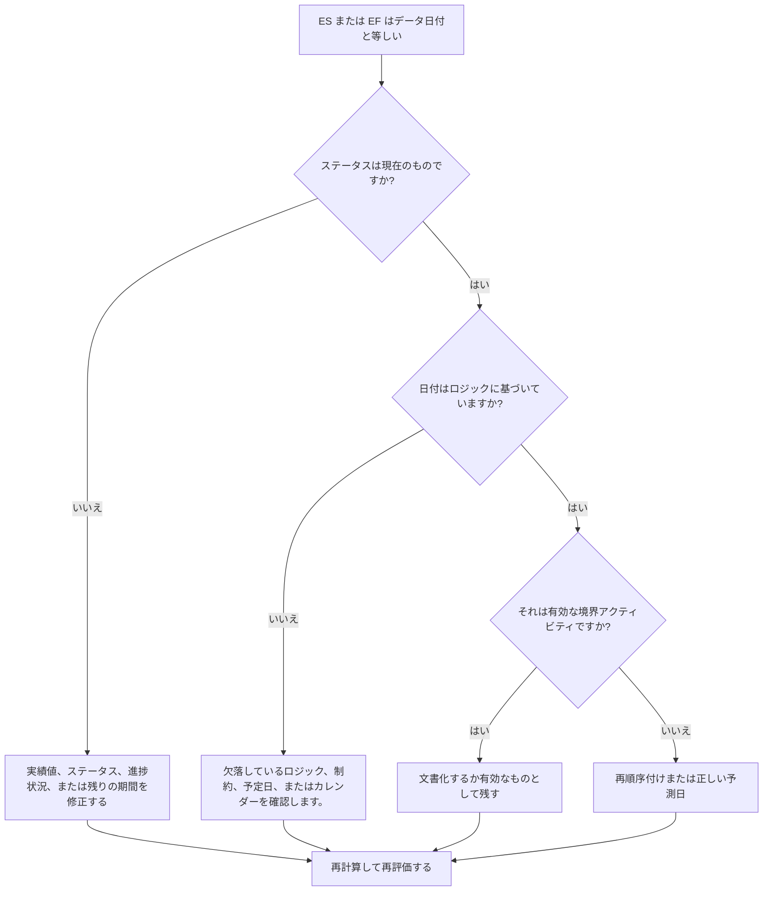

# データデーのアクティビティ - 改善ガイド

## 目的

このガイドは、スケジューラーが、Primavera P6 データ日と正確に一致する早期開始または早期終了のアクティビティを確認するのに役立ちます。実際のパフォーマンスと予測作業の境界で作業がどこに集まっているかを示すことで、更新サイクルのチェックをサポートします。

## 始める前に

アクションを実行する前に、次の情報を収集してください。

- このメトリクスの現在の評価結果。
- プロジェクト データ 最新のスケジュール計算に使用される日付。
- 早期開始 = データ日であるアクティビティのリスト。
- 早期終了 = データ日であるアクティビティのリスト。
- アクティビティステータス、実際の開始、実際の終了、残り期間、開始、終了、合計フロート、およびカレンダー。
- 前任者と後任者の関係の詳細。
- 制約、予定日、および更新メモ。

## 結果を理解する

データ日付の早期開始または早期終了により、原因不明のアクティビティがゼロになるという強力な結果が得られます。

一部のアクティビティ、特に続行の準備ができている短期の作業や更新境界で終了する作業は、正当にデータ日付に設定される場合があります。問題は日付だけではありません。問題は、日付が有効なステータス、ロジック、および更新情報によって説明されるかどうかです。

結果が弱い場合は、明確なスケジュール上の理由もなく、多くのアクティビティがデータ日付に収集されていることを意味します。

## 改善目標

ターゲットは、ES = データ日または EF = データ日の説明されていないアクティビティが 0 件であることです。

目標は、各アクティビティが正しくステータス設定され、論理的に駆動され、正しい更新境界から予測されているかどうかを確認することです。

## 行動計画

### ステップ 1: 主要な問題を特定する

早期開始がデータ日付と等しい、または早期終了がデータ日付と等しいアクティビティをフィルターする P6 レイアウトまたはレポートを作成します。アクティビティ ID、アクティビティ名、WBS、アクティビティ ステータス、早期開始、早期終了、開始、終了、実際の開始、実際の終了、残り期間、合計フロート、カレンダー、制約、先行者、後続者が含まれます。

それぞれのアクティビティを確認し、次のことを尋ねます。

- アクティビティは完了していますか、進行中ですか、それともまだ開始されていませんか?
- 実際の開始または実際の終了がありませんか?
- アクティビティは論理的にデータ日付まで駆動されますか?
- 制約、予定日、またはカレンダーによってアクティビティがデータ日付にプッシュされていますか?
- その活動は無制限ですか、それとも弱いつながりですか?
- データ日付は更新期間に対して正しいですか?

### ステップ 2: 推奨される修正を適用する

ステータスが不完全な場合は、ロジックを変更する前に、実際の開始、実際の終了、残り期間、完了率、アクティビティ ステータスを修正してください。

先行ロジックが欠落しているか非駆動であるためにアクティビティがデータ日付に開始される場合は、実際の作業シーケンスを表す関係を追加または修正します。

進捗状況が更新されなかったためにアクティビティがデータ日付に終了している場合は、作業が更新境界までに終了したかどうかを確認します。完了している場合は「実績終了」を入力し、作業が残っている場合は「残り期間」と「予測終了」を更新します。

制約または予定日によってアクティビティがデータ日付にずれ込んでいる場合は、プロジェクト管理手順に従ってアクティビティを削除、修正、または文書化します。

### ステップ 3: 一般的なブロッカーを削除する

一般的な阻害要因としては、不完全な実現、オープン開始、オープン終了、ロジックの代替として使用される制約、十分なステータス確認のないデータ日付の移動などが挙げられます。

もう 1 つの妨害者は、データ日のアクティビティは無害であると想定しています。更新境界に大きなクラスターがあると、欠落したシーケンスが隠れたり、短期的な予測が実際よりもきれいに見えたりする可能性があります。

### ステップ 4: 変更を検証する

修正後にスケジュールを再計算します。メトリクスを再実行し、データ日付の残りの各アクティビティが現在のステータス、有効なロジック、または承認された例外によって説明されていることを確認します。

合計フロート、クリティカルまたは最長のパス、マイルストーンの日付、および短期先取りレポートを確認して、修正によって新たな不整合が生じていないことを確認します。

## 改善スケジュール

### 1 日目: 確認と診断

メトリクスを実行し、データ日付を確認し、結果をデータ日付の ES、データ日付の EF、ステータスの問題、ロジックの問題、制約、および有効な境界アクティビティに分けます。

### 2 ～ 3 日目: 優先アクションの実施

クリティカルなアクティビティ、クリティカルに近いアクティビティ、および短期的なアクティビティを最初に修正します。ステータスを更新し、ロジックを追加または修正し、制約を確認します。

### 4 ～ 5 日目: 初期の結果を監視する

スケジュールを再計算し、先読み出力、フロートの変更、マイルストーンの移動、データ日付にまだ残っているアクティビティを確認します。

### 6日目: 最終調整

残りの不確実な項目は、担当分野、フィールドリーダー、またはプロジェクト管理リーダーと協力して解決してください。

### 7 日目: 再評価と比較

評価を再度実行し、結果をターゲットしきい値と比較します。

## 進捗状況の追跡

シンプルなトラッカーを使用して修正と承認を管理します。

| 日付 | 講じられたアクション | 予想される影響 | 結果・観察 | 次のステップ |
| --- | --- | --- | --- | --- |
| [日付] | データ日付に ES/EF をレビューしました | 境界クラスタリングを特定する | 【観察結果】 | 所有者の割り当て |
| [日付] | ステータスまたは実際の日付を修正しました | 作業ステータスを更新境界に合わせる | 【観察結果】 | スケジュールを再計算する |
| [日付] | ロジックまたは制約を修正しました | 説明のつかないデータ日付のクラスタリングを削減する | 【観察結果】 | 指標を再評価する |

## 結果が改善しない場合

結果が改善しない場合は、欠落しているロジック、制約、古い予定日、または不完全な更新手順によって、アクティビティが繰り返しデータ日付にプルされていないかどうかを確認してください。

未解決の項目がクリティカル、クリティカルに近い、クライアントの報告、引き継ぎ、支払い、または短期的な実行作業に影響を及ぼす場合は、エスカレーションします。

## メンテナンス

レポートを発行する前に、更新サイクルごとにこのメトリックを確認してください。これは、データ日付の移動、進行状況のインポート、作業の順序変更、またはステータスの大きな変更後の再計算の後に特に便利です。

## 概要チェックリスト

- [ ] 現在の結果をレビューしました
- [ ] 目標閾値を確認しました
- [ ] データ日付が確認されました
- [ ] ES = データ 活動がレビューされた日付
- [ ] EF = 活動をレビューしたデータ日付
- [ ] ステータスと実際の日付の確認
- [ ] 残りの持続時間を確認しました
- [ ] ロジックと制約の見直し
- [ ] 有効な境界アクティビティが文書化されている
- [ ] スケジュールが再計算されました
- [ ] 評価の繰り返し
- [ ] 次のステップの文書化
## 関連コンテンツ
- [データデーのアクティビティ: プリマヴェーラ P6 の早期開始および早期終了チェック - 概要](01_overview_template.md)
- [データデーのアクティビティ: プリマヴェーラ P6 の早期開始および早期終了チェック](03_blog_template.md)
- [スケジュールとは](../../12b_blogs_jp/01_WHAT%20A%20SCHEDULE%20IS/01_blog.md)
- [堅牢なロジック](../../12b_blogs_jp/02_ROBUST%20LOGIC/02_ROBUST%20LOGIC.md)
