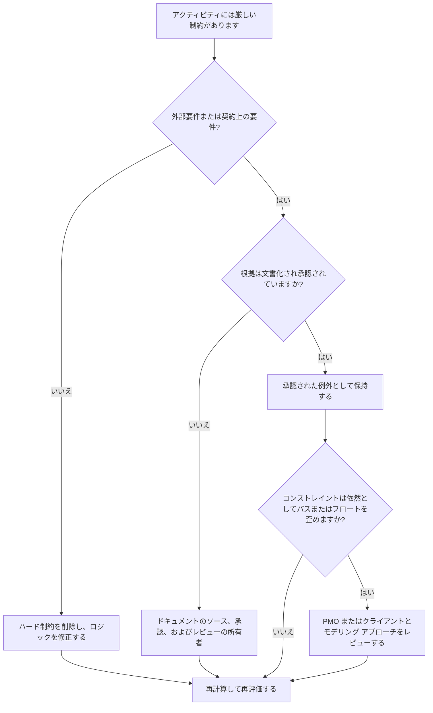

## 目的

このガイドは、スケジューラが Primavera P6 のハード制約を確認して軽減するのに役立ちます。アクティビティの日付を強力に制御する制約、特に必須の開始と必須の終了に焦点を当てています。

## 始める前に

アクションを実行する前に、次の情報を収集してください。

- このメトリクスの現在の評価結果。
- ハード制約のあるアクティビティのリスト。
- 各アクティビティの制約タイプと制約日付。
- アクティビティ ID、アクティビティ名、WBS、アクティビティ ステータス、開始、終了、合計フロート、およびクリティカルまたは最長パスのステータス。
- 前任者と後任者の関係の詳細。
- 必要な制約の契約、クライアント、許可、アクセス、規制、または引き継ぎの根拠。
- 制約がいつ追加されたかを示すベースラインまたは以前の更新の比較。

## 結果を理解する

強力な結果は、説明のつかない厳しい制約がゼロになることです。

ハード制約は、通常の CPM 計算を上書きしたり、大幅に制限したりする可能性があります。これらは、契約日、アクセス ウィンドウ、許可リリース、規制上のホールド ポイント、所有者向けの要件に対しては有効である可能性がありますが、欠落しているロジックの代替として使用すべきではありません。

結果が弱い場合は、ネットワーク ロジックではなく予測を制御している可能性がある強制された日付がスケジュールに含まれていることを意味します。

## 改善目標

目標は、説明されていないハード制約が 0 であることです。

目標は、不必要なハード制約を削除し、本当に必要な制約を文書化することです。

## 行動計画

### ステップ 1: 主要な問題を特定する

ハード制約タイプを使用してアクティビティをフィルタリングする P6 レイアウトまたはレポートを作成します。アクティビティ ID、アクティビティ名、WBS、アクティビティ ステータス、開始、終了、制約タイプ、制約日付、合計フロート、クリティカルまたは最長パスのステータス、先行パス、および後続パスが含まれます。

制約されたアクティビティをそれぞれ確認し、次のことを尋ねます。

- ハード制約の原因は何ですか?
- それは契約上または外部的に義務付けられていますか?
- 欠落している先行ロジックまたは後続ロジックを置き換えるのでしょうか?
- スケジュールによって予測されるべき目標日を強制していませんか?
- 合計フロート、クリティカル パス、またはマイルストーンのレポートに影響しますか?
- 理由は文書化され承認されていますか?

### ステップ 2: 推奨される修正を適用する

ハード制約が外部的に必要ない場合は、それを削除し、CPM ロジックを追加または修正します。日付を強制するのではなく、関係性、アクティビティの順序、カレンダー、現実的な期間を使用して作業をモデル化します。

ハード制約が必要な場合は、その根拠を文書化してください。ソース、承認、日付、責任のある所有者、および通常のロジックでモデル化できない理由をキャプチャします。

目標日付を保持するために制約が使用されている場合は、より緩やかな制約、マイルストーン、期限、またはレポートメモがより適切であるかどうかを検討してください。

### ステップ 3: 一般的なブロッカーを削除する

一般的な阻害要因としては、古いベースラインから継承された制約、必須日付として入力されたクライアントの目標日、一時的な制約を残した復旧計画、インターフェイス ロジックの欠落などが挙げられます。

もう 1 つの問題は、日付が重要であるため、ハード制約が許容されると想定していることです。重要な日付は表示される必要がありますが、スケジュールには作業がどのように到着するかを説明する必要があります。

### ステップ 4: 変更を検証する

修正後にスケジュールを再計算します。メトリクスを再実行し、残りのハード制約が承認され、文書化されていることを確認します。

合計フロート、クリティカルまたは最長のパス、マイルストーンの日付、およびスケジュールの比較出力を確認して、修正によって予期しない動きが生じていないことを確認します。

## 改善スケジュール

### 1 日目: 確認と診断

メトリクスを実行し、WBS、制約タイプ、重要度、文書化された根拠ごとに結果をグループ化します。

### 2 ～ 3 日目: 優先アクションの実施

まず、重要なアクティビティ、ほぼクリティカルなアクティビティ、契約上のアクティビティ、および短期的なアクティビティから不必要な厳しい制約を削除します。不足しているロジックを必要に応じて追加します。

### 4 ～ 5 日目: 初期の結果を監視する

スケジュールを再計算し、フロートの移動、クリティカル パスの変更、マイルストーンへの影響を確認します。

### 6日目: 最終調整

残りの例外をスケジューラ、プロジェクト管理リーダー、PMO レビュー担当者、またはクライアントの代表者と相談して解決します。

### 7 日目: 再評価と比較

評価を再度実行し、結果をターゲットしきい値と比較します。

## 進捗状況の追跡

シンプルなトラッカーを使用して修正と承認を管理します。

| 日付 | 講じられたアクション | 予想される影響 | 結果・観察 | 次のステップ |
| --- | --- | --- | --- | --- |
| [日付] | ハード制約の見直し | 課された日付管理を特定する | 【観察結果】 | 所有者の割り当て |
| [日付] | 不要なハード制約を削除しました | ロジック駆動の計算を復元する | 【観察結果】 | スケジュールを再計算する |
| [日付] | 文書化された承認済みのハード制約 | 正当な例外を保持する | 【観察結果】 | 指標を再評価する |

## 結果が改善しない場合

結果が改善しない場合は、インポート、フラグネットのコピー、ベースラインの更新、またはリカバリ スケジュールの変更によってハード制約が再導入されているかどうかを確認してください。

未解決の項目がクリティカル パス、契約上のマイルストーン、クライアントのレポート、遅延分析、支払いイベント、または引き継ぎ日に影響を与える場合は、エスカレーションします。

## メンテナンス

このメトリクスは、更新サイクルごとに、ベースラインの承認前に確認してください。ハード制約は、特に大規模な再シーケンス、復旧計画、およびクライアント提出の準備の後、標準スケジュールのヘルス チェックの一部である必要があります。

## 概要チェックリスト

- [ ] 現在の結果をレビューしました
- [ ] 目標閾値を確認しました
- [ ] 生成されたハード制約リスト
- [ ] 制約のタイプと日付がチェックされました
- [ ] 外部根拠が確認されました
- [ ] 不必要なハード制約が削除されました
- [ ] 欠落していたロジックを修正しました
- [ ] 承認された例外を文書化
- [ ] スケジュールが再計算されました
- [ ] フロートパスとクリティカルパスの見直し
- [ ] 評価の繰り返し
- [ ] 次のステップの文書化
## 関連コンテンツ
- [Primavera P6 のハード制約](03_blog_template.md)
- [スケジュールとは](../../12b_blogs_jp/01_WHAT%20A%20SCHEDULE%20IS/01_blog.md)
- [堅牢なロジック](../../12b_blogs_jp/02_ROBUST%20LOGIC/02_ROBUST%20LOGIC.md)
