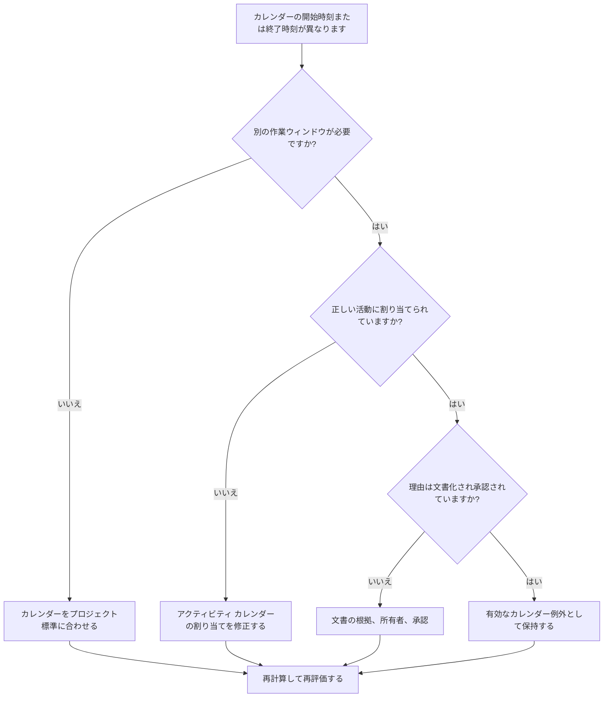

## 目的

このガイドは、異なる勤務日の開始時刻または終了時刻を使用する Primavera P6 カレンダーをスケジューラが確認するのに役立ちます。カレンダーの時差が意図的で承認され、理解されていることを確認することで、スケジュールの品質チェックをサポートします。

## 始める前に

アクションを実行する前に、次の情報を収集してください。

- このメトリクスの現在の評価結果。
- 承認されたプロジェクト カレンダーの標準および通常の日次作業ウィンドウ。
- 異なる開始時刻、終了時刻、シフト枠、または日の一部のパターンが異なるカレンダーのリスト。
- 影響を受ける各カレンダーに割り当てられたアクティビティ。
- カレンダーの種類 (グローバル、プロジェクト、リソース カレンダーなど)。
- 影響を受けるカレンダーを使用するクリティカルまたはクリティカルに近いアクティビティ。
- 夜勤、停電作業、アクセス制限、特別なスタッフのスケジュールなど、各非標準カレンダーの理由。

## 結果を理解する

優れた結果は、開始時刻または終了時刻が異なる説明のつかないカレンダーがゼロであることです。

仕事が実際に異なるシフト、アクセスウィンドウ、またはリソースの可用性に従っている場合、カレンダーの違いは有効である可能性があります。懸念されるのは、明確な理由もなくカレンダーが時間帯によって異なる場合です。

弱い結果は、日付、浮動小数点、およびロジックの動作に影響を与える隠れたカレンダーの仮定がスケジュールに含まれている可能性があることを意味します。

## 改善目標

目標は、開始時刻または終了時刻が異なる不明なカレンダーが 0 個であることです。

目的は、さまざまな作業ウィンドウがそれぞれ必要かどうか、文書化されているかどうか、適切なアクティビティのみに割り当てられているかどうかを確認することです。

## 行動計画

### ステップ 1: 主要な問題を特定する

P6 からカレンダー レビュー エクスポートを作成するか、各カレンダー、通常の勤務日の開始時刻、終了時刻、毎日の時間、例外、割り当てられたアクティビティをリストするスケジュール評価ツールを作成します。

非標準カレンダーをそれぞれ確認し、次のことを尋ねます。

- プロジェクトで承認された標準労働日は何日ですか?
- 異なる開始時刻または終了時刻を使用するカレンダーはどれですか?
- この違いは意図的なものですか、それとも偶然ですか?
- 各カレンダーを使用するアクティビティはどれですか?
- クリティカルまたはクリティカルに近いアクティビティは影響を受けますか?
- カレンダーの違いは文書化され、承認されていますか?

### ステップ 2: 推奨される修正を適用する

カレンダーの違いが偶然である場合は、開始時刻、終了時刻、および毎日の作業期間を、承認されたプロジェクト標準に合わせます。

カレンダーの違いが有効な場合は、その理由を文書化してください。一般的に有効なケースには、夜勤、週末勤務、シャットダウン時間帯、所有者のアクセス制限、環境制限、またはリソース固有の作業期間が含まれます。

アクティビティが間違ったカレンダーに割り当てられている場合は、カレンダー自体を変更する前に、アクティビティ カレンダーの割り当てを修正してください。有効な特殊カレンダーでも、割り当て範囲が広すぎると問題が発生する可能性があります。

### ステップ 3: 一般的なブロッカーを削除する

一般的な阻害要因には、古いスケジュールからコピーされたカレンダー、非表示の時刻設定を持つインポートされたカレンダー、アクティビティ カレンダーとして使用されるリソース カレンダー、標準の日付レイアウトでは表示されない小さな時差などが含まれます。

もう 1 つの障害は、時刻を省略して日付だけを確認することです。 P6 では、時刻がアクティビティの配置、フロート、人間関係の動作、および見かけ上の 1 日の日付の動きに影響を与える可能性があります。

### ステップ 4: 変更を検証する

カレンダー修正後にスケジュールを再計算します。メトリクスを再実行し、残りのカレンダーの差異が有効であり、文書化されていることを確認します。

影響を受けたアクティビティの日付、合計フロート、クリティカルまたは最長のパス、関係関係、および短期先取りレポートを検討して、修正によって予期しない動きが生じていないことを確認します。

## 改善スケジュール

### 1 日目: 確認と診断

メトリクスを実行し、カレンダー、作業期間、カレンダーの種類、割り当てられたアクティビティ、重要度ごとに結果をグループ化します。

### 2 ～ 3 日目: 優先アクションの実施

まず、重要なアクティビティ、ほぼ重要なアクティビティ、および短期的なアクティビティに関する偶発的なカレンダーの時差と間違ったアクティビティ カレンダーの割り当てを修正します。

### 4 ～ 5 日目: 初期の結果を監視する

スケジュールを再計算し、フロートの動き、日付の変更、マイルストーンへの影響、および先読みの変更を確認します。

### 6日目: 最終調整

残りのカレンダー例外をスケジューラ、専門分野の所有者、プロジェクト管理リーダー、または PMO レビュー担当者と協力して解決します。

### 7 日目: 再評価と比較

評価を再度実行し、結果をターゲットしきい値と比較します。

## 進捗状況の追跡

シンプルなトラッカーを使用して修正と承認を管理します。

| 日付 | 講じられたアクション | 予想される影響 | 結果・観察 | 次のステップ |
| --- | --- | --- | --- | --- |
| [日付] | カレンダーの開始時間と終了時間を確認しました | 標準以外の作業ウィンドウを特定する | 【観察結果】 | 所有者の割り当て |
| [日付] | プロジェクト標準に合わせたカレンダー | 偶然の時差を解消する | 【観察結果】 | スケジュールを再計算する |
| [日付] | 有効なカレンダーの例外を文書化 | 位置調整された作業ウィンドウを保持する | 【観察結果】 | 指標を再評価する |

## 結果が改善しない場合

結果が改善しない場合は、インポート、スケジュールのコピー、リソースの割り当て、またはベースラインの更新によって非標準のカレンダーが再導入されているかどうかを確認してください。

未解決のカレンダーの差異がクリティカル パス、顧客レポート、支払いマイルストーン、停止作業、引き継ぎ日、または短期的な実行に影響を与える場合は、エスカレーションします。

## メンテナンス

ベースライン開発、インポートのスケジュール、およびメジャー更新サイクルごとにこのメトリクスを確認してください。カレンダーの時刻設定は、レポートが発行される前の標準スケジュールのヘルス チェックの一部である必要があります。

## 概要チェックリスト

- [ ] 現在の結果をレビューしました
- [ ] 目標閾値を確認しました
- [ ] プロジェクトカレンダー標準の確認
- [ ] 標準外の暦時間が特定される
- [ ] 割り当てられた活動のレビュー
- [ ] クリティカルおよびクリティカルに近い影響をチェック
- [ ] 偶発的なカレンダーの違いを修正
- [ ] 有効なカレンダー例外の文書化
- [ ] スケジュールが再計算されました
- [ ] 日付とフロートの変更を確認しました
- [ ] 評価の繰り返し
- [ ] 次のステップの文書化
## 関連コンテンツ
- [Primavera P6 の開始時刻と終了時刻が異なるカレンダー](03_blog_template.md)
- [スケジュールとは](../../12b_blogs_jp/01_WHAT%20A%20SCHEDULE%20IS/01_blog.md)
- [堅牢なロジック](../../12b_blogs_jp/02_ROBUST%20LOGIC/02_ROBUST%20LOGIC.md)
