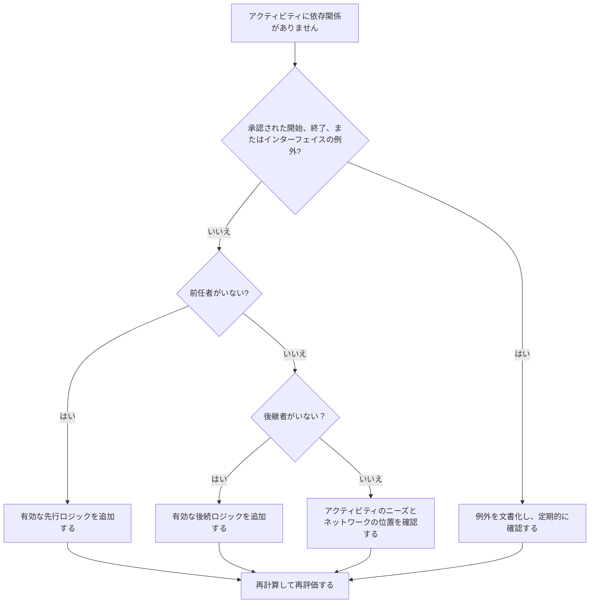

# Primavera P6 で不足している依存関係 - 改善ガイド

## 目的

このガイドは、スケジューラが Primavera P6 で欠落している先行ロジックまたは後続ロジックを特定して修正するのに役立ちます。 CPM ネットワークの完全性を向上させることで、スケジュールの品質をサポートします。

## 始める前に

アクションを実行する前に、次の情報を収集してください。

- このメトリクスの現在の評価結果。
- 先行者のないアクティビティのリスト。
- 後継者がいないアクティビティのリスト。
- 先行ロジックも後続ロジックも持たないアクティビティのリスト。
- アクティビティ ID、アクティビティ名、WBS、アクティビティ タイプ、アクティビティ ステータス、開始、終了、合計フロート、およびカレンダー。
- 承認されたプロジェクトの開始、プロジェクトの終了、外部インターフェイス、および契約上の例外リスト。
- 最新の更新ノートと責任ある規律またはパッケージ所有者。

## 結果を理解する

強力な結果は、依存関係ロジックが欠落している未解決のアクティビティがゼロになることです。

一部のアクティビティには、承認されたプロジェクト開始マイルストーン、最終完了マイルストーン、承認された外部インターフェイス マイルストーンなど、正当に先行者または後続者が存在しない場合があります。これらは制限され、文書化される必要があります。

弱い結果は、CPM ネットワークに適切に接続されていないアクティビティがスケジュールに含まれていることを意味します。

## 改善目標

ターゲットは、依存関係が欠落している未解決のアクティビティが 0 件であることです。

目標は、各アクティビティを有効な先行ロジックと後続ロジックに接続すること、またはそれが例外である承認された理由を文書化することです。

## 行動計画

### ステップ 1: 主要な問題を特定する

先行アクティビティ、後続アクティビティ、またはその両方がないアクティビティをフィルタリングする P6 レイアウトまたはレポートを作成します。アクティビティ ID、アクティビティ名、WBS、アクティビティ タイプ、アクティビティ ステータス、開始、終了、合計フロート、カレンダー、制約、先行者、後続者が含まれます。

それぞれのアクティビティを確認し、次のことを尋ねます。

- このアクティビティは、承認されたプロジェクトの開始項目またはプロジェクトの終了項目ですか?
- それは外部インターフェイス、所有者が管理する日付、または契約上の例外ですか?
- このアクティビティを開始する前に、どのような作業を行う必要がありますか?
- このアクティビティの終了または開始によってどの作業が左右されますか?
- アクティビティは古くなったり、重複したり、または間違ったステータスになったりしていませんか?
- 実際の依存関係を確認できるのはどの所有者ですか?

### ステップ 2: 推奨される修正を適用する

オープン スタートの場合は、アクティビティを開始する前に必要な実際の状態を表す先行ロジックを追加します。これには、以前の作業、承認、アクセス、調達、設計リリース、検査、または引き継ぎが含まれる場合があります。

オープン フィニッシュの場合は、アクティビティに依存するものを表す後続ロジックを追加します。これには、後続の作業、テスト、試運転、売上高、完了、または完了マイルストーンが含まれる場合があります。

先行者も後続者も存在しない分離されたアクティビティの場合は、そのアクティビティがまだ必要かどうかを確認してください。有効な作品であれば、ネットワークに接続します。古い場合は、プロジェクト管理手順に従って削除または閉じます。

### ステップ 3: 一般的なブロッカーを削除する

一般的な阻害要因としては、アクティビティのコピー、不完全なフラグネット、専門分野間の不明確なハンドオフ、インターフェイス情報の欠落、シーケンスが判明する前にアクティビティをロードするというプレッシャーなどが挙げられます。

もう 1 つの障害は、メトリックを渡すためだけにプレースホルダー リレーションシップを追加することです。関係は人為的なリンクではなく、実際の依存関係を表す必要があります。

### ステップ 4: 変更を検証する

修正後にスケジュールを再計算します。メトリクスを再実行し、残りの各アクティビティが接続されているか、承認された例外として文書化されていることを確認します。

合計フロート、クリティカルまたは最長パス、マイルストーン日付、および短期先取りレポートを検討して、追加されたロジックによって予期しない動きが発生していないことを確認します。

## 改善スケジュール

### 1 日目: 確認と診断

メトリクスを実行し、検出結果を欠落している先行アクティビティ、欠落している後続アクティビティ、分離されたアクティビティ、有効な例外、および廃止されたアクティビティにグループ化します。

### 2 ～ 3 日目: 優先アクションの実施

重要なアクティビティ、ほぼクリティカルなアクティビティ、契約上のアクティビティ、および短期的なアクティビティを最初に修正します。有効なロジックを追加し、必要に応じて古いアクティビティを削除します。

### 4 ～ 5 日目: 初期の結果を監視する

スケジュールを再計算し、フロート、クリティカル パス、先読み日付、マイルストーンへの影響を確認します。

### 6日目: 最終調整

依存関係に関する残りの質問は、規律責任者、パッケージ所有者、建設管理者、またはプロジェクト管理のリーダーと協力して解決してください。

### 7 日目: 再評価と比較

評価を再度実行し、結果をターゲットしきい値と比較します。

## 進捗状況の追跡

シンプルなトラッカーを使用して修正と承認を管理します。

| 日付 | 講じられたアクション | 予想される影響 | 結果・観察 | 次のステップ |
| --- | --- | --- | --- | --- |
| [日付] | 不足している依存関係を確認しました | オープンスタートとオープンフィニッシュを特定する | 【観察結果】 | 所有者の割り当て |
| [日付] | 先行ロジックを追加しました | アクティビティ開始ロジックを改善する | 【観察結果】 | スケジュールを再計算する |
| [日付] | 後継ロジックの追加 | アクティビティ終了の継続性を向上させる | 【観察結果】 | 指標を再評価する |

## 結果が改善しない場合

結果が改善しない場合は、新しいアクティビティがロジックなしで追加されているか、インポートされたフラグネットが不完全か、例外ルールが緩すぎないかを確認してください。

未解決の項目がクリティカル パス、クライアントのレポート、支払いマイルストーン、引き継ぎ、調達、または短期的な実行に影響を与える場合は、エスカレーションします。

## メンテナンス

このメトリクスは、すべての更新サイクル中、スケジュールのインポート後、ベースラインの承認前に確認してください。欠落している依存関係は、標準スケジュールのヘルスチェックの一部として含める必要があります。

## 概要チェックリスト

- [ ] 現在の結果をレビューしました
- [ ] 目標閾値を確認しました
- [ ] オープンスタートの見直し
- [ ] オープンフィニッシュのレビュー
- [ ] 孤立したアクティビティのレビュー
- [ ] 有効な例外が文書化されている
- [ ] 欠落していた先行ロジックが追加されました
- [ ] 欠落している後継ロジックが追加されました
- [ ] 廃止されたアクティビティが解決されました
- [ ] スケジュールが再計算されました
- [ ] 評価の繰り返し
- [ ] 次のステップの文書化
## 関連コンテンツ
- [Primavera P6 で不足している依存関係 - 概要](01_overview_template.md)
- [Primavera P6 で不足している依存関係](03_blog_template.md)
- [スケジュールとは](../../12b_blogs_jp/01_WHAT%20A%20SCHEDULE%20IS/01_blog.md)
- [堅牢なロジック](../../12b_blogs_jp/02_ROBUST%20LOGIC/02_ROBUST%20LOGIC.md)
