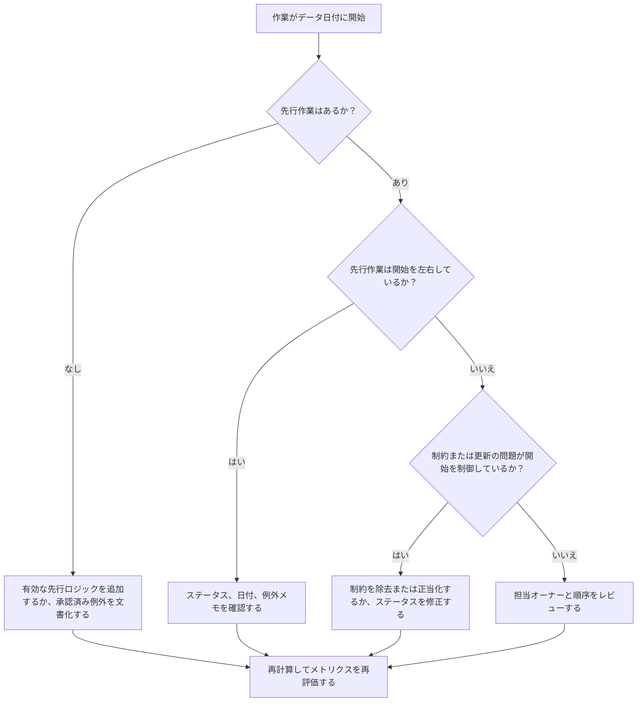

## 目的

このガイドは、スケジューラーおよびプロジェクト管理チームが、有効な先行ロジックなしにPrimavera P6のデータ日付に開始するようにスケジュールされた作業を減らすまたは排除するのを助けます。スケジュール品質レビュー、PMO健全性チェック、更新サイクル検証に適用されます。

目的は、近い将来の作業が明確なCPMロジックによって支持されており、作業が欠落した関係、制約、手動日付、または不完全な進捗更新のためだけにデータ日付に開始していないことを確認することです。

## 開始前に

アクションを取る前に以下の情報を収集してください：

- このメトリクスの現在の評価結果。
- 最新のスケジュール計算で使用されたプロジェクトのデータ日付。
- データ日付に等しい開始日を持つオープンまたは未開始の作業のリスト。
- 各作業の先行・後続関係の詳細。
- 制約、期待日、実際の日付、カレンダー割り当て。
- 更新に使用されたP6スケジューリングオプション（関連する場合はリテインドロジックまたは進捗オーバーライド設定を含む）。
- プロジェクト開始作業、外部インターフェースマイルストーン、またはオーナー指示開始など、承認済みの例外。

## 結果を理解する

強い結果はドライビング先行ロジックなしにデータ日付に開始する未解決の作業がゼロです。これは現在および近い将来の作業がスケジュールネットワークに接続されており、データ日付が欠落した順序付けを隠していないことを意味します。

許容できる結果には少数の文書化された例外が含まれることがあります。これらはレビューおよび承認されるべきであり、無視されるべきではありません。例えば、着手通知マイルストーンや外部から承認された作業は通常の先行作業が必要でないかもしれませんが、その理由はレビュー担当者に見えるべきです。

弱い結果とは、複数の作業が明確な論理的ドライバーなしにデータ日付に開始していることを意味します。これは、オープンスタート、欠落した先行関係、過剰な制約、不完全な進捗更新、または最新の更新後に適切に再順序付けされなかった作業を示している可能性があります。

## 改善目標

目標は有効なドライビングロジックなしにデータ日付に開始する未解決の作業がゼロです。

改善目標はカウントを減らすだけではありません。より深い目標は、データ日付近くの各作業が予測開始について防御可能な理由を持つことを確認することです。修正後、影響を受けた各作業は適切な先行ロジック、文書化された例外、または修正されたステータス/日付条件のいずれかを持つべきです。

## アクションプラン

### ステップ1：主要な問題を特定する

データ日付に等しい開始日を持つオープンまたは未開始の作業をフィルタリングするP6レイアウトまたはレポートを作成します。作業ID、作業名、WBS、開始、完了、ステータス、トータルフロート、カレンダー、主要制約、先行作業、後続作業、利用可能な場合はドライビング関係指標の列を含めます。

各作業をレビューし、問いかけてください：

- 作業に先行作業はあるか？
- 先行作業が存在する場合、それらは実際に開始を左右しているか？
- 作業は制約によって保持または移動されているか？
- 作業に実際の開始や進捗更新が欠落しているか？
- 作業はプロジェクト開始マイルストーンなどの有効な例外か？
- 作業は通常ロジックが弱いWBSエリアに属しているか？

調査結果を実際的な原因にグループ化してください：欠落した先行作業、ドライブしていない先行作業、制約または期待日、更新/ステータスエラー、または承認済み例外。

### ステップ2：推奨される修正を適用する

欠落したまたは弱いロジックから始めます。フィニッシュ・ツー・スタート、スタート・ツー・スタート、またはフィニッシュ・ツー・フィニッシュ関係など、実際の作業順序を表す有効な先行関係を追加します。メトリクスを満たすためだけに関係を追加することは避けてください；各関係は実際の建設、エンジニアリング、調達、アクセス、承認、または引渡しの依存関係を反映すべきです。

次に制約をレビューします。作業がスタート制約のためにデータ日付に開始している場合、その制約が契約上または運用上正当化されているかどうかを確認します。不必要な制約を除去し、作業をロジックによってドライブされるようにします。制約が有効な場合、その理由を文書化し、クリティカルパスを歪めていないことを確認します。

進捗ステータスを確認します。作業がすでに開始している場合、実際の開始と残り工期を正しく更新します。作業が開始していない場合、予測開始がデータ日付に留まるべきかどうかを確認します。更新サイクルが作業を現在の日付に引いたからといって、作業が開始準備完了として見えるべきではありません。

変更が加えられた後、スケジュールを再計算し、影響を受けた作業を再度レビューします。開始日が今やロジックによってドライブされているか、正しくステータスされているか、または承認済み例外として文書化されていることを確認します。

### ステップ3：一般的な障害を除去する

一般的な障害には、不明確なフィールドフィードバック、欠落したインターフェース情報、および近い将来の作業を準備完了に見せる圧力があります。専門分野リード、建設マネージャー、調達オーナー、またはパッケージマネージャーと影響を受けた作業をレビューすることでこれらを解決します。

もうひとつの一般的な障害は、ロジックの代替として制約を誤用することです。一部の場合に制約が必要かもしれませんが、スケジュールネットワークを置き換えるべきではありません。制約が保持される場合、なぜ存在するか、フロートと最長パスにどのように影響するかを文書化します。

また、問題がスケジュール計算設定または更新慣行によって引き起こされているかどうかを確認します。進捗オーバーライド、リテインドロジック、順序外進捗、または不完全な実績化が結果に影響している場合、メトリクスを再評価する前に更新方法をプロジェクト管理手順と一致させます。

### ステップ4：変更を検証する

次の評価前に修正されたスケジュールを検証します。ドライビングロジックなしにデータ日付に開始するオープンまたは未開始の作業のフィルターを再実行します。残りの各項目が修正されているか、承認済み例外として文書化されていることを確認します。

再計算後のトータルフロート、最長パス、近い将来のルックアヘッド作業をレビューします。ロジックの修正によりクリティカルパスが変わったり、追加の順序付けの問題が明らかになったりすることがあります。スケジュールの動きが大きい場合は、プロジェクト管理リードまたはPMOレビュー担当者に影響を伝えます。

## 改善スケジュール

### 1日目：レビューと診断

メトリクスを実行し、データ日付を確認し、作業リストを作成します。結果を欠落したロジック、ドライブしていないロジック、制約、ステータスエラー、潜在的な例外に分けます。

### 2〜3日目：優先アクションの実施

特にクリティカルまたはニアクリティカルな作業から、最も影響の大きい作業を最初に修正します。有効な先行ロジックを追加し、不必要な制約を除去し、誤ったステータスを更新し、例外を文書化します。

### 4〜5日目：初期結果のモニタリング

スケジュールを再計算し、影響を受けた作業が今やロジックによってドライブされているかどうかをレビューします。トータルフロート、最長パス、マイルストーン日付への予期しない変更を確認します。

### 6日目：最終調整

担当専門分野またはパッケージオーナーとともに残りの障害を解決します。保持されている例外が正当化され、明確に文書化されていることを確認します。

### 7日目：再評価と比較

評価を再実行し、新しい結果を以前の結果および目標閾値と比較します。メトリクスが未解決の作業ゼロになっているか、さらなるアクションが必要かどうかを確認します。

## 進捗の追跡

修正と承認を管理するシンプルなトラッカーを使用してください。

| 日付 | 実施したアクション | 期待される影響 | 結果・観察 | 次のステップ |
| --- | --- | --- | --- | --- |
| [日付] | ドライビングロジックなしにデータ日付に開始する作業をレビュー | 欠落したまたは弱いロジックを特定 | [観察された結果] | 担当オーナーに修正を割り当て |
| [日付] | 有効な先行関係を追加 | CPM順序付けを改善 | [観察された結果] | 再計算してフロートへの影響をレビュー |
| [日付] | 制約を除去または正当化 | 人工的な開始を減少 | [観察された結果] | 残りの例外を確認 |
| [日付] | 誤った作業ステータスを更新 | 更新精度を改善 | [観察された結果] | 評価を再実行 |

## 結果が改善しない場合

結果が改善しない場合、同じ作業がまだ失敗しているか、または新しい作業がデータ日付に現れているかどうかをレビューします。繰り返しの失敗は、WBSエリアの不完全なロジック、弱い更新規律、または制約の一貫しない使用など、より広いスケジュール開発の問題を示している可能性があります。

プロジェクト管理リード、プランニングマネージャー、またはPMOレビュー担当者に持続的な問題をエスカレートします。主要なスケジュールの場合、影響を受けた作業パッケージに対して集中的なロジックレビューワークショップを検討してください。スケジュールが契約報告、遅延分析、またはアーンドバリュー予測に使用される場合、未解決の項目は品質上の懸念として扱うべきです。

## メンテナンス

スケジュールを発行する前に、すべての更新サイクル中にこのメトリクスをレビューします。確認は、特に進捗更新、再順序付け、大きなスコープ変更、または回復計画の後、標準的なスケジュール健全性レビューの一部であるべきです。

良いメンテナンス習慣には、P6レイアウトで先行・後続作業列を常に表示する、各提出前にオープンスタートをレビューする、承認済み例外を文書化する、データ日付の移動が新しいドライブされていない作業のグループを生み出さないことを確認することが含まれます。

## 概要チェックリスト

- [ ] 現在の結果をレビュー済み
- [ ] 目標閾値を確認済み
- [ ] データ日付を確認済み
- [ ] データ日付に開始する作業を特定済み
- [ ] 主要な問題を特定済み
- [ ] 欠落したまたは弱いロジックを修正済み
- [ ] 制約をレビューし正当化または除去済み
- [ ] ステータス日付を確認済み
- [ ] 承認済み例外を文書化済み
- [ ] スケジュールを再計算済み
- [ ] 結果をモニタリング済み
- [ ] 評価を繰り返し済み
- [ ] 次のステップを文書化済み
