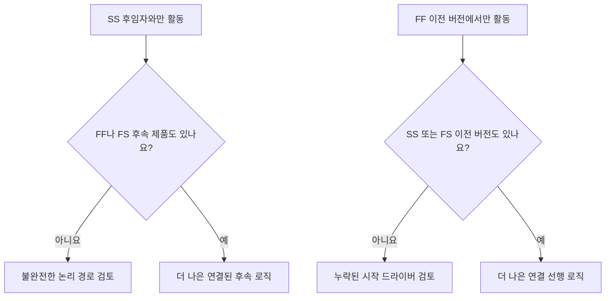

# 견고한 논리

논리는 프로젝트 공정표 내의 순서와 종속성을 수학적으로 표현한 것입니다. 무슨 일이 일어나기 전에 무슨 일이 일어나야 하는지, 어떤 활동이 동시에 일어날 수 있는지, 그리고 프로젝트 팀이 첫 번째 활동에서 최종 완료-시작 어떻게 이동할 것인지를 설명합니다.

좋은 Primavera P6 공정표에서 논리는 장식이 아닙니다. 공정표가 날짜, 여유시간, 주요 경로 및 예측 이동을 계산할 수 있도록 하는 엔진입니다. 이는 검토하고, 도전하고, 개선할 수 있는 방식으로 실행 이야기를 들려줍니다.

일정에 "기초를 쌓은 다음 벽을 쌓은 다음 지붕을 쌓는다"라고 적혀 있다면 논리는 해당 시퀀스를 계산 가능한 네트워크로 바꾸는 것입니다. 플래너는 단지 타임라인을 그리는 것이 아닙니다. 기획자가 배송 경로를 정의하고 있습니다.

## 논리는 작품의 이야기를 말해준다

모든 프로젝트 팀에는 프로젝트를 실행하기 위한 의도된 방법이 있습니다. 엔지니어링에서는 영역별로 디자인을 공개할 수 있습니다. 조달팀은 장비를 패키지로 배송할 수 있습니다. 토목 공사는 구조 작업이 시작되기 전에 접근을 준비할 수 있습니다. 시운전을 시작하기 전에 기계적 완료가 이루어져야 할 수도 있습니다.

논리 링크는 해당 계획의 수학적 표현입니다.

이 간단한 다이어그램은 단순한 시퀀스가 ​​아닙니다. 의사결정 모델입니다. 기초가 늦어지면 벽도 늦어질 수 있습니다. 벽이 늦으면 지붕도 늦어질 수 있습니다. 지붕 공사가 늦어지면 내부 공사에 영향을 미칠 수 있습니다. 일정은 논리가 있는 경우에만 해당 영향을 표시할 수 있습니다.

강력한 논리는 일정이 활동이 시작되는 이유, 종료되는 이유 및 계획의 한 부분이 이동하면 어떤 일이 발생하는지 설명할 수 있음을 의미합니다.

## 데이터 날짜에 강력한 논리가 중요한 이유

"주도 로직 없이 데이터 날짜에 시작하는 활동"이라는 지표는 공정표 품질에 대한 강력한 테스트입니다.

데이터 날짜는 실제 성과와 예측 작업 간의 경계입니다. 활동이 정확히 데이터 날짜에 시작되면 검토자는 다음과 같은 간단한 질문을 해야 합니다. 이 시작을 주도하는 것은 무엇입니까?

활동에 유효한 선행 로직이 있는 경우 일정으로 시작을 설명할 수 있습니다. 어쩌면 지역이 공개되었을 수도 있습니다. 어쩌면 자재 납품이 완료되었을 수도 있습니다. 아마도 이전 활동이 완료되어 다음 크루가 시작될 수 있었을 것입니다.

활동에 주도 로직가 없으면 시작이 약해집니다. 선행 작업이 없거나, 논리가 불완전하거나, 제약조건에 의해 강제되거나, 업데이트 상태가 완전히 지정되지 않았기 때문에 활동이 데이터 날짜에 있을 수 있습니다.

그렇기 때문에 강력한 논리가 중요합니다. 데이터 날짜가 이동되었다는 이유만으로 작업이 준비된 것으로 일정에 표시되어서는 안 됩니다. 작업을 시작할 수 있는 실제 상태를 보여주어야 합니다.

## 균형: 중복된 논리가 아닌 충분한 논리

좋은 논리는 균형을 이루고 있습니다. 일정에는 활동을 선행 작업과 후속 작업에 적절하게 연결하기 위한 충분한 관계가 필요합니다. 동시에 불필요한 방식으로 동일한 종속성을 반복하는 중복 논리를 피해야 합니다.

논리가 너무 적으면 개방형 시작, 개방형 종료, 신뢰할 수 없는 부동 및 취약한 임계 경로 결과가 생성됩니다. 논리가 너무 많으면 네트워크 검토가 어려워지고 활동의 실제 동인이 숨겨질 수 있습니다.

목표는 관계 수를 최대화하는 것이 아닙니다. 목표는 필수 및 필수 종속성을 명확하게 표현하는 것입니다.

각 활동에 대해 스케줄러는 다음과 같이 응답할 수 있어야 합니다.

- 무엇이 이 활동을 시작하게 합니까?
- 이 활동은 다음에 무엇을 가능하게 합니까?
- 실제로 활동을 주도하는 관계는 무엇입니까?
- 중복되거나 불필요한 관계가 있나요?
- 검토자가 의도한 순서를 이해할 수 있습니까?

이 균형은 PMO 공정표 검토의 핵심입니다. 조밀한 네트워크가 자동으로 강력한 네트워크가 되는 것은 아닙니다. 가벼운 네트워크는 자동적으로 깨끗한 네트워크가 아닙니다. 올바른 네트워크는 실행 계획을 깔끔하게 설명합니다.

## 모든 활동에는 시작 드라이버가 필요합니다

강력한 논리는 유효한 프로젝트 시작 또는 외부에서 승인된 예외를 제외하고 모든 활동에 시작을 허용하거나 트리거하는 선행 작업이 있음을 의미합니다.

건설 활동의 경우 시작 동인은 구역 접근, 이전 완료, 자재 가용성, 설계 릴리스, 허가 승인 또는 사전 거래 완료일 수 있습니다. 조달 활동의 경우 설계 승인 또는 구매 주문 릴리스가 될 수 있습니다. 시운전의 경우 기계적 완성, 테스트 패키지 준비 또는 시스템 교체가 포함될 수 있습니다.

이 시작 드라이버가 없으면 활동이 일정에서 인위적인 위치로 이동할 수 있습니다. 업데이트 중에는 데이터 날짜에 나타날 수 있습니다. 그것은 잘못된 준비 감각을 만듭니다.

"펌프 설치"라는 활동을 고려해 보십시오. 데이터 날짜에 시작했지만 기초 완료, 펌프 배송 또는 영역 인도에 대한 선행 작업이 없는 경우 일정은 설치를 시작할 수 있는 이유를 설명하지 않습니다. 활동이 계획될 수 있지만 논리가 견고하지 않습니다.

## SS와 FF는 반쪽 관계입니다

시작부터 시작까지 및 완료부터 종료까지의 관계는 유용하지만 신중하게 사용해야 합니다. 많은 공정표 검토에서는 활동을 자체적으로 완전한 논리 경로에 완전히 배치하지 않기 때문에 "절반" 관계로 가장 잘 이해됩니다.

SS 관계는 활동이 시작되는 시기를 설명할 수 있지만 활동이 언제 완료되어야 하는지 또는 무엇을 넘겨주는지는 설명하지 못할 수 있습니다. FF 관계는 종료 정렬을 설명할 수 있지만 활동 시작이 허용되는 시기는 설명하지 못할 수 있습니다.

그렇다고 해서 SS나 FF가 틀린 것은 아닙니다. 중복되는 작업은 일반적이며 종종 현실적입니다. 문제는 활동이 완전히 연결되었는지 여부입니다.

예를 들어:

- SS 후속 작업이 있는 활동에는 일반적으로 FF 또는 FS 후속 작업도 있어야 합니다.
- FF 선행 작업이 있는 활동에는 일반적으로 SS 또는 FS 선행 작업도 있어야 합니다.

이렇게 하면 활동이 해당 기간의 한쪽에만 연결되는 것을 방지할 수 있습니다. 일정에는 작업 시작 방법과 작업 완료 방법이 모두 설명되어야 합니다.

## 실제로 강력한 논리

실용적인 논리 검토는 데이터 날짜에 가까운 활동, 중요하고 거의 중요한 작업, 주요 인계 경로부터 시작해야 합니다. 이러한 영역은 현재 의사결정에 가장 큰 영향을 미칩니다.

P6의 유용한 검토 열에는 활동 ID, 활동 이름, WBS, 시작, 완료, 활동 상태, 총 부동, 선행 작업, 후속 작업, 관계 유형, 지연, 제약조건, 달력 및 사용 가능한 경우 주도 관계 표시기가 포함됩니다.

데이터 날짜에 시작되는 각 활동에 대해 다음을 질문하십시오.

- 활동을 시작할 준비가 정말 되었나요?
- 어떤 전임자가 시작을 허용합니까?
- 그 전임자는 완료되었습니까, 진행 중입니까, 아니면 예상됩니까?
- 관계가 주도하고 있습니까?
- 제약조건이나 예상 날짜가 논리를 대체합니까?
- 활동에 유효한 후속자 논리도 있습니까?

답변이 불분명한 경우 책임 있는 소유자와 함께 활동을 검토해야 합니다. 수정에는 누락된 선행 항목 추가, 관계 유형 변경, 제약조건 제거, 실제 업데이트 또는 유효한 예외 문서화 등이 포함될 수 있습니다.

## 인공 논리 피하기

한 가지 실수는 메트릭을 전달하기 위해서만 관계를 추가하는 것입니다. 이는 강력한 논리를 생성하지 않습니다. 인공적인 논리를 만들어냅니다.

관계는 실제 종속성을 나타내야 합니다. 링크가 건설 순서, 엔지니어링 릴리스, 조달 요구, 액세스, 승인, 테스트, 시운전 또는 인도를 반영하지 않는 경우 네트워크에 속하지 않을 수 있습니다.

또 다른 실수는 더 안전해 보이기 때문에 중복된 논리를 남겨 두는 것입니다. 동일한 종속성이 이미 더 명확한 관계로 표시되는 경우 추가 링크로 인해 중요한 경로가 혼동되고 네트워크 감사가 더 어려워질 수 있습니다.

강력한 논리는 명확하고 목적이 있으며 방어 가능합니다.

## 결론

논리는 프로젝트가 어떻게 실행될지에 대한 수학적 이야기입니다. 이는 먼저 일어나야 할 일, 함께 일어날 수 있는 일, 다음에 일어날 일을 정의합니다.

강력한 논리는 가능한 한 많은 링크를 추가하는 것을 의미하지 않습니다. 이는 올바른 링크를 추가하는 것을 의미합니다. 각 활동을 실제 선행 작업 및 후속 작업에 연결하기에 충분하지만 네트워크가 중복되거나 오해의 소지가 있을 정도로 많지는 않습니다.

주도 로직 없이 데이터 날짜에 활동이 시작되면 일정이 해당 스토리의 약점을 노출시킵니다. 활동이 준비된 것으로 표시될 수 있지만 네트워크에서는 이유를 설명하지 않습니다.

신뢰할 수 있는 일정은 이 질문에 명확하게 대답해야 합니다. 무엇이 이 작업을 시작하게 합니까? 다음에는 무엇을 가능하게 합니까? 일정이 두 가지 모두에 답할 수 있으면 논리가 견고해지고 있는 것입니다. 그렇지 않은 경우 프로젝트 팀은 예측을 신뢰할 수 있으려면 더 많은 순서 작업을 수행해야 합니다.
## 관련 콘텐츠
- [Primavera P6에서 종속성 누락 - 개요](../../metrics/21_missing_dependencies/02_guide_template.md)
- [Primavera P6 공정표의 중복 논리 - 개요](../../metrics/06_redundant_logic/02_guide_template.md)
- [일정이란 무엇입니까?](../01_WHAT%20A%20SCHEDULE%20IS/01_blog.md)
- [중요 경로](../03_CRITICAL%20PATH/03_CRITICAL%20PATH.md)
