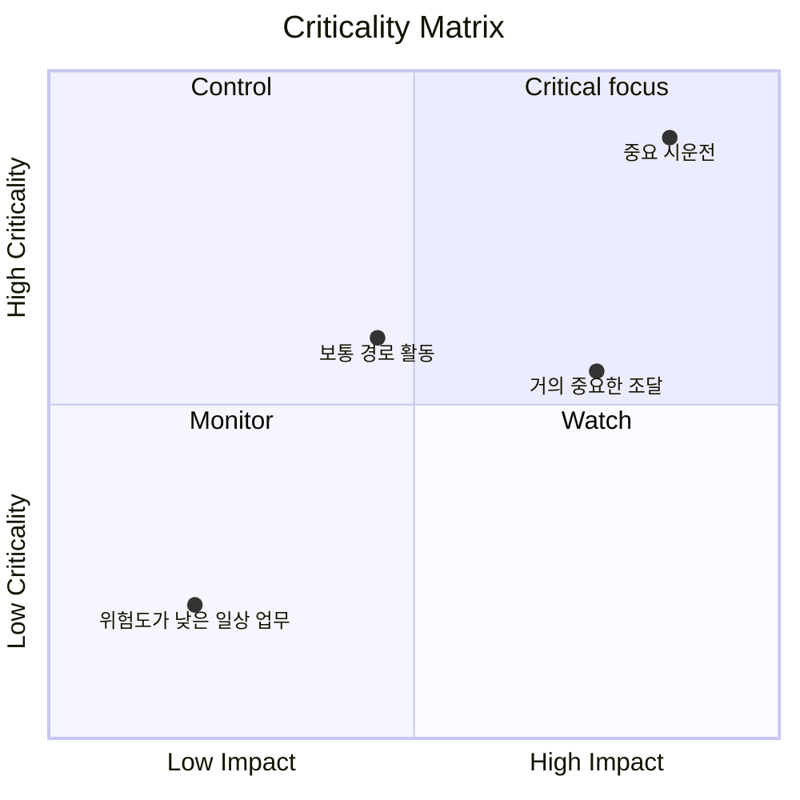

# 중요도 매트릭스

중요도 매트릭스는 프로젝트 완료에 얼마나 중요한지를 기준으로 프로젝트 활동을 분류하고 우선순위를 지정하는 데 사용되는 시각적 또는 분석적 방법입니다. Primavera P6 맥락에서 이는 프로젝트 관리자, 기획자 및 PMO 검토자가 어떤 활동이 가장 큰 일정 위험을 초래하는지 식별하는 데 도움이 됩니다.

주요 경로는 일정의 현재 결정론적 스토리를 알려줍니다. 중요도 매트릭스는 한 단계 더 발전합니다. 이를 통해 팀은 어떤 활동이 이미 중요한지, 어떤 활동이 중요해지기 직전인지, 어떤 활동이 미끄러질 경우 심각한 영향을 미칠지 이해하는 데 도움이 됩니다.

오늘날 중요한 활동이 항상 주의를 기울일 만한 유일한 활동은 아니기 때문에 이는 중요합니다. 지연에 큰 영향을 미치는 거의 중요한 활동이 내일의 문제가 될 수 있습니다. 장기간의 조달 활동은 현재의 중요한 경로에 있지 않을 수 있지만 긴밀한 통제를 정당화할 만큼 충분한 위험을 안고 있을 수 있습니다.

## P6에서 중요도의 의미

Primavera P6에서 중요도는 일반적으로 활동이 지연될 경우 프로젝트 완료 날짜에 영향을 미칠 수 있는지 여부를 나타냅니다. 전통적으로 P6은 전체 부동 또는 가장 긴 경로 설정을 사용하여 중요한 활동을 식별합니다.

일반적인 결정론적 정의는 간단합니다.

- 중요 활동은 여유시간이 0이거나 음수인 활동입니다.
- 이러한 활동은 중요한 경로에 있거나 중요한 경로와 밀접하게 연결되어 있습니다.
- 지연될 경우 프로젝트 종료일이 지연될 가능성이 높습니다.

이 정의는 유용하지만 완전하지는 않습니다. 이는 계산된 하나의 일정 조건을 기반으로 합니다. 활동이 실패할 경우 불확실성, 확률 또는 영향의 크기를 완전히 설명하지 않습니다.

중요도 매트릭스는 "오늘 이 활동이 중요한가?"에서 토론을 확장합니다. "이 활동이 심각해질 가능성은 얼마나 되며, 이로 인해 얼마나 많은 피해가 발생할 수 있습니까?"

## 중요도 매트릭스가 결합하는 것

중요도 매트릭스는 일반적으로 두 가지 차원을 결합합니다.

첫 번째 차원은 일정 민감도 또는 가능성입니다. 이는 몬테카를로 시뮬레이션 중에 활동이 얼마나 자주 중요해졌는지 또는 총 부동 또는 임계에 가까운 임계값을 기준으로 활동이 임계에 얼마나 가까운지를 기준으로 측정할 수 있습니다.

두 번째 차원은 영향입니다. 이는 활동이 지연될 경우 지연의 심각도를 의미합니다. 영향은 활동 기간, 프로젝트 완료에 대한 지연 영향, 민감도 지수, 비용 노출, 계약상의 마일스톤 영향 또는 경영진 판단에 따라 달라질 수 있습니다.

이러한 차원은 팀이 활동의 ​​우선순위를 정하는 데 도움이 됩니다.

이러한 유형의 보기는 중요한 필터에만 나타나는 활동과 적극적인 관리 주의가 필요한 활동을 구분하기 때문에 유용합니다.

## 간단한 매트릭스 구조

기본 중요도 매트릭스는 그리드로 표시될 수 있습니다.

| 중요도/영향 | 낮은 영향 | 중간 영향 | 높은 영향 |
| --- | --- | --- | --- |
| 낮은 중요도 | 감시 장치 | 감시 장치 | 보다 |
| 중간 중요도 | 검토 | 제어 | 높은 우선순위 |
| 높은 중요성 | 제어 | 높은 우선순위 | 중요한 초점 |

정확한 라벨은 조직에 따라 변경될 수 있지만 아이디어는 동일합니다. 중요도와 영향이 낮은 활동을 모니터링할 수 있습니다. 중요성과 영향력이 높은 활동에는 집중적인 통제가 필요합니다.

## 매트릭스에 사용되는 P6 데이터

Primavera P6은 일반적으로 기본적으로 내장된 중요도 매트릭스 보기를 제공하지 않습니다. 매트릭스는 일반적으로 외부 분석과 결합된 P6 활동 데이터를 사용하여 구축됩니다.

유용한 P6 필드는 다음과 같습니다.

- 총 여유시간.
- 프리 여유시간.
- 활동 기간.
- 잔여 기간.
- 활동 상태.
- 시작 및 완료일.
- 제약.
- 관계 논리.
- 달력.
- WBS 또는 활동 코드.
- 중요하거나 가장 긴 경로 표시기입니다.

이 데이터는 결정적인 일정 보기를 제공합니다. 현재 계산된 경로, 거의 중요한 작업, 제한된 활동 및 오랫동안 노출되어 있는 활동을 보여줍니다.

## 위험 분석 입력

매트릭스를 더욱 강력하게 만들기 위해 팀은 몬테카를로 분석에서 얻은 확률적 일정 위험 데이터를 추가할 수 있습니다. 이는 Primavera 위험 분석 또는 기타 위험 시뮬레이션 플랫폼과 같은 도구에서 나올 수 있습니다.

중요한 위험 지표에는 중요도 지수, 총 유동량, 일정 민감도 지수 및 기간 또는 영향 값이 포함됩니다.

CI라고도 불리는 중요도 지수는 활동이 중요 경로에 나타나는 시뮬레이션의 비율을 표시합니다. 예를 들어 활동의 CI = 80%인 경우 시뮬레이션된 시나리오의 80%에서 중요했습니다.

총 부동액은 결정적 일정에서 활동이 프로젝트 완료에 얼마나 영향을 미치는지 보여줍니다. 거의 0에 가까운 여유시간는 경고 신호입니다.

일정 민감도 지수는 중요도와 영향을 결합합니다. 이는 활동이 중요해졌는지 여부뿐만 아니라 결과에 의미 있는 영향을 미치는지 여부도 보여주는 데 도움이 됩니다.

기간 또는 영향 값은 심각도를 추정하는 데 도움이 됩니다. 장기 활동, 고위험 조달 패키지 또는 계약 마일스톤과 관련된 작업은 지연될 경우 더 큰 영향을 미칠 수 있습니다.

## 예

다음과 같은 단순화된 활동 세트를 고려하십시오.

| 활동 | 뜨다 | 중요도 지수 | 지속 | 매트릭스 결과 |
| --- | ---: | ---: | ---: | --- |
| 에이 | 0일 | 95% | 20일 | 중요한 초점 |
| 비 | 5일 | 60% | 15일 | 높은 우선순위 |
| 기음 | 20일 | 15% | 10일 | 감시 장치 |

활동 A는 중요도가 높고 영향이 큰 영역에 속합니다. 여유시간가 없고 대부분의 시뮬레이션에서 중요한 것으로 보이며 지속 시간이 깁니다. 집중적으로 제어할 가치가 있습니다.

활동 B는 활동 A만큼 긴급하지는 않지만 여전히 주의를 기울일 가치가 있습니다. 제한된 여유시간와 중요해질 확률이 높습니다.

활동 C에는 부동이 더 많고 중요도가 더 낮습니다. 무시해서는 안 되지만 동일한 수준의 관리 집중이 필요하지는 않습니다.

## 왜 유용한가요?

중요도 매트릭스는 프로젝트 팀이 단일 결정론적 중요 경로에만 의존하지 않도록 도와줍니다. 결정론적 경로는 중요하지만 일정에 대한 하나의 보기일 뿐입니다.

매트릭스는 팀에 다음을 지원합니다.

- 면밀히 모니터링할 항목의 우선순위를 정하세요.
- 주요 위험 활동에 대한 완화에 중점을 둡니다.
- 거의 중요한 활동이 중요해지기 전에 식별합니다.
- 확률적 일정 위험을 이해합니다.
- 하나의 보기에서 가능성과 영향을 비교하세요.
- 일정 위험을 경영진에게 보다 명확하게 전달합니다.

PMO 보고의 경우 이는 일정 복잡성을 의사 결정 프레임워크로 변환하므로 특히 유용합니다. 수백 가지 활동을 제시하는 대신 팀은 어떤 활동이 "중요한 초점", "높은 우선순위", "통제" 또는 "모니터링" 영역에 있는지 보여줄 수 있습니다.

## 하나를 만드는 간단한 방법

P6에서 활동 데이터를 내보내는 것부터 시작하세요. 활동 ID, 활동 이름, WBS, 총 부동 시간, 잔여 기간, 시작, 완료, 달력, 제약조건 및 중요 또는 가장 긴 경로 표시기를 포함합니다.

그런 다음 중요도 지수 및 일정 민감도 지수와 같은 선택적 위험 분석 필드를 추가합니다. 시뮬레이션 데이터를 사용할 수 없는 경우 부동 및 기간을 기반으로 실제 임계값을 사용하십시오. 예를 들어 중요도가 높다는 것은 총 여유시간이 0일 이하이거나 CI가 70%를 초과함을 의미할 수 있습니다. 중간 중요도는 거의 임계에 가까운 부동 또는 CI가 40%에서 70% 사이임을 의미할 수 있습니다.

영향 임계값을 정의합니다. 영향력이 큰 활동은 장기간일 수도 있고, 계약상 중요 시점에 연결되거나, 고위험 패키지의 일부일 수도 있고, 시뮬레이션을 통해 프로젝트 완료에 영향을 미칠 수도 있습니다.

마지막으로 Excel, Power BI 또는 기타 보고 도구에서 활동을 표시합니다. 결과는 복잡할 필요가 없습니다. 가치는 우선순위를 가시화하는 데서 나옵니다.

## 판단력을 사용하라

중요도 매트릭스는 자동 답변이 아닌 의사결정 지원 도구입니다. 임계값은 프로젝트 통제 팀에서 검토하고 프로젝트 유형, 계약 민감도 및 일정 성숙도에 맞게 조정되어야 합니다.

또한 매트릭스는 공정표 품질에 따라 달라집니다. P6 공정표에 논리 누락, 비현실적인 기간, 엄격한 제약, 열악한 달력 또는 약한 상태 업데이트가 있는 경우 매트릭스는 이러한 약점을 상속합니다.

매트릭스의 가장 좋은 용도는 분석 결과를 전문적인 일정 판단과 결합하는 것입니다.

## 결론

중요도 매트릭스는 프로젝트 활동이 얼마나 중요해질 가능성과 지연될 경우 얼마나 많은 영향을 미칠지에 따라 순위를 매깁니다. 총여유시간, Duration, Constraints, logic 등 P6 데이터를 활용하며, Criticality Index, Schedule Sensitivity Index 등의 Monte Carlo 결과로 강화할 수 있습니다.

프로젝트 관리자와 PMO 검토자의 경우 매트릭스는 일정 위험을 보다 명확한 관리 대화로 전환합니다. 이는 팀이 오늘날의 중요 필터에 나타나는 활동뿐만 아니라 가장 중요한 활동에 집중하는 데 도움이 됩니다.

잘 사용하면 중요도 매트릭스는 프로젝트 팀이 사후 보고에서 사전 예방적 일정 제어로 전환하는 데 도움이 됩니다.
## 관련 콘텐츠
- [제약조건으로 시작하는 중요 경로 또는 부동 경로 - 개요](../../10_metrics_ko/09_cp_or_float_path_starting_with_constraint/01_overview_template.md)
- [중요 경로](../03_CRITICAL%20PATH/03_CRITICAL%20PATH.md)
- [P6의 활동 유형](../05_ACTIVITY%20TYPES%20IN%20P6/05_ACTIVITY%20TYPES%20IN%20P6.md)
