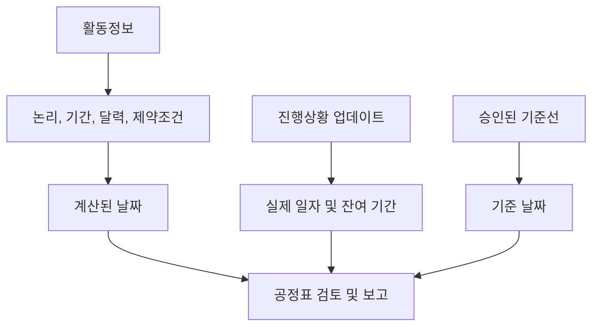

# P6의 날짜

Primavera P6의 날짜는 활동에 시작 날짜와 완료 날짜가 하나만 있지 않기 때문에 혼란스러울 수 있습니다. 계획된 날짜, 현재 일정 날짜, 초기 날짜, 늦은 날짜, 실제 일자, 기준 날짜, 제약 날짜, 예상 날짜 및 때로는 레이아웃 및 프로젝트 설정에 따라 외부 또는 예측 관련 날짜가 있을 수 있습니다.

이 날짜는 모두 같은 것을 의미하지 않습니다. 일부는 CPM 로직으로 계산됩니다. 일부는 진행 상황 업데이트 중에 입력됩니다. 일부는 비교를 위해 사용됩니다. 일부는 일정을 제어하거나 제한하는 데 사용됩니다. 공정표 품질, PMO 보고, 지연 분석 준비 및 기본 프로젝트 통제를 위해서는 차이점을 이해하는 것이 필수적입니다.

가장 중요한 질문은 간단합니다. 이 날짜가 나에게 무엇을 말해주고 있으며, 어디서 왔는가?

## P6에 날짜가 너무 많은 이유

P6은 단순한 날짜 목록이 아닙니다. 계산 모델입니다. 소프트웨어는 활동 기간, 달력, 관계, 제약조건, 자원, 진행 상태, 데이터 날짜를 바탕으로 날짜를 계산합니다.

기획자가 다양한 질문에 답해야 하기 때문에 다양한 날짜 필드가 존재합니다.

- 원래 계획은 무엇이었나요?
- 현재 예측은 어떻습니까?
- 실제로 무슨 일이 일어났나요?
- 활동을 시작하거나 끝낼 수 있는 가장 빠른 시간은 언제입니까?
- 프로젝트에 영향을 주지 않고 시작하거나 끝낼 수 있는 가장 최근의 일은 무엇입니까?
- 활동을 강제하는 제약사항이 있나요?
- 현재 계획은 기준과 어떻게 비교됩니까?

문제는 이러한 날짜 유형이 목적을 이해하지 못한 채 혼합될 때 시작됩니다.

## 데이터 날짜

데이터 날짜는 활동 날짜는 아니지만 모든 활동 날짜를 해석하는 방법을 제어합니다.

데이터 날짜는 실제 성과와 예측 작업 간의 경계입니다. 데이터 날짜 이전의 작업은 실현되거나 상태화되어야 합니다. 데이터 날짜 이후의 작업을 예측해야 합니다.

활동의 실제 일자가 데이터 날짜 이후인 경우 이는 일반적으로 상태 오류입니다. 진행 논리 없이 데이터 날짜에 진행 중인 활동이 정확히 시작되면 순서가 누락되었음을 나타낼 수 있습니다. 예상되는 완료 날짜가 데이터 날짜 이전인 경우 이는 오래된 업데이트 정보를 의미할 수 있습니다.

활동 날짜를 검토하기 전에 데이터 날짜를 확인하세요.

## 시작과 마무리

시작 및 종료는 대부분의 사용자가 P6 레이아웃에서 볼 수 있는 주요 일정 날짜입니다. 이는 일정 데이터를 기반으로 활동에 대해 현재 계산되거나 예정된 날짜를 나타냅니다.

시작되지 않은 활동의 경우 시작 및 완료는 예측 날짜입니다. 진행 중인 활동의 경우 실제 상태와 남은 예측을 결합할 수 있습니다. 완료된 활동의 경우 실제 일자와 일치해야 합니다.

이는 일반적으로 보고서, 예측 일정 및 관리 논의에 사용되는 날짜입니다. 그러나 그 이면의 논리와 현황을 확인하지 않고 받아들여서는 안 된다.

시작 및 종료를 사용하여 다음 질문에 답하십시오. 활동이 현재 언제 시작되고 종료되도록 예정되어 있습니까?

## 조기 시작 및 조기 종료

Early Start 및 Early Finish는 CPM 계산 날짜입니다. 선행 작업 논리, 달력, 제약조건 및 현재 일정 조건을 기반으로 활동을 시작하고 완료할 수 있는 가장 빠른 날짜를 표시합니다.

초기 날짜는 공정표 계산의 전달을 설명하는 데 도움이 되므로 중요합니다. 논리가 허용하는 대로 작업이 네트워크를 통해 어떻게 이동할 수 있는지 보여줍니다.

많은 활동이 데이터 날짜에 조기 시작되는 경우 검토자는 해당 활동이 실제로 준비되었는지 또는 개방형 시작, 제한된 활동 또는 약하게 연결된 활동인지 확인해야 합니다.

조기 시작 및 조기 완료를 사용하여 답하십시오. 현재 네트워크에 따라 이 활동이 발생할 수 있는 가장 빠른 시간은 언제입니까?

## 늦은 시작과 늦은 마무리

늦은 시작 및 늦은 완료는 일정 설정에 따라 프로젝트 완료 또는 제어 종료 지점을 지연시키지 않고 활동을 시작하거나 완료할 수 있는 가장 늦은 날짜를 표시합니다.

늦은 날짜는 역방향 전달의 일부입니다. 이는 여유시간를 계산하는 데 사용됩니다. 빠른 날짜와 늦은 날짜의 차이는 활동의 유연성이 얼마나 되는지 보여주는 데 도움이 됩니다.

날짜가 늦어지는 것이 이상해 보인다면 제약조건, 누락된 후임자, 미결 완료, 달력 또는 비정상적인 프로젝트 완료 설정을 찾아보세요.

늦은 시작 및 늦은 완료를 사용하여 답변: 이 활동이 제어 완료 날짜에 영향을 미치기 전에 얼마나 늦게 이동할 수 있습니까?

## 실제 시작 및 실제 완료

실제 시작 및 실제 완료는 상태 사실입니다. 현장이나 프로젝트 실행에서 실제로 발생한 일을 나타내야 합니다.

실제 시작은 활동이 실제로 시작되었음을 의미합니다. 실제 완료란 활동이 실제로 완료되었음을 의미합니다. 이 날짜를 계획 목표 또는 예측 날짜로 사용해서는 안 됩니다.

실제 일자는 일반적으로 데이터 날짜 또는 그 이전이어야 합니다. 실제 일자가 데이터 날짜 이후인 경우 일정은 향후 작업을 이미 시작되었거나 완료된 것으로 보고하므로 업데이트 신뢰성이 약화됩니다.

실제 시작 및 실제 완료를 사용하여 답하세요. 실제로 무슨 일이 일어났나요?

## 계획된 시작 및 계획된 완료

계획된 시작과 계획된 완료는 종종 오해됩니다. 일정이 생성, 업데이트 및 표시되는 방식에 따라 이러한 필드는 공식적으로 승인된 기준선처럼 작동하지 않을 수 있습니다.

일부 사용자는 계획 날짜가 원래 계획을 영원히 표시할 것으로 기대합니다. 이것이 항상 안전한 가정은 아닙니다. 공식적인 차이 보고의 경우 할당된 기준선은 일반적으로 계획 날짜에 아무렇게나 의존하는 것보다 더 안정적입니다.

프로젝트 통제 절차에서 유지 관리 방법과 의미를 명확하게 정의한 경우에만 계획된 시작 및 계획된 완료를 사용하십시오.

## 기준선 시작 및 기준선 종료

기준 날짜는 할당된 기준선에서 나옵니다. 현재 일정을 승인된 계획과 비교하는 데 사용됩니다.

예를 들어, BL1 시작 및 BL1 완료에는 승인된 기준선을 기준으로 활동의 시작 및 완료 날짜가 표시될 수 있습니다. 현재 시작 및 종료는 최신 예측을 표시합니다. 이들 사이의 차이는 차이를 나타냅니다.

기준 날짜는 성과 보고, 일정 차이, 변경 제어 및 지연 분석 준비의 핵심입니다.

기준 시작 및 기준 완료를 사용하여 답하세요. 현재 일정이 승인된 계획과 어떻게 비교됩니까?

## 제약 날짜

제약 날짜에는 날짜 제어가 적용됩니다. 이는 시작 시, 시작 시 또는 이후, 종료 시, 종료 시 또는 이전, 필수 시작 또는 필수 완료와 같은 제약 유형에 연결됩니다.

제약조건은 자동으로 잘못된 것이 아닙니다. 일부는 실제 계약 날짜, 액세스 제한, 허가 해제, 중단 기간 또는 소유자 요구 사항을 나타냅니다. 그러나 제약조건은 누락된 논리를 숨기거나 비현실적인 날짜를 강요할 수도 있습니다.

엄격한 제약조건, 특히 필수 시작 및 필수 완료는 거의 발생하지 않으며 문서화되어야 합니다.

제약 날짜를 사용하여 답하십시오: 부과된 날짜가 이 활동을 통제하거나 제한합니까?

## 예상 완료 및 예측 유형 날짜

예상 완료는 업데이트 중에 프로젝트 팀이 활동이 완료될 것으로 예상하는 시기를 포착하는 데 자주 사용됩니다. 설정 및 절차에 따라 예상 날짜는 P6이 활동 날짜를 계산하거나 표시하는 방법에 영향을 미칠 수 있습니다.

예상 완료는 현장 팀이 현실적인 완료 기대치를 제공할 때 진행 중인 작업에 유용할 수 있습니다. 그러나 유지 관리하지 않으면 오래될 수 있습니다. 데이터 날짜 이전에 완료가 예상되는 것은 일반적인 경고 신호입니다.

일부 프로젝트에서는 보고를 위해 예측 관련 날짜 필드나 사용자 정의 필드도 사용합니다. 핵심은 이를 명확하게 정의하여 팀이 계산, 수동 입력 또는 가져오기 여부를 알 수 있도록 하는 것입니다.

예상 또는 예상 날짜를 사용하여 답하십시오. 팀의 최근 기대는 무엇이며 정의된 업데이트 절차에 의해 제어됩니까?

## 1차 및 2차 제약 날짜

P6은 선택된 제약 필드에 따라 활동에 대해 둘 이상의 제약조건을 보유할 수 있습니다. 기본 제약조건은 일반적으로 표준 레이아웃에 표시되는 주요 제약조건이지만 두 번째 제약조건도 해석에 영향을 미칠 수 있습니다.

공정표 검토 시 시작과 완료만 보지 마십시오. 제약 유형 및 제약 날짜 필드를 레이아웃에 추가합니다. 날짜가 예상대로 작동하지 않는 경우 가장 먼저 확인해야 할 사항 중 하나는 제약조건입니다.

## 어떤 날짜를 사용해야 합니까?

각 날짜를 해당 목적에 맞게 사용하십시오.

- 현재 일정 예측에 대해 시작 및 완료를 사용합니다.
- CPM 계산과 여유시간을 이해하려면 이른 날짜와 늦은 날짜를 사용하세요.
- 작업이 완료되었거나 시작된 경우 실제 일자를 사용하세요.
- 승인된 계획과의 차이를 확인하려면 기준 날짜를 사용하세요.
- 제약 날짜를 사용하여 부과된 날짜 통제를 식별합니다.
- 업데이트 절차에서 정의한 경우에만 예상 완료 또는 예측 필드를 사용하십시오.
- 데이터 날짜를 사용하여 예측 작업과 실제 성과를 구분합니다.

## 일반적인 실수

흔한 실수 중 하나는 잘못된 날짜를 비교하는 것입니다. 예를 들어, 계획된 날짜가 프로젝트 절차에 의해 제어되지 않으면 현재 시작과 계획된 시작을 비교하는 것이 의미가 없을 수 있습니다.

또 다른 실수는 실제 시작을 예측으로 취급하는 것입니다. 실제 일자는 의도가 아닌 실제 성과를 나타내야 합니다.

세 번째 실수는 시간을 무시하는 것입니다. P6은 날짜를 시간과 함께 저장하며, 달력 차이로 인해 하루 교대 근무가 발생하거나 예상치 못한 결과가 발생할 수 있습니다.

마지막으로 제약 날짜를 숨기지 마십시오. 날짜가 지정되면 검토자는 이를 확인해야 합니다.

## 결론

P6의 날짜는 일정 이야기의 다양한 부분을 알려주기 때문에 강력합니다. 현재 날짜는 예측을 보여줍니다. 빠른 날짜와 늦은 날짜는 CPM 계산을 설명합니다. 실제 일자는 무슨 일이 일어났는지 기록합니다. 기준 날짜는 비교를 지원합니다. 제약 날짜는 부과된 통제를 나타냅니다. 예상 날짜는 제대로 유지 관리되면 업데이트를 지원할 수 있습니다.

강력한 공정표 검토는 "날짜가 언제입니까?"만 묻지 않습니다. "이게 무슨 날짜인지, 어디서 나온 것인지, 믿을 수 있는 것인지" 묻는다.

프로젝트 팀이 각 날짜 필드의 의미를 이해하면 일정을 더 쉽게 설명하고, 감사하고, 프로젝트를 더 안정적으로 제어할 수 있습니다.
## 관련 콘텐츠
- [Primavera P6의 데이터 날짜보다 실제 일자가 이후임 - 개요](../../10_metrics_ko/12_actual_date_greater_than_data_date/01_overview_template.md)
- [P6의 기간 유형](../06_DURATION%20TYPES%20IN%20P6/06_DURATION%20TYPES%20IN%20P6.md)
- [P6의 캘린더](../08_CALENDARS%20IN%20P6/08_CALENDARS%20IN%20P6.md)
