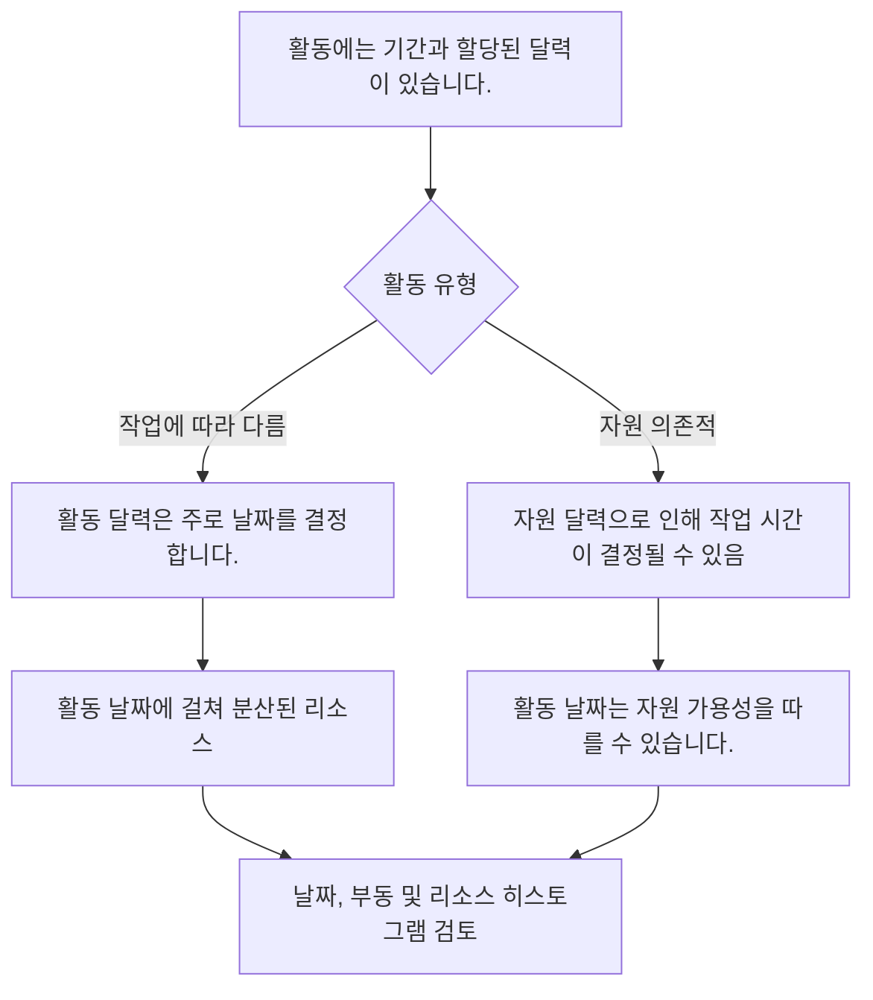

# P6의 캘린더

달력은 Primavera P6 공정표의 조용한 기초 중 하나입니다. 작업이 언제 발생할 수 있는지 정의합니다. 그들은 P6에게 어느 날이 근무일인지, 어느 날이 휴무일인지, 하루에 몇 시간을 사용할 수 있는지, 하루 중 작업이 시작되고 끝나는 시간을 알려줍니다.

달력은 뒤에서 작동하기 때문에 과소평가되기 쉽습니다. 일정은 강력한 논리와 합리적인 기간을 가질 수 있지만 달력이 잘못되었거나 일관성이 없는 경우 날짜는 여전히 오해의 소지가 있습니다.

공정표 품질, 리소스 계획, 중요 경로 검토 및 업데이트 규율을 위해서는 달력을 이해하는 것이 필수적입니다.

## P6에서 달력이 하는 일

P6에서는 달력이 기간을 날짜로 변환합니다. 활동 기간이 영업일 기준 10일인 경우 P6은 영업일의 의미를 알아야 합니다. 월요일부터 금요일까지인가요? 토요일도 포함되나요? 근무시간은 8시간인가요, 10시간인가요, 12시간인가요? 일이 7시나 8시에 시작되나요? 휴일은 제외되나요?

달력은 이러한 질문에 답합니다.

달력의 영향:

- 활동 시작 및 완료일.
- 이른 날짜와 늦은 날짜.
- 총 여유시간.
- 임계 경로와 가장 긴 경로.
- 자원 사용 타이밍.
- 관계 지연 해석.
- 업데이트 중 날짜가 변경됩니다.
- 예측 및 보고의 정확성.

달력은 단순한 관리 설정 항목이 아닙니다. 공정표 계산의 일부입니다.

## 하나 이상의 달력이 필요한 이유

모든 작업이 동일한 작업 패턴을 따르지는 않기 때문에 많은 프로젝트에는 두 개 이상의 달력이 필요합니다.

예는 다음과 같습니다:

- 5일 달력에 따른 사무실 엔지니어링 작업입니다.
- 6일간의 현장 건설 작업입니다.
- 24시간 달력에 따라 종료 또는 중단 작업이 수행됩니다.
- 야간 교대 시운전 작업.
- 소유자 액세스 창.
- 환경 제한.
- 공급업체 근무일을 기준으로 한 조달 활동.
- 검사관, 공급업체 또는 전문 인력을 위한 자원별 달력입니다.

모든 일에 하나의 달력을 사용하는 것은 간단해 보이지만 비현실적인 날짜를 생성할 수 있습니다. 시운전이 밤에만 이루어질 수 있다면 일반적인 주간 달력이 틀릴 수 있습니다. 공급업체가 평일에만 작업하는 경우 7일 건설 일정으로 인해 가용성이 과장될 수 있습니다.

목표는 달력을 많이 만드는 것이 아닙니다. 목표는 일정을 불필요하게 복잡하게 만들지 않고 실제 작업 조건을 모델링할 수 있는 충분한 달력을 만드는 것입니다.

## 활동 달력

활동 달력은 활동에 직접 할당됩니다. 특히 작업 종속 활동의 경우 해당 활동의 기간과 날짜를 계산하는 데 사용되는 작업 시간을 정의합니다.

예를 들어, "케이블 트레이 설치"에 6일 건설 달력이 있는 경우 P6는 해당 달력을 기반으로 작업량을 계산합니다. 토요일이 근무일인 경우 활동은 5일 달력보다 일찍 완료될 수 있습니다.

활동 달력은 일반적으로 일반 일정 활동에 대한 기본 달력 제어입니다.

작업 자체가 주간 교대, 야간 교대, 종료 작업 또는 사무 작업과 같이 정의된 작업 패턴을 따르는 경우 활동 달력을 사용합니다.

## 자원 달력

자원 달력은 자원을 사용할 수 있는 시기를 정의합니다. 리소스는 사람, 팀, 장비 항목, 공급업체 전문가 또는 기타 할당된 리소스일 수 있습니다.

자원 달력은 활동이 자원 의존적이거나 프로젝트가 자원 평준화 또는 상세한 자원 계획을 사용하는 경우 특히 중요합니다.

예를 들어, 활동에 6일 건설 달력이 할당될 수 있지만 해당 활동에 할당된 전문 검사관은 월요일부터 수요일까지만 근무할 수 있습니다. 활동이 자원 중심인 경우 P6은 활동 달력만이 아닌 자원 달력을 기반으로 날짜를 계산할 수 있습니다.

자원 달력은 자원 가용성이 실제 일정 제약인 경우에 유용합니다. 또한 할당되었으나 유지 관리되지 않는 경우 혼란을 야기할 수도 있습니다.

## 활동 및 자원 달력이 인터페이스되는 방식

활동 달력과 자원 달력 간의 관계는 활동 유형, 자원 설정 및 공정표 계산 동작에 따라 달라집니다.

작업 종속 활동의 경우 일반적으로 활동 달력이 활동 기간의 기본 기준이 됩니다. 자원 달력은 여전히 ​​자원 분산 및 사용량에 영향을 미칠 수 있습니다.

자원 의존 활동의 경우 자원 달력은 작업 수행 시기에 영향을 미칠 수 있습니다. 이는 자원 달력이 활동 날짜에 더 직접적으로 영향을 미칠 수 있음을 의미합니다.

중요한 점은 달력을 함께 검토해야 한다는 것입니다. 활동 달력에는 작업이 가능하다고 표시되지만 자원 달력에는 할당된 자원을 사용할 수 없다고 표시될 수 있습니다. 이러한 불일치로 인해 비동기화가 발생할 수 있습니다.

## 달력 비동기화의 의미

달력 비동기화는 일정의 여러 달력이 프로젝트의 실제 작동 방식과 일치하지 않을 때 발생합니다.

일반적인 예는 다음과 같습니다.

- 활동은 6일 달력을 사용하지만 할당된 자원은 5일 달력을 사용합니다.
- 활동은 주간 교대 달력을 사용하지만 자원은 야간 교대를 사용합니다.
- 두 개의 연결된 활동은 하루 중 서로 다른 시작 및 종료 시간을 사용합니다.
- 시차는 업무와 맞지 않는 달력을 통해 해석된다.
- 복사된 활동은 다른 프로젝트의 이전 달력을 유지합니다.
- 자원 달력에는 활동 달력에 없는 휴일이 있습니다.

결과는 혼란스러울 수 있습니다. 날짜가 예기치 않게 바뀔 수 있습니다. 활동은 하루 후에 끝나는 것처럼 보일 수 있습니다. 여유시간는 명확한 논리적 이유 없이 변경될 수 있습니다. 리소스 히스토그램이 실행 계획과 일치하지 않을 수 있습니다. 실제 순서가 아닌 달력 동작으로 인해 주요 경로가 이동할 수 있습니다.

## 달력 불일치로 인한 문제

일정 불일치로 인해 여러 가지 공정표 품질 문제가 발생할 수 있습니다.

첫째, 오해의 소지가 있는 날짜를 만들 수 있습니다. 달력의 작업 기간이 적기 때문에 작업이 더 오래 걸리는 것처럼 보일 수 있습니다.

둘째, 여유시간를 왜곡할 수 있습니다. 다양한 달력에서의 활동은 설명하기 어려운 방식으로 이른 날짜와 늦은 날짜를 계산할 수 있습니다.

셋째, 중요한 경로에 영향을 줄 수 있습니다. 논리 순서가 실제로 제어하기 때문이 아니라 달력이 작업을 제한하기 때문에 경로가 중요해질 수 있습니다.

넷째, 자원 보고에 손상을 줄 수 있습니다. 리소스 히스토그램은 리소스를 실제로 사용할 수 없는 날짜의 리소스 수요를 표시하거나 표시되어야 하는 수요를 놓칠 수 있습니다.

마지막으로 업데이트 혼란을 야기할 수 있습니다. 데이터 날짜가 이동하면 다양한 달력의 활동이 다르게 반응할 수 있으므로 일정을 상태화하고 검토하기가 더 어려워집니다.

## 비동기화를 해결하는 방법

프로젝트 달력 표준을 식별하는 것부터 시작하십시오. 일반 근무 주, 근무 시작 및 종료 시간, 휴일, 종료 기간, 특별 근무 기간을 정의합니다.

그런 다음 일정의 모든 캘린더를 검토합니다. 확인하다:

- 달력 이름과 목적.
- 근무일.
- 일일 근무 시간.
- 시작 및 종료 시간.
- 휴일 및 예외.
- 달력 유형.
- 달력에 할당된 활동입니다.
- 달력에 할당된 리소스입니다.

다음으로 날짜가 이상해 보이는 활동을 검토하세요. 가능한 경우 활동 달력, 활동 유형, 시작, 완료, 조기 시작, 조기 완료, 총 부동, 자원 및 자원 달력에 대한 열을 추가하십시오.

달력이 틀리면 수정하세요. 활동이 잘못된 캘린더에 할당된 경우 할당을 변경하세요. 자원 달력이 유효하지만 예상치 못한 결과가 발생하는 경우 활동이 자원 종속인지 아니면 작업 종속인지 확인하십시오.

수정 후 공정표를 다시 계산하고 영향을 받은 날짜, 여유시간, 주요 경로 및 자원 히스토그램을 검토합니다.

## 좋은 달력 거버넌스

캘린더는 논리 및 제약조건처럼 관리되어야 합니다. 통제 없이 증식해서는 안 됩니다.

모범 사례에는 다음이 포함됩니다.

- 명확한 명명 규칙을 사용하십시오.
- 승인된 프로젝트 공정표을 제한적으로 유지하세요.
- 특별한 달력이 존재하는 이유를 문서화하십시오.
- 이전 일정에서 사용하지 않는 달력을 복사하지 마세요.
- 기준 승인 전에 활동 일정 할당을 검토합니다.
- 리소스 로딩이 사용되는 경우 리소스 달력을 검토하세요.
- 근무일뿐만 아니라 달력 시작 및 종료 시간도 확인하세요.

캘린더 관리는 많은 사용자가 활동을 추가하거나 복사할 수 있는 대규모 일정에서 특히 중요합니다.

## 실제 사례

건설 프로젝트에서는 현장 작업에 6일 달력을 사용합니다. 대부분의 건설 활동은 월요일부터 토요일까지 07:00부터 17:00까지 진행됩니다. 시운전 팀은 22:00부터 6:00까지 야간 근무를 합니다. 테스트는 운영이 오프라인일 때만 가능하기 때문입니다.

두 달력 모두 유효합니다.

복사된 건설 활동이 실수로 야간 근무 달력을 상속하는 경우 문제가 나타납니다. 그들의 날짜가 이상하게 움직이기 시작합니다. 일부 관계는 후임자를 다음 날로 밀어넣는 것처럼 보입니다. 팀이 설명할 수 없는 방식으로 변경 사항을 플로팅합니다.

해결 방법은 야간 근무 달력을 삭제하지 않는 것입니다. 해결 방법은 활동 달력 할당을 수정하고, 실제로 야간 교대 달력이 필요한 활동을 확인하고, 공정표를 다시 계산하는 것입니다.

## 결론

P6의 달력은 작업이 가능한 시기를 정의합니다. 이는 활동 날짜, 부동, 주요 경로, 리소스 로딩, 지연 및 업데이트 동작에 영향을 미칩니다.

프로젝트에는 현장 작업, 사무실 작업, 야간 근무, 종료, 공급업체 작업, 자원 가용성 등 다양한 작업 패턴이 포함되므로 달력이 두 개 이상 필요한 경우가 많습니다. 그러나 여러 달력은 신중하게 제어해야 합니다.

주요 위험은 비동기화입니다. 활동 달력과 자원 달력이 실제 실행 계획과 일치하지 않으면 일정에 혼란스러운 날짜, 오해의 소지가 있는 부동 및 신뢰할 수 없는 자원 정보가 표시될 수 있습니다.

강력한 일정은 의도적으로 달력을 사용합니다. 각 달력에는 목적이 있고 각 특수 달력은 문서화되며 일정을 신뢰하기 전에 활동 및 자원 달력 할당이 검토됩니다.
## 관련 콘텐츠
- [Primavera P6에서 시작 및 종료 시간이 다른 달력 - 개요](../../metrics/20_calendars_with_different_start_finish_time_in_day/02_guide_template.md)
- [P6의 날짜](../07_DATES%20IN%20P6/07_DATES%20IN%20P6.md)
- [P6의 지속 시간](../09_DURATION%20IN%20P6/09_DURATION%20IN%20P6.md)
