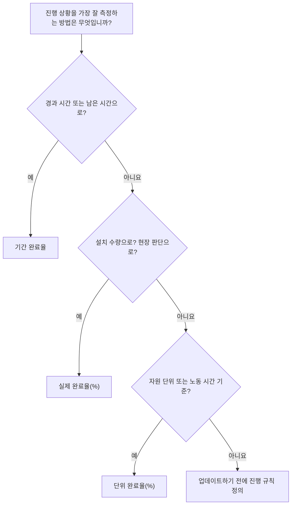

# P6의 완료율 유형

완료율은 Primavera P6에서 가장 눈에 띄는 진행률 필드 중 하나이지만 가장 잘못 이해되는 필드 중 하나이기도 합니다. 50% 완료 값은 활동이 구성된 방식과 프로젝트에서 진행 상황을 측정하는 방식에 따라 다른 의미를 가질 수 있습니다.

P6에서 완료율 유형은 활동 완료율이 계산되거나 업데이트되는 방식을 제어합니다. 이는 P6에게 진행 상황이 시간, 신체적 성취 또는 자원 단위를 기준으로 해야 하는지 알려줍니다.

활동의 주요 완료율 유형은 다음과 같습니다.

- 기간 % 완료.
- 실제 % 완료.
- 단위 % 완료.

진행 상황은 단순한 보고 수치가 아니기 때문에 올바른 것을 선택하는 것이 중요합니다. 이는 잔여 기간, 획득가치, 자원 보고, 공정표 신뢰성 및 각 업데이트 주기의 품질에 영향을 미칩니다.

## 완료율 유형이 중요한 이유

다양한 활동에는 진행 상황을 측정하는 다양한 방법이 필요합니다.

일부 활동의 경우 시간이 합리적인 대안입니다. 작업 기간이 10일이고 근무일 기준으로 5일이 완료되면 활동이 약 50% 완료되었다고 말하는 것이 합리적일 수 있습니다.

다른 활동에는 시간이 충분하지 않습니다. 팀은 10일 작업에 5일을 소비하고 실제 작업의 20%만 완료할 수 있습니다. 다른 팀은 해당 기간의 전반부에 수량의 80%를 완료할 수 있습니다. 이러한 경우 기간 기반 진행은 프로젝트 팀을 오해할 수 있습니다.

자원이 많은 일정의 경우 단위가 최상의 진행 기준이 될 수 있습니다. 활동이 1,000 노동 시간으로 계획되어 있고 600 노동 시간을 획득하거나 소비한 경우 완료 단위 %가 진행 상황을 더 잘 반영할 수 있습니다.

올바른 완료율 유형은 활동이 나타내는 내용과 진행 상황이 실제로 측정되는 방식에 따라 달라집니다.

## 활동 완료율

활동 % 완료는 활동에 대해 표시되는 일반적인 진행률 값입니다. 해당 소스는 선택한 완료율 유형에 따라 다릅니다.

활동에서 기간 완료율(%)을 사용하는 경우 활동 완료율은 원래 기간, 실제 기간, 잔여 기간 간의 관계에 따라 결정됩니다.

활동에서 실제 완료율(%)을 사용하는 경우 활동 완료율은 사용자가 입력한 실제 완료율(%) 값을 따릅니다.

활동에서 단위 완료율(%)을 사용하는 경우 활동 완료율은 자원 단위 진행률을 기준으로 합니다.

이것이 두 활동이 모두 50% 완료를 표시할 수 있지만 의미가 매우 다른 이유입니다.

## 기간 완료율

기간 % 완료는 시간을 기준으로 진행률을 측정합니다. 총 예상 지속시간 대비 얼마나 많은 지속시간이 소모되었는지 비교합니다.

간단히 말해서 활동의 계획 기간 또는 완료 시 기간이 10일이고 5일이 소비된 경우 해당 활동은 약 50% 기간(%) 완료로 표시될 수 있습니다.

기간 % 완료는 진행률이 시간에 합리적으로 비례할 때 유용합니다.

예는 다음과 같습니다:

- 행정 검토 기간.
- 대기 또는 치료 기간.
- 시간 기반 지원 작업.
- 작품 생산이 꾸준한 몇 가지 간단한 활동.

시간이 진행 상황을 공정하게 측정하고 잔여 기간이 주의 깊게 유지되는 경우 기간 % 완료를 사용합니다.

위험은 소요된 시간이 항상 달성한 작업과 같지 않다는 것입니다. 작업은 계획된 기간의 절반을 소비할 수 있으며 여전히 물리적으로 훨씬 뒤쳐질 수 있습니다. 스케줄러가 기간에만 의존하는 경우 진행 보고서는 실제보다 더 좋아 보일 수 있습니다.

## 실제 완료율(%)

물리적 완료율(%)은 실제 물리적 진행 상황에 따라 수동으로 입력되거나 업데이트됩니다. 이는 기간이나 자원 단위와 관계없이 작업에서 실제로 달성된 내용을 나타냅니다.

이는 건설, 엔지니어링 결과물, 설치 작업, 시운전 패키지 또는 측정 가능한 성과를 기반으로 진행되어야 하는 모든 활동에 가장 적합한 옵션인 경우가 많습니다.

예는 다음과 같습니다:

- 발행된 도면의 40%입니다.
- 케이블 트레이가 60% 설치되었습니다.
- 배관의 75%가 용접되었습니다.
- 테스트 패키지의 30%가 완료되었습니다.
- 장비 정렬이 100% 완료되었습니다.

수량, 인도물 상태, 현장 확인 또는 책임 소유자 판단으로 진행 상황을 측정해야 하는 경우 실제 완료율(%)을 사용합니다.

경과된 시간보다 현실을 더 잘 반영할 수 있다는 장점이 있습니다. 위험은 규율이 필요하다는 것입니다. 프로젝트 팀은 물리적 진행 상황을 측정하는 방법, 승인하는 사람, 증거 수집 방법을 정의해야 합니다.

## 단위 완료율(%)

단위 % 완료는 자원 단위를 기준으로 진행률을 측정합니다. 실제 단위를 완료 시 단위와 비교합니다.

이는 일정에 리소스가 로드되고 노동 시간, 장비 시간 또는 기타 측정 가능한 리소스 단위를 통해 진행 상황을 추적할 때 유용합니다.

예는 다음과 같습니다:

- 예산 노동 시간 대비 실제 노동 시간을 벌어 들인 것입니다.
- 계획된 장비 시간 대비 사용된 장비 시간입니다.
- 자원 단위 진행 상황과 연결된 설치 작업입니다.
- 단위를 기반으로 한 획득가치 워크플로입니다.

자원 단위가 안정적이고 유지 관리되며 프로젝트 진행 방식의 일부인 경우 단위 완료율을 사용합니다.

위험은 자원 소비가 항상 물리적 발전과 같지 않다는 것입니다. 팀은 예상 작업을 완료하지 못한 채 많은 시간을 보낼 수 있습니다. 이러한 이유로 단위 완료율은 리소스 보고 및 진행률 측정이 잘 제어될 때 가장 잘 작동합니다.

## 올바른 유형을 선택하는 방법

완료율 유형을 선택하는 실용적인 방법은 활동의 진행 상황이 무엇을 의미하는지 물어보는 것입니다.

진행 상황이 시간이 경과했음을 의미하는 경우 기간 % 완료를 사용하세요.

진행 상황이 물리적 작업이 달성되었음을 의미하는 경우 물리적 작업 완료율을 사용하세요.

진행 상황이 자원 단위가 획득되거나 소비되었음을 의미하는 경우 단위 완료율을 사용합니다.

선택은 유사한 활동 그룹 전체에서 일관되어야 합니다. 엔지니어링 결과물에는 실제 완료율(%)을 사용할 수 있습니다. 건설 설치는 수량에 따라 물리적 완료율을 사용할 수 있습니다. 시간 기반 관리 지원은 기간 % 완료를 사용할 수 있습니다. 리소스가 많은 작업 패키지는 리소스 데이터가 신뢰할 수 있는 경우 단위 완료율을 사용할 수 있습니다.

## 잔여 기간과의 관계

완료율과 잔여 기간은 일관된 내용을 전달해야 합니다.

활동은 물리적으로 80% 완료될 수 있지만 남은 작업이 어렵거나 지연되거나 다른 조건에 따라 달라지는 경우 잔여 기간은 여전히 ​​10일입니다. 그것은 유효할 수 있습니다.

계획된 시간의 절반이 경과했기 때문에 활동은 50% 기간 % 완료일 수 있지만 작업의 20%만 물리적으로 완료된 경우 잔여 기간을 수정해야 할 수 있습니다.

그렇기 때문에 좋은 업데이트에는 진행 상황과 예측 검토가 모두 필요합니다. 완료율은 얼마나 달성되었는지를 나타냅니다. 잔여 기간은 아직 필요한 시간을 나타냅니다.

## 일반적인 실수

흔히 저지르는 실수 중 하나는 신체적 진행 상황이 시간에 비례하지 않는 활동에 Duration % Complete를 사용하는 것입니다. 이로 인해 진행 상황이 실제 작업보다 좋아 보일 수도 있고 나빠 보일 수도 있습니다.

또 다른 실수는 측정 규칙 없이 실제 % 완료율을 사용하는 것입니다. 한 분야에서 물리적 진행 상황을 설치 수량별로 보고하고 다른 분야에서는 의견별로 보고하는 경우 일정이 일치하지 않게 됩니다.

세 번째 실수는 자원 데이터가 불완전하거나 신뢰할 수 없을 때 단위 완료율을 사용하는 것입니다. 실제 단위가 유지되지 않으면 진행 값을 신뢰할 수 없습니다.

또 다른 문제는 완료율을 업데이트하지만 잔여 기간을 무시하는 것입니다. 활동은 진행 상황을 표시하지만 여전히 비현실적인 예측을 가질 수 있습니다.

## 모범 사례

업데이트 주기가 시작되기 전에 진행 규칙을 정의합니다. 프로젝트 팀은 어떤 활동 그룹이 기간, 실제 또는 단위 완료율을 사용하는지 알아야 합니다.

완료율 유형, 활동 완료율(%), 물리적 완료율(%), 기간 완료율(%), 단위 완료율(%), 잔여 기간, 실제 시작, 실제 완료 및 활동 상태를 표시하는 레이아웃을 사용합니다.

다음과 같은 불일치를 확인하십시오.

- 진행률 0%로 활동을 시작했습니다.
- 잔여 기간 = 0이지만 상태가 완료되지 않았습니다.
- 실제 완료 없이 100% 진행됩니다.
- 현장 증거와 일치하지 않는 실제 % 완료.
- 누락된 리소스 업데이트를 기반으로 한 단위 완료율입니다.

이러한 점검은 진행 상황이 입력되었을 뿐만 아니라 신뢰할 수 있는지 확인하는 데 도움이 됩니다.

## 결론

P6의 완료율 유형은 활동 진행률을 측정하는 방법을 정의합니다. 기간 % 완료는 시간 기반 진행률을 측정합니다. 실제 완료율(%)은 실제로 달성한 작업을 측정합니다. 단위 % 완료는 자원 단위 진행률을 측정합니다.

모든 활동에 가장 적합한 단일 유형은 없습니다. 올바른 선택은 작업이 어떻게 계획되고, 측정되고, 통제되는지에 달려 있습니다.

강력한 일정은 의도적으로 완료율 유형을 사용합니다. 방법이 작업과 일치하면 진행 상황 업데이트가 더 명확해지고 잔여 기간이 더 안정적이 되며 프로젝트 보고를 방어하기가 더 쉬워집니다.
## 관련 콘텐츠
- [주도 로직 없이 데이터 날짜에 시작하는 활동: 이 일정 지표가 중요한 이유 - 개요](../../metrics/01_activities_starting_in_dd_with_no_logic_driving/02_guide_template.md)
- [P6의 지속 시간](../09_DURATION%20IN%20P6/09_DURATION%20IN%20P6.md)
- [P6에서 비용이 발생하는 곳](../11_WHERE%20THE%20COST%20LIVE%20IN%20P6/11_WHERE%20THE%20COST%20LIVE%20IN%20P6.md)
