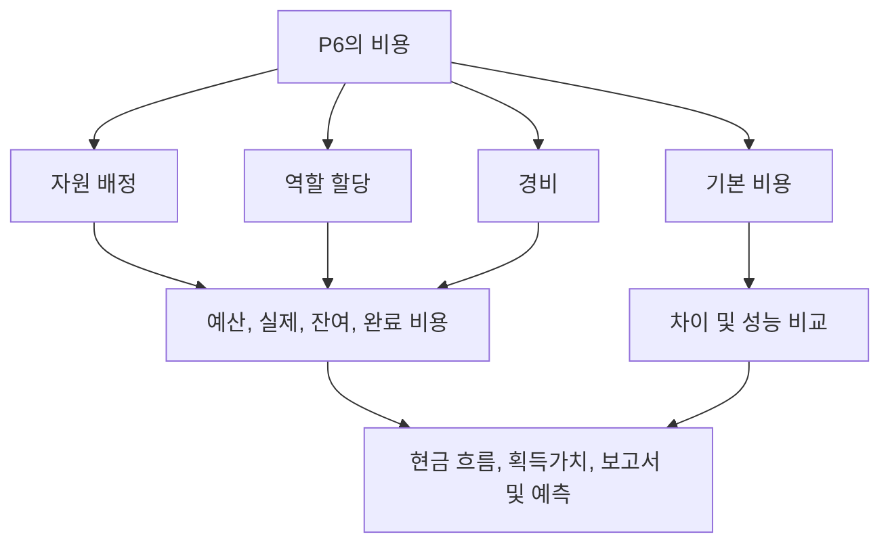

# P6에서 비용이 발생하는 곳

Primavera P6의 비용은 여러 장소에 존재할 수 있습니다. 이는 유용하지만 혼란스러울 수도 있습니다. 일정에는 예산 비용, 실제 비용, 남은 비용, 완료 시 비용, 리소스 비용, 역할 비용, 비용 비용, 획득가치 필드 및 기준 비용이 표시될 수 있습니다. 이러한 값은 서로 관련되어 있지만 모두 같은 의미는 아닙니다.

프로젝트 통제 팀의 경우 핵심 질문은 "비용은 얼마입니까?" 뿐만이 아닙니다. 더 나은 질문은 이 비용이 어디서 발생하는지, 무엇을 의미하는지, 어떻게 사용해야 하는지입니다.

이 블로그에서는 P6에서 사용할 수 있는 주요 비용 유형, 차이점, 각 유형이 언제 유용한지 설명합니다.

## 비용 위치가 중요한 이유

P6는 주로 일정 도구이지만 비용이 많이 드는 일정, 획득가치, 현금 흐름 및 예측 보고도 지원할 수 있습니다. 이를 제대로 수행하려면 일정 모델의 올바른 부분에 비용을 배치해야 합니다.

인건비를 비용으로 입력하면 자원 히스토그램이 올바른 내용을 전달하지 못할 수 있습니다. 실제 비용을 수동으로 입력했지만 프로젝트에서는 해당 비용이 실제 자원에서 나올 것으로 예상하는 경우 보고서가 일치하지 않을 수 있습니다. 기준 비용이 누락되면 일정 차이 및 비용 차이 보고의 맥락이 상실됩니다.

비용 소스는 비용의 롤업, 업데이트, 예측 및 보고 방식에 영향을 미치기 때문에 비용 위치가 중요합니다.

## 자원 비용

자원 비용은 활동에 할당된 자원에서 발생합니다. 자원은 노동력, 장비 또는 기타 자원 범주를 나타낼 수 있습니다. 각 리소스에는 요율, 단위 및 비용 계산이 있을 수 있습니다.

예를 들어, 활동이 정의된 시간당 요율로 80시간 동안 배관공 작업자를 사용하는 경우 P6은 할당된 단위 및 요율에서 인건비를 계산할 수 있습니다.

자원 비용은 프로젝트에서 일정 활동을 노동, 장비, 생산성 및 자원 히스토그램에 연결하려고 할 때 유용합니다.

다음과 같은 경우 자원 비용을 사용하십시오.

- 노동력이나 장비 수요가 중요합니다.
- 리소스 히스토그램이 필요합니다.
- 비용은 시간 또는 단위에 따라 결정됩니다.
- 획득가치 또는 진행 상황은 자원을 기반으로 합니다.
- 일정은 자원 계획에 사용됩니다.

주요 위험은 유지 관리입니다. 리소스가 많은 일정에는 규율이 필요합니다. 단위, 요율, 달력 또는 실제 금액이 유지되지 않으면 비용 보고서를 신뢰할 수 없습니다.

## 역할 비용

역할은 엔지니어, 전기 기술자, 기획자, 검사관 또는 크레인 주도자와 같은 일반적인 직무 기능입니다. P6에서는 명명된 리소스가 알려지기 전에 활동에 역할을 할당할 수 있습니다.

역할 비용은 팀이 필요한 리소스 유형을 알고 있지만 특정 사람이나 팀은 알지 못하는 경우 초기 계획을 지원할 수 있습니다.

예를 들어, 초기 엔지니어링 계획 중에 활동에는 120시간의 "선임 엔지니어" 시간이 필요할 수 있습니다. 지정된 사람은 아직 지정되지 않았을 수 있지만 해당 역할은 계획 요율 및 비용 견적을 제공할 수 있습니다.

다음과 같은 경우 역할 비용을 사용하십시오.

- 일정은 아직 계획 중입니다.
- 명명된 리소스가 아직 확인되지 않았습니다.
- 프로젝트에서는 높은 수준의 리소스 또는 비용 견적을 원합니다.
- 역할은 나중에 실제 리소스로 대체됩니다.

역할 비용은 초기 단계 계획에 유용하지만 프로젝트가 성숙해짐에 따라 검토해야 합니다. 실제 자원이 알려진 후에도 역할이 남아 있으면 일정이 너무 일반적이어서 세부적인 제어가 불가능해질 수 있습니다.

## 비용 비용

비용은 활동에 직접 할당된 비자원 비용입니다. 이는 노동력이나 장비 자원으로 가장 잘 표현되지 않는 비용에 유용합니다.

예는 다음과 같습니다:

- 허가.
- 여행하다.
- 판매자 일시금.
- 하청업체 패키지.
- 재료를 일정 금액으로 구매합니다.
- 테스트 비용.
- 동원 비용.

비용 비용은 프로젝트 추적 방법에 따라 예산 책정, 실제 비용, 잔여 비용 또는 완료 시 비용이 될 수 있습니다.

다음과 같은 경우 비용을 사용하십시오.

- 비용은 리소스 시간에 따라 결정되지 않습니다.
- 비용은 고정 또는 일시불 항목입니다.
- 활동에는 직접적인 비자원 비용이 필요합니다.
- 프로젝트에서는 비인력 항목에 대한 현금 흐름을 원합니다.

위험은 비용이 투기장이 될 수 있다는 것입니다. 모든 비용을 비용으로 입력하면 일정에서 인건비, 장비, 생산성을 별도로 설명하는 능력이 상실될 수 있습니다.

## 예산 비용

예산 비용은 활동에 할당된 계획 비용입니다. 이는 자원 할당, 역할 할당, 비용 또는 이들의 조합에서 나올 수 있습니다.

예산비용은 실행 전 비용 계획을 나타내기 때문에 중요합니다. 현금 흐름, 기준 비용, 획득가치 설정 및 프로젝트 통제 보고를 지원합니다.

예산 비용을 사용하여 답해 보세요. 이 활동의 ​​계획 비용은 얼마였습니까?

예산 비용이 누락되거나 일관성이 없는 경우에도 일정에서 날짜를 계산할 수는 있지만 의미 있는 비용 로드 보고를 지원할 수는 없습니다.

## 실제 비용

실제 비용은 이미 발생한 비용을 나타냅니다. 프로젝트 설정에 따라 실제 비용은 실제 자원 단위 및 요율에서 계산되거나, 수동으로 입력되거나, 작업표에서 가져오거나, 외부 비용 시스템에서 로드될 수 있습니다.

실제 비용은 진행 상황 보고 및 획득가치에 중요합니다. 지금까지 지출된 금액이나 기록된 금액을 보여줍니다.

실제 비용을 사용하여 답변하십시오. 이미 발생했거나 기록된 비용은 무엇입니까?

위험은 소스를 혼합하는 것입니다. 회계에서 일부 실제 비용을 가져오고 나머지는 P6에 수동으로 입력하는 경우 팀에서는 중복이나 격차를 피하기 위한 명확한 규칙이 필요합니다.

## 남은 비용

남은 비용은 활동을 완료하는 데 필요한 예상 비용입니다. 이는 남은 단위, 자원 요율, 남은 비용 및 업데이트 가정과 연결되어 있습니다.

남은 비용은 가장 중요한 예측 필드 중 하나입니다. 현재 데이터 날짜부터 앞으로 남은 비용이 얼마나 되는지 프로젝트 팀에 알려줍니다.

남은 비용을 사용하여 답하세요. 예상되는 비용은 얼마입니까?

잔여 기간은 업데이트되었지만 남은 비용은 업데이트되지 않은 경우 예측이 일치하지 않을 수 있습니다. 자원 단위나 비용 잔여 값이 유지되지 않는 경우에도 마찬가지입니다.

## 완료 비용으로

완료 비용은 실제 비용과 남은 비용을 합산한 활동의 ​​예상 총 비용입니다.

간단히 말하면:

실제 비용 + 잔여 비용 = 완료 비용

완료 비용은 활동이 예산 초과, 미달 또는 예산 범위 내에서 완료될 것으로 예상되는지를 표시하는 데 도움이 됩니다.

완료 비용을 사용하여 답하세요. 최근 예상 총 비용은 얼마입니까?

## 기본 비용

기준 비용은 할당된 기준선에서 비롯됩니다. 현재 비용 값을 승인된 계획과 비교하는 데 사용됩니다.

차이 보고에는 기준 비용이 중요합니다. 기준선이 없으면 프로젝트는 현재 예측 비용을 알 수 있지만 해당 예측이 승인된 계획보다 나은지 나쁜지는 알 수 없습니다.

기본 비용을 사용하여 답하세요. 현재 비용은 승인된 비용 계획과 어떻게 비교됩니까?

기본 비용은 획득가치 또는 공식 PMO 보고를 위해 P6을 사용할 때 특히 중요합니다.

## 획득가치 비용 필드

P6는 프로젝트 설정에 따라 계획 가치, 획득가치, 실제 비용, 비용 차이 및 일정 차이와 같은 획득가치 필드를 지원할 수 있습니다.

획득가치(획득가치)는 비용이 탑재된 일정 정보를 사용하여 계획 작업, 획득 작업 및 실제 비용을 비교합니다.

이 필드는 프로젝트에 공식적인 획득가치 프로세스가 있는 경우 유용합니다. 일관된 기준선, 진행 규칙, 완료율 방법 및 비용 부담이 필요합니다.

다음과 같은 경우 획득가치 비용 필드를 사용합니다.

- 이 프로젝트에는 EV 보고가 필요합니다.
- 진행 규칙이 정의됩니다.
- 기본 비용이 승인되었습니다.
- 실제 비용 소스가 통제됩니다.
- 활동 진행 상황은 지속적으로 유지됩니다.

이러한 통제가 없으면 획득가치 결과는 정확해 보이지만 신뢰할 수는 없습니다.

## 어떤 비용 유형을 사용해야 합니까?

자원 계획, 생산성 및 히스토그램을 지원해야 하는 노동 및 장비에 대한 자원 비용을 사용합니다.

명명된 리소스가 아직 알려지지 않은 경우 초기 계획을 위해 역할 비용을 사용합니다.

직접적인 비자원 비용, 일시불, 공급업체 품목, 허가증, 여행 또는 하청 계약 패키지에 대한 비용 비용을 사용하십시오.

예산, 실제, 남은 비용 및 완료 시 비용 필드를 사용하여 시간별 비용 수명 주기를 이해하세요.

승인된 계획과 비교하려면 기준 비용을 사용하세요.

프로젝트에 EV 보고를 지원하는 데 필요한 거버넌스가 있는 경우 획득가치 필드를 사용합니다.

## 일반적인 문제

일반적인 문제 중 하나는 비용 중복입니다. 동일한 하청업체 비용을 자원 비용으로 입력하고 다시 비용으로 입력할 수 있습니다.

또 다른 문제는 실제 비용이 누락된다는 것입니다. 일정에는 예산과 남은 비용이 있을 수 있지만 실제 비용은 별도의 회계 시스템에 상주하여 결코 P6에 도달하지 못할 수 있습니다.

세 번째 문제는 모든 것에 비용을 사용하는 것입니다. 이로 인해 총 비용이 발생할 수 있지만 리소스 가시성이 약할 수 있습니다.

또 다른 문제는 일관성 없는 진행입니다. 완료율, 잔여 기간, 남은 비용이 일치하지 않으면 완료 시 비용이 불안정해집니다.

## 모범 사례

일정을 로드하기 전에 비용 전략을 정의하세요. 인건비, 장비, 자재, 하청업체 및 간접 비용이 어디에 거주할지 결정합니다.

일관된 비용 계정, 활동 코드, 자원, 역할 및 비용 범주를 사용하십시오.

실제 비용을 P6에 입력할지, 가져올지 또는 다른 시스템에서 보고할지 여부를 문서화합니다.

각 업데이트 주기 동안 비용 필드를 검토합니다. 예산, 실제, 잔여 비용 및 완료 비용이 일관된 이야기를 전달해야 합니다.

## 결론

P6의 비용은 리소스, 역할, 비용, 기준선 및 획득가치 필드에 포함될 수 있습니다. 각 장소마다 목적이 다릅니다.

자원 비용은 비용과 노동 및 장비 비용을 연결합니다. 역할 비용은 초기 계획을 지원합니다. 비용 비용에는 자원이 아닌 항목이 직접 포함됩니다. 예산, 실제, 잔여 및 완료 시 비용은 비용 수명 주기를 보여줍니다. 기준 및 획득가치 필드는 비교 및 ​​성과 보고를 지원합니다.

비용이 많이 드는 강력한 일정은 숫자가 맞는 곳에 숫자를 배치하여 구축되지 않습니다. 각 비용 유형이 속하는 위치를 결정하고 모든 업데이트 주기 동안 해당 구조를 유지함으로써 구축됩니다.
## 관련 콘텐츠
- [주도 로직 없이 데이터 날짜에 시작하는 활동: 이 일정 지표가 중요한 이유 - 개요](../../10_metrics_ko/01_activities_starting_in_dd_with_no_logic_driving/01_overview_template.md)
- [P6의 완료율 유형](../10_PERCENT%20COMPLETION%20TYPES%20IN%20P6/10_PERCENT%20COMPLETION%20TYPES%20IN%20P6.md)
- [P6의 리소스 유형](../12_RESOURCE%20TYPES%20IN%20P6/12_RESOURCE%20TYPES%20IN%20P6.md)
