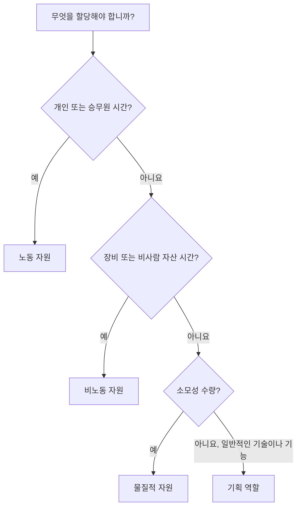

Primavera P6의 리소스는 작업을 실행하는 데 필요한 사람, 장비, 자재를 나타냅니다. 일정을 용량, 생산성, 비용 및 시간 경과에 따른 리소스 수요에 연결합니다.

일정은 리소스 없이도 존재할 수 있지만 리소스가 많은 일정은 프로젝트 팀에 더 깊은 시각을 제공합니다. 노동 히스토그램, 장비 수요, 자재 사용량, 비용 곡선, 자원 제약 및 가능한 과부하를 표시할 수 있습니다. 해당 정보를 유용하게 만들려면 스케줄러는 P6에서 사용할 수 있는 다양한 리소스 유형과 각 리소스 유형을 언제 사용해야 하는지 이해해야 합니다.

P6의 주요 리소스 유형은 다음과 같습니다.

- 노동.
- 비노동.
- 재료.

P6은 또한 자원과 정확히 동일하지는 않지만 밀접하게 관련되어 있고 계획 중에 매우 유용한 역할을 사용합니다.

## 리소스 유형이 중요한 이유

리소스 유형은 P6가 단위, 요율, 비용, 달력 및 보고서를 처리하는 방법에 영향을 미칩니다.

노동 자원은 물질 자원과 다르게 행동합니다. 크레인은 콘크리트 볼륨과 동일한 방식으로 취급되어서는 안 됩니다. 일반 엔지니어 역할은 명명된 엔지니어 리소스와 동일하지 않습니다. 리소스 유형이 잘못 혼합되면 히스토그램, 비용 보고서, 생산성 검토 및 획득가치 출력이 오해의 소지가 있을 수 있습니다.

리소스 유형은 실용적인 질문인 활동에 어떤 종류가 할당되어 있는지에 대한 답을 제공합니다.

## 노동 자원

노동 자원은 사람이나 팀을 나타냅니다. 일반적으로 시간, 일 또는 기타 시간 기반 단위로 측정됩니다. 노동 자원에는 요율, 달력, 가용성 제한 및 비용 값이 있을 수 있습니다.

예는 다음과 같습니다:

- 입안자.
- 민간 승무원.
- 전공.
- 용접 승무원.
- 엔지니어.
- 검사관.
- 시운전 기술자.

일정에 인적 노력이나 승무원 수요가 표시되어야 하는 경우 노동 자원을 사용합니다. 노동 자원은 인력 히스토그램, 인력 배치 계획, 생산성 분석, 인건비 예측에 유용합니다.

예를 들어, "케이블 트레이 설치"라는 활동에는 5일 동안 4명의 전기 기술자가 필요할 수 있습니다. 노동 자원을 할당하면 해당 기간 동안 전기 기술자에 대한 수요를 일정에 표시할 수 있습니다.

노동 자원은 프로젝트에서 계획된 노동 시간과 실제 노동 시간을 비교해야 하는 경우에도 유용합니다.

## 비인력 자원

비인적 자원은 장비 또는 기타 재사용 가능한 비인적 자산을 나타냅니다. 이는 일반적으로 노동과 마찬가지로 시간 기반이지만 인적 자원은 아닙니다.

예는 다음과 같습니다:

- 기중기.
- 굴착기.
- 용접기.
- 테스트 장비.
- 비계 승무원 장비.
- 전문 도구 세트.
- 발전기.

장비 가용성이 중요하거나 시간 경과에 따라 장비 비용을 추적해야 하는 경우 비인력 자원을 사용하십시오.

예를 들어, 무거운 물건을 운반하는 데 이틀 동안 크레인이 필요한 경우 비인력 크레인 자원을 할당하면 프로젝트 팀이 크레인 수요를 확인하고, 충돌을 피하고, 장비 비용을 예측하는 데 도움이 됩니다.

비인력 자원은 장비가 부족하거나, 비싸거나, 작업 영역 간에 공유되거나 작업 순서의 동인이 될 때 중요합니다.

## 물질적 자원

재료 자원은 소비 가능한 항목을 나타냅니다. 일반적으로 시간보다는 양으로 측정됩니다.

예는 다음과 같습니다:

- 콘크리트 입방미터.
- 강철 톤.
- 케이블 미터.
- 파이프 스풀.
- 밸브.
- 코팅 리터.
- 패널.

일정에서 수량 기반 소비 또는 자재 관련 비용을 추적해야 하는 경우 자재 자원을 사용합니다.

자재 자원은 자재 곡선, 수량 추적 및 비용 로딩을 지원할 수 있습니다. 이는 일정이 설치 수량 또는 수량에 따른 획득가치와 연결될 때 특히 유용합니다.

예를 들어, 활동에는 500미터의 케이블 설치가 포함될 수 있습니다. 케이블을 자재 자원으로 지정하면 팀이 시간이 지남에 따라 계획된 수량과 실제 설치된 수량을 추적하는 데 도움이 됩니다.

노동 시간이나 장비 시간을 나타내기 위해 물질적 자원을 사용해서는 안 됩니다. 그들은 다른 목적으로 사용됩니다.

## 역할

역할은 일반적인 직무 또는 기술 범주입니다. 리소스와 동일하지는 않지만 명명된 리소스가 알려지기 전에 계획을 세우는 데 도움이 됩니다.

예는 다음과 같습니다:

- 수석 엔지니어.
- 전기 감독관.
- 민사검사관.
- 스케줄러.
- 시운전 리드.
- 크레인 주도자.

누가 작업을 수행할지 정확히 알지 못해도 프로젝트에서 어떤 유형의 기술이 필요한지 알 수 있기 때문에 역할은 초기 계획에 유용합니다.

예를 들어 엔지니어링 활동에는 80시간의 "수석 전기 엔지니어" 노력이 필요할 수 있습니다. 나중에 해당 역할을 명명된 리소스로 대체하거나 보완할 수 있습니다.

다음과 같은 경우에 역할을 사용하세요.

- 계획은 아직 높은 수준입니다.
- 명명된 리소스가 확인되지 않았습니다.
- 기술 유형에 따라 자원 수요가 필요합니다.
- 조직은 조기 인력 배치 예측을 원합니다.

프로젝트가 성숙해짐에 따라 역할을 검토해야 합니다. 일정에 세부적인 제어가 필요한 경우 역할을 실제 리소스로 대체해야 할 수도 있습니다.

## 자원 달력

자원에는 달력이 있을 수 있습니다. 이는 자원 가용성이 활동 가용성과 다를 수 있기 때문에 중요합니다.

예를 들어, 건설 활동은 6일 활동 달력을 사용할 수 있지만 할당된 공급업체 전문가는 월요일부터 금요일까지만 사용할 수 있습니다. 활동이 자원 종속적이거나 자원 평준화가 사용되는 경우 자원 달력이 일정에 영향을 미칠 수 있습니다.

인력과 장비는 특정 시간에만 사용할 수 있으므로 인력 및 비인력 자원에는 달력이 필요한 경우가 많습니다. 재료 자원은 작업 시간이 아닌 수량을 나타내기 때문에 일반적으로 다르게 동작합니다.

자원 날짜가 이상하게 보이면 활동 달력과 자원 달력을 모두 확인하세요.

## 자원 비용

자원에는 비용이 적용될 수 있습니다. 인력 및 비인적 자원은 종종 시간 기준 요율을 사용합니다. 물질적 자원은 단위 요율을 사용하는 경우가 많습니다.

예를 들어:

- 전기 기술자: 시간당 비용.
- 크레인: 시간당 또는 하루당 비용.
- 콘크리트: 입방미터당 비용.

자원이 활동에 할당되면 P6은 예산, 실제, 남은 비용 및 완료 비용을 계산할 수 있습니다.

이는 비용이 많이 드는 일정, 획득가치 보고, 자원 예측 및 현금 흐름 분석에 유용합니다. 하지만 단위, 요율, 달력 및 진행 상황 업데이트가 유지되는 경우에만 제대로 작동합니다.

## 올바른 리소스 유형 선택

자원이 사람, 승무원 또는 인간의 노력인 경우 노동을 사용하십시오.

자원이 시간이 중요한 장비 또는 재사용 가능한 자산인 경우 비노동을 사용하십시오.

자원이 소모성 수량인 경우 자재를 사용합니다.

명명된 리소스가 알려지기 전에 기술이나 기능별로 계획을 세울 때 역할을 사용하세요.

선택은 프로젝트가 작업을 계획, 측정 및 보고하려는 방식을 반영해야 합니다.

## 일반적인 실수

흔한 실수 중 하나는 모든 일에 노동력을 사용하는 것입니다. 이렇게 하면 처음에는 비용 로딩이 더 쉬워지지만 장비나 자재 수량이 중요한 경우 명확성이 떨어집니다.

또 다른 실수는 실제로 비용이나 하도급 일시금 항목에 물적 자원을 사용하는 것입니다. 프로젝트에 수량 추적이 필요하지 않은 경우 비용이 더 적절할 수 있습니다.

세 번째 실수는 실제 단위를 유지하지 않고 자원을 할당하는 것입니다. 리소스 로드 일정은 진행률 업데이트가 리소스 데이터를 최신 상태로 유지하는 경우에만 유용합니다.

또 다른 문제는 역할과 자원을 혼동하는 것입니다. 역할은 계획에 적합하지만 세부 할당, 일정 및 실제 사항이 중요한 경우 명명된 자원이 더 좋습니다.

## 모범 사례

일정을 로드하기 전에 리소스 전략을 정의하세요.

어떤 작업이 노동 자원을 사용할지, 어떤 작업이 비인력 자원을 사용할지, 어떤 자재에 수량 추적이 필요한지, 대신 비용을 어디에 사용해야 할지 결정하십시오.

일관된 명명 규칙과 리소스 코드를 사용하세요. 리소스 사전을 깨끗하게 유지하세요. 이름이 약간 다른 중복 리소스를 피하십시오.

각 업데이트 주기 동안 리소스 할당을 검토합니다. 단위, 비용, 달력 및 실제 사항은 프로젝트 통제 프로세스와 일치해야 합니다.

## 결론

P6의 리소스 유형은 작업을 수행하는 데 필요한 것이 무엇인지 정의하는 데 도움이 됩니다. 노동 자원은 사람과 직원을 나타냅니다. 비인력 자원은 장비와 재사용 가능한 자산을 나타냅니다. 재료 자원은 소비 가능한 수량을 나타냅니다. 역할은 명명된 리소스가 알려지기 전에 기술이나 기능별로 계획을 지원합니다.

올바른 리소스 유형을 선택하면 일정을 더 쉽게 분석할 수 있습니다. 이는 노동 히스토그램, 장비 계획, 자재 추적, 비용 로딩, 획득가치 및 예측 보고를 개선합니다.

좋은 리소스 탑재 일정은 리소스만 첨부된 일정이 아닙니다. 각 자원 유형을 의도적으로 사용하고 프로젝트 수명 동안 유지 관리하는 일정입니다.
## 관련 콘텐츠
- [Primavera P6에서 0% 진행으로 시작된 활동 - 개요](../../metrics/13_activity_started_progress_zero/02_guide_template.md)
- [P6에서 비용이 발생하는 곳](../11_WHERE%20THE%20COST%20LIVE%20IN%20P6/11_WHERE%20THE%20COST%20LIVE%20IN%20P6.md)
- [P6의 리소스 제한](../13_RESOURCES%20LIMITS%20IN%20P6/13_RESOURCES%20LIMITS%20IN%20P6.md)
