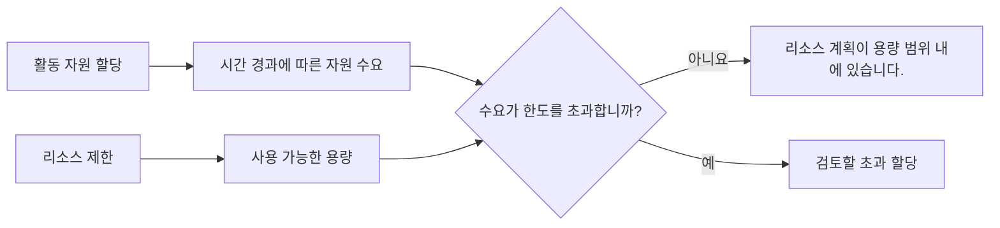

Primavera P6의 리소스 제한은 일정 기간 동안 사용할 수 있는 리소스의 양을 정의합니다. 이는 활동 배정에 의해 생성된 자원 수요를 프로젝트의 실제 능력과 비교하는 데 사용됩니다.

간단히 말해서, 리소스 제한은 프로젝트에서 이 리소스를 얼마나 사용할 수 있는지에 대한 답입니다.

일정에 한 명의 팀이 동시에 5개의 활동을 수행해야 한다고 나와 있는 경우 P6는 수요를 표시할 수 있습니다. 그러나 자원 제한이 없으면 일정은 해당 수요가 현실적인지 여부를 명확하게 보여줄 수 없습니다. 제한은 계획자가 과부하, 용량 문제 및 가능한 자원 중심 일정 문제를 볼 수 있도록 하는 것입니다.

## 리소스 제한이란 무엇입니까?

리소스 제한은 리소스의 최대 가용성입니다. 이는 일일 시간, 주당 시간 또는 작업 기간 동안 사용 가능한 단위 수와 같은 기간별 단위로 정의될 수 있습니다.

예를 들어:

- 플래너 1명당 하루 8시간 이용 가능합니다.
- 전기 기술자 3명이 하루 24시간 근무합니다.
- 크레인 1대로 하루 8시간 장비를 사용할 수 있습니다.
- 검사관 2명이 하루 16시간 근무합니다.

활동에 자원이 로드되면 P6은 해당 배정으로 인해 생성된 자원 수요를 계산합니다. 자원 제한은 수요를 비교하는 용량 라인을 제공합니다.

## 리소스 제한이 중요한 이유

일정은 기술적으로는 가능하지만 실제로는 불가능한 경우가 많기 때문에 리소스 제한이 중요합니다.

논리 네트워크는 여러 활동이 동시에 발생할 수 있다고 계산할 수 있습니다. 날짜는 괜찮을 것 같습니다. 중요한 경로는 합리적으로 보일 수 있습니다. 그러나 모든 활동에 동일한 제한된 직원, 전문가 또는 장비가 필요한 경우 계획이 실행 가능하지 않을 수 있습니다.

리소스 제한은 계산된 일정과 결과물 일정 간의 차이를 드러내는 데 도움이 됩니다.

다음과 같은 경우에 유용합니다.

- 과중한 노동력 식별.
- 장비 수요를 확인합니다.
- 리소스 히스토그램을 지원합니다.
- 인력계획을 검토합니다.
- 자원 평준화를 준비 중입니다.
- 논리가 허용하더라도 일부 작업을 시작할 수 없는 이유를 설명합니다.
- 계획이 사용 가능한 용량과 일치하는지 테스트합니다.

프로젝트 통제에서 이는 인력 배치, 조달 지원, 건설 계획 또는 획득가치 보고에 일정을 사용할 때 특히 유용합니다.

## 노동 자원 제한

노동 한도는 사용 가능한 사람 수 또는 노동 시간을 정의합니다.

예를 들어, 프로젝트에 10명의 전기 기술자가 하루 8시간 근무하는 경우 일일 노동 한도는 하루 80시간이 될 수 있습니다. 일정 수요에 같은 날 120시간의 전기 기술자가 표시되면 해당 일정은 프로젝트보다 더 많은 전기 기술자를 요구하는 것입니다.

이것이 자동으로 일정이 잘못되었음을 의미하는 것은 아닙니다. 이는 기획자가 계획을 검토해야 함을 의미합니다. 해결책은 인력 추가, 순서 변경, 중요하지 않은 작업 이동, 초과 근무 사용, 현실적이고 승인된 경우 임시 피크 수용 등일 수 있습니다.

노동 자원 제한은 인력 가용성이 실제로 제약이 될 때 유용합니다. 일정이 리소스 제어를 지원하는 데 필요한 세부 수준으로 유지되지 않으면 유용성이 떨어집니다.

## 비인적 자원 한도

장비 및 기타 재사용 가능한 자산에는 비인력 제한이 적용됩니다.

예로는 크레인, 굴착기, 테스트 장비, 특수 도구, 발전기 또는 임시 시설이 있습니다. 크레인을 하나만 사용할 수 있는 경우 다른 크레인을 추가하거나 작업 순서를 변경하지 않는 한 동일한 크레인이 필요한 작업을 동시에 수행할 수 없습니다.

여기서는 리소스 제한이 매우 실용적일 수 있습니다. 장비는 실제로 제약이 되는 경우가 많습니다. 특히 장비가 비싸거나, 여러 구역에서 공유되거나, 이동하기 어렵거나, 중요한 작업에 필요한 경우에는 더욱 그렇습니다.

예를 들어, 두 개의 무거운 리프트가 모두 논리적으로 준비되어 있을 수 있습니다. 그러나 둘 다 동일한 크레인이 필요한 경우 리소스 제한으로 인해 계획이 사용 가능한 용량을 초과하는 것으로 나타날 수 있습니다.

## 물질적 자원과 한계

물질적 자원은 노동 및 비노동 자원과 다르게 행동합니다. 이는 일반적으로 일일 근무 시간 가용성이 아닌 수량을 나타냅니다.

자재 할당에는 계획된 콘크리트 볼륨, 케이블 길이, 강철 톤수 또는 설치 수량이 표시될 수 있습니다. 프로젝트에는 여전히 자재 제약이 있을 수 있지만 이는 인력이나 장비에 사용되는 동일한 유형의 일일 자원 가용성 제한보다는 조달 날짜, 납품 마일스톤, 재고 추적 또는 일정 제약을 통해 관리되는 경우가 많습니다.

그렇다고 재료가 중요하지 않다는 뜻은 아니다. 이는 기획자가 한계가 나타내는 내용에 대해 주의해야 함을 의미합니다.

문제가 하루에 배치할 수 있는 콘크리트의 최대 입방미터와 같은 생산 능력인 경우 자원 또는 생산 모델이 유용할 수 있습니다. 문제가 자재 도착 여부라면 논리 관계 또는 조달 이정표가 더 명확할 수 있습니다.

## P6이 제한을 사용하는 방법

P6은 리소스 프로필, 스프레드시트, 히스토그램 및 리소스 분석에서 리소스 제한을 사용할 수 있습니다. 활동 할당의 수요는 사용 가능한 한도에 대해 표시될 수 있습니다.

리소스 평준화를 사용하는 경우 P6은 리소스 가용성을 사용하여 활동을 지연시켜 평준화 설정에 따라 수요가 한도 내에서 유지되도록 할 수도 있습니다.

이는 강력하지만 주의 깊게 다뤄야 합니다. 자원 평준화는 예측 날짜를 변경할 수 있습니다. 제한, 달력, 우선순위 및 활동 논리가 잘 유지되지 않으면 평준화된 결과가 수학적으로 보일 수 있지만 실용적이지 않을 수 있습니다.

따라서 리소스 제한은 업데이트가 끝날 때 누르는 버튼이 아닌 통제된 일정 프로세스의 일부여야 합니다.

## 자원 제한을 사용해야 하는 경우

리소스가 실제로 제한되어 있고 일정이 분석을 지원하기에 충분한 품질로 리소스를 로드하는 경우 리소스 제한을 사용합니다.

좋은 사용 사례는 다음과 같습니다.

- 고정된 수의 팀원이 참여하는 프로젝트입니다.
- 공유 크레인 또는 특수 장비.
- 제한된 엔지니어링 또는 시운전 전문가.
- 종료, 처리 및 중단.
- 인력 피크를 통제해야 하는 건설 계획.
- 동일한 리소스 풀이 여러 프로젝트를 지원하는 프로그램입니다.

리소스 제한은 가정 분석 중에도 유용합니다. 계획자는 현재 계획이 가용 용량에 맞게 작동하는지 또는 추가 인력, 초과 근무 또는 재배치가 필요한지 여부를 테스트할 수 있습니다.

## 조심해야 할 때

리소스 데이터가 불완전하거나 상징적인 경우 주의하세요.

비용 로딩을 위해서만 리소스를 추가한 경우 단위는 실제 가용성을 나타내지 않을 수 있습니다. 모든 작업이 일반 리소스에 할당된 경우 히스토그램이 너무 광범위하여 실제 결정을 뒷받침할 수 없습니다. 실제 단위가 업데이트되지 않으면 자원 계획이 빠르게 현실에서 벗어날 수 있습니다.

또한 인위적인 한계에도 주의하세요. 한도가 너무 낮으면 평준화 중에 불필요한 지연이 발생할 수 있습니다. 제한이 너무 높으면 실제 용량 문제가 숨겨질 수 있습니다.

한도는 실제 계획 질문과 일치해야 합니다. 실제 직원 가용성, 예산이 책정된 인력, 장비 접근 또는 관리 목표를 테스트하고 있습니까? 각각 다른 설정이 필요할 수 있습니다.

## 일반적인 실수

일반적인 실수는 리소스 제한이 나타내는 내용에 동의하지 않고 리소스 제한을 설정하는 것입니다. 리소스에 하루 80시간이 표시될 수 있지만 그것이 현재 직원인가요, 최대 직원인가요, 예산이 책정된 직원인가요, 아니면 계약자가 약속한 직원인가요?

또 다른 실수는 평준화 결과를 검토하지 않고 사용하는 것입니다. P6는 자원 규칙에 따라 활동을 이동할 수 있지만 계획자는 결과가 구성에 적합한지 여부를 계속 확인해야 합니다.

또 다른 문제는 캘린더를 무시하는 것입니다. 리소스 제한은 가용성에 따라 결정되며 가용성은 작업 시간에 따라 달라집니다. 자원 달력이 실제 작업 패턴과 일치하지 않는 경우 제한으로 인해 오해의 소지가 있는 과부하 또는 잘못된 가용성이 발생할 수 있습니다.

리소스에 과부하가 걸리고 히스토그램을 마치 보고서인 것처럼 받아들이는 것도 일반적입니다. 과부하는 계획 신호입니다. 단순히 무시하는 것이 아니라 검토를 시작해야 합니다.

## 모범 사례

가장 중요한 리소스부터 시작하세요. 모든 리소스에 세부 제한이 필요한 것은 아닙니다. 프로젝트 완료 또는 주요 일정에 영향을 미치는 중요한 인력, 부족한 장비, 핵심 전문가 및 리소스에 집중하세요.

제한이 일반 용량, 최대 용량 또는 승인된 최대 용량을 나타내는지 정의합니다. 그 정의를 일관되게 유지하십시오.

공정표 업데이트 중에 리소스 프로필을 검토합니다. 예측이 변경되면 자원 수요도 변경됩니다. 논리, 달력, 잔여 기간 및 진행 상황과 함께 한도를 검토해야 합니다.

리소스 평준화를 신중하게 사용하고 설정을 문서화하십시오. 팀이 변경된 내용과 이유를 이해할 수 있도록 평준화된 결과를 평준화되지 않은 일정과 비교합니다.

가장 중요한 것은 작업을 수행하는 사람들과 함께 결과를 검증하는 것입니다. 히스토그램은 실제 자원 계획을 반영하는 경우에만 유용합니다.

## 결론

P6의 리소스 제한은 사용 가능한 용량을 정의합니다. 이를 통해 프로젝트 팀은 일정에 필요한 것과 프로젝트가 현실적으로 제공할 수 있는 것을 비교할 수 있습니다.

잘 활용하면 자원 제한을 통해 과부하를 식별하고, 인력 계획을 지원하고, 장비 수요를 제어하고, 일정 현실성을 향상할 수 있습니다. 잘못 사용하면 오해의 소지가 있는 히스토그램이나 인위적인 평준화 결과가 생성될 수 있습니다.

최상의 리소스 제한은 단순하고 의도적이며 실제 프로젝트 결정과 연결됩니다. 이는 하나의 실용적인 질문에 답하는 데 도움이 됩니다. 프로젝트가 실제로 보유한 자원으로 이 계획을 실행할 수 있습니까?
## 관련 콘텐츠
- [Primavera P6에서 0% 진행으로 시작된 활동 - 개요](../../metrics/13_activity_started_progress_zero/02_guide_template.md)
- [P6의 리소스 유형](../12_RESOURCE%20TYPES%20IN%20P6/12_RESOURCE%20TYPES%20IN%20P6.md)
- [P6의 리소스 밸런싱](../14_RESOURCES%20BALANCING%20IN%20P6/14_RESOURCES%20BALANCING%20IN%20P6.md)
