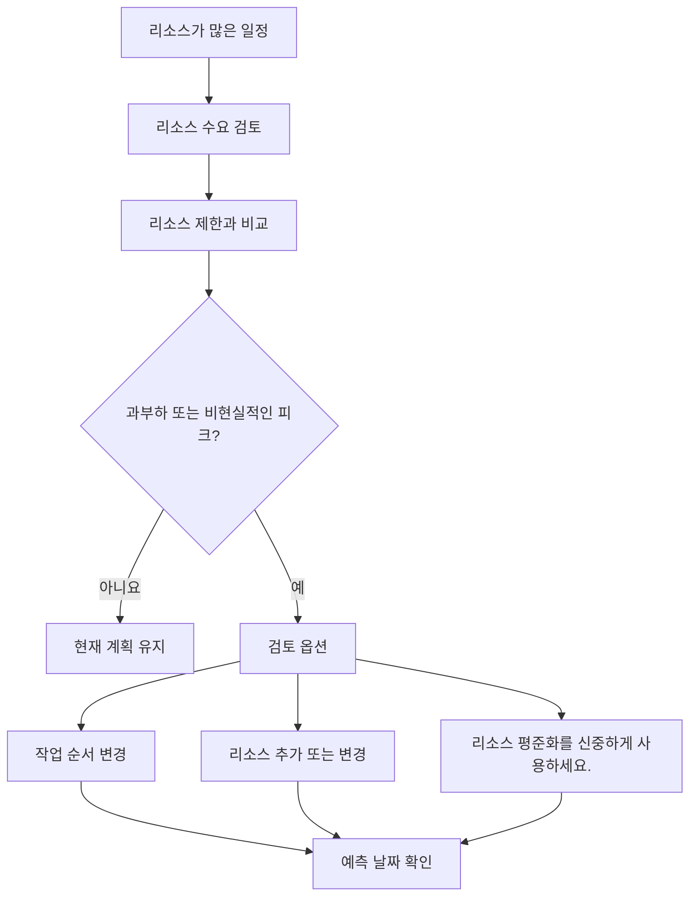

# P6의 리소스 밸런싱

Primavera P6의 리소스 밸런싱은 가용 용량 대비 리소스 수요를 검토하고 가용 리소스로 작업을 실행할 수 있도록 계획을 조정하는 프로세스입니다. 이는 프로젝트 팀이 일정이 논리적으로만 올바른지 또는 자원 관점에서 실용적인지 이해하는 데 도움이 됩니다.

일상적인 공정관리에서 사람들은 리소스 밸런싱과 리소스 평준화라는 단어를 같은 의미인 것처럼 사용하는 경우가 많습니다. 서로 연관되어 있지만 완전히 동일하지는 않습니다.

자원 균형 조정은 보다 광범위한 계획 검토입니다. 여기에는 히스토그램, 리소스 프로필, 직원 가용성, 장비 수요, 인력 피크 및 계획의 현실성을 살펴보는 것이 포함됩니다.

리소스 평준화는 리소스 가용성 및 평준화 설정에 따라 활동을 이동할 수 있는 P6 기능입니다.

이 기능은 유용할 수 있지만 제어와 함께 사용해야 합니다. P6은 균등한 결과를 계산할 수 있지만 스케줄러는 해당 결과가 프로젝트에 적합한지 여부를 결정해야 합니다.

## 리소스 밸런싱이란?

자원 균형 조정은 실용적인 질문을 던집니다. 프로젝트가 실제로 보유하고 있는 자원으로 이 일정을 실행할 수 있습니까?

일정에는 좋은 논리, 허용 가능한 날짜 및 합리적인 주요 경로가 있을 수 있습니다. 그러나 동시에 너무 많은 장소에서 작업하기 위해 동일하고 제한된 인력이나 장비가 필요한 경우 계획은 현실적이지 않을 수 있습니다.

리소스의 균형을 맞추는 것은 해당 수요를 검토하고 이를 관리하는 방법을 결정하는 것을 의미합니다.

가능한 조치는 다음과 같습니다.

- 중요하지 않은 작업을 이동합니다.
- 리소스를 추가합니다.
- 작업을 여러 팀이나 영역으로 분할합니다.
- 활동 순서 변경.
- 초과근무나 교대근무를 이용합니다.
- 달력을 조정합니다.
- 리소스 한도를 업데이트하는 중입니다.
- 현실적이고 승인된 경우 임시 피크를 수락합니다.

목표는 히스토그램을 완벽하게 평평하게 만드는 것이 아닙니다. 실제 프로젝트에는 정점과 계곡이 있습니다. 목표는 리소스 수요를 이해하고, 달성 가능하며, 실행 계획에 맞게 조정하는 것입니다.

## 중요한 이유

일정은 계산뿐만 아니라 실행도 지원해야 하기 때문에 리소스 균형이 중요합니다.

계획에 다음 주에 50명의 용접공이 필요하지만 계약업체가 30명만 제공할 수 있다면 일정에는 충족할 수 없는 수요가 표시되는 것입니다. 두 가지 중요한 활동에 동시에 동일한 크레인이 필요한 경우 그 중 적어도 하나는 이동해야 할 수 있습니다. 엔지니어링 검토 활동에 모두 동일한 전문가가 필요한 경우 공사가 시작되기도 전에 병목 현상이 나타날 수 있습니다.

리소스 밸런싱이 없으면 프로젝트는 실제 용량보다 용량이 더 많다고 생각할 수 있습니다.

이는 다음에 영향을 미칠 수 있습니다.

- 단기 예측 계획.
- 인력 예측.
- 장비 계획.
- 중요 경로 신뢰성.
- 수익가치 예측.
- 비용 및 현금 흐름 곡선.
- 진행 약속.
- 복구 계획.

리소스 균형 조정은 CPM 공정표을 실제 현장 및 사무실 용량과 연결하는 데 도움이 됩니다.

## 리소스 밸런싱과 리소스 평준화

자원 균형 조정은 관리 및 계획 활동입니다.

자원 평준화는 공정표 계산입니다.

그 구별이 중요합니다. 기획자는 히스토그램을 검토하고 프로젝트 지식을 기반으로 일정을 조정하여 수동으로 리소스 균형을 조정할 수 있습니다. P6 리소스 평준화는 리소스 수요가 가용성을 초과할 때 활동을 자동으로 지연시켜 도움을 줄 수도 있습니다.

두 가지 접근 방식 모두 유용할 수 있습니다.

스케줄러가 판단, 현장 입력, 구성 가능성 검토 또는 활동 이동에 대한 신중한 제어가 필요한 경우 수동 균형 조정이 더 좋습니다.

P6 리소스 평준화는 리소스 데이터가 신뢰할 수 있고, 리소스 제한이 정의되어 있고, 달력이 정확하고, 스케줄러가 리소스 가용성이 적용될 때 일정이 어떻게 변경되는지 테스트하려는 경우에 유용합니다.

평준화는 계획 판단을 대체해서는 안 됩니다. 그것을 지원해야합니다.

## 레벨링 전에 P6에 필요한 것

P6 자원 평준화 기능을 사용하기 전에 자원 분석을 위한 일정이 준비되어 있어야 합니다.

최소한 다음을 확인하십시오.

- 활동에는 의미 있는 자원 할당이 있습니다.
- 자원 단위는 실제 수요를 반영합니다.
- 리소스 제한은 실제 가용성을 반영합니다.
- 자원 달력이 정확합니다.
- 활동 달력이 정확합니다.
- 로직은 일정 결정을 지원할 만큼 완벽합니다.
- 제약조건이 이해됩니다.
- 우선순위가 정의되거나 검토됩니다.
- 평준화된 결과를 비교할 수 있도록 현재 일정이 저장되었습니다.

이러한 항목이 약한 경우 레벨링을 통해 정확해 보이지만 유용하지 않은 결과가 나올 수 있습니다.

예를 들어, 모든 건설 인력이 하나의 일반 "건설 인력" 자원에 할당된 경우 P6은 자원 과부하를 표시할 수 있지만 결과는 문제가 토목, 배관, 전기 또는 기계인지 프로젝트에 알려주지 못할 수 있습니다. 리소스 설정은 계획 결정과 일치해야 합니다.

## P6이 리소스 평준화를 사용하는 방법

P6 리소스 평준화는 리소스 할당 및 가용성을 검토합니다. 설정에 따라 리소스 초과 할당을 줄이거나 제거하기 위한 활동이 지연될 수 있습니다.

계산에서는 리소스 제한, 활동 논리, 부동, 달력, 우선 순위 및 평준화 옵션을 고려할 수 있습니다. 정확한 결과는 프로젝트 구성 방법에 따라 다릅니다.

실용적인 측면에서 P6은 리소스 수요가 가용성보다 높은 상황을 찾은 다음 리소스를 사용할 수 있는 날짜로 활동을 이동하려고 시도합니다.

이를 통해 리소스 활용 가능성이 더 높은 일정을 만들 수 있을 뿐만 아니라 주요 경로를 변경하거나, 중요 시점을 지연하거나, 검토가 필요한 방식으로 작업을 이동할 수도 있습니다.

평준화 후 스케줄러는 결과를 원래 예측과 비교해야 합니다.

- 어떤 활동이 옮겨졌나요?
- 어떤 마일스톤이 변경되었나요?
- 주요 경로가 변경되었습니까?
- 레벨링이 사용 가능한 여유시간를 사용했거나 프로젝트 완료를 지연시켰습니까?
- 새로운 날짜를 구성할 수 있습니까?
- 그 결과 자원 문제가 해결되었나요, 아니면 또 다른 문제가 생겼나요?

균등화된 일정을 맹목적으로 받아들여서는 안 됩니다.

## 리소스 밸런싱을 사용해야 하는 경우

리소스 가용성이 실행에 영향을 미칠 때마다 리소스 밸런싱을 사용합니다.

특히 다음과 같은 경우에 유용합니다.

- 승무원 제한이 있는 건설 일정.
- 종료, 처리 및 중단.
- 제한된 전문가로 시운전 계획.
- 공유 검토자가 있는 엔지니어링 일정.
- 값비싼 장비나 공유 장비를 사용하는 프로젝트.
- 하나의 리소스 풀이 여러 프로젝트를 지원하는 프로그램입니다.
- 추가 리소스가 고려되는 복구 계획입니다.

리소스 밸런싱은 기준 승인 전에도 유용합니다. 비현실적인 인력이나 장비 가용성을 가정하는 기준선은 나중에 방어하기 어려울 수 있습니다.

업데이트 중에 리소스 균형 조정은 현재 팀 및 장비를 사용하여 남은 작업을 계속 전달할 수 있는지 확인하는 데 도움이 됩니다.

## 조심해야 할 때

리소스 데이터가 유지 관리되지 않는 경우 주의하세요.

실제 단위가 업데이트되지 않으면 자원 곡선이 현실에서 벗어날 수 있습니다. 비용 로딩을 위해서만 자원이 할당된 경우 단위는 실제 용량을 나타내지 않을 수 있습니다. 달력이 잘못되면 자원 가용성도 잘못될 수 있습니다.

계약 또는 기본 일정에 따라 리소스 평준화를 사용할 때도 주의하세요. 평준화는 날짜를 이동하고 부동에 영향을 줄 수 있습니다. 팀은 균등화된 일정이 공식적인 계획인지, 가상 시나리오인지, 내부 계획 관점인지 이해해야 합니다.

레벨링은 논리적 약점을 숨길 수도 있습니다. 평준화로 인해 활동이 이동하는 경우 검토자는 원래 논리가 불완전하거나 잘못되었음을 놓칠 수 있습니다. 항상 논리를 먼저 검토한 다음 리소스를 검토하세요.

## 실제로 사용하는 방법

가장 중요한 리소스를 식별하는 것부터 시작하세요. 모든 사소한 리소스를 동일한 세부 수준으로 균형을 맞추려고 하지 마십시오. 중요 시점에 영향을 미칠 수 있는 핵심 직원, 핵심 전문가, 공유 장비 및 리소스에 중점을 둡니다.

그런 다음 P6에서 리소스 프로필이나 히스토그램을 검토합니다. 수요의 최고점, 과부하, 격차 및 갑작스러운 변화를 찾아보세요.

수요를 리소스 제한과 비교합니다. 수요가 한도를 초과하는 경우 담당팀과 문제를 논의하세요. 대답은 일정 수립뿐만 아니라 운영적일 수도 있습니다.

다음으로 수정 방법을 결정합니다.

- 리소스 제한이 잘못된 경우 리소스 제한을 업데이트하세요.
- 자원 수요가 잘못된 경우 할당을 수정합니다.
- 순서가 비현실적이면 논리 또는 활동 타이밍을 조정합니다.
- 과부하가 실제로 발생하는 경우 자원을 추가할지, 초과 근무를 사용할지, 작업을 이동할지, 아니면 피크를 수용할지 결정하십시오.
- 자동화된 평준화가 적절한 경우 이를 통제된 시나리오로 실행하고 결과를 비교하십시오.

리소스 평준화를 실행하기 전에 평준화되지 않은 일정의 복사본을 보관하세요. 이는 팀에 참조 지점을 제공하고 변경된 사항을 설명하는 데 도움이 됩니다.

## 모범 사례

일회성 정리 작업이 아닌 공정표 검토의 일부로 리소스 밸런싱을 사용하십시오.

기준선 개발, 주요 재예측, 복구 계획 및 정기 업데이트 주기 동안 리소스 곡선을 검토합니다.

품질이 좋지 않은 일정을 평준화하고 결과가 신뢰할 수 있을 것으로 기대하지 마십시오. 먼저 논리, 달력, 활동 상태, 잔여 기간 및 자원 할당을 수정합니다.

P6 기능을 사용할 때 문서 레벨링 설정입니다. 자원 평준화는 선택한 옵션에 따라 다른 결과를 생성할 수 있으므로 설정은 일정 기록의 일부입니다.

가장 중요한 것은 해당 작업을 소유한 사람들과 함께 자원 계획을 검증하는 것입니다. 프로젝트 팀은 리소스 피크를 달성할 수 있는지, 순서가 실용적인지, 추가 리소스를 실제로 사용할 수 있는지 확인해야 합니다.

## 결론

P6의 리소스 밸런싱은 프로젝트 팀이 사용 가능한 리소스로 일정을 실행할 수 있는지 테스트하는 데 도움이 됩니다. 날짜와 논리를 인력, 장비, 전문가 가용성 및 실제 생산 능력과 연결합니다.

P6 리소스 평준화는 리소스 가용성에 따라 활동을 이동하여 이러한 검토를 지원할 수 있지만 신중하게 사용하고 계산 후 검토해야 합니다.

균형 잡힌 일정이 반드시 완벽하게 원활한 일정은 아닙니다. 이는 자원 수요가 가시적이고 현실적이며 프로젝트가 실제로 전달되는 방식과 일치하는 일정입니다.
## 관련 콘텐츠
- [Primavera P6에서 0% 진행으로 시작된 활동 - 개요](../../10_metrics_ko/13_activity_started_progress_zero/01_overview_template.md)
- [P6의 리소스 제한](../13_RESOURCES%20LIMITS%20IN%20P6/13_RESOURCES%20LIMITS%20IN%20P6.md)
- [SS 및 FF 관계](../15_SS%20&%20FF%20RELATIONS/15_SS%20&%20FF%20RELATIONS.md)
