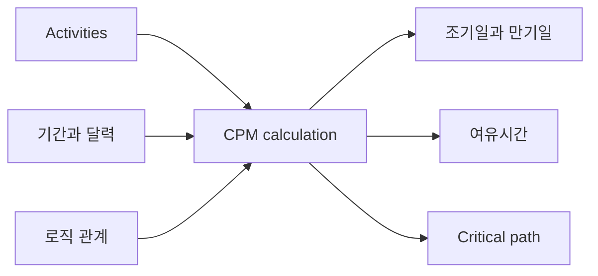

# CPM (Critical Path Method)

Critical Path Method, 즉 CPM은 진지한 프로젝트 공정표의 핵심 계산 방법입니다. 활동 목록을 논리 기반 네트워크로 바꾸어 프로젝트 팀이 가장 중요한 질문에 답할 수 있게 합니다. 프로젝트는 언제 끝날 수 있는가, 어떤 활동이 완료일을 통제하는가, 일정에는 어디에 여유가 있는가.

Primavera P6에서는 CPM이 schedule 버튼 뒤에 숨어 있는 경우가 많습니다. 소프트웨어는 날짜, 여유시간, critical activities를 매우 빠르게 계산합니다. 그러나 방법 자체를 이해하는 것은 여전히 중요합니다. 플래너가 CPM을 이해하지 못하면 일정은 계산되지만 결과가 실제 실행 계획을 의미하지 않을 수 있습니다.

## CPM이 하는 일

CPM은 활동, 기간, 달력, 관계로 이루어진 네트워크에서 프로젝트 기간을 계산합니다.

핵심 아이디어는 단순합니다. 프로젝트 기간은 모든 활동 기간의 합이 아닙니다. 네트워크 안에서 서로 의존하는 작업의 가장 긴 연결 경로의 기간입니다. 이 경로가 주요 경로입니다.

이 경로의 활동이 지연되면, 같은 경로에서 시간을 회복하지 않는 한 프로젝트 완료도 지연됩니다.

## CPM에 필요한 입력

CPM은 일정 네트워크의 품질에 의존합니다.

첫째, 일정에는 명확한 작업 단위를 나타내는 활동이 필요합니다. 각 활동은 정의된 범위, 합리적인 기간, 명확한 완료 기준을 가져야 합니다.

둘째, 각 활동에는 기간이 필요합니다. 대부분의 P6 공정표에서는 생산성, 자원, 달력, 실행 가정을 기반으로 한 deterministic 기간 추정입니다.

셋째, 활동에는 논리가 필요합니다. 관계는 무엇이 먼저 와야 하는지, 무엇이 병행 가능한지, 어떤 조건에서 후속 활동이 시작하거나 완료될 수 있는지를 정의합니다.

CPM은 논리가 좋은지 판단하지 않습니다. 주어진 논리로 계산할 뿐입니다. 누락 논리, 약한 제약조건, 과도한 lag, 불완전한 SS/FF 관계가 있으면 결과는 수학적으로 맞아도 실무적으로 신뢰하기 어렵습니다.

## Forward Pass와 Backward Pass

CPM은 두 가지 주요 계산 과정을 사용합니다.

Forward pass는 데이터 날짜에서 프로젝트 끝으로 이동하며 각 활동이 가장 빨리 시작하고 끝날 수 있는 날짜를 계산합니다. 이는 Early Start와 Early Finish입니다.

Backward pass는 프로젝트 끝에서 시작 쪽으로 이동하며 프로젝트 완료 또는 선택한 목표를 지연시키지 않고 각 활동이 가장 늦게 시작하고 끝날 수 있는 날짜를 계산합니다. 이는 Late Start와 Late Finish입니다.

P6는 early date와 late date를 바탕으로 여유시간를 계산합니다.

## 여유시간

여유시간는 활동이 정의된 일정 목표에 영향을 주기 전에 움직일 수 있는 시간입니다.

총여유시간는 P6에서 가장 많이 검토되는 값입니다. 활동이 프로젝트 완료 또는 controlling path에 영향을 주기 전까지 얼마나 지연될 수 있는지 보여줍니다.

자유여유시간는 더 국지적인 값입니다. 활동이 직접 후속 활동의 early start에 영향을 주지 않고 지연될 수 있는 시간을 보여줍니다.

여유시간는 함부로 써도 되는 여유 시간이 아닙니다. 일정의 유연성입니다. 여유시간이 소모되면 프로젝트는 미래 지연에 대한 보호를 잃습니다.

## Critical Path

Critical path는 프로젝트 완료를 통제하는 가장 긴 의존 활동 경로입니다. 많은 일정에서는 총여유시간이 0 또는 음수인 활동을 critical로 보지만, 더 좋은 검토는 longest path를 이해하고 실제로 말이 되는지 확인하는 것입니다.

좋은 주요 경로는 믿을 수 있는 실행 이야기를 보여야 합니다. 설계 릴리스, 조달, 시공 순서, 시험, 시운전, 인수인계 등 실제 완료를 통제하는 활동을 지나야 합니다.

주요 경로가 이상한 마일스톤, 불필요한 제약조건, 누락된 로직, 실제로 완료를 통제하지 않는 활동을 지나면 공정표는 잘못된 신호를 줄 수 있습니다.

## 준주요 작업

프로젝트 팀은 여유시간이 0인 활동만 보아서는 안 됩니다.

준주요 활동은 여유시간이 낮고 작은 지연으로도 주요 경로가 될 수 있습니다. 기준은 프로젝트 규모와 민감도에 따라 다릅니다. 대형 프로젝트에서는 여유시간이 10일 또는 20일 미만인 활동도 면밀히 관리해야 할 수 있습니다.

준주요 경로가 중요한 이유는 위험이 하나의 선에만 머무르지 않기 때문입니다. 밀도 높은 시공, 시운전, shutdown 기간에는 여러 경로가 동시에 주요 경로에 가까워질 수 있습니다.

## CPM과 Risk Analysis

CPM은 deterministic 답을 줍니다. 각 활동이 계획 기간대로 걸린다면 프로젝트는 이 날짜에 끝납니다.

Schedule Risk Analysis는 불확실성을 더 다룹니다. 활동 기간에 범위나 확률 분포를 적용하고 많은 시뮬레이션을 실행하여 목표일 완료 확률을 추정합니다.

하지만 risk analysis는 CPM 네트워크에 의존합니다. 논리가 약하면 위험 결과도 약합니다. Monte Carlo는 누락 논리, 비현실적 기간, 나쁜 일정 구조를 고치지 못합니다.

## Primavera P6의 CPM

P6는 CPM 계산을 빠르게 하지만, 그 속도는 가정을 숨길 수 있습니다.

일정을 계산할 때 P6는 데이터 날짜, 달력, 기간, 관계, 제약조건, 실적 데이터, 잔여 기간, 공정표 옵션을 사용합니다. 작은 설정 변경도 여유시간, 주요 경로, 예측 날짜를 바꿀 수 있습니다.

따라서 플래너는 F9만 누르고 결과를 받아들이면 안 됩니다. 계산 결과가 실제 실행 계획과 맞는지 검토해야 합니다.

## 좋은 실무

실제 실행 논리에서 CPM 네트워크를 만듭니다. 검사 통과나 원하는 날짜를 만들기 위해 관계를 추가하지 않습니다.

각 업데이트 후 주요 경로를 검토합니다. 현재 프로젝트 상태에서 시작과 끝이 타당한지 확인합니다.

시간에 따른 여유시간 변화를 추적합니다. 프로젝트가 계획대로 보이더라도 여유시간이 조용히 소모될 수 있습니다.

준주요 경로를 검토합니다. 다음 일정 문제가 어디서 생길지 자주 보여줍니다.

CPM을 지원할 수 있도록 일정을 깨끗하게 유지합니다. Open starts, open finishes, hard 제약조건, 과도한 lag, 불완전한 관계는 계산의 가치를 낮춥니다.

## 결론

CPM은 Primavera P6 공정표를 프로젝트 통제 도구로 바꾸는 엔진입니다. 활동 네트워크에서 조기일, 만기일, 여유시간, 주요 경로를 계산합니다.

하지만 CPM은 계산 대상인 일정만큼만 신뢰할 수 있습니다. 좋은 활동, 현실적인 기간, 올바른 달력, 강한 논리가 결과를 의미 있게 만듭니다.

CPM의 가치는 완료일을 보여주는 데서 끝나지 않습니다. 진짜 가치는 그 완료일이 왜 통제되는지, 어디에 유연성이 있는지, 관리 attention이 어디로 가야 하는지를 설명하는 데 있습니다.
## 관련 콘텐츠
- [제약조건으로 시작하는 중요 경로 또는 부동 경로 - 개요](../../10_metrics_ko/09_cp_or_float_path_starting_with_constraint/01_overview_template.md)
- [SS 및 FF 관계](../15_SS%20&%20FF%20RELATIONS/15_SS%20&%20FF%20RELATIONS.md)
- [프로젝트 공정표 개발](../17_DEVELOPE%20A%20PROJECT%20SCHEDULE/17_DEVELOPE%20A%20PROJECT%20SCHEDULE.md)
