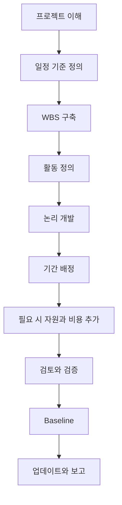

프로젝트 공정표을 처음부터 개발하는 것은 Primavera P6에 활동을 입력하는 일만이 아닙니다. 범위, 실행 전략, 제약, 자원, 프로젝트 약속을 검토, 승인, 업데이트, 의사결정에 사용할 수 있는 시간 모델로 바꾸는 과정입니다.

좋은 일정은 계산되기 전에 만들어집니다. P6 파일의 품질은 첫 활동을 입력하기 전의 사고 품질에 달려 있습니다.

## 개발 흐름

## 먼저 프로젝트를 이해한다

P6를 열기 전에 프로젝트를 이해해야 합니다.

계약, 작업 범위, 사양, 주요 마일스톤, 실행 전략, 조달 제약, 허가, 접근 제한, 인수인계 요구사항을 검토합니다. 그다음 프로젝트 관리자, 엔지니어링, 조달, 시공, 시운전, 하도급업체, 공급업체와 협의합니다.

일정은 팀이 프로젝트를 어떻게 수행하려는지 보여주는 모델입니다. 플래너가 그 의도를 이해하지 못하면 일정은 가정 위에 만들어집니다.

## 일정 기준을 정의한다

공정표 기준서는 공정표가 어떻게 만들어질지 설명합니다. WBS, 달력, 활동 코딩, 상세 수준, 관계 규칙, 지연 정책, P6 계산 설정, 데이터 날짜 기준, 보고 요구사항, 기준선 접근 방식을 정의해야 합니다.

이 문서는 왜 일정이 그렇게 만들어졌는지 설명하기 때문에 중요합니다. 또한 품질 검토와 이후 업데이트 비교의 기준이 됩니다.

## WBS를 구축한다

Work Breakdown Structure는 일정의 조직 프레임입니다. 프로젝트가 관리되고 보고되는 방식을 반영해야 합니다.

WBS는 단계, 구역, 시스템, 분야, 산출물, 계약 패키지 또는 그 조합으로 구성될 수 있습니다. 필터링, 진행률 측정, 책임 배정, 보고를 지원해야 합니다.

WBS가 프로젝트 통제 방식과 맞지 않으면 활동이 기술적으로 맞아도 일정은 사용하기 어렵습니다.

## 활동을 정의한다

활동은 명확하고 측정 가능한 작업 단위를 나타내야 합니다. 각 활동은 정의된 범위, 명확한 시작 조건, 명확한 완료 조건, 한 명의 책임자를 가져야 합니다.

너무 큰 활동은 status 관리가 어렵습니다. 너무 작은 활동은 유지 관리가 어렵습니다. 적절한 상세 수준은 프로젝트 단계, 계약 요구, 보고 요구, 통제 기대에 따라 달라집니다.

활동명은 중요합니다. 좋은 이름은 어떤 작업이 수행되는지, 어디에서 수행되는지, 어떤 객체, 시스템 또는 산출물과 관련되는지를 알려야 합니다.

## 논리를 개발한다

논리는 CPM 공정표의 핵심입니다. 무엇이 먼저 필요하고, 무엇이 병행 가능하며, 어떤 조건에서 각 활동이 시작 또는 완료될 수 있는지 정의합니다.

논리는 작업을 아는 사람들과 함께 개발해야 합니다. P6에서 혼자 책상에서만 순서를 만들지 마십시오. 분야 책임자, 시공 관리자, 시운전, 조달, 하도급업체와 검토합니다.

작업을 가장 잘 표현할 때 FS를 사용합니다. 실제 중첩이 있을 때만 SS와 FF를 조심스럽게 사용합니다. 음수 지연을 피하고, 명확히 승인된 이유가 없으면 SF를 피합니다. 유효한 프로젝트 시작과 완료 마일스톤을 제외하면 활동은 보통 선행작업과 후속작업을 가져야 합니다.

## 기간을 배정한다

기간은 희망이 아니라 현실이어야 합니다. 범위, 생산성, 자원, 달력, vendor input, subcontractor input, 유사 작업 경험을 기반으로 해야 합니다.

기간은 단순한 숫자가 아닙니다. 특정 crew, production rate, work calendar, access condition, execution method를 가정합니다. 이 가정이 바뀌면 기간도 바뀔 수 있습니다.

중요한 기간 가정을 문서화합니다. 이는 검토, 업데이트, 변경 관리, 지연 분석에 도움이 됩니다.

## 자원과 비용을 추가한다

일정이 resource planning, cost loading, earned value, cash flow에 사용된다면 자원과 비용을 신중하게 추가해야 합니다.

Resource loading은 labor demand, equipment demand, material quantities, possible overloads를 보여줍니다. Cost loading은 일정을 budgets, 예측s, payment/progress curves와 연결합니다.

보기 좋게 하려고 자원을 추가하지 마십시오. 프로젝트가 자원 데이터를 사용할 것이라면 업데이트 때도 유지해야 합니다.

## 검토하고 검증한다

Baseline 승인 전 일정은 기술적으로, 운영적으로 검토되어야 합니다.

열린 시작, 열린 완료, 관계 유형, 지연, 제약조건, 긴 기간, 누락 로직, 여유시간 분포, 주요 경로의 합리성을 확인합니다. DCMA식 점검은 유용하지만 프로젝트 판단이 필요합니다.

프로젝트 팀과 일정을 함께 검토합니다. 로직, 기간, 자원, 마일스톤이 실제 실행 계획과 맞는지 확인합니다. 지표는 통과하지만 현장 검토를 통과하지 못하는 일정은 준비된 것이 아닙니다.

## Baseline을 설정한다

검토와 승인이 끝나면 공정표는 기준선이 됩니다. 기준선은 진행률, 편차, 지연, 복구, 성과를 측정하는 기준입니다.

기준선 설정은 공식적이어야 합니다. 승인된 버전을 저장하고, 통제되지 않은 변경으로부터 보호하며, 승인을 문서화합니다. 이후 기준선 변경은 변경 통제를 따라야 합니다.

프로젝트가 지연될 때마다 바뀌는 기준선은 기준선이 아닙니다. 그것은 움직이는 목표입니다.

## 업데이트 사이클을 만든다

일정은 지속적으로 업데이트될 때만 유용합니다.

누가 진행률을 제공하는지, 언제 수집하는지, 어떤 증거가 필요한지, 실제 일자를 어떻게 검증하는지, 잔여 기간을 어떻게 검토하는지, 어떤 보고서를 발행하는지 정의합니다. 진행 중인 시공과 시운전은 주간 또는 격주 업데이트가 필요할 수 있습니다. 초기 단계는 월간 업데이트로 충분할 수 있습니다.

업데이트 사이클은 기준선을 정적 문서에서 살아 있는 통제 도구로 바꿉니다.

## 결론

프로젝트 공정표 개발은 구조화된 과정입니다. 프로젝트 이해, 공정표 기준서 정의, WBS 구축, 활동 생성, 논리 개발, 기간 배정, 필요 시 자원 로딩, 검증, 기준선 설정, 업데이트 유지가 필요합니다.

좋은 일정은 P6를 빨리 여는 데서 나오지 않습니다. 작업을 이해하고, 가정을 검토하고, 프로젝트 팀이 신뢰할 수 있는 모델을 만드는 데서 나옵니다.
## 관련 콘텐츠
- [주도 로직 없이 데이터 날짜에 시작하는 활동: 이 일정 지표가 중요한 이유 - 개요](../../metrics/01_activities_starting_in_dd_with_no_logic_driving/02_guide_template.md)
- [CPM (Critical Path Method)](../16_CPM%20(CRITICAL%20PATH%20METHOD)/16_CPM%20(CRITICAL%20PATH%20METHOD).md)
- [활동 코드](../18_ACTIVITY%20CODES/18_ACTIVITY%20CODES.md)
