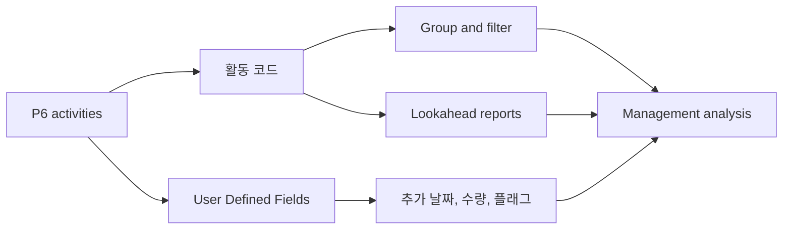

# 활동 코드

Primavera P6의 활동 코드는 일정을 활동 목록에서 프로젝트 통제 데이터베이스로 바꾸는 주요 도구 중 하나입니다. 이를 통해 프로젝트 팀은 일정을 다양한 관리 관점에서 group, filter, sort, report, analyze할 수 있습니다.

공정표는 막대 차트만이 아닙니다. P6에서 각 활동은 책임자, 단계, 구역, 시스템, 분야, 계약, 마일스톤 유형 및 기타 프로젝트 속성을 담을 수 있는 기록입니다. 활동 코드는 이 정보를 통제된 방식으로 구성합니다.

## 활동 코드란 무엇인가

활동 코드는 활동에 배정되는 구조화된 분류 필드입니다. 각 code type은 하나의 reporting dimension을 나타내고, 각 code value는 그 dimension 안의 선택값입니다.

예:

- Code type: Area.
- Code values: Unit 1, Unit 2, Tank Farm, Utilities.

또는:

- Code type: Discipline.
- Code values: Civil, Mechanical, Electrical, Instrumentation, Commissioning.

WBS는 작업이 프로젝트 구조 어디에 있는지 보여줍니다. 활동 코드는 그 작업을 reporting과 analysis 관점에서 어떻게 볼 수 있는지 보여줍니다.

## 활동 코드가 아닌 것

활동 코드는 WBS를 대체하지 않습니다. WBS는 scope hierarchy입니다. Codes는 같은 활동을 보는 추가 관점입니다.

활동 코드는 logic을 대체하지 않습니다. Logic은 작업 순서를 정의합니다.

활동 코드는 resources를 대체하지 않습니다. Resources는 labor, equipment, material demand, cost loading을 정의합니다.

이 개념들이 섞이면 일정 유지가 어려워집니다. 깨끗한 P6 공정표은 WBS, logic, resources, 활동 코드, UDFs를 각각 다른 목적으로 사용합니다.

## Global과 Project 활동 코드

P6에는 Global 활동 코드와 Project 활동 코드가 있습니다.

Global 활동 코드는 여러 프로젝트에서 공유됩니다. 표준 phase, corporate responsibility groups, program-level reporting categories처럼 portfolio 전반에서 동일한 분류가 필요할 때 유용합니다.

Project 활동 코드는 특정 프로젝트에 속합니다. Areas, systems, contract packages, work fronts, turnover packages, local reporting categories처럼 프로젝트 안에서만 의미 있는 속성에 적합합니다.

Global codes는 변경이 다른 프로젝트에 영향을 줄 수 있으므로 신중하게 사용합니다. 한 프로젝트에만 의미 있는 속성은 project codes를 사용합니다.

## 일반적인 Activity Code Types

유용한 code types는 프로젝트마다 다르지만 일반적인 예는 다음과 같습니다:

- Responsible Party.
- Discipline.
- Project Phase.
- Area or Location.
- System or Subsystem.
- Contract Package.
- Work Package.
- Milestone Type.
- Turnover Package.
- Reporting Level.

좋은 code types는 reporting needs에서 나옵니다. Codes를 만들기 전에 질문합니다: 이 일정은 어떤 질문에 답해야 하는가?

예:

- 다음 달 Area A에는 어떤 작업이 계획되어 있는가?
- 어떤 활동이 electrical contractor에 속하는가?
- 어떤 시스템이 시운전을 주도하는가?
- 어떤 contract package가 지연되고 있는가?
- 어떤 마일스톤을 발주처에 보고해야 하는가?

## User Defined Fields

User Defined Fields, 즉 UDFs는 활동 코드와 다릅니다. 코드는 활동을 범주로 분류합니다. UDF는 날짜, 숫자, 텍스트, 비용, 수량, 예/아니요 표시자 같은 사용자 정의 데이터를 저장합니다.

정보가 단순한 category가 아닐 때 UDFs를 사용합니다.

예:

- Contractual finish date.
- Forecast finish date.
- Risk flag.
- Quantity planned.
- Quantity installed.
- Change order number.
- Drawing reference.
- Inspection status.

활동 코드는 grouping과 filtering에 적합합니다. UDFs는 P6 기본 필드가 제공하지 않는 추가 정보를 저장하는 데 적합합니다.

## Reporting에서 중요한 이유

좋은 코딩은 reports를 더 빠르고 신뢰할 수 있게 만듭니다.

일관된 활동 코드가 있으면 스케줄러는 분야별 룩어헤드, 구역별 보고서, 계약 패키지 요약, 시운전 시스템 보고서, 마일스톤 보고서, 대시보드를 매번 필터를 새로 만들지 않고 생성할 수 있습니다.

Codes가 없으면 reporting은 수작업이 되기 쉽습니다. 팀은 data를 export하고, spreadsheets를 수정하고, labels를 손으로 넣고, 매 update마다 같은 일을 반복합니다. 이는 오류와 시간 낭비를 만듭니다.

Codes는 일정을 재사용 가능한 data source로 만듭니다.

## Governance

활동 코드에는 governance가 필요합니다. 모두가 자유롭게 values를 만들면 일정은 빠르게 불일치해집니다.

예를 들어 한 사람은 "Electrical", 다른 사람은 "Elec", 또 다른 사람은 "E&I"를 사용할 수 있습니다. 같은 category가 여러 labels로 나뉘면 report가 활동을 누락할 수 있습니다.

가능하면 기준선 전에 코드 유형과 허용 값을 정의합니다. 각 코드의 의미, 유지 책임자, 필수 여부를 문서화합니다.

Coding completeness는 공정표 품질 항목처럼 점검해야 합니다. 필수 codes가 누락된 활동이 많으면 그 codes를 기반으로 한 reports는 신뢰할 수 없습니다.

## Over-Engineering 피하기

Codes가 많다고 자동으로 control이 좋아지는 것은 아닙니다.

각 code와 UDF는 maintenance work를 만듭니다. Report, filter, dashboard, analysis에 쓰이지 않는 code라면 유지할 가치가 낮을 수 있습니다.

중요한 reporting questions에서 시작합니다. 그것을 답하기에 충분한 구조를 만들되, 언젠가 유용할 것 같다는 이유만으로 fields를 만들지 않습니다.

## 좋은 실무

코딩 구조는 기준선 이후가 아니라 공정표 개발 중에 설계합니다.

코드를 프로젝트 보고 계획과 맞춥니다. 프로젝트가 구역, 분야, 계약, 시스템별로 보고한다면 해당 차원은 P6 코딩 구조에 있어야 합니다.

Code values는 일관되고 통제되어야 합니다. 중복과 불명확한 약어를 피합니다.

사용자 정의 날짜, 수량, 참조, 지표에는 UDF를 사용합니다. 숫자나 날짜 정보를 활동 코드에 억지로 넣지 않습니다.

매 update마다 코딩을 검토합니다. 새 활동은 reports 발행 전에 required codes를 받아야 합니다.

## 결론

활동 코드는 단순한 administrative labels가 아닙니다. Primavera P6 공정표이 관리 questions에 빠르고 일관되게 답하게 해줍니다.

잘 사용하면 codes는 일정을 filter, group, report, analyze하기 쉽게 만듭니다. UDFs는 P6 표준 필드가 다루지 않는 프로젝트 정보를 저장하여 이 기능을 확장합니다.

Bar chart는 시간을 보여줍니다. Coding structure는 일정을 어떻게 읽고, 나누고, 사용할 수 있는지 설명합니다.
## 관련 콘텐츠
- [Primavera P6에서 종속성 누락 - 개요](../../metrics/21_missing_dependencies/02_guide_template.md)
- [프로젝트 공정표 개발](../17_DEVELOPE%20A%20PROJECT%20SCHEDULE/17_DEVELOPE%20A%20PROJECT%20SCHEDULE.md)
- [Schedule Basis](../19_SCHEDULE%20BASIS/19_SCHEDULE%20BASIS.md)
