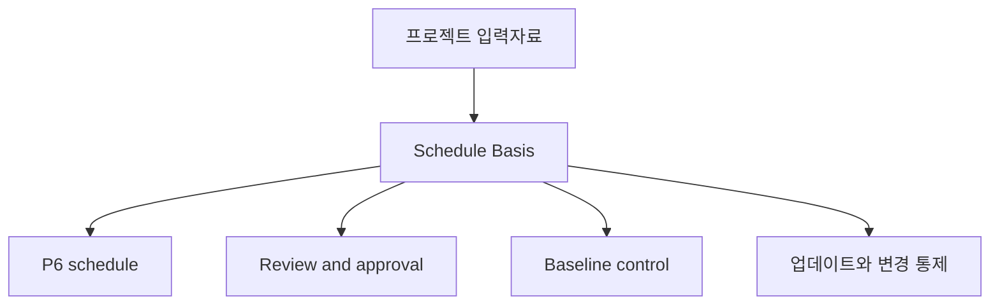

Schedule Basis, 또는 Basis of Schedule은 프로젝트 공정표이 어떻게 만들어졌고 어떤 가정이 그것을 뒷받침하는지 설명하는 문서입니다. Primavera P6 파일의 서면 동반 문서입니다.

공정표는 날짜, 로직, 여유시간, 마일스톤, 자원, 주요 경로를 보여줍니다. 공정표 기준서는 왜 그런 값과 구조가 되었는지 설명합니다.

## 용도

공정표 기준서는 검토, 승인, 기준선 통제, 진행률 업데이트, 변경 관리, 지연 분석을 지원합니다. 검토자가 공정표 뒤의 규칙, 가정, 입력자료, 한계를 이해하게 합니다.

이 문서가 없으면 P6 파일은 계산될 수 있지만, 팀은 어떤 assumptions가 쓰였는지, 그 일정이 의사결정에 적합한지 알기 어렵습니다.

## 누가 쓰고 누가 사용하는가

공정표 기준서는 보통 스케줄러 또는 계획 엔지니어가 작성하며, 프로젝트 관리자, 엔지니어링, 조달, 시공, 시운전, 프로젝트 통제, 계약, 비용 팀의 입력을 받습니다.

대상은 project team, client, PMO, reviewers, claims analysts, 그리고 일정이 어떻게 만들어졌는지 이해해야 하는 모든 사람입니다.

## 왜 중요한가

공정표에는 많은 결정이 들어 있습니다. 달력, 기간, 로직, 작업반, 마일스톤, 승인 주기, 허가, 자원 한계는 날짜와 여유시간에 영향을 줍니다.

공정표 기준서는 이러한 결정을 보이게 합니다. 모호함을 줄이고, 감사 가능성을 높이며, 기준선에서 무엇을 가정했는지에 대한 나중의 논쟁을 줄입니다.

## 포함해야 할 내용

Comprehensive Basis of Schedule에는 다음이 포함되어야 합니다:

- Project scope and exclusions.
- Schedule purpose and contractual use.
- Schedule development methodology.
- WBS and 활동 코딩 structure.
- Calendars, shifts, holidays, weather, non-work periods.
- Key assumptions and 제약조건.
- 시작, 완료, 접근, 승인, 자재 납품 마일스톤.
- Approval and permit cycles.
- Handover and turnover assumptions.
- Logic rules, relationship types, lag policy.
- Duration basis, productivity rates, norms.
- Crews, resource availability, labor limits, equipment limits.
- Cost rules, if applicable.
- Critical path and near-주요 경로 explanation.
- Risk assumptions and major uncertainties.
- Update cycle, status rules, reporting approach.

## Assumptions

가정은 명확하고 검증 가능해야 합니다. 현장 접근 날짜, 엔지니어링 릴리스, 공급업체 납품일, 허가 승인 기간, 발주처 검토 기간, 작업반 가용성, 기상 여유, 시운전 순서 가정이 포함될 수 있습니다.

어떤 가정이 날짜, 여유시간, 자원, 인수인계에 영향을 준다면 공정표 기준서에 포함되어야 합니다.

## Calendars and Work Periods

문서는 P6에서 사용하는 주요 달력을 설명해야 합니다. 근무일, 교대, 휴일, 계절적 중단, 기상 달력, 야간 작업, 주말 작업, 비근무 기간을 포함합니다.

달력은 활동 날짜와 여유시간에 직접 영향을 줍니다. 엔지니어링, 조달, 시공, 시운전, 자원에 서로 다른 달력이 쓰이면 그 이유를 설명해야 합니다.

## Crews, Resources, Limits

기간은 자원 가정을 이해할 때 의미가 있습니다. 공정표 기준서는 작업반 가정, 자원 가용성, 인력 한계, 장비 한계, 초과근무 또는 교대 전략을 설명해야 합니다.

Resource loading이 포함되면 manpower planning, cost loading, earned value, resource leveling 중 어떤 목적으로 쓰이는지 설명합니다.

## Milestones, Approvals, Permits, Handover

주요 마일스톤을 나열하고 설명합니다. 프로젝트 시작, 계약상 완료, 접근 허가, 발주처 승인, 제3자 인터페이스, 자재 납품, 허가, 시스템 인수인계, 최종 인계가 포함됩니다.

승인 및 허가 주기는 가정된 기간과 책임 주체를 보여야 합니다. 발주처 또는 제3자의 조치가 공정표를 주도한다면 명확히 보여야 합니다.

## Methodology, Productivity, Costs

공정표 기준서는 공정표가 어떻게 개발되었는지 설명해야 합니다. 여기에는 사용한 출처, 워크숍, 순서 로직, 기간 산정 방법, 생산성 기준, 표준, 검증 프로세스가 포함됩니다.

Cost loading이 포함되면 rules를 명시합니다. Costs가 resource, expense, activity, WBS, contract package, earned value method 중 어디에 따라 배정되는지 설명합니다.

## Critical Path and Risk

공정표 기준서는 주요 경로를 요약하고 왜 합리적인지 설명해야 합니다. 준주요 경로, 주요 리스크, 공정표 민감도, 실행 중 바뀔 수 있는 가정도 식별해야 합니다.

이는 팀이 planned finish date뿐 아니라 무엇이 그 날짜를 통제하는지 이해하게 합니다.

## 좋은 실무

공정표 기준서는 기준선 승인 전에 작성합니다. P6 파일과 일치하게 유지합니다. 승인된 변경이 가정, 달력, 마일스톤, 자원 전략, 방법론을 바꾸면 업데이트합니다.

Generic narrative가 되어서는 안 됩니다. 다른 스케줄러가 일정이 어떻게 만들어졌는지 이해할 만큼 구체적이어야 합니다.

## 결론

공정표 기준서는 공정표 뒤의 설명입니다. 공정표가 무엇을 가정하는지, 어떻게 만들어졌는지, 무엇을 포함하고 제외하는지, 날짜가 유효하려면 어떤 조건이 유지되어야 하는지 말해줍니다.

강한 Basis of Schedule은 P6 파일을 더 쉽게 review, defend, update, trust할 수 있게 만듭니다.
## 관련 콘텐츠
- [주도 로직 없이 데이터 날짜에 시작하는 활동: 이 일정 지표가 중요한 이유 - 개요](../../metrics/01_activities_starting_in_dd_with_no_logic_driving/02_guide_template.md)
- [활동 코드](../18_ACTIVITY%20CODES/18_ACTIVITY%20CODES.md)
