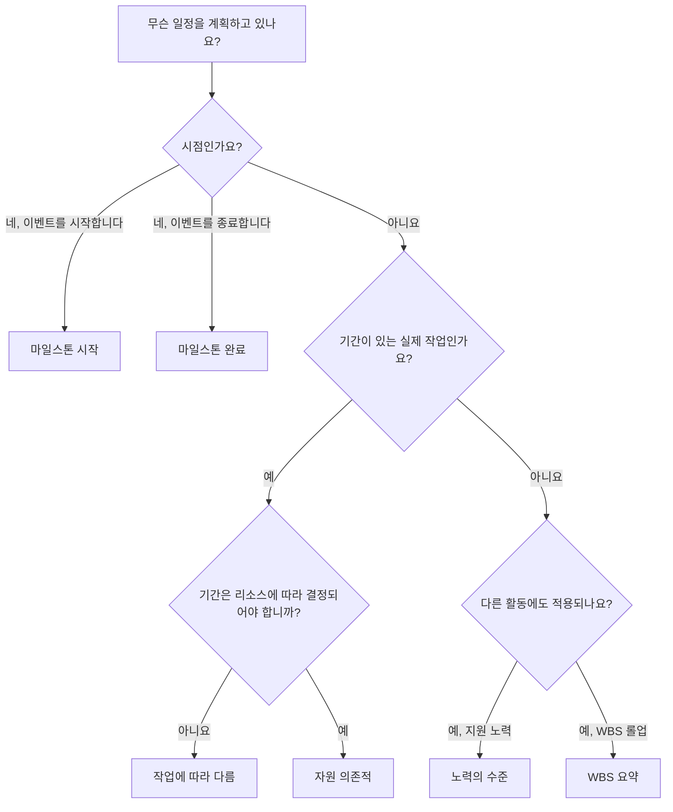

활동 유형은 Primavera P6에서 가장 중요한 설정 필드 중 하나입니다. 이는 P6에게 계산 중인 활동의 종류와 해당 활동이 일정에서 어떻게 작동해야 하는지 알려줍니다.

많은 스케줄러는 먼저 활동 이름, 기간, 날짜 및 관계에 중점을 둡니다. 이는 필수적이지만 활동 유형도 중요합니다. 작업 활동, 이정표, 노력 수준 활동 및 WBS 요약 활동은 동일한 방식으로 작동하지 않습니다. 잘못된 유형을 선택하면 날짜, 진행 상황, 리소스 로드, 부동 및 보고가 왜곡될 수 있습니다.

이 블로그의 목적은 P6에서 사용할 수 있는 주요 활동 유형, 각 유형의 용도, 계획 중인 작업에 적합한 유형을 결정하는 방법을 설명하는 것입니다.

## 활동 유형이 중요한 이유

활동 유형은 항목의 일정 목적과 일치해야 합니다. 기간이 있는 실제 작업인가요? 시점인가요? 다른 활동에 걸친 작업 요약인가요? 고정된 작업 기간이 아닌 자원에 의존하는 노력입니까?

활동 유형이 목적과 일치하지 않으면 일정이 혼란스러울 수 있습니다. 기간이 있는 마일스톤은 마일스톤이 아닙니다. 요약으로 사용되는 일반 작업은 논리를 숨길 수 있습니다. 작업을 추진하는 데 사용되는 노력 수준 활동은 중요한 경로를 왜곡할 수 있습니다. 잘못 사용된 자원 의존 활동은 예상과 다르게 계산될 수 있습니다.

P6에서 활동 유형은 '일정이 계산될 때 이 항목이 어떻게 작동해야 합니까?'라는 실용적인 질문에 답하는 데 도움이 됩니다.

## P6의 주요 활동 유형

가장 일반적인 Primavera P6 활동 유형은 다음과 같습니다.

- 작업에 따라 다릅니다.
- 리소스에 따라 다릅니다.
- 노력 수준.
- 마일스톤을 시작하세요.
- 마일스톤을 완료하세요.
- WBS 요약.

각각 다른 목적을 가지고 있습니다.

## 작업 종속 활동

작업 종속은 P6에서 가장 일반적인 활동 유형입니다. 활동 기간이 개별 자원 달력이 아닌 활동에 할당된 달력에 의해 제어되는 일반적인 계획 작업에 사용하십시오.

예는 다음과 같습니다:

- 기초를 발굴합니다.
- 케이블 트레이를 설치합니다.
- 콘크리트 슬래브를 붓습니다.
- 디자인 패키지를 준비합니다.
- 압력 테스트를 수행합니다.

작업 종속 활동은 일반적으로 대부분의 건설, 엔지니어링, 조달, 테스트 및 시운전 작업에 가장 적합한 선택입니다. 명확하고 안정적이며 이해하기 쉽습니다. 스케줄러는 기간을 정의하고, 활동 달력을 할당하고, 논리를 연결하고, P6은 날짜를 계산합니다.

활동이 개별 작업 범위를 나타내고 작업 기간이 자원 달력에 따라 변경되어서는 안 되는 경우 작업 종속을 사용합니다.

## 자원 의존 활동

자원 종속 활동은 기간 및 일정 동작이 활동에 할당된 자원의 영향을 받아야 하는 경우에 사용됩니다. 이 경우 P6은 자원 달력과 자원 가용성을 사용하여 활동 일정을 계산할 수 있습니다.

이는 리소스 가용성이 작업의 실제 동인인 경우 유용할 수 있습니다. 예를 들어 전문 직원, 검사관 또는 장비 자원은 특정 날짜 또는 교대 근무에만 사용할 수 있습니다.

예는 다음과 같습니다.

- 한정된 검사관에 의한 전문 검사.
- 공급업체 기술자 지원.
- 부족한 자원을 활용한 장비 교정.
- 자원 중심의 유지 관리 작업.

자원 의존적 활동은 주의해서 사용해야 합니다. 프로젝트가 적극적으로 리소스를 로드하지 않거나 리소스 수준이 지정되지 않은 경우 습관적으로 리소스 의존성을 사용하면 혼란이 발생할 수 있습니다. 활동 달력이 주요 일정 기준이기 때문에 많은 일정에서는 작업 종속을 기본값으로 사용합니다.

자원과 해당 달력이 일정 계산에 영향을 미치도록 의도된 경우 자원 종속을 사용합니다.

## 마일스톤 시작

시작 마일스톤은 이벤트, 단계, 액세스 기간, 승인 또는 주요 작업 조건의 시작을 나타내는 기간이 0인 활동입니다.

예는 다음과 같습니다:

- 진행 통지를 받았습니다.
- 지역 접근 권한이 부여되었습니다.
- 공사 시작.
- 실행을 위해 출시된 디자인 패키지.
- 시운전 창을 시작합니다.

시작 마일스톤은 수행 중인 작업을 나타내지 않습니다. 이는 작업을 시작할 수 있는 시점을 나타내거나 중요한 시작 이벤트를 표시합니다.

일정에 중요한 일의 시작을 표시해야 하는 경우 시작 마일스톤을 사용하세요. 일반적으로 이정표를 추진하는 요소와 이를 통해 릴리스되는 작업을 설명하는 논리와 연결되어야 합니다.

## 마일스톤 완료

완료 마일스톤은 이벤트, 단계, 결과물 또는 계약 지점의 완료를 나타내는 기간이 0인 활동입니다.

예는 다음과 같습니다:

- 기계적 완성을 달성했습니다.
- 시스템 교체가 완료되었습니다.
- 허가 승인을 받았습니다.
- 실질적인 완성.
- 최종 완성.

완료 마일스톤은 성취도를 표시하므로 보고에 유용합니다. 정상적인 업무 활동으로 사용되어서는 안 됩니다. 이정표에 도달하기 위해 노력이 필요한 경우 해당 노력은 이정표로 이어지는 작업으로 모델링되어야 합니다.

일정이 완료되었거나 달성되었음을 표시해야 하는 경우 완료 마일스톤을 사용하세요.

## 노력의 수준

LOE라고도 하는 노력 수준은 프로젝트를 직접 추진하기보다는 다른 작업에 걸쳐 있는 활동에 사용됩니다. LOE 활동은 일반적으로 관리, 감독, 검사 지원, 프로젝트 통제 또는 지속적인 조정에 사용됩니다.

예는 다음과 같습니다:

- 프로젝트 관리 지원.
- 사이트 감독.
- 엔지니어링 관리.
- 건설관리.
- 품질검사 지원.

LOE 활동은 일반적으로 다른 활동에서 날짜를 가져옵니다. 다른 작업이 진행되는 동안 계속되는 지원 노력을 나타내야 합니다. 일반적으로 개별 건설 또는 엔지니어링 작업의 원동력이 되는 것은 아닙니다.

활동이 활동 그룹에 걸쳐 지속되는 지원, 감독 또는 관리를 나타내는 경우 LOE를 사용합니다.

LOE 논리에 주의하세요. LOE가 잘못 연결된 경우 날짜를 앞당기거나 부동 소수점을 왜곡하는 것처럼 보일 수 있습니다. LOE 활동은 일정 품질 점검 중에 검토되어야 하며, 특히 주요 경로에 나타나거나 비정상적인 FS 또는 SF 관계가 있는 경우에는 더욱 그렇습니다.

## WBS 요약

WBS 요약 활동은 WBS 요소 내의 활동 그룹을 요약합니다. 해당 날짜는 자체 세부 논리가 아닌 WBS의 활동에서 파생됩니다.

예는 다음과 같습니다:

- 엔지니어링 요약.
- 조달 요약.
- A구역 공사개요.
- 시스템 01 시운전 요약.

WBS 요약 활동은 상위 수준 보고에 유용할 수 있지만 실제 활동이나 논리를 대체해서는 안 됩니다. 실행 작업이 아닌 롤업 도구입니다.

WBS 섹션의 요약 수준 보기가 필요할 때 그리고 프로젝트 보고 방법이 해당 사용을 지원하는 경우에만 WBS 요약 활동을 사용하십시오.

## 올바른 유형 선택

간단한 규칙이 도움이 됩니다.

- 기간이 있는 실제 작업인 경우 자원 달력이 이를 추진하지 않는 한 작업 종속을 사용하십시오.
- 리소스 가용성이 이를 촉진해야 하는 경우 리소스 종속을 사용하세요.
- 시작 이벤트인 경우 Start Milestone을 사용하십시오.
- 완료 이벤트인 경우 Finish Milestone을 사용하세요.
- 다른 작업에 걸쳐 지속적인 지원이 필요한 경우 노력 수준을 사용하세요.
- 보고 롤업인 경우 WBS 요약을 사용하세요.

활동 유형은 일정을 더 쉽게 이해할 수 있도록 해야 합니다. 검토자가 마일스톤에 기간이 있는 이유, LOE가 작업을 추진하는 이유 또는 WBS 요약이 세부 논리에 나타나는 이유를 질문해야 하는 경우 활동 유형이 잘못되었을 수 있습니다.

## 일반적인 실수

흔한 실수 중 하나는 마일스톤을 작업의 대체물로 사용하는 것입니다. 이정표는 특정 시점을 표시해야 합니다. 작업이 필요한 경우 작업에 대한 활동을 만듭니다.

또 다른 실수는 LOE 활동을 사용하여 개별 작업을 제어하는 ​​것입니다. LOE는 실제 활동 간의 논리를 대체하는 것이 아니라 작업을 지원하거나 확장해야 합니다.

세 번째 실수는 리소스 기반 일정 프로세스 없이 리소스 종속을 사용하는 것입니다. 자원 달력이 유지 관리되지 않으면 활동 유형이 가치보다 더 많은 혼란을 야기할 수 있습니다.

마지막으로, 잘 구축된 WBS 및 상세한 논리 대신 WBS 요약 활동을 사용하지 마십시오. 요약은 보고에 유용하지만 일정에는 여전히 실제 활동이 필요합니다.

## 결론

P6의 활동 유형은 활동의 작동 방식을 정의합니다. 그것은 단순한 라벨이 아닙니다. 올바른 활동 유형은 일정을 올바르게 계산하고 명확하게 전달하는 데 도움이 됩니다.

작업 종속 활동은 가장 일반적인 작업을 나타냅니다. 자원 종속 활동은 자원 달력이 일정을 제어해야 할 때 유용합니다. 시작 및 종료 마일스톤은 시간의 주요 지점을 표시합니다. 노력 수준 활동은 다른 작업에 걸친 지원을 나타냅니다. WBS 요약 활동은 롤업 보고를 지원합니다.

올바른 활동 유형을 선택하면 일정을 더 쉽게 검토하고, 더 쉽게 설명할 수 있으며, 프로젝트 제어에 대한 안정성도 높아집니다. 강력한 일정에는 좋은 날짜와 논리만 있는 것이 아닙니다. 또한 표현되는 작업에 적합한 종류의 활동을 사용합니다.
