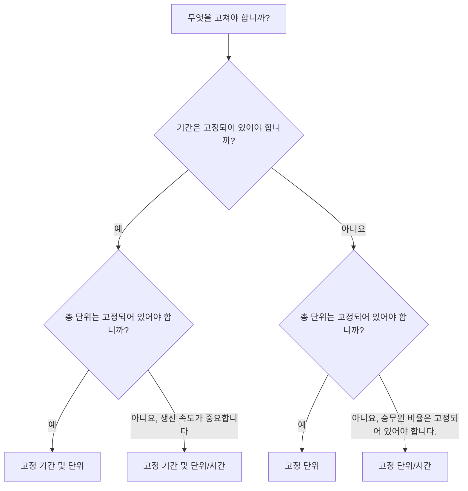

기간 유형은 기간, 단위 및 자원 생산성이 변경될 때 활동이 어떻게 작동하는지 제어하는 ​​Primavera P6의 필드 중 하나입니다. 간과하기 쉽지만 일정 날짜, 리소스 로드, 비용 예측, 획득 가치 및 업데이트 동작에 영향을 미칠 수 있습니다.

많은 스케줄러는 기간을 일 수로만 생각합니다. P6에서는 기간이 숫자 이상입니다. 활동에는 노동 단위, 비노동 단위, 시간당 단위, 자원 달력, 활동 달력 및 남은 작업 시간도 포함될 수 있습니다. 기간 유형은 일정이 다시 계산되거나 스케줄러가 리소스와 기간을 변경할 때 고정 상태로 유지되어야 하는 사항을 P6에 알려줍니다.

이 블로그에서는 P6의 활동에 사용할 수 있는 주요 기간 유형, 차이점, 각 유형의 용도, 다른 유형 대신 사용하는 경우에 대해 설명합니다.

## 기간 유형이 기간 필드와 동일하지 않습니다.

유형을 살펴보기 전에 두 가지 아이디어를 분리하는 것이 도움이 됩니다.

기간 필드는 원래 기간, 남은 기간, 실제 기간 및 완료 시 기간과 같은 값입니다. 이는 시간을 설명합니다.

기간 유형은 계산 설정입니다. 이는 P6에게 지속 시간, 총 단위, 변화가 있을 때 시간당 단위의 균형을 맞추는 방법을 알려줍니다.

예를 들어 활동에 더 많은 리소스를 추가하는 경우 활동이 더 일찍 완료되어야 합니까? 아니면 기간은 동일하게 유지하고 총 노력은 늘려야 합니까? 대답은 기간 유형에 따라 다릅니다.

## 주요 기간 유형

일반적인 P6 기간 유형은 다음과 같습니다.

- 고정 기간 및 단위.
- 고정 기간 및 단위/시간.
- 고정 단위.
- 고정 단위/시간.

처음에는 이름이 기술적으로 느껴질 수 있지만 각 이름은 실질적인 질문에 답합니다. 무언가 변경될 때 P6가 활동의 어떤 부분을 보호해야 합니까?

## 고정 기간 및 단위

고정 기간 및 단위는 활동 기간과 총 단위를 고정된 상태로 유지합니다. 시간당 단위가 변경되면 P6은 기간이나 총 노력을 변경하는 대신 속도를 조정합니다.

이 유형은 계획된 기간과 총 노력을 모두 안정적으로 유지하려는 경우에 유용합니다.

예:

활동은 400시간의 노동 시간으로 10일 동안 계획됩니다. 일정 팀은 기간을 10일로 유지하고 총 예산 노력을 400시간으로 유지하기를 원합니다. 자원 할당 세부 사항이 변경되면 계획된 기간과 총 단위가 자동으로 이동되어서는 안 됩니다.

다음과 같은 경우 고정 기간 및 단위를 사용하세요.

- 활동에는 고정된 작업 창이 있습니다.
- 총 노력은 이미 합의되었습니다.
- 자원 요율 변경으로 인해 활동 기간이 자동으로 변경되어서는 안 됩니다.
- 일정은 안정적인 비용이나 획득가치 관리를 위해 사용됩니다.

이는 일정 기간과 예산에 따른 노력이 모두 통제되는 관리 작업 패키지에 유용한 경우가 많습니다.

## 고정 기간 및 단위/시간

고정 기간 및 단위/시간은 기간과 리소스 비율을 고정된 상태로 유지합니다. 리소스가 추가되거나 제거되면 P6은 총 단위를 조정할 수 있습니다.

이 유형은 고정된 시간 동안 활동이 발생해야 하고 리소스 로딩 속도가 일관되게 유지되어야 하는 경우에 유용합니다.

예:

프로젝트 관리 지원 활동은 20일 동안 지속됩니다. 팀에서는 하루 8시간씩 프로젝트 엔지니어 한 명을 배정합니다. 기간은 20일로 유지되어야 하며 일일 요금은 하루 8시간으로 유지되어야 합니다. 총 단위는 기간과 비율의 결과입니다.

다음과 같은 경우 고정 기간 및 단위/시간을 사용합니다.

- 활동 기간은 정해져 있습니다.
- 일일 또는 시간당 자원 요율이 중요합니다.
- 총 단위는 기간과 비율로 계산해야 합니다.
- 활동은 지속적인 지원 또는 고정된 작업 기간을 나타냅니다.

이는 감독, 관리, 검사 지원 또는 시간 기반 지원 활동에 유용할 수 있습니다.

## 고정 단위

고정 단위는 전체 단위를 고정된 상태로 유지합니다. 리소스 비율이 변경되면 P6은 기간을 조정할 수 있습니다.

이 유형은 작업량이 고정되어 있지만 기간은 생산성이나 자원 가용성에 따라 달라지는 경우에 유용합니다.

예:

활동에는 800시간의 노동 시간이 필요합니다. 팀에서 더 많은 팀 수용력을 할당하면 활동이 더 빨리 완료될 수 있습니다. 사용 가능한 승무원 수가 적은 경우 활동에 더 오랜 시간이 걸릴 수 있습니다. 총 작업 시간은 800시간입니다.

다음과 같은 경우 고정 단위를 사용합니다.

- 작업량이나 총 노력은 고정되어 있습니다.
- 기간은 리소스 가용성이나 생산성에 따라 달라집니다.
- 승무원 규모는 활동을 완료하는 데 필요한 시간을 변경할 수 있습니다.
- 자원 계획이 활성화되어 유지관리됩니다.

이는 전체 노력이 알려져 있고 제작진의 부하에 반응하는 기간이 예상되는 생산 스타일 작업에 유용할 수 있습니다.

## 고정 단위/시간

고정 단위/시간은 자원 비율을 고정된 상태로 유지합니다. 기간이 변경되면 총 단위도 함께 변경됩니다.

이 유형은 활동이 지속되는 동안 팀이나 자원이 고정된 비율로 작업할 때 유용합니다.

예:

현장 감독 활동에는 감독자 한 명이 하루 8시간 동안 참여합니다. 활동 기간이 10일에서 15일로 증가하면 더 많은 일수 동안 감독자가 필요하므로 총 단위가 증가해야 합니다. 일일 요금은 고정되어 있습니다.

다음과 같은 경우 고정 단위/시간을 사용합니다.

- 승무원 또는 자원 비율은 고정되어 있습니다.
- 기간이 변경되면 총 단위가 증가하거나 감소해야 합니다.
- 활동은 시간 기반 노력을 나타냅니다.
- 자원은 전체 활동 기간 동안 할당됩니다.

이는 시간이 총 노력을 요하는 지원, 감독, 검사 및 관리 활동에 유용한 경우가 많습니다.

## 올바른 기간 유형을 선택하는 방법

최상의 기간 유형은 활동이 나타내는 내용과 프로젝트 제어 팀이 P6에서 변경 사항을 계산할 것으로 기대하는 방식에 따라 달라집니다.

선택하는 간단한 방법은 다음과 같이 질문하는 것입니다.

- 기간은 요금제, 계약, 기간 또는 액세스에 따라 고정됩니까?
- 총 노력은 수량, 예산 또는 견적에 따라 결정됩니까?
- 자원 비율은 승무원 계획 또는 인력 배치 계획에 따라 고정됩니까?
- 자원을 추가하면 활동이 단축되어야 합니까?
- 활동을 확장하면 총 단위가 증가해야 합니까?

기간과 총 단위를 고정해야 하는 경우 고정 기간 및 단위를 사용하세요.

기간과 생산 속도가 고정되어 있어야 하는 경우 고정 기간 및 단위/시간을 사용하세요.

총 작업 시간이 고정되어 있어야 하고 기간이 리소스 로드에 반응해야 하는 경우 고정 단위를 사용하세요.

자원 비율을 고정으로 유지하고 단위를 기간에 따라 변경해야 하는 경우 고정 단위/시간을 사용하세요.

## 실제 사례

정의된 인력 및 비용 예산을 갖춘 고정 1일 작업으로 계획된 콘크리트 타설의 경우 고정 기간 및 단위가 적절할 수 있습니다.

고정된 보고 기간 동안 일정한 일일 비율로 할당된 프로젝트 관리 지원의 경우, 총 단위 또는 기간 변경이 예측을 주도해야 하는지 여부에 따라 고정 기간 및 단위/시간 또는 고정 단위/시간이 적절할 수 있습니다.

전체 작업량이 알려진 설치 활동의 경우 작업자 규모가 완료 시간에 영향을 미치므로 고정 단위가 적합할 수 있습니다.

공사 기간이 연장되는 한 계속되는 현장 감독의 경우 고정 단위/시간이 적절할 수 있습니다.

중요한 점은 선택이 습관이 아닌 프로젝트 제어 방법을 반영해야 한다는 것입니다.

## 일반적인 실수

일반적인 실수 중 하나는 활동 목적과 일치하는지 확인하지 않고 모든 활동에서 기본 기간 유형을 그대로 두는 것입니다.

또 다른 실수는 프로젝트가 자원 할당을 신중하게 유지하지 않을 때 자원 중심 기간 동작을 사용하는 것입니다. 자원 데이터가 약한 경우 자원 기반 계산으로 인해 신뢰할 수 없는 결과가 발생할 수 있습니다.

세 번째 실수는 P6이 단위나 요율을 어떻게 다시 계산하는지 이해하지 못한 채 업데이트 중에 기간을 변경하는 것입니다. 이는 비용 로딩, 획득 가치 및 자원 히스토그램에 영향을 미칠 수 있습니다.

마지막으로 기간 유형을 순전히 기술적인 설정으로 취급하지 마세요. 이는 계획이 변경될 때 일정이 작동하는 방식에 영향을 줍니다.

## 기간 유형 및 일정 품질

기간 유형은 예측의 신뢰성 여부에 영향을 미치므로 일정 품질의 일부입니다. 활동의 기간, 단위 및 자원 요율이 예상대로 작동하지 않는 경우 일정에 오해의 소지가 있는 날짜나 자원 수요가 표시될 수 있습니다.

PMO 검토의 경우 기간 유형이 유사한 활동 그룹 간에 일관성이 있는지 확인하는 것이 유용합니다. 엔지니어링 활동, 조달 활동, 건설 활동, LOE 활동 및 지원 활동에는 서로 다른 규칙이 필요할 수 있지만 선택은 의도적이어야 합니다.

일정에 리소스가 로드되면 기간 유형이 더욱 중요해집니다. 이는 자원 변경이 기간, 총 단위 또는 시간당 단위에 영향을 미치는지 여부를 결정하는 데 도움이 됩니다.

## 결론

P6의 기간 유형은 기간, 총 단위 및 자원 요율이 변경될 때 활동이 응답하는 방식을 정의합니다. 이는 단순한 배경 설정이 아닙니다.

고정 기간 및 단위는 시간과 총 노력을 모두 보호합니다. 고정 기간 및 단위/시간은 시간과 속도를 보호합니다. 고정 단위는 총 노력을 보호합니다. 고정 단위/시간은 자원 요율을 보호합니다.

올바른 기간 유형을 선택하면 프로젝트 계획과 일치하는 방식으로 일정을 계산하는 데 도움이 됩니다. 또한 리소스 로딩, 진행 상황 업데이트, 비용 예측, 일정 보고서를 더 쉽게 이해하고 방어할 수 있습니다.
