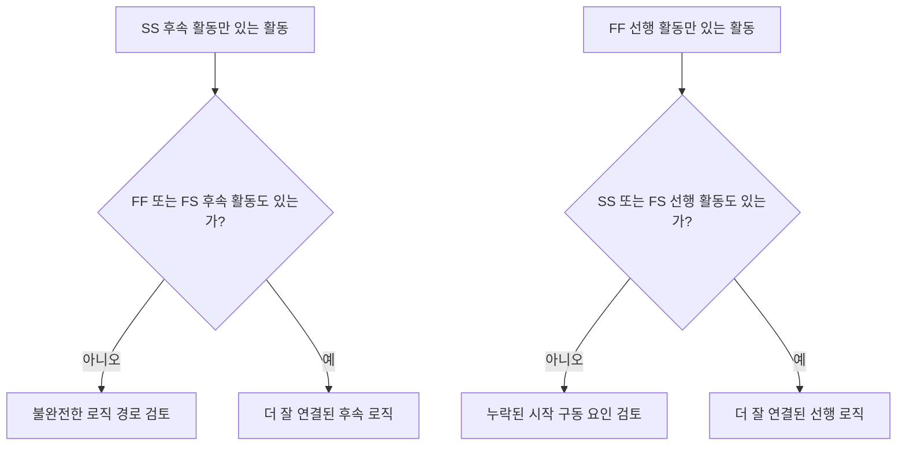

로직은 프로젝트 일정 내의 순서와 의존 관계를 수학적으로 표현한 것입니다. 무엇이 무엇보다 먼저 일어나야 하는지, 어떤 활동이 동시에 일어날 수 있는지, 프로젝트 팀이 첫 번째 활동에서 최종 완료로 어떻게 이동하려는지를 설명합니다.

좋은 Primavera P6 일정에서, 로직은 장식이 아닙니다. 일정이 날짜, 여유 시간(float), 주공정(critical path), 예측 이동을 계산할 수 있게 하는 엔진입니다. 검토, 도전, 개선될 수 있는 방식으로 실행의 이야기를 말합니다.

일정이 "기초를 놓고, 그런 다음 벽을 세우고, 그런 다음 지붕을 만든다"라고 말한다면, 로직은 그 순서를 계산 가능한 네트워크로 전환하는 것입니다. 플래너는 단순히 타임라인을 그리는 것이 아닙니다. 플래너는 납품 경로를 정의하는 것입니다.

## 로직은 작업의 이야기를 합니다

모든 프로젝트 팀에는 프로젝트를 실행하려는 의도된 방식이 있습니다. 엔지니어링은 구역별로 설계를 발행할 수 있습니다. 조달은 패키지별로 장비를 납품할 수 있습니다. 토목 작업은 구조 작업이 시작되기 전에 접근을 준비할 수 있습니다. 기계 완료는 시운전이 시작되기 전에 일어나야 할 수 있습니다.

로직 링크는 그 계획의 수학적 표현입니다.

이 간단한 다이어그램은 단순한 순서가 아닙니다. 의사결정 모델입니다. 기초가 늦어지면, 벽이 늦어질 수 있습니다. 벽이 늦어지면, 지붕이 늦어질 수 있습니다. 지붕이 늦어지면, 내부 작업이 영향을 받을 수 있습니다. 로직이 존재해야만 일정이 그 영향을 보여줄 수 있습니다.

견고한 로직은 일정이 왜 활동이 시작되는지, 왜 완료되는지, 계획의 한 부분이 이동할 때 무슨 일이 일어나는지를 설명할 수 있음을 의미합니다.

## 데이터 기준일에서 견고한 로직이 중요한 이유

"데이터 기준일(Data Date)에 구동 로직 없이 시작되는 활동" 지표는 일정 품질의 강력한 테스트입니다.

데이터 기준일은 실제 실적과 예측 작업 사이의 경계입니다. 활동이 데이터 기준일에 정확히 시작될 때, 검토자는 간단한 질문을 해야 합니다: 이 시작을 결정하는 것은 무엇인가?

활동에 유효한 선행 활동(predecessor) 로직이 있다면, 일정은 시작을 설명할 수 있습니다. 아마도 구역이 해제되었을 것입니다. 아마도 자재 납품이 완료되었을 것입니다. 아마도 선행 활동이 완료되고 다음 팀이 시작할 수 있게 되었을 것입니다.

활동에 구동 로직이 없다면, 시작은 더 취약합니다. 활동이 선행 활동이 없거나, 로직이 불완전하거나, 제약이 강요하거나, 업데이트가 완전히 현황 파악되지 않았기 때문에 데이터 기준일에 앉아 있을 수 있습니다.

이것이 견고한 로직이 중요한 이유입니다. 일정은 데이터 기준일이 이동했다는 이유만으로 작업이 준비된 것처럼 보이게 해서는 안 됩니다. 작업이 시작될 수 있는 실제 조건을 보여주어야 합니다.

## 균형: 충분한 로직, 중복 없이

좋은 로직은 균형 잡혀 있습니다. 일정은 활동을 선행 활동과 후속 활동에 올바르게 연결하기에 충분한 관계가 필요합니다. 동시에, 동일한 의존 관계를 불필요한 방식으로 반복하는 중복 로직을 피해야 합니다.

로직이 너무 적으면 열린 시작(open starts), 열린 완료(open finishes), 신뢰할 수 없는 여유 시간, 취약한 주공정 결과가 생성됩니다. 로직이 너무 많으면 네트워크를 검토하기 어렵게 만들고 활동의 진정한 결정 요인을 숨길 수 있습니다.

목표는 관계의 수를 최대화하는 것이 아닙니다. 목표는 필수 및 요구되는 의존 관계를 명확하게 표현하는 것입니다.

각 활동에 대해, 일정 담당자는 다음에 답할 수 있어야 합니다:

- 이 활동이 시작되도록 허용하는 것은 무엇인가?
- 이 활동이 다음에 무엇을 가능하게 하는가?
- 어떤 관계가 진정으로 활동을 결정하는가?
- 어떤 관계가 중복되거나 불필요한가?
- 검토자가 의도된 순서를 이해할 수 있는가?

이 균형은 PMO 일정 검토의 핵심입니다. 촘촘한 네트워크가 자동으로 강력한 네트워크는 아닙니다. 가벼운 네트워크가 자동으로 깨끗한 네트워크도 아닙니다. 올바른 네트워크는 혼란 없이 실행 계획을 설명합니다.

## 모든 활동에는 시작 구동 요인이 필요합니다

견고한 로직은 모든 활동이 유효한 프로젝트 시작 또는 외부적으로 승인된 예외를 제외하고 시작을 허용하거나 유발하는 선행 활동을 가짐을 의미합니다.

건설 활동의 경우, 시작 구동 요인은 구역 접근, 선행 활동 완료, 자재 가용성, 설계 발행, 허가 승인, 또는 이전 공종 완료일 수 있습니다. 조달 활동의 경우, 설계 승인 또는 구매 발주 발행일 수 있습니다. 시운전의 경우, 기계 완료, 테스트 패키지 준비, 또는 시스템 인계일 수 있습니다.

이 시작 구동 요인이 누락되면, 활동이 일정의 인위적인 위치로 이동할 수 있습니다. 업데이트 중에, 데이터 기준일에 나타날 수 있습니다. 이것은 거짓된 준비 감각을 만듭니다.

"펌프 설치"라는 활동을 생각해 보십시오. 데이터 기준일에 시작되지만 기초 완료, 펌프 납품, 또는 구역 인계에 대한 선행 활동이 없다면, 일정은 왜 설치가 시작될 수 있는지를 설명하지 않습니다. 활동은 계획될 수 있지만, 로직은 견고하지 않습니다.

## SS 및 FF는 절반 관계입니다

Start-to-Start(SS) 및 Finish-to-Finish(FF) 관계는 유용하지만 신중하게 사용해야 합니다. 많은 일정 검토에서, 이들은 자체적으로 완전한 로직 경로에 활동을 완전히 배치하지 못하기 때문에 "절반" 관계로 가장 잘 이해됩니다.

SS 관계는 활동이 언제 시작할 수 있는지를 설명할 수 있지만, 활동이 언제 완료되어야 하는지 또는 무엇을 인계하는지를 설명하지 못할 수 있습니다. FF 관계는 완료 정렬을 설명할 수 있지만, 활동이 언제 시작될 수 있는지를 설명하지 못할 수 있습니다.

이것이 SS 또는 FF가 잘못되었다는 것을 의미하지는 않습니다. 겹치는 작업은 일반적이고 종종 현실적입니다. 문제는 활동이 완전히 연결되어 있는지 여부입니다.

예를 들어:

- SS 후속 활동이 있는 활동은 일반적으로 FF 또는 FS 후속 활동도 가져야 합니다.
- FF 선행 활동이 있는 활동은 일반적으로 SS 또는 FS 선행 활동도 가져야 합니다.

이것은 활동이 기간의 한쪽에서만 연결되는 것을 방지하는 데 도움이 됩니다. 일정은 작업이 어떻게 시작되는지와 어떻게 완료되는지를 모두 설명해야 합니다.

## 실제 견고한 로직

실제적인 로직 검토는 데이터 기준일 근처의 활동, 주공정 및 근접 주공정 작업, 주요 인계 경로에서 시작해야 합니다. 이러한 영역은 현재 의사결정에 가장 높은 영향을 미칩니다.

P6에서 유용한 검토 열은 Activity ID, 활동명, WBS, 시작, 완료, 활동 현황, 전체 여유 시간(Total Float), 선행 활동, 후속 활동, 관계 유형, 지연(lag), 제약, 캘린더, 가용한 경우 구동 관계 지표를 포함합니다.

데이터 기준일에 시작되는 각 활동에 대해 물어보십시오:

- 활동이 진정으로 시작할 준비가 되어 있는가?
- 어떤 선행 활동이 시작을 허용하는가?
- 그 선행 활동은 완료, 진행 중, 또는 예측 상태인가?
- 관계가 구동하는가?
- 제약 또는 예상 날짜가 로직을 대체하는가?
- 활동에 유효한 후속 로직도 있는가?

답이 불명확하다면, 활동은 책임자와 함께 검토해야 합니다. 수정은 누락된 선행 활동 추가, 관계 유형 변경, 제약 제거, 실적 업데이트, 또는 유효한 예외 문서화를 포함할 수 있습니다.

## 인위적인 로직 피하기

한 가지 실수는 지표를 충족시키기 위해서만 관계를 추가하는 것입니다. 이것은 견고한 로직을 만들지 않습니다. 인위적인 로직을 만듭니다.

관계는 실제 의존 관계를 나타내야 합니다. 링크가 건설 순서, 엔지니어링 발행, 조달 필요, 접근, 승인, 테스트, 시운전, 또는 인계를 반영하지 않는다면, 네트워크에 속하지 않을 수 있습니다.

또 다른 실수는 더 안전해 보이기 때문에 중복 로직을 남기는 것입니다. 동일한 의존 관계가 이미 더 명확한 관계로 표현되어 있다면, 추가 링크는 주공정을 혼란스럽게 하고 네트워크를 감사하기 더 어렵게 만들 수 있습니다.

견고한 로직은 명확하고, 목적이 있으며, 방어 가능합니다.

## 결론

로직은 프로젝트가 어떻게 실행될지에 대한 수학적 이야기입니다. 무엇이 먼저 일어나야 하는지, 무엇이 함께 일어날 수 있는지, 다음에 무엇이 따르는지를 정의합니다.

견고한 로직은 가능한 한 많은 링크를 추가하는 것을 의미하지 않습니다. 올바른 링크를 추가하는 것을 의미합니다: 각 활동을 실제 선행 활동 및 후속 활동에 연결하기에 충분하지만, 네트워크가 중복되거나 오해를 일으키게 할 만큼 많지는 않게.

활동이 구동 로직 없이 데이터 기준일에 시작될 때, 일정은 그 이야기의 약점을 드러내고 있습니다. 활동은 준비된 것으로 표시될 수 있지만, 네트워크는 왜 그런지를 설명하지 않습니다.

신뢰할 수 있는 일정은 그 질문에 명확하게 답해야 합니다. 이 작업이 시작되도록 허용하는 것은 무엇인가? 다음에 무엇을 가능하게 하는가? 일정이 두 가지 모두에 답할 수 있다면, 로직은 견고해지고 있습니다. 답할 수 없다면, 예측을 신뢰할 수 있기 전에 프로젝트 팀이 더 많은 시퀀싱 작업을 해야 합니다.
