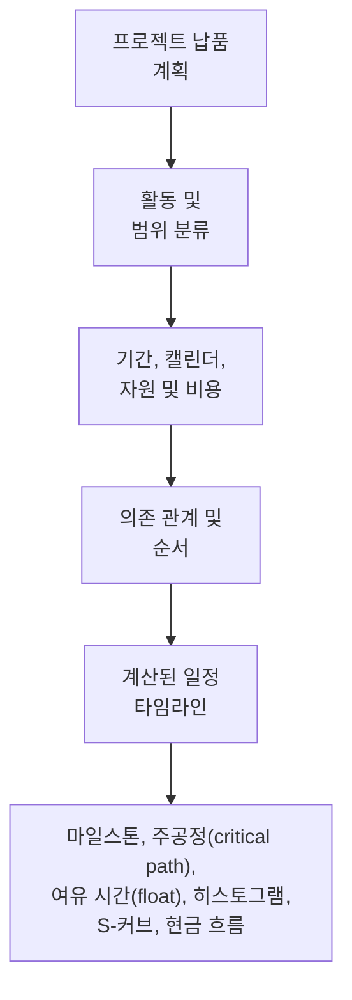

프로젝트 일정은 단순한 날짜 목록이 아닙니다. 프로젝트 납품 계획을 그래픽과 논리로 표현한 것입니다. 프로젝트가 시작부터 완료까지 어떻게 실행될지, 작업 패키지가 어떻게 연결되는지, 주요 마일스톤이 언제 달성되어야 하는지, 그리고 프로젝트 팀이 의사결정에 어떤 정보를 사용해야 하는지를 설명합니다.

간단히 말해, 일정은 프로젝트 계획을 로드맵으로 변환합니다. 관련된 모든 사람이 무엇을 해야 하는지, 언제 해야 하는지, 누가 책임지는지를 이해할 수 있도록 돕습니다. 프로젝트 관리자, 플래너, 건설 팀, 엔지니어, 조달 담당자, PMO 검토자 모두에게 일정은 조정과 통제의 주요 도구가 됩니다.

일정은 타임라인이지만, 타임라인만은 아닙니다. 취약한 일정은 날짜를 보여줄 수 있습니다. 강력한 일정은 그 날짜가 왜 신뢰할 수 있는지를 설명합니다.

## 납품 로드맵으로서의 일정

모든 프로젝트는 의도에서 시작됩니다. 팀은 무엇을 납품해야 하는지 알고 있습니다: 건물, 시설, 산업 시스템, 셧다운, 인프라 자산, 또는 작업 패키지. 그러나 납품은 최종 목표를 아는 것만으로는 충분하지 않습니다. 팀은 순서를 이해해야 합니다.

무엇이 먼저인가? 무엇이 병렬로 진행될 수 있는가? 설계 승인, 자재 납품, 접근권, 허가 획득, 테스트, 인계(handover)를 기다려야 하는 것은 무엇인가? 어떤 활동이 완료 날짜를 결정하는가? 어떤 마일스톤이 고객에게 가장 중요한가?

일정은 계획을 활동, 기간, 의존 관계(dependencies), 캘린더, 자원, 비용, 마일스톤으로 변환함으로써 이러한 질문들에 답합니다.

그래픽 타임라인은 사람들이 작업을 볼 수 있게 해주어 유용합니다. 로직 네트워크는 소프트웨어가 작업을 계산할 수 있게 해주어 유용합니다. 함께, 이들은 일정이 커뮤니케이션 도구이자 통제 도구가 될 수 있게 합니다.

## 일정을 구성하는 요소

일정은 이를 구성하는 데 사용된 정보만큼만 신뢰할 수 있습니다. Primavera P6에서 일정은 여러 주요 입력 값으로 구성됩니다.

첫 번째 입력 값은 활동 목록입니다. 활동은 프로젝트를 관리 가능한 작업 단위로 분류합니다. 각 활동은 계획, 현황 파악, 측정이 가능할 만큼 명확해야 합니다.

두 번째 입력 값은 확정적 기간(deterministic duration)입니다. 이것은 각 활동을 완료하는 데 필요한 계획된 작업 시간입니다. 기간은 실행 방법, 생산성 가정, 인원 규모, 접근권, 작업 현장 제약 조건, 프로젝트 조건을 반영해야 합니다.

세 번째 입력 값은 의존 관계 로직(dependency logic)입니다. 의존 관계는 활동들이 서로 어떻게 연관되는지를 설명합니다. 한 활동이 다른 활동이 시작되기 전에 완료되어야 할 수 있습니다. 두 활동이 함께 시작될 수 있습니다. 두 완료 날짜가 맞춰져야 할 수 있습니다. 이러한 관계들이 CPM 네트워크를 만듭니다.

네 번째 입력 값은 순서(sequencing)입니다. 순서는 실행의 실제 순서입니다. 시공성(constructability), 설계 흐름, 조달 타이밍, 접근권, 시운전 로직, 인계 전략, 고객 우선순위를 고려합니다.

다섯 번째 입력 값은 자원과 비용입니다. 자원 부하(resource loading)는 일정이 시간에 따른 인력, 장비, 자재 수요를 보여줄 수 있게 합니다. 비용 부하(cost loading)는 일정이 현금 흐름, 획득 가치(earned value), 재무 예측을 지원할 수 있게 합니다.

이러한 입력 값들이 완전하고 현실적일 때, 일정은 유용한 출력 값을 생성할 수 있습니다.

## 일정이 알려주는 것

잘 구성된 일정은 프로젝트의 전체 기간을 알려줍니다. 계획된 완료 마일스톤과 중간 납품물을 보여줍니다. 인력 또는 장비 수요가 언제 증가하고 감소하는지를 보여주는 자원 히스토그램을 생성합니다. 진행 S-커브, 현금 흐름 S-커브, 획득 가치 보고, 단기 계획 수립을 지원합니다.

가장 중요하게, 주공정(critical path) 또는 최장 경로(longest path)를 식별합니다. 이것은 프로젝트 완료를 결정하는 작업의 연쇄입니다. 해당 경로의 활동이 지연되면, 프로젝트 완료 날짜도 지연될 수 있습니다. 이것이 로직이 그토록 중요한 이유입니다. 좋은 의존 관계가 없다면, 주공정이 프로젝트의 실제 결정 요인을 보여주지 못할 수 있습니다.

여유 시간(float)도 중요한 출력 값입니다. 여유 시간은 활동이 다른 활동이나 프로젝트 완료에 영향을 미치기 전까지 얼마나 유연성을 가지는지를 알려줍니다. 그러나 여유 시간은 일정 네트워크가 완전할 때만 의미가 있습니다. 활동에 로직이 누락되어 있으면, 여유 시간이 실제보다 좋거나 나빠 보일 수 있습니다.

## 로직이 타임라인을 신뢰할 수 있게 하는 이유

여기서 "데이터 기준일(Data Date)에 구동 로직 없이 시작되는 활동" 지표가 중요해집니다.

P6의 데이터 기준일(Data Date)은 실제 실적과 예측 사이의 경계입니다. 데이터 기준일 이전의 모든 것은 이미 발생한 것을 나타내야 합니다. 데이터 기준일 이후의 모든 것은 지금부터의 계획을 나타내야 합니다.

활동이 데이터 기준일에 정확히 시작되면서 이를 구동하는 로직이 없으면, 일정은 경고 신호를 보내는 것입니다. 작업이 즉시 시작될 준비가 된 것처럼 보일 수 있지만, 일정은 왜 그런지 설명하지 못할 수 있습니다. 해당 구역이 접근 가능하다는 것을 보여주는 선행 활동(predecessor)이 없거나, 자재 납품에 대한 연결이 없거나, 설계 승인에 대한 연결이 없거나, 검사 승인에 대한 연결이 없거나, 이전 작업으로부터의 로직이 없을 수 있습니다.

이것이 중요한 이유는 일정이 단순히 날짜에 작업을 배치해서는 안 되기 때문입니다. 그 날짜까지의 경로를 설명해야 합니다.

활동이 모든 필수 선행 작업이 완료되고 로직이 시작을 지원하기 때문에 데이터 기준일에 시작된다면, 그 날짜는 방어 가능합니다. 활동이 열려 있고, 구동되지 않거나, 제약이 걸려 있거나, 업데이트가 제대로 이루어지지 않아 그 날짜에 시작된다면, 그 날짜는 취약합니다. 실제 가능 조건이 모델링되지 않았을 때 프로젝트 팀은 작업이 준비되었다고 믿을 수 있습니다.

## 실제 예시

데이터 기준일이 6월 1일인 프로젝트 일정을 상상해 보십시오. 업데이트 후, 여러 활동이 6월 1일에 시작됩니다:

- B 구역 케이블 트레이 설치.
- 파이프 압력 테스트 시작.
- 장비 얼라인먼트 시작.
- 단열 인력 투입.

처음 보기에, 단기 작업 계획(lookahead)은 바쁘고 준비된 것처럼 보입니다. 그러나 일정 담당자가 로직을 검토하면, 문제가 명확해집니다. 케이블 트레이 설치는 자재 납품과 연결되지 않았습니다. 압력 테스트는 배관 완료와 연결되지 않았습니다. 장비 얼라인먼트는 기계 완료에 대한 선행 활동이 누락되었습니다. 단열 인력 투입에는 접근 승인 선행 활동이 없습니다.

일정은 데이터 기준일에 작업을 보여주고 있지만, 작업이 왜 시작될 수 있는지는 설명하지 않습니다. 이것은 신뢰할 수 있는 로드맵이 아닙니다. 단기 의도의 목록입니다.

해결책은 실제 CPM 로직을 추가하거나 수정하는 것입니다. 자재 납품이 케이블 트레이 설치를 결정한다면, 연결하십시오. 배관 완료가 압력 테스트를 결정한다면, 연결하십시오. 접근 승인이 단열을 결정한다면, 그 조건을 모델링하십시오. 재계산 후, 일부 활동은 여전히 데이터 기준일 근처에서 시작될 수 있지만, 이제 일정은 왜 그런지 설명할 수 있습니다.

## 좋은 일정이 해야 할 일

좋은 일정은 팀이 계획을 보고, 테스트하고, 관리할 수 있도록 도와야 합니다.

무엇을 해야 하는지 보여주어야 합니다. 작업 순서를 설명해야 합니다. 누가 언제 행동해야 하는지 식별해야 합니다. 주공정을 드러내야 합니다. 자원 계획, 진행 측정, 현금 흐름 예측, PMO 보고를 지원해야 합니다.

또한 취약한 부분을 가시화해야 합니다. 누락된 로직, 강제 제약(hard constraints), 오래된 날짜, 열린 시작(open starts), 열린 완료(open finishes), 데이터 기준일에 집중되는 활동들은 단순한 기술적 문제가 아닙니다. 이들은 프로젝트 팀이 준비 상태, 위험, 통제를 이해하는 방식에 영향을 미칩니다.

## 결론

일정은 시간, 로직, 측정 가능한 작업으로 표현된 프로젝트 납품 계획입니다. 로드맵이자, 계산 모델이자, 커뮤니케이션 도구입니다.

잘 구성되면, 프로젝트 팀에게 무엇이 언제 일어나야 하는지, 그리고 왜 날짜를 신뢰할 수 있는지를 알려줍니다. 활동이 구동 로직 없이 데이터 기준일에 시작될 때, 그 신뢰성은 약해집니다. 일정이 계획을 설명하는 것을 멈추고 다음 단계를 추측하기 시작합니다.

그런 이유로, 일정 품질 검토는 항상 간단한 질문을 해야 합니다: 일정이 왜 작업이 시작될 때 시작되는지를 설명하는가? 답이 그렇다면, 일정은 제 역할을 하고 있습니다. 답이 아니라면, 신뢰받기 전에 로드맵에 더 많은 로직이 필요합니다.
