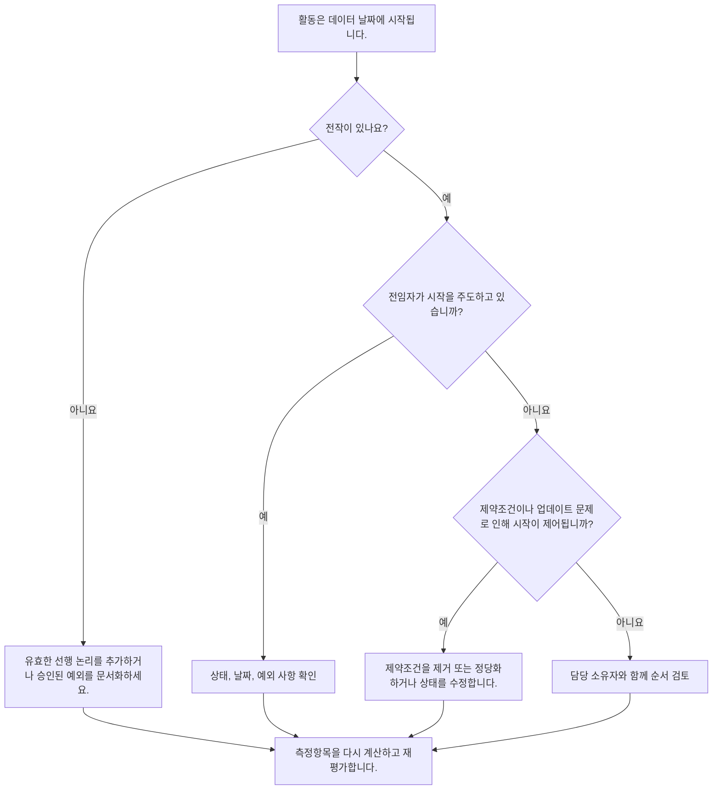

# 주도 로직 없이 데이터 날짜에 시작하는 활동 - 개선 가이드

## 목적

이 가이드는 스케줄러와 프로젝트 통제 팀이 시작을 주도하는 유효한 이전 논리 없이 Primavera P6 데이터 날짜에 시작하도록 예약된 활동을 줄이거나 제거하는 데 도움이 됩니다. 이는 공정표 품질 검토, PMO 상태 확인 및 업데이트 주기 검증에 적용됩니다.

목표는 명확한 CPM 논리로 단기 작업이 지원되고, 관계 누락, 제약조건, 수동 날짜 또는 불완전한 진행 업데이트로 인해 활동이 데이터 날짜에만 시작되지 않는지 확인하는 것입니다.

## 시작하기 전에

조치를 취하기 전에 다음 정보를 수집하십시오.

- 이 측정항목에 대한 현재 평가 결과입니다.
- 최신 공정표 계산에 사용된 프로젝트 데이터 날짜입니다.
- 시작 날짜가 데이터 날짜와 동일한 진행 중이거나 시작되지 않은 활동 목록입니다.
- 각 활동에 대한 전임자 및 후임자 관계 세부정보입니다.
- 제약조건, 예상 날짜, 실제 일자 및 달력 할당.
- 관련되는 경우 유지된 논리 또는 진행률 재정의 설정을 포함하여 업데이트에 사용되는 P6 예약 옵션입니다.
- 프로젝트 시작 활동, 외부 인터페이스 이정표 또는 소유자 지시 시작과 같은 승인된 예외입니다.

## 결과 이해

강력한 결과는 주도 선행 로직 없이 데이터 날짜부터 시작되는 해결되지 않은 활동이 없다는 것입니다. 이는 현재 및 단기 작업이 일정 네트워크에 연결되어 있고 데이터 날짜가 누락된 순서를 숨기지 않는다는 것을 의미합니다.

허용 가능한 결과에는 문서화된 소수의 예외가 포함될 수 있습니다. 이러한 사항은 무시되어서는 안 되며 검토 및 승인되어야 합니다. 예를 들어, 진행 통지 마일스톤이나 외부에서 승인된 활동에는 일반적인 전임자가 필요하지 않을 수 있지만 그 이유는 검토자가 볼 수 있어야 합니다.

결과가 약하다는 것은 명확한 논리적 동인 없이 데이터 날짜에 여러 활동이 시작된다는 의미입니다. 이는 개방형 시작, 선행자 관계 누락, 과도한 제약, 불완전한 진행 업데이트 또는 최신 업데이트 이후 적절하게 순서가 다시 지정되지 않은 활동을 나타낼 수 있습니다.

## 개선목표

목표는 데이터 날짜부터 유효한 주도 로직 없이 해결되지 않은 활동 0개입니다.

개선 목표는 횟수를 줄이는 것만이 아닙니다. 더 깊은 목표는 데이터 날짜 근처의 각 활동에 예측 시작에 대한 방어 가능한 이유가 있는지 확인하는 것입니다. 수정 후 영향을 받는 각 활동에는 적절한 선행 논리, 문서화된 예외 또는 수정된 상태/날짜 조건이 있어야 합니다.

## 실천 계획

### 1단계: 주요 문제 식별

데이터 날짜와 동일한 시작 날짜를 사용하여 열려 있거나 시작되지 않은 활동을 필터링하는 P6 레이아웃 또는 보고서를 만듭니다. 가능한 경우 활동 ID, 활동 이름, WBS, 시작, 완료, 상태, 총 부동액, 달력, 주요 제약조건, 선행자, 후임자 및 주도 관계 표시기에 대한 열을 포함합니다.

각 활동을 검토하고 질문하십시오.

- 활동에 선행 작업이 있습니까?
- 전임자가 존재한다면 실제로 그들이 시작을 주도하고 있습니까?
- 제약으로 인해 활동이 보류되거나 이동되고 있습니까?
- 활동에 실제 시작 또는 진행 업데이트가 누락되어 있습니까?
- 활동이 프로젝트 시작 마일스톤과 같은 유효한 예외인가요?
- 활동이 일반적으로 논리가 약한 WBS 영역에 속합니까?

조사 결과를 실제 원인(전임자 누락, 비주도 선행작업, 제약조건 또는 예상 날짜, 업데이트/상태 오류 또는 승인된 예외)으로 그룹화합니다.

### 2단계: 권장 수정사항 적용

누락되었거나 약한 논리로 시작하세요. 적절한 경우 완료에서 시작, 시작에서 시작 또는 완료에서 완료 관계와 같은 작업의 실제 순서를 나타내는 유효한 선행자 관계를 추가합니다. 메트릭을 충족하기 위해서만 관계를 추가하지 마십시오. 각 관계는 실제 건설, 엔지니어링, 조달, 접근, 승인 또는 인계 종속성을 반영해야 합니다.

다음으로 제약조건을 검토하세요. 시작 제약으로 인해 데이터 날짜에 활동이 시작되는 경우 제약이 계약상으로나 운영상으로 정당한지 확인하십시오. 불필요한 제약조건을 제거하고 활동이 로직에 따라 일정이 계산되도록 허용합니다. 제약조건이 유효한 경우 이유를 문서화하고 주요 경로가 왜곡되지 않는지 확인합니다.

진행상태를 확인하세요. 작업이 이미 시작된 경우 실제 시작 및 잔여 기간을 올바르게 업데이트하세요. 작업이 시작되지 않은 경우 예측 시작이 데이터 날짜로 유지되어야 하는지 확인합니다. 단순히 업데이트 주기로 인해 활동이 현재 날짜로 당겨졌다고 해서 활동을 시작할 준비가 된 것으로 나타나서는 안 됩니다.

변경 후에는 공정표를 다시 계산하고 영향을 받은 활동을 다시 검토하세요. 이제 시작 날짜가 논리에 따라 결정되고, 올바르게 상태가 지정되거나, 승인된 예외로 문서화되는지 확인하세요.

### 3단계: 일반적인 차단 요소 제거

일반적인 방해 요소로는 불분명한 현장 피드백, 인터페이스 정보 누락, 단기 작업을 준비된 것처럼 보이게 만들어야 한다는 압력 등이 있습니다. 분야 리더, 건설 관리자, 조달 소유자 또는 패키지 관리자와 함께 영향을 받는 활동을 검토하여 이 문제를 해결하십시오.

또 다른 일반적인 방해 요소는 논리 대신 제약조건을 오용하는 것입니다. 어떤 경우에는 제약이 필요할 수 있지만 일정 네트워크를 대체해서는 안 됩니다. 제약조건이 유지되는 경우 해당 제약조건이 존재하는 이유와 이것이 여유시간 및 가장 긴 경로에 어떤 영향을 미치는지 문서화하세요.

또한 공정표 계산 설정이나 업데이트 관행으로 인해 문제가 발생하는지 확인하세요. 진행률 재정의, 유지된 논리, 순서가 잘못된 진행 또는 불완전한 실현이 결과에 영향을 미치는 경우 메트릭을 재평가하기 전에 업데이트 방법을 프로젝트 통제 절차에 맞추십시오.

### 4단계: 변경 사항 확인

다음 평가 전에 수정된 일정을 확인하세요. 주도 로직 없이 데이터 날짜에 시작되는 진행 중이거나 시작되지 않은 활동에 대한 필터를 다시 실행합니다. 나머지 각 항목이 승인된 예외로 수정되거나 문서화되었는지 확인합니다.

재계산 후 총 부동, 최장 경로 및 단기 예측 활동을 검토합니다. 논리 수정으로 인해 중요한 경로가 변경되거나 추가적인 순서 문제가 드러날 수 있습니다. 일정 이동이 중요한 경우 프로젝트 통제 책임자 또는 PMO 검토자에게 영향을 전달합니다.

## 개선 일정

### 1일차: 검토 및 진단

메트릭을 실행하고 데이터 날짜를 확인한 후 활동 목록을 생성합니다. 결과를 누락된 논리, 비주도 로직, 제약조건, 상태 오류 및 잠재적인 예외로 구분합니다.

### 2~3일: 우선순위 조치 구현

가장 큰 영향을 미치는 활동, 특히 중요하거나 거의 임계에 가까운 활동을 먼저 수정합니다. 유효한 선행 논리를 추가하고, 불필요한 제약조건을 제거하고, 잘못된 상태를 업데이트하고, 예외를 문서화하세요.

### 4~5일차: 초기 결과 모니터링

공정표를 다시 계산하고 영향을 받는 활동이 이제 논리 기반인지 검토합니다. 총 부동, 최장 경로 및 마일스톤 날짜에 대한 예기치 않은 변경 사항을 확인하세요.

### 6일차: 최종 조정

책임 있는 분야 또는 패키지 소유자와 함께 남아 있는 방해 요소를 해결하십시오. 유지된 예외가 정당하고 명확하게 문서화되었는지 확인하십시오.

### 7일차: 재평가 및 비교

평가를 다시 실행하고 새 결과를 이전 결과 및 목표 임계값과 비교합니다. 현재 측정항목이 해결되지 않은 활동이 0인지 또는 추가 조치가 필요한지 확인하세요.

## 진행 상황 추적

간단한 추적기를 사용하여 수정 및 승인을 관리하세요.

| 날짜 | 취해진 조치 | 기대효과 | 결과/관찰 | 다음 단계 |
| --- | --- | --- | --- | --- |
| [날짜] | 주도 로직 없이 데이터 날짜부터 시작되는 활동을 검토했습니다. | 누락되거나 약한 논리 식별 | [관찰 결과] | 책임 있는 소유자에게 수정 사항 할당 |
| [날짜] | 유효한 전임자 관계가 추가되었습니다. | CPM 순서 개선 | [관찰 결과] | 여유시간 영향 재계산 및 검토 |
| [날짜] | 제거되거나 정당화된 제약조건 | 인위적인 시작을 줄입니다 | [관찰 결과] | 나머지 예외 확인 |
| [날짜] | 잘못된 활동 상태가 업데이트되었습니다. | 업데이트 정확도 향상 | [관찰 결과] | 평가 재실행 |

## 결과가 개선되지 않는 경우

결과가 개선되지 않으면 동일한 활동이 여전히 실패하고 있는지 또는 데이터 날짜에 새로운 활동이 나타나는지 검토하십시오. 반복되는 실패는 WBS 영역의 불완전한 논리, 약한 업데이트 규칙 또는 일관되지 않은 제약조건 사용과 같은 광범위한 공정표 개발 문제를 나타낼 수 있습니다.

지속적인 문제를 프로젝트 통제 책임자, 계획 관리자 또는 PMO 검토자에게 에스컬레이션하세요. 주요 일정의 경우 영향을 받는 작업 패키지에 대한 집중적인 논리 검토 워크숍을 고려하세요. 일정이 계약 보고, 지연 분석 또는 획득가치 예측에 사용되는 경우 해결되지 않은 항목은 품질 문제로 처리되어야 합니다.

## 유지

일정을 발행하기 전에 모든 업데이트 주기 동안 이 측정항목을 검토하세요. 점검은 특히 진행 업데이트, 순서 재지정, 주요 범위 변경 또는 복구 계획 이후 표준 일정 상태 검토의 일부여야 합니다.

좋은 유지 관리 습관에는 P6 레이아웃에 선행 및 후속 열이 표시되도록 유지하고, 각 제출 전에 열린 시작을 검토하고, 승인된 예외를 문서화하고, 데이터 날짜 이동으로 인해 주도되지 않는 새로운 활동 그룹이 생성되지 않는지 확인하는 것이 포함됩니다.

## 요약 체크리스트

- [ ] 현재 결과가 검토되었습니다.
- [ ] 목표 임계값 확인됨
- [ ] 데이터 날짜 확인
- [ ] 식별된 데이터 날짜에 시작되는 활동
- [ ] 확인된 주요 문제
- [ ] 누락되거나 약한 논리가 수정되었습니다.
- [ ] 제약조건을 검토하고 정당화하거나 제거했습니다.
- [ ] 확인된 상태 날짜
- [ ] 승인된 예외 사항이 문서화됨
- [ ] 일정이 다시 계산되었습니다.
- [ ] 모니터링된 결과
- [ ] 평가가 반복됨
- [ ] 문서화된 다음 단계
## 관련 콘텐츠
- [주도 로직 없이 데이터 날짜에 시작하는 활동: 이 일정 지표가 중요한 이유 - 개요](01_overview_template.md)
- [블로그 템플릿](03_blog_template.md)
- [일정이란 무엇입니까?](../../10b_blogs_ko/01_WHAT%20A%20SCHEDULE%20IS/01_blog.md)
- [견고한 논리](../../10b_blogs_ko/02_ROBUST%20LOGIC/02_ROBUST%20LOGIC.md)
