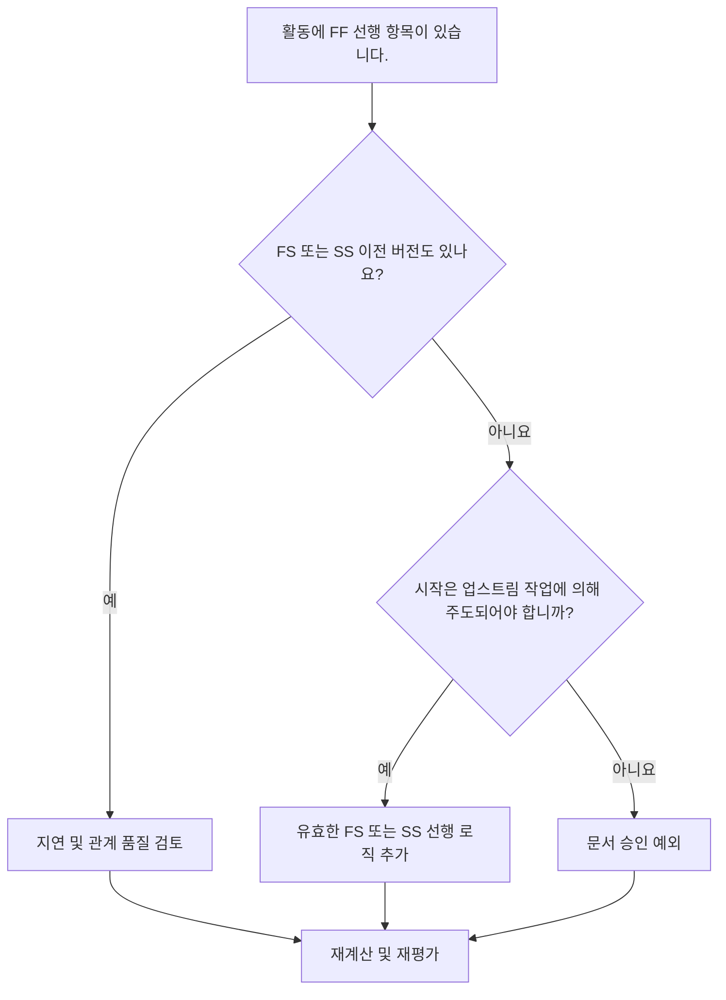

# FF 전임자가 있고 FS 또는 SS 전임자가 없는 활동 - 개선 가이드

## 목적

이 가이드는 스케줄러가 완료-완료 선행 항목은 있지만 완료-시작 또는 시작-시작 선행 항목은 없는 활동을 검토하고 수정하는 데 도움이 됩니다. 활동 종료뿐만 아니라 시작이 업스트림 일정 네트워크에 연결되어 있는지 확인하여 더 강력한 CPM 로직을 지원합니다.

## 시작하기 전에

조치를 취하기 전에 다음 정보를 수집하십시오.

- 이 측정항목에 대한 현재 평가 결과입니다.
- FF 선행 작업은 있고 FS 또는 SS 선행 작업은 없는 활동 목록입니다.
- 각 활동에 대한 전임자 관계 세부정보입니다.
- 활동 유형, 기간, 상태, 달력, 총 여유시간 및 WBS.
- 활동이나 이전 작업에 영향을 미치는 지연, 제약 또는 예상 날짜.
- 관련 건설, 엔지니어링, 조달, 접근, 승인 또는 인계 순서 정보.

## 결과 이해

이 조건에서는 해결되지 않은 활동이 0이라는 것이 강력한 결과입니다. 이는 완료가 이전 작업과 연결된 활동에도 필요한 경우 유효한 시작-주도 로직가 있음을 의미합니다.

수용 가능한 결과에는 작업 수준 활동, 관리 활동 또는 시작 논리가 필요하지 않은 의도적으로 모델링된 병렬 작업과 같은 문서화된 예외가 포함될 수 있습니다. 이는 타당하다고 가정하기보다는 검토되어야 합니다.

약한 결과는 이전 작업과 관련하여 여러 활동이 완료될 수 있지만 시작은 업스트림 작업에 의해 제어되지 않음을 의미합니다. 이를 통해 실제 시퀀스가 ​​지원하는 것보다 먼저 활동을 시작할 수 있습니다.

## 개선목표

목표는 FF 선행 작업이 있고 FS 또는 SS 선행 작업이 없는 해결되지 않은 활동이 0개입니다.

목표는 각 활동에 시작이 업스트림 작업에 따라 달라지는 현실적인 시작 주도 선행작업가 있는지 확인하거나 시작 논리의 부족이 정당화되고 문서화되었는지 확인하는 것입니다.

## 실천 계획

### 1단계: 주요 문제 식별

FF 선행자가 하나 이상 있고 FS 또는 SS 선행자가 없는 활동을 나열하는 P6 레이아웃 또는 내보내기를 만듭니다. 활동 ID, 활동 이름, WBS, 원래 기간, 잔여 기간, 총 부동, 선행자, 관계 유형, 지연, 제약조건 및 활동 상태를 포함합니다.

각 활동을 검토하고 질문하십시오.

- 이 활동을 시작하려면 먼저 어떤 일이 일어나야 합니까?
- FF 이전 제품은 마감 정렬만 제어합니까?
- FS 또는 SS 전임자가 누락되었습니까?
- FF 관계가 중복 작업을 올바르게 모델링하는 데 사용되고 있습니까?
- 노력 수준이나 지원 활동과 같은 활동이 유효한 예외입니까?

### 2단계: 권장 수정사항 적용

활동 시작이 이전 작업에 따라 달라지는 시작 주도 로직를 추가합니다. 선행 작업이 완료될 때까지 활동을 시작할 수 없는 경우 FS를 사용합니다. 선행 작업이 시작되거나 정의된 진행 지점에 도달한 후 활동을 시작할 수 있는 경우 SS를 사용합니다.

지연이 있는 FF 관계를 검토합니다. 지연이 시작 종속성을 근사화하는 데 사용되는 경우 더 명확한 FS 또는 SS 로직으로 대체하거나 보완하십시오. 메트릭을 충족하기 위해서만 관계를 추가하지 마십시오. 각 관계는 실제 작업 순서를 반영해야 합니다.

활동이 유효한 예외인 경우 노트북 주제, UDF, 설명 필드 또는 공정표 품질 추적기에 이유를 문서화합니다.

### 3단계: 일반적인 차단 요소 제거

일반적인 방해 요소로는 이전 일정에서 복사된 논리, FF 관계의 남용, 불명확한 액세스 또는 릴리스 지점, 현장 또는 분야 책임자의 입력 누락 등이 있습니다. 담당 소유자와 함께 실제 시작 조건을 검토하여 이 문제를 해결하십시오.

또 다른 장애물은 두 활동을 함께 완료해야 할 때 FF 논리로 충분하다는 믿음입니다. 마무리 정렬은 유효할 수 있지만 후속 활동에는 여전히 명확한 시작 조건이 필요한 경우가 많습니다.

### 4단계: 변경 사항 확인

수정 후 공정표를 다시 계산합니다. 측정항목을 다시 실행하고 남은 각 활동이 수정되었거나 승인된 예외로 문서화되었는지 확인하세요.

초기 날짜, 총 여유 공간, 주요 경로, 가장 긴 경로 및 단기 이정표에 대한 영향을 검토합니다. 시작 논리를 추가하면 주요 날짜가 변경되는 경우 결과를 프로젝트 통제 책임자 또는 PMO 검토자에게 전달하세요.

## 개선 일정

### 1일차: 검토 및 진단

메트릭을 실행하고, 영향을 받는 활동 목록을 확인하고, 활동을 누락된 시작 로직, 약한 FF 로직, 지연 문제 및 가능한 예외로 분리합니다.

### 2~3일: 우선순위 조치 구현

중요하고 거의 중요한 활동을 먼저 수정하세요. 유효한 FS 또는 SS 선행 항목을 추가하고, 부적절한 FF 논리를 조정하고, 정당한 예외를 문서화하세요.

### 4~5일차: 초기 결과 모니터링

공정표를 다시 계산하고 초기 날짜, 여유시간, 가장 긴 경로 및 마일스톤 날짜의 이동을 검토합니다.

### 6일차: 최종 조정

책임 있는 분야, 패키지 소유자 또는 건설 책임자와 함께 나머지 불확실한 항목을 해결하십시오.

### 7일차: 재평가 및 비교

평가를 다시 실행하고 결과를 목표 임계값과 비교합니다.

## 진행 상황 추적

간단한 추적기를 사용하여 수정 및 승인을 관리하세요.

| 날짜 | 취해진 조치 | 기대효과 | 결과/관찰 | 다음 단계 |
| --- | --- | --- | --- | --- |
| [날짜] | FF 전용 선행 활동 검토 | 누락된 시작 논리 식별 | [관찰 결과] | 수정 할당 |
| [날짜] | FS 또는 SS 이전 로직 추가 | CPM 연속성 개선 | [관찰 결과] | 일정 재계산 |
| [날짜] | 문서화된 유효한 예외 | 리뷰 추적성 향상 | [관찰 결과] | 측정항목 재평가 |

## 결과가 개선되지 않는 경우

결과가 개선되지 않으면 필터가 네트워크 개발이 취약한 특정 WBS 영역에서 유효한 예외, 중복 논리 또는 활동을 식별하고 있는지 확인하십시오. 반복되는 문제는 팀이 계획 중에 FF 관계에 너무 많이 의존하고 있음을 나타낼 수 있습니다.

해결되지 않은 항목이 중요, 거의 중요, 계약, 액세스 관련 또는 인계 관련 작업에 영향을 미치는 경우 계획 책임자 또는 PMO 검토자에게 에스컬레이션합니다.

## 유지

각 공정표 업데이트 동안과 기준 승인 전에 이 측정항목을 검토하세요. 순서 재지정, 복구 계획, 공정표 개발 복사 또는 주요 범위 변경 후에는 특별한 주의를 기울이십시오.

## 요약 체크리스트

- [ ] 현재 결과가 검토되었습니다.
- [ ] 목표 임계값 확인됨
- [ ] 확인된 주요 문제
- [ ] FF 전임자 검토
- [ ] 누락된 FS 또는 SS 로직이 수정되었습니다.
- [ ] 지연 및 제약조건 확인
- [ ] 문서화된 유효한 예외
- [ ] 일정이 다시 계산되었습니다.
- [ ] 모니터링된 결과
- [ ] 평가가 반복됨
- [ ] 문서화된 다음 단계
## 관련 콘텐츠
- [FF 전임자가 있고 FS 또는 SS 전임자가 없는 활동 - 개요](01_overview_template.md)
- [블로그 템플릿](03_blog_template.md)
- [일정이란 무엇입니까?](../../10b_blogs_ko/01_WHAT%20A%20SCHEDULE%20IS/01_blog.md)
- [견고한 논리](../../10b_blogs_ko/02_ROBUST%20LOGIC/02_ROBUST%20LOGIC.md)
