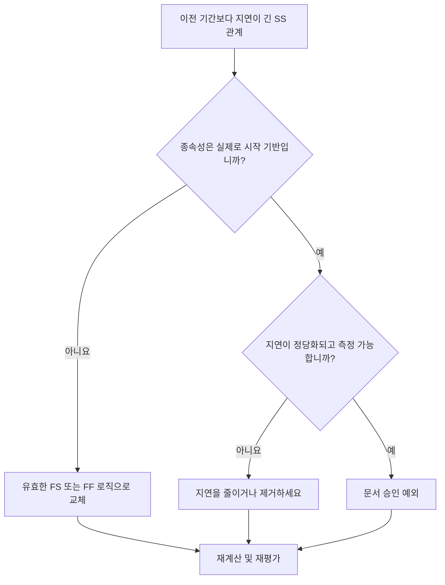

## 목적

이 가이드는 스케줄러가 지연 시간이 이전 활동 기간보다 긴 시작-시작 관계를 검토하고 수정하는 데 도움이 됩니다. 과도한 SS 지연을 실제 작업 순서를 더 잘 나타내는 관계 논리로 대체하여 보다 명확한 CPM 논리를 지원합니다.

## 시작하기 전에

조치를 취하기 전에 다음 정보를 수집하십시오.

- 이 측정항목에 대한 현재 평가 결과입니다.
- 지연이 선행 기간보다 긴 SS 관계 목록입니다.
- 선행자 및 후임자 활동 ID, 이름, WBS, 기간, 달력 및 상태.
- 관계 지연, 관계 유형 및 관련 제약조건.
- 지연에 사용되는 공정표 계산 설정 및 달력 기준입니다.
- 의도된 종속성을 설명하는 현장, 엔지니어링, 조달 또는 인계 논리.

## 결과 이해

강력한 결과는 지연이 선행 기간을 초과하는 해결되지 않은 SS 관계가 없다는 것입니다.

허용 가능한 결과에는 문서화된 예외가 포함될 수 있지만 이러한 경우는 드뭅니다. 긴 SS 지연은 종종 관계 유형이 모델링되는 종속성과 일치하지 않음을 나타냅니다.

약한 결과는 일정에 이전 기간보다 긴 지연 후에만 후속 작업이 시작되는 여러 시작-시작 링크가 포함되어 있음을 의미합니다. 이는 SS 관계 뒤에 마무리 중심 논리를 숨길 수 있습니다.

## 개선목표

목표는 선행 기간보다 지연 시간이 긴 해결되지 않은 SS 관계가 0개입니다.

목표는 각 관계가 SS를 유지해야 하는지, FS 또는 FF 로직으로 변환되어야 하는지, 지연이 줄어들어야 하는지, 아니면 유효한 예외로 문서화되어야 하는지 확인하는 것입니다.

## 실천 계획

### 1단계: 주요 문제 식별

지연이 이전 기간보다 긴 SS 관계를 나열하는 P6 레이아웃 또는 내보내기를 만듭니다. 선행자 및 후속자 활동 ID, 활동 이름, WBS, 원래 기간, 잔여 기간, 관계 유형, 지연, 일정, 총 부동 및 활동 상태를 포함합니다.

각 관계를 검토하고 질문하십시오.

- 왜 이렇게 오랜 지연 끝에 후임자가 시작되는 걸까요?
- 후임자는 실제로 전임자의 시작에 의존합니까, 아니면 전임자의 마무리에 의존합니까?
- 지연 시간이 이전 기간의 원래 기간, 잔여 기간 또는 둘 다보다 큽니까?
- 조달, 치료, 검토 시간, 액세스 또는 기타 실제 대기 기간을 모델링하는 데 지연이 사용됩니까?
- FS 또는 FF 관계가 종속성을 더 명확하게 합니까?

### 2단계: 권장 수정사항 적용

선행 작업이 완료된 후 후속 작업을 시작해야 하는 경우 SS 관계를 FS 관계로 바꾸세요. 작업이 겹칠 수 있지만 선행 작업이 완료될 때까지 후속 작업을 완료할 수 없는 경우 FF 논리를 사용합니다.

관계가 실제로 시작 기반인 경우 지연 값을 검토합니다. 대략적인 자리 표시자로 사용되었거나 복사된 논리에서 상속된 과도한 지연을 줄입니다. 지연이 실제 대기 기간을 나타내는 경우 단위, 달력 및 설명이 올바른지 확인하십시오.

일정에 표시되어야 하는 활동을 대신하여 긴 지연을 사용하지 마세요. 지연이 검토, 치료, 전달, 동원 또는 승인 시간을 나타내는 경우 해당 작업을 별도의 활동으로 모델링하는 것을 고려하십시오.

### 3단계: 일반적인 차단 요소 제거

일반적인 방해 요소에는 이전 일정에서 복사된 논리, 숨겨진 대기 기간, 일정 혼란, 네트워크 단순성을 유지하라는 압력 등이 포함됩니다. 책임 있는 소유자와의 의도된 종속성을 확인하여 이 문제를 해결하십시오.

또 다른 차단제는 지연을 무해한 것으로 간주합니다. 긴 지연은 검토하기 어려울 수 있고, 위험을 숨길 수 있으며, 대기 기간이 활동으로 표시되지 않기 때문에 지연 분석을 더 어렵게 만들 수 있습니다.

### 4단계: 변경 사항 확인

수정 후 공정표를 다시 계산합니다. 측정항목을 다시 실행하고 나머지 각 항목이 수정되었거나 승인된 예외로 문서화되었는지 확인하세요.

총 유동량, 최장 경로, 중요 경로 및 단기 이정표를 검토합니다. 관계 변경으로 인해 주요 날짜가 변경되면 결과를 프로젝트 통제 책임자 또는 PMO 검토자에게 전달하세요.

## 개선 일정

### 1일차: 검토 및 진단

메트릭을 실행하고 영향을 받는 관계 목록을 확인한 후 항목을 잘못된 관계 유형, 과도한 지연, 숨겨진 활동, 일정 문제 및 가능한 예외로 구분합니다.

### 2~3일: 우선순위 조치 구현

중요한 관계와 거의 중요한 관계를 먼저 수정하세요. 적절한 경우 SS 논리를 FS 또는 FF로 변환하고, 정당하지 않은 지연을 줄이고, 유효한 예외를 문서화합니다.

### 4~5일차: 초기 결과 모니터링

공정표를 다시 계산하고 부동, 최장 경로 및 마일스톤 날짜의 이동을 검토합니다.

### 6일차: 최종 조정

책임 있는 분야, 패키지 소유자 또는 건설 책임자와 함께 나머지 불확실한 항목을 해결하십시오.

### 7일차: 재평가 및 비교

평가를 다시 실행하고 결과를 목표 임계값과 비교합니다.

## 진행 상황 추적

간단한 추적기를 사용하여 수정 및 승인을 관리하세요.

| 날짜 | 취해진 조치 | 기대효과 | 결과/관찰 | 다음 단계 |
| --- | --- | --- | --- | --- |
| [날짜] | 이전 기간보다 긴 SS 지연을 검토했습니다. | 약하거나 불분명한 논리 식별 | [관찰 결과] | 수정 할당 |
| [날짜] | FS 또는 FF로 관계 전환 | CPM 논리 명확성 향상 | [관찰 결과] | 일정 재계산 |
| [날짜] | 감소되거나 문서화된 지연 | 리뷰 추적성 향상 | [관찰 결과] | 측정항목 재평가 |

## 결과가 개선되지 않는 경우

결과가 개선되지 않으면 특정 WBS 영역, 분야 또는 복사된 일정 섹션에서 동일한 관계 패턴이 반복되는지 확인하십시오. 반복되는 발견은 팀이 실제 종속성을 모델링하는 대신 SS 지연을 표준 지름길로 사용하고 있음을 나타낼 수 있습니다.

해결되지 않은 항목이 중요, 거의 중요, 계약, 조달, 승인 또는 인계 관련 작업에 영향을 미치는 경우 에스컬레이션합니다.

## 유지

각 공정표 업데이트 동안과 기준 승인 전에 이 측정항목을 검토하세요. 복사된 공정표 개발, 순서 재지정, 복구 계획 또는 주요 범위 변경 후에는 특별한 주의를 기울이십시오.

## 요약 체크리스트

- [ ] 현재 결과가 검토되었습니다.
- [ ] 목표 임계값 확인됨
- [ ] 확인된 주요 문제
- [ ] SS 관계 검토
- [ ] 과도한 지연이 수정되거나 정당화됨
- [ ] 필요한 경우 FS 또는 FF 교체 적용
- [ ] 적절한 경우 숨겨진 작업을 모델링함
- [ ] 일정이 다시 계산되었습니다.
- [ ] 모니터링된 결과
- [ ] 평가가 반복됨
- [ ] 문서화된 다음 단계
## 관련 콘텐츠
- [블로그 템플릿](03_blog_template.md)
- [일정이란 무엇입니까?](../../10b_blogs_ko/01_WHAT%20A%20SCHEDULE%20IS/01_blog.md)
- [견고한 논리](../../10b_blogs_ko/02_ROBUST%20LOGIC/02_ROBUST%20LOGIC.md)
