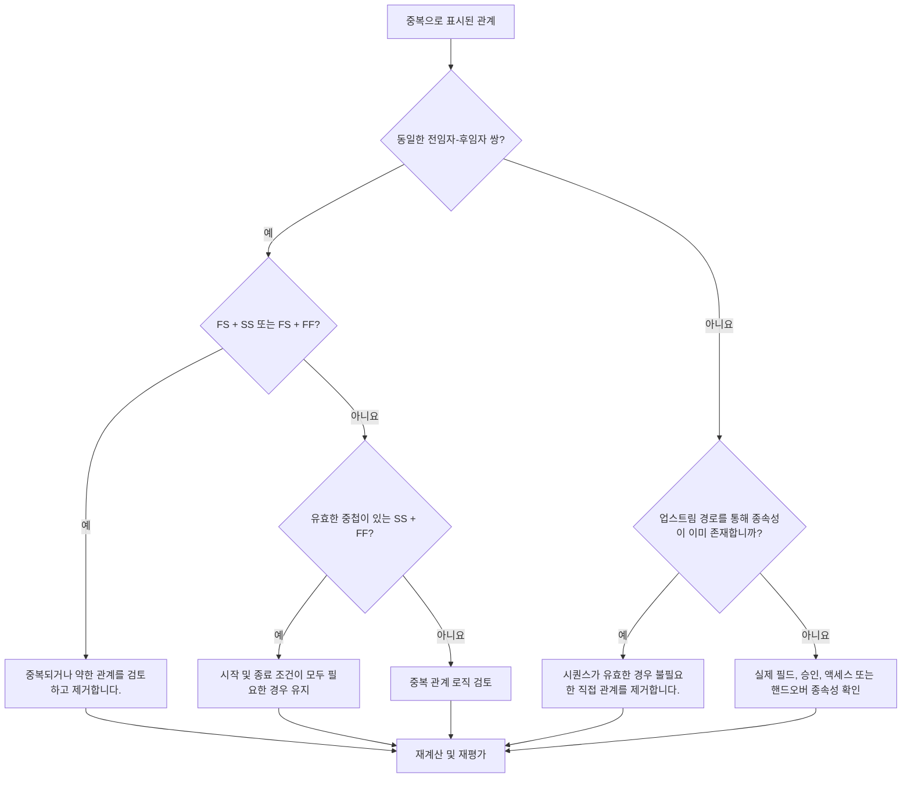

## 목적

이 가이드는 스케줄러가 Primavera P6 공정표에서 중복 논리를 식별하고 제거하는 데 도움이 됩니다. 이는 중복 관계 패턴, 반복되는 선행 논리, 실제 작업 순서를 나타내지 않는 불필요한 종속성에 적용됩니다.

## 시작하기 전에

조치를 취하기 전에 다음 정보를 수집하십시오.

- 이 측정항목에 대한 현재 평가 결과입니다.
- 중복 논리로 플래그가 지정된 활동 및 관계 목록입니다.
- 플래그가 지정된 각 활동에 대한 선행자 및 후속자 세부정보입니다.
- 관계 유형, 시차, 달력, 총 부동 및 주도 관계 표시기.
- WBS, 활동 코드, 규율 또는 작업 패키지 소유권.
- 실제 종속성을 설명하는 현장, 엔지니어링, 조달, 승인 또는 인계 정보입니다.

## 결과 이해

강력한 결과는 해결되지 않은 중복 관계가 없다는 것입니다.

허용 가능한 결과에는 중복된 것처럼 보이는 논리가 방어 가능한 이유로 의도적으로 사용되는 드물게 문서화된 예외가 포함될 수 있습니다. 중복 논리는 일반적으로 공정표 품질 문제이므로 이러한 사례를 주의 깊게 검토해야 합니다.

약한 결과는 일정에 반복되거나 불필요한 관계 논리가 포함되어 있음을 의미합니다. 이는 복사된 일정 섹션이 정리되지 않거나, 기존 경로를 확인하지 않고 관계가 추가되거나, 동일한 활동 간에 여러 종속성 유형이 사용되는 경우 발생할 수 있습니다.

## 개선목표

목표는 해결되지 않은 중복 관계 0개입니다.

목표는 실제 종속성을 나타내는 관계만 유지하고 실제 작업 순서를 복제하거나 마스킹하거나 과장하는 논리를 제거하는 것입니다.

## 실천 계획

### 1단계: 주요 문제 식별

중복될 수 있는 논리를 식별하는 P6 레이아웃, 보고서 또는 외부 관계 검토를 만듭니다. 다음 사례에 중점을 둡니다.

- 동일한 선행자가 동일한 후임자에 두 번 이상 연결되었습니다. 특히 FS + SS 또는 FS + FF입니다.
- 동일한 두 활동 간의 SS + FF는 중첩이 올바르게 모델링되고 시작 및 종료 조건이 모두 중요한 경우 유효할 수 있습니다.
- 자체 전임자와 동일한 전임자 및 관계 유형을 사용하여 체인을 통해 반복적으로 상속된 논리를 생성하는 활동입니다.
- 동일한 종속성이 여러 단계 뒤로 나타나는 더 길고 반복되는 선행 체인입니다.
- 순서, 날짜, 부동, 핸드오버, 액세스 또는 위험 제어를 변경하지 않는 종속성입니다.

표시된 각 관계를 검토하고 다음 사항에 대해 질문하십시오.

- 이 관계가 실제 종속성을 추가합니까?
- 동일한 활동 간의 다른 관계로 종속성이 이미 표시되어 있습니까?
- 종속성이 이미 업스트림 경로로 표시되어 있습니까?
- 관계를 제거하면 유효한 공정표 로직가 변경됩니까, 아니면 네트워크만 단순화됩니까?
- 관계가 날짜를 결정하는 이유는 정당한 이유입니까, 아니면 중복된 논리가 추가되었기 때문입니까?

### 2단계: 권장 수정사항 적용

정확한 중복과 반복되는 선행자-후속자 쌍으로 시작하십시오. 동일한 두 활동이 FS + SS 또는 FS + FF와 연결된 경우 실제 종속성을 나타내는 관계를 결정합니다. 논리를 복제하거나 약화시키는 관계를 제거하십시오.

SS와 FF 쌍을 별도로 검토하세요. 이 조합은 겹치는 작업이 시작될 때 하나의 관계 제어가 시작될 수 있고 작업이 완료될 때 다른 제어가 완료될 때 유효할 수 있습니다. 두 조건이 모두 실제이고 작업 순서에 따라 문서화된 경우에만 보관하십시오.

다음으로 상속된 선행 논리를 검토합니다. 활동 C가 활동 B와 동일한 선행 관계를 갖고 있고 활동 B가 이미 활동 C의 선행 관계인 경우 이전 활동의 직접적인 관계는 불필요할 수 있습니다. 기존 경로를 통해 CPM 순서가 올바르게 유지되면 제거하십시오.

마지막으로 작업 순서, 액세스, 승인, 인계, 위험 제어 또는 계약 논리를 지원하지 않는 불필요한 종속성을 제거합니다.

### 3단계: 일반적인 차단 요소 제거

일반적인 차단에는 이전 일정에서 복사된 논리, 네트워크가 연결된 것처럼 보이게 하기 위한 과도한 모델링, 기존 경로를 확인하지 않고 업데이트하는 동안 관계 추가 등이 포함됩니다.

또 다른 장애물은 관계를 없애면 일정이 약화될 것이라는 두려움입니다. 목표는 유효한 컨트롤을 제거하는 것이 아닙니다. 이는 네트워크에 이미 존재하는 중복 제어 관계를 제거하는 것입니다.

### 4단계: 변경 사항 확인

중복된 로직을 제거하거나 조정한 후 공정표를 다시 계산하세요. 총 부동, 주도 관계, 최장 경로, 주요 경로 및 주요 마일스톤 날짜를 검토합니다.

관계 제거로 인해 날짜가 예기치 않게 변경되는 경우 제거된 링크가 실제로 유효한 종속성을 제공했는지 또는 누락된 다른 관계를 더 정확하게 추가해야 하는지 조사하십시오.

## 개선 일정

### 1일차: 검토 및 진단

지표를 실행하고, 영향을 받은 관계 목록을 확인하고, 결과를 중복 쌍, FS 및 SS/FF 조합, 상속된 선행 논리 및 불필요한 종속성으로 분리합니다.

### 2~3일: 우선순위 조치 구현

중요한 관계와 거의 중요한 관계를 먼저 수정하세요. 정확한 중복을 제거하고, 반복되는 선행 쌍을 정리하고, 유효한 SS와 FF 조합을 문서화합니다.

### 4~5일차: 초기 결과 모니터링

공정표를 다시 계산하고 부동, 최장 경로, 주도 관계 및 마일스톤 날짜의 이동을 검토합니다.

### 6일차: 최종 조정

책임 있는 분야, 패키지 소유자 또는 건설 책임자와 함께 불확실한 항목을 해결하십시오.

### 7일차: 재평가 및 비교

평가를 다시 실행하고 결과를 목표 임계값과 비교합니다.

## 진행 상황 추적

간단한 추적기를 사용하여 수정 및 승인을 관리하세요.

| 날짜 | 취해진 조치 | 기대효과 | 결과/관찰 | 다음 단계 |
| --- | --- | --- | --- | --- |
| [날짜] | 중복 관계 목록을 검토했습니다. | 중복되거나 불필요한 논리 식별 | [관찰 결과] | 수정 할당 |
| [날짜] | 중복 관계 제거됨 | CPM 네트워크 단순화 | [관찰 결과] | 일정 재계산 |
| [날짜] | 문서화된 유효한 예외 | 리뷰 추적성 향상 | [관찰 결과] | 측정항목 재평가 |

## 결과가 개선되지 않는 경우

결과가 개선되지 않으면 특정 WBS 영역, 복사된 프로젝트 섹션, 분야 또는 공정표 업데이트 기간에 중복 논리가 집중되어 있는지 확인하십시오. 반복되는 결과는 관계 정리가 일반적인 일정 작업 흐름의 일부가 아니라는 것을 나타낼 수 있습니다.

중요, 거의 중요, 계약, 액세스, 승인 또는 인계 관련 작업에 영향을 미치는 경우 해결되지 않은 중복 논리를 에스컬레이션하세요.

## 유지

각 공정표 업데이트 동안과 기준 승인 전에 이 측정항목을 검토하세요. 복사된 공정표 개발, 순서 재지정, 복구 계획 또는 대규모 논리 수정 후에는 특별한 주의를 기울이십시오.

## 요약 체크리스트

- [ ] 현재 결과가 검토되었습니다.
- [ ] 목표 임계값 확인됨
- [ ] 확인된 주요 문제
- [ ] 중복된 전임자-후임자 쌍이 검토되었습니다.
- [ ] FS + SS 또는 FS + FF 조합 수정됨
- [ ] 유효한 SS와 FF 조합이 문서화됨
- [ ] 상속된 선행 로직을 검토했습니다.
- [ ] 불필요한 종속성을 제거했습니다.
- [ ] 일정이 다시 계산되었습니다.
- [ ] 모니터링된 결과
- [ ] 평가가 반복됨
- [ ] 문서화된 다음 단계
## 관련 콘텐츠
- [블로그 템플릿](03_blog_template.md)
- [일정이란 무엇입니까?](../../10b_blogs_ko/01_WHAT%20A%20SCHEDULE%20IS/01_blog.md)
- [견고한 논리](../../10b_blogs_ko/02_ROBUST%20LOGIC/02_ROBUST%20LOGIC.md)
