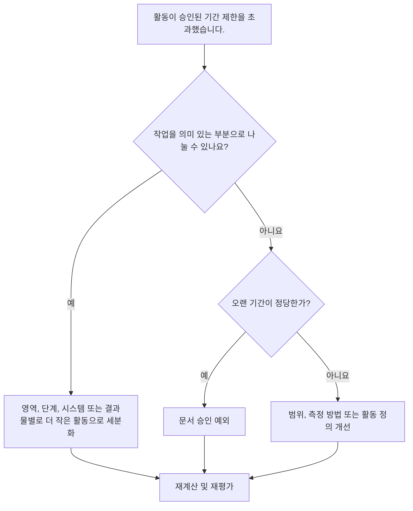

# Primavera P6 공정표 검토의 긴 작업 기간 - 개선 가이드

## 목적

이 가이드는 스케줄러가 승인된 프로젝트 임계값보다 기간이 긴 활동을 검토하고 개선하는 데 도움이 됩니다. 허용되는 기간은 프로젝트 유형, 세부 수준, 보고 주기, 계약 요구 사항 및 장기 활동에 대한 고객 민감도에 따라 다릅니다.

## 시작하기 전에

조치를 취하기 전에 다음 정보를 수집하십시오.

- 이 측정항목에 대한 현재 평가 결과입니다.
- 프로젝트 또는 일정 수준에 대해 승인된 최대 활동 기간.
- 기간 임계값을 초과하는 활동 목록입니다.
- 원래 기간, 잔여 기간, 활동 유형, 상태, WBS, 달력 및 총 여유시간입니다.
- 기준 요구사항, 고객 보고 기대치, PMO 공정표 품질 규칙.
- 예측 계획 기간, 진행 업데이트 주기, 분야 또는 패키지 소유권.
- 조달, 치료, 배송, 검토, 테스트 또는 노력 수준 활동과 같은 정당한 예외.

## 결과 이해

강력한 결과는 승인된 장기 임계값을 초과하는 해결되지 않은 활동이 없다는 것입니다.

허용 가능한 결과에는 문서화된 예외가 포함될 수 있으며, 특히 합리적으로 분류할 수 없거나 의도적으로 요약과 유사한 제어 활동으로 관리되는 활동의 경우 더욱 그렇습니다. 이는 제한되어야 하며 명확하게 정당화되어야 합니다.

약한 결과는 일정에 효과적인 계획과 통제를 하기에는 너무 광범위한 활동이 많이 포함되어 있음을 의미합니다. 이로 인해 진행 상황 가시성이 줄어들고 실제로 일정을 추진하는 작업이 무엇인지 이해하기가 더 어려워질 수 있습니다.

## 개선목표

목표는 승인된 기간 제한을 초과하는 해결되지 않은 활동이 0개입니다.

목표는 긴 활동을 더 나은 제어가 필요한 더 작고 의미 있는 활동으로 분할하는 동시에 긴 기간이 적절한 경우 유효한 예외를 문서화하는 것입니다.

## 실천 계획

### 1단계: 주요 문제 식별

프로젝트에서 정의한 기간 임계값을 초과하는 활동을 나열하는 P6 레이아웃 또는 보고서를 만듭니다. 활동 ID, 활동 이름, WBS, 활동 유형, 원래 기간, 잔여 기간, 시작, 완료, 달력, 총 부동 및 활동 상태를 포함합니다.

각 활동을 검토하고 질문하십시오.

- 활동 기간이 이 프로젝트 유형 및 일정 수준에 대해 승인된 임계값보다 길습니까?
- 활동이 여러 작업 단계, 위치, 시스템, 영역 또는 결과물을 포괄합니까?
- 각 업데이트 주기 동안 진행 상황을 객관적으로 측정할 수 있나요?
- 클라이언트나 PMO가 장기간에 민감하기 때문에 활동에 더 자세한 내용이 필요합니까?
- 활동이 오랫동안 유지되어야 하는 유효한 예외인가요?

### 2단계: 권장 수정사항 적용

작업을 작은 조각으로 계획하고 측정할 수 있는 긴 활동을 분할합니다. 일반적인 분류 방법에는 위치, WBS 영역, 분야, 시스템, 결과물, 단계, 팀 순서 또는 보고 기간이 포함됩니다.

활동을 분할할 때 실제 논리 시퀀스를 유지하세요. 적절한 전임자와 후임자를 추가하고, 올바른 달력을 할당하고, 새 활동이 작업이 실제로 실행되는 방식을 반영하는지 확인합니다.

측정항목을 만족시키기 위해서만 활동을 분할하지 마십시오. 분석을 통해 제어, 진행 상황 측정, 예측 계획 또는 보고 명확성이 향상되어야 합니다.

### 3단계: 일반적인 차단 요소 제거

일반적인 방해 요인으로는 불완전한 범위 정의, 취약한 WBS 구조, 제한된 필드 입력, 활동 수를 낮게 유지하라는 압력 등이 있습니다. 책임 있는 분야, 패키지 소유자 또는 건설 책임자와 함께 장기간의 활동을 검토하여 이 문제를 해결하십시오.

또 다른 방해 요소는 하나의 긴 활동을 사용하여 시퀀스로 계획해야 하는 작업을 나타내는 것입니다. 활동에 여러 인계, 작업 단계, 결과물 또는 제어 지점이 포함된 경우 더 자세한 내용이 필요할 수 있습니다.

### 4단계: 변경 사항 확인

긴 활동을 분할하거나 조정한 후 공정표를 다시 계산하세요. 각각의 새로운 활동에 적절한 논리, 기간, 일정 및 진행률 측정이 있는지 확인하세요.

총 부동, 주요 경로, 가장 긴 경로 및 마일스톤 날짜를 검토합니다. 분석으로 인해 주요 날짜가 변경된 경우 프로젝트 통제 책임자 또는 PMO 검토자에게 이유를 전달하세요.

## 개선 일정

### 1일차: 검토 및 진단

메트릭을 실행하고, 기간 임계값을 확인하고, 활동을 분할 후보, 유효한 예외 및 소유자 입력이 필요한 항목으로 분리합니다.

### 2~3일: 우선순위 조치 구현

중요하고, 거의 중요하며, 클라이언트에 민감한 활동을 먼저 수정하십시오. 광범위한 활동을 분류하고 유효한 예외를 문서화합니다.

### 4~5일차: 초기 결과 모니터링

공정표를 다시 계산하고 부동, 최장 경로, 마일스톤 날짜 및 미리보기 가시성의 이동을 검토합니다.

### 6일차: 최종 조정

책임 있는 분야, 패키지 소유자 또는 프로젝트 통제 책임자와 함께 나머지 불확실한 항목을 해결하십시오.

### 7일차: 재평가 및 비교

평가를 다시 실행하고 결과를 목표 임계값과 비교합니다.

## 진행 상황 추적

간단한 추적기를 사용하여 수정 및 승인을 관리하세요.

| 날짜 | 취해진 조치 | 기대효과 | 결과/관찰 | 다음 단계 |
| --- | --- | --- | --- | --- |
| [날짜] | 장기 활동 검토 | 분석이 필요한 활동 식별 | [관찰 결과] | 소유자 할당 |
| [날짜] | 활동을 더 작은 작업 단계로 분할 | 진행 상황 가시성 향상 | [관찰 결과] | 일정 재계산 |
| [날짜] | 문서화된 유효한 예외 | 리뷰 추적성 향상 | [관찰 결과] | 측정항목 재평가 |

## 결과가 개선되지 않는 경우

결과가 개선되지 않으면 기간 임계값이 불명확하거나, 일관되지 않게 적용되거나, 일정 수준과 일치하지 않는지 확인하세요. 또한 장기간의 활동이 특정 WBS 영역, 분야 또는 프로젝트 단계에 집중되어 있는지 검토합니다.

해결되지 않은 장기 활동이 중요, 거의 중요, 계약, 보고 또는 고객에 민감한 작업에 영향을 미치는 경우 이를 에스컬레이션합니다.

## 유지

각 공정표 업데이트, 기준선 개발 및 주요 재배열 연습 중에 이 측정항목을 검토하세요. 프로젝트가 다른 단계나 세부 수준으로 이동하는 경우 임계값을 업데이트합니다.

## 요약 체크리스트

- [ ] 현재 결과가 검토되었습니다.
- [ ] 목표 임계값 확인됨
- [ ] 확인된 주요 문제
- [ ] 오랜 활동을 검토했습니다.
- [ ] 분할 후보 확인
- [ ] 유용한 활동으로 분류됨
- [ ] 문서화된 유효한 예외
- [ ] 일정이 다시 계산되었습니다.
- [ ] 모니터링된 결과
- [ ] 평가가 반복됨
- [ ] 문서화된 다음 단계
## 관련 콘텐츠
- [Primavera P6 공정표 검토의 긴 작업 기간 - 개요](01_overview_template.md)
- [블로그 템플릿](03_blog_template.md)
- [일정이란 무엇입니까?](../../10b_blogs_ko/01_WHAT%20A%20SCHEDULE%20IS/01_blog.md)
- [견고한 논리](../../10b_blogs_ko/02_ROBUST%20LOGIC/02_ROBUST%20LOGIC.md)
