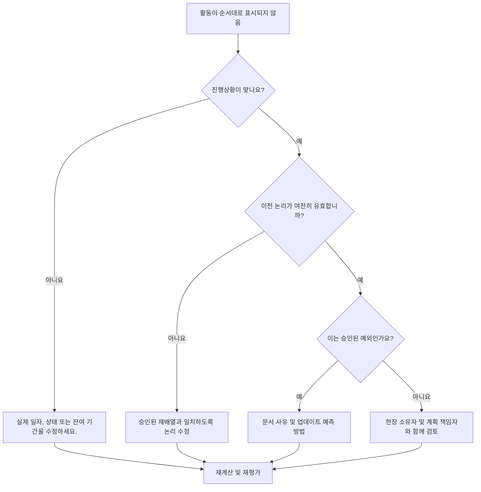

# Primavera P6의 순서가 잘못된 활동 - 개선 가이드

## 목적

이 가이드는 스케줄러가 Primavera P6에서 순서가 잘못된 활동을 검토하고 수정하는 데 도움이 됩니다. 필수 선행 로직이 충족되기 전에 활동이 시작되거나 진행된 경우 적용됩니다.

## 시작하기 전에

조치를 취하기 전에 다음 정보를 수집하십시오.

- 이 측정항목에 대한 현재 평가 결과입니다.
- 순서가 잘못된 것으로 표시된 활동 목록입니다.
- 최신 업데이트에 사용된 데이터 날짜입니다.
- 실제 시작, 실제 완료, 잔여 기간 및 활동 상태.
- 관계 유형 및 지연을 포함한 선행자 및 후임자 관계 세부정보입니다.
- 공정표 계산 설정, 특히 유지된 논리 및 진행률 재정의.
- 계획된 로직이 완료되기 전에 작업이 진행된 이유에 대한 현장 설명입니다.

## 결과 이해

강력한 결과는 해결되지 않은 순서를 벗어난 활동이 전혀 없다는 것입니다.

수용 가능한 결과에는 작업 순서가 의도적으로 변경되고 새 계획을 반영하기 위해 공정표 로직가 업데이트된 문서화된 예외가 포함될 수 있습니다.

약한 결과는 공정표 업데이트에 기존 논리 네트워크와 충돌하는 진행 상황이 포함되어 있음을 의미합니다. 이는 잘못된 상태, 실제 항목 누락, 오래된 논리 또는 예측에 아직 반영되지 않은 실제 필드 순서 변경을 나타낼 수 있습니다.

## 개선목표

목표는 해결되지 않은 비순차적 활동 0개입니다.

목표는 각 항목이 상태 오류, 논리 오류 또는 실제 재배열 이벤트인지 확인한 다음 현재 계획을 나타내도록 일정을 수정하는 것입니다.

## 실천 계획

### 1단계: 주요 문제 식별

순서가 잘못된 활동을 나열하는 P6 레이아웃이나 보고서를 만듭니다. 활동 ID, 활동 이름, WBS, 상태, 실제 시작, 실제 완료, 잔여 기간, 시작, 완료, 총 부동, 선행자, 후임자, 관계 유형, 지연 및 주도 관계 표시기를 포함합니다.

각 활동을 검토하고 질문하십시오.

- 이전 요구 사항이 충족되기 전에 활동이 실제로 시작되었습니까?
- 전임자 상태가 맞나요?
- 후임자 상태가 맞나요?
- 필드 순서를 다시 지정한 후에도 관계가 여전히 유효한가요?
- 일정 로직을 변경해야 할까요, 아니면 진행 업데이트를 수정해야 할까요?
- 어떤 P6 예약 옵션이 사용됩니까? 논리 유지 또는 진행률 재정의?

### 2단계: 권장 수정사항 적용

먼저 상태 오류를 수정하세요. 실제 시작, 실제 완료, 잔여 기간 또는 선행 작업 상태가 잘못된 경우 로직을 변경하기 전에 활동 데이터를 업데이트하세요.

필드 순서가 변경된 경우 승인된 현재 계획을 나타내도록 논리를 수정합니다. 메트릭을 지우기 위해 단순히 선행 관계를 제거하지 마십시오. 오래된 논리를 실제 실행 순서와 일치하는 관계로 대체합니다.

유지된 논리 및 진행률 재정의 설정을 검토합니다. 유지된 논리는 일반적으로 남은 작업에 대한 원래의 선행 논리를 보존하는 반면, 진행률 재정의는 불완전한 선행 논리에도 불구하고 남은 작업을 계속하도록 허용할 수 있습니다. 설정은 프로젝트 통제 절차와 일치해야 하며 결과를 보고하기 전에 이해되어야 합니다.

### 3단계: 일반적인 차단 요소 제거

일반적인 방해 요인으로는 늦은 현장 업데이트, 불완전한 실제 일자, 논리 검토 없이 진행 상황을 수락하라는 압력, 공정표 계산 옵션에 대한 혼란 등이 있습니다.

또 다른 방해 요인은 순서를 벗어난 진행을 단지 소프트웨어 문제로 간주하는 것입니다. 실제 질문은 프로젝트가 작업 순서를 변경했는지 여부와 이제 일정이 승인된 순서를 반영하는지 여부입니다.

### 4단계: 변경 사항 확인

수정 후 공정표를 다시 계산합니다. 순서가 잘못된 검사를 다시 실행하고 나머지 각 항목이 수정, 정당화 또는 후속 조치를 위해 할당되었는지 확인합니다.

총 유동량, 최장 경로, 중요 경로 및 단기 이정표를 검토합니다. 순서를 벗어난 수정으로 인해 예측 날짜가 변경될 수 있으므로 프로젝트 통제 책임자 또는 PMO 검토자에게 의미 있는 영향을 전달하세요.

## 개선 일정

### 1일차: 검토 및 진단

지표를 실행하고, 데이터 날짜를 확인하고, 결과를 상태 오류, 논리 오류, 실제 재배열 및 가능한 예외로 구분합니다.

### 2~3일: 우선순위 조치 구현

중요한 활동, 거의 중요한 활동, 예측 활동을 먼저 수정하세요. 상태를 업데이트하고, 오래된 논리를 수정하고, 승인된 재배열을 문서화하세요.

### 4~5일차: 초기 결과 모니터링

공정표를 다시 계산하고 부동, 최장 경로, 주요 경로 및 마일스톤 날짜의 이동을 검토합니다.

### 6일차: 최종 조정

현장 책임자, 분야 소유자 또는 계획 관리자와 함께 나머지 항목을 해결하십시오.

### 7일차: 재평가 및 비교

평가를 다시 실행하고 결과를 목표 임계값과 비교합니다.

## 진행 상황 추적

간단한 추적기를 사용하여 수정 및 승인을 관리하세요.

| 날짜 | 취해진 조치 | 기대효과 | 결과/관찰 | 다음 단계 |
| --- | --- | --- | --- | --- |
| [날짜] | 순서를 벗어난 활동을 검토했습니다. | 상태 또는 논리 문제 식별 | [관찰 결과] | 소유자 지정 |
| [날짜] | 수정된 상태 또는 실제 일자 | 업데이트 정확도 향상 | [관찰 결과] | 일정 재계산 |
| [날짜] | 승인된 재배열을 위한 수정된 논리 | 예측 신뢰성 향상 | [관찰 결과] | 측정항목 재평가 |

## 결과가 개선되지 않는 경우

결과가 개선되지 않으면 동일한 작업 영역이 순서를 벗어나 반복적으로 진행되고 있는지 확인하십시오. 이는 약한 업데이트 규율, 비현실적인 논리, 불완전한 현장 조정 또는 빈번한 승인되지 않은 재배열을 의미할 수 있습니다.

해결되지 않은 항목이 중요, 거의 중요, 계약, 액세스, 인계 또는 클라이언트에 민감한 작업에 영향을 미치는 경우 에스컬레이션합니다.

## 유지

일정을 발행하기 전에 모든 업데이트 주기 동안 이 측정항목을 검토하세요. PMO 보고, 지연 분석 또는 복구 계획에 일정 보고서를 사용하기 전에 순서를 벗어난 진행이 해결되었는지 확인합니다.

## 요약 체크리스트

- [ ] 현재 결과가 검토되었습니다.
- [ ] 목표 임계값 확인됨
- [ ] 데이터 날짜 확인
- [ ] 확인된 주요 문제
- [ ] 상태 오류가 수정되었습니다.
- [ ] 논리 오류가 수정되었습니다.
- [ ] 승인된 재배열 문서화
- [ ] 공정표 계산 설정을 검토했습니다.
- [ ] 일정이 다시 계산되었습니다.
- [ ] 모니터링된 결과
- [ ] 평가가 반복됨
- [ ] 문서화된 다음 단계
## 관련 콘텐츠
- [Primavera P6의 순서가 잘못된 활동 - 개요](01_overview_template.md)
- [블로그 템플릿](03_blog_template.md)
- [일정이란 무엇입니까?](../../10b_blogs_ko/01_WHAT%20A%20SCHEDULE%20IS/01_blog.md)
- [견고한 논리](../../10b_blogs_ko/02_ROBUST%20LOGIC/02_ROBUST%20LOGIC.md)
