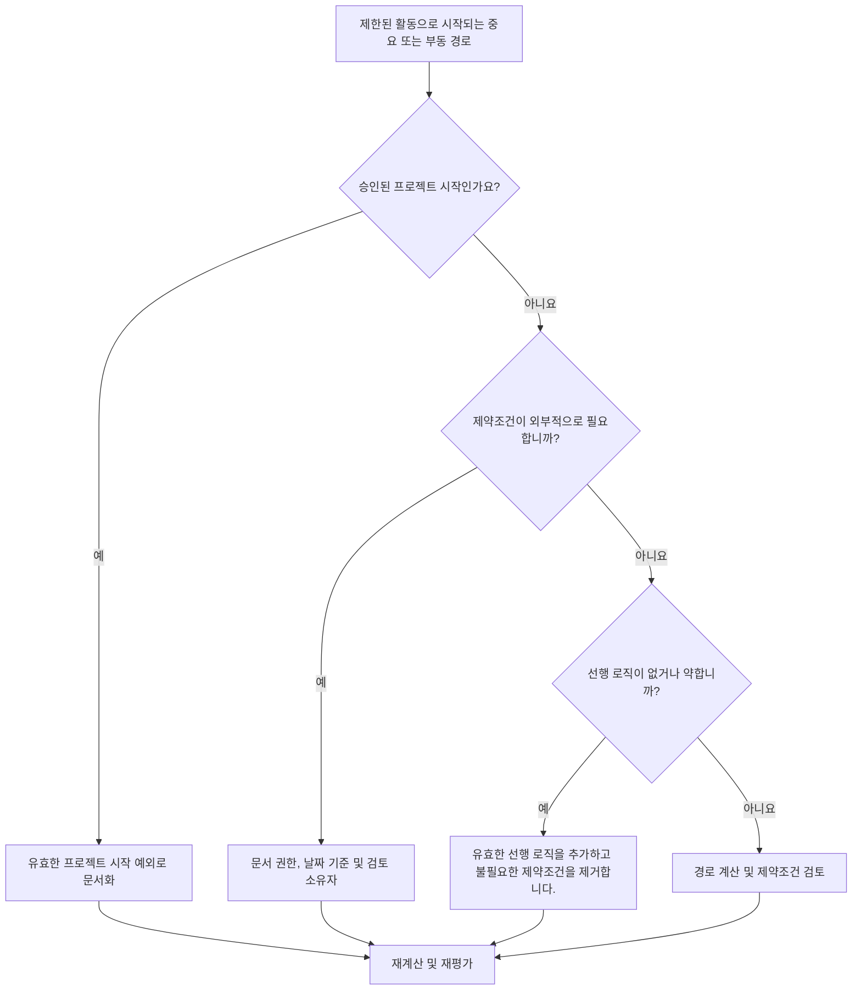

# 제약조건으로 시작하는 중요 경로 또는 부동 경로 - 개선 가이드

## 목적

이 가이드는 스케줄러가 제한된 활동으로 시작하는 중요 경로 또는 부동 경로 체인을 검토하는 데 도움이 됩니다. 승인된 프로젝트 시작은 일반적으로 유효한 예외입니다. 문제는 다운스트림 경로가 논리적 순서 대신 제약조건에서 시작되는 경우입니다.

## 시작하기 전에

조치를 취하기 전에 다음 정보를 수집하십시오.

- 이 측정항목에 대한 현재 평가 결과입니다.
- Primavera P6의 중요 경로 또는 부동 경로 보고서.
- 플래그가 지정된 각 경로의 첫 번째 활동입니다.
- 제약조건 유형, 제약 날짜 및 예상 날짜.
- 경로 시작 활동에 대한 선행자 및 후임자 관계.
- 데이터 날짜, 프로젝트 시작 이정표, 기본 요구 사항 및 PMO 또는 클라이언트 일정 규칙.
- 승인된 외부 제약조건에 대한 설명입니다.

## 결과 이해

강력한 결과는 승인된 프로젝트 시작을 제외하고 제약조건으로 시작하는 해결되지 않은 중요 경로 또는 부동 경로가 없다는 것입니다.

허용 가능한 결과에는 진행 통지, 소유자 액세스 해제, 허가 해제 또는 계약 보류 지점과 같은 문서화된 외부 제약 사항이 포함될 수 있습니다. 이는 명확하게 정당화되어야 합니다.

약한 결과는 경로가 네트워크 논리 대신 부과된 날짜에 의해 제어될 수 있음을 의미합니다. 이로 인해 예측, 보고 및 지연 분석에 있어 주요 경로 또는 부동 경로의 신뢰성이 낮아질 수 있습니다.

## 개선목표

대상은 제약조건으로 시작하는 0개의 해결되지 않은 경로입니다.

목표는 경로가 승인된 프로젝트 시작, 유효한 선행 로직 또는 문서화된 외부 제약조건에서 시작되어야 하는지 확인하는 것입니다.

## 실천 계획

### 1단계: 주요 문제 식별

주요 경로와 선택된 부동 경로를 표시하는 P6 레이아웃 또는 보고서를 만듭니다. 각 경로의 첫 번째 활동에는 활동 ID, 활동 이름, WBS, 시작, 완료, 총 유동, 자유 유동, 기본 제약, 제약 날짜, 선행자, 후임 및 활동 상태가 포함됩니다.

플래그가 지정된 각 경로를 검토하고 다음 사항을 질문하십시오.

- 이것이 승인된 프로젝트 시작 활동입니까, 아니면 진행 통지 활동입니까?
- 제약조건이 계약상으로 필요한가요? 아니면 외부적으로 필요한가요?
- 활동에 선행 로직이 누락되어 있습니까?
- 제약이 약하거나 불완전한 일정 네트워크를 가리고 있습니까?
- 제약조건이 제거되면 경로가 다르게 시작됩니까?
- PMO 또는 고객 검토를 위해 제한된 시작이 문서화되어 있습니까?

### 2단계: 권장 수정사항 적용

제한된 활동이 승인된 프로젝트 시작인 경우 이를 유효한 예외로 문서화하고 그것이 경로의 의도된 시작점인지 확인합니다.

제약조건이 외부적으로 필요한 경우 이유가 명확한 경우에만 유지하세요. 계약 이정표, 액세스 릴리스, 허가, 소유자 지침 또는 규제 요구 사항과 같은 소스를 문서화합니다.

제약조건이 필요하지 않은 경우 이를 제거하고 활동이 이전 작업, 승인, 인계, 조달 또는 액세스에 따라 달라지는 유효한 선행 논리를 추가합니다. 공정표를 다시 계산하고 경로가 이제 논리 기반인지 확인합니다.

### 3단계: 일반적인 차단 요소 제거

일반적인 방해 요인에는 이전 기준에서 상속된 제약조건, 날짜를 강제하는 데 사용되는 제약조건, 누락된 인터페이스 논리, 외부 날짜의 불명확한 소유권 등이 있습니다.

또 다른 방해 요인은 P6이 이를 식별한다는 이유만으로 중요한 경로를 신뢰할 수 있다고 가정하는 것입니다. 경로가 불필요한 제약조건으로 시작하는 경우 경로는 실제 CPM 논리가 아닌 날짜 제어를 반영할 수 있습니다.

### 4단계: 변경 사항 확인

제약조건이나 논리를 변경한 후 공정표를 다시 계산합니다. 주요 경로, 가장 긴 경로, 선택한 유동 경로, 총 유동 및 주요 마일스톤 날짜를 검토합니다.

경로가 크게 변경되면 이유를 문서화하고 프로젝트 통제 책임자, PMO 검토자 또는 고객 스케줄러에게 영향을 전달합니다.

## 개선 일정

### 1일차: 검토 및 진단

메트릭을 실행하고, 제한된 경로 시작 활동을 식별하고, 결과를 프로젝트 시작 예외, 유효한 외부 제약, 누락된 논리, 불필요한 제약으로 구분합니다.

### 2~3일: 우선순위 조치 구현

중요한 경로와 클라이언트에 민감한 경로를 먼저 수정하세요. 불필요한 제약조건을 제거하고, 누락된 논리를 추가하고, 승인된 예외를 문서화하세요.

### 4~5일차: 초기 결과 모니터링

공정표를 다시 계산하고 주요 경로, 가장 긴 경로, 부동 경로 및 마일스톤 날짜의 이동을 검토합니다.

### 6일차: 최종 조정

나머지 제한된 경로를 해결하려면 책임 소유자, 프로젝트 통제 책임자 또는 고객 검토자가 시작됩니다.

### 7일차: 재평가 및 비교

평가를 다시 실행하고 결과를 목표 임계값과 비교합니다.

## 진행 상황 추적

간단한 추적기를 사용하여 수정 및 승인을 관리하세요.

| 날짜 | 취해진 조치 | 기대효과 | 결과/관찰 | 다음 단계 |
| --- | --- | --- | --- | --- |
| [날짜] | 제한된 경로 시작 활동을 검토했습니다. | 날짜 기반 경로 시작 식별 | [관찰 결과] | 소유자 지정 |
| [날짜] | 불필요한 제약을 제거했습니다. | 논리 기반 경로 복원 | [관찰 결과] | 일정 재계산 |
| [날짜] | 문서화된 승인 예외 | 리뷰 추적성 향상 | [관찰 결과] | 측정항목 재평가 |

## 결과가 개선되지 않는 경우

결과가 개선되지 않으면 특정 WBS 영역, 인터페이스 패키지 또는 프로젝트 단계에 제약이 집중되어 있는지 확인하십시오. 반복되는 발견은 일정이 완전한 논리가 아닌 부과된 날짜에 의해 제어되고 있음을 나타낼 수 있습니다.

해결되지 않은 제한된 경로 시작이 중요, 거의 중요, 계약, 클라이언트 민감, 액세스 또는 인계 관련 작업에 영향을 미칠 때 에스컬레이션합니다.

## 유지

각 공정표 업데이트, 기준 검토 및 주요 재배열 연습 중에 이 측정항목을 검토하세요. 복구 계획, 클라이언트 날짜 변경 또는 인터페이스 수정 후에는 특별한 주의를 기울이십시오.

## 요약 체크리스트

- [ ] 현재 결과가 검토되었습니다.
- [ ] 목표 임계값 확인됨
- [ ] 중요 또는 부동 경로 보고서 검토
- [ ] 프로젝트 시작 예외가 식별됨
- [ ] 제약조건 확인됨
- [ ] 누락된 논리가 수정되었습니다.
- [ ] 불필요한 제약이 제거되었습니다.
- [ ] 승인된 예외 사항이 문서화됨
- [ ] 일정이 다시 계산되었습니다.
- [ ] 모니터링된 결과
- [ ] 평가가 반복됨
- [ ] 문서화된 다음 단계
## 관련 콘텐츠
- [제약조건으로 시작하는 중요 경로 또는 부동 경로 - 개요](01_overview_template.md)
- [블로그 템플릿](03_blog_template.md)
- [일정이란 무엇입니까?](../../10b_blogs_ko/01_WHAT%20A%20SCHEDULE%20IS/01_blog.md)
- [견고한 논리](../../10b_blogs_ko/02_ROBUST%20LOGIC/02_ROBUST%20LOGIC.md)
