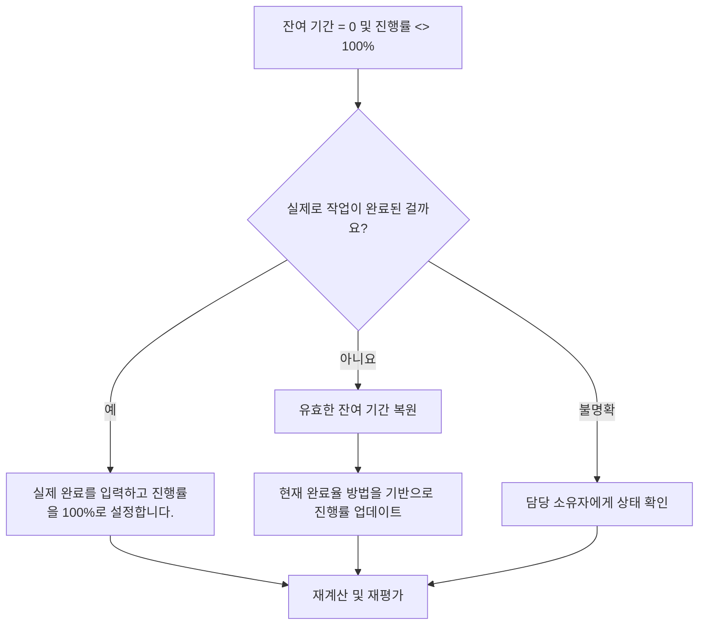

# 잔여 기간이 0이고 진행률이 100%가 아닌 활동 - 개선 가이드

## 목적

이 가이드는 스케줄러가 잔여 기간이 0이지만 진행률이 100%가 아닌 활동을 검토하고 수정하는 데 도움이 됩니다. 잔여 기간, 진행률, 실제 완료 및 활동 상태를 정렬하여 더욱 깔끔한 Primavera P6 상태 업데이트를 지원합니다.

## 시작하기 전에

조치를 취하기 전에 다음 정보를 수집하십시오.

- 이 측정항목에 대한 현재 평가 결과입니다.
- 잔여 기간 = 0이고 진행률 <> 100%인 활동 목록입니다.
- 활동 상태, 실제 시작, 실제 완료, 원래 기간, 잔여 기간 및 완료 시 기간.
- 완료율 유형 및 관련 진행률 필드입니다.
- 실제 완료율, 기간 완료율, 단위 완료율 및 활동 완료율입니다.
- 데이터 날짜 및 최신 진행 상황 업데이트 참고 사항.
- 작업 완료 여부, 남은 작업 여부를 현장에서 확인합니다.

## 결과 이해

강력한 결과는 잔여 기간 = 0이고 진행률이 100%보다 낮거나 높은 활동이 없는 것입니다.

허용 가능한 결과에는 특정 완료율 방법으로 인해 일시적인 보고 차이가 발생하는 드물게 문서화된 사례가 포함될 수 있지만 이러한 경우는 공식 보고 전에 해결해야 합니다.

약한 결과는 일정에 남은 작업과 진행 상태가 일치하지 않는 활동이 포함되어 있음을 의미합니다. 이로 인해 부정확한 보고, 획득가치 문제 또는 오해의 소지가 있는 완료 상태가 발생할 수 있습니다.

## 개선목표

목표는 잔여 기간 = 0이고 진행률 <> 100%인 해결되지 않은 활동 0개입니다.

목표는 각 활동이 완료되었는지, 진행 상황이 잘못 업데이트되었는지, 검토가 필요한 완료율 방법을 사용하는지 확인하는 것입니다.

## 실천 계획

### 1단계: 주요 문제 식별

잔여 기간이 0이고 진행률이 100%가 아닌 활동을 필터링하는 P6 레이아웃 또는 보고서를 만듭니다. 활동 ID, 활동 이름, WBS, 활동 상태, 실제 시작, 실제 완료, 원래 기간, 잔여 기간, 완료율 유형, 실제 완료율, 기간 완료율, 단위 완료율 및 활동 완료율을 포함합니다.

각 활동을 검토하고 질문하십시오.

- 실제로 작업이 완료된 걸까요?
- 완료되면 실제 완료가 누락됩니까?
- 완료되지 않은 경우 잔여 기간이 0인 이유는 무엇입니까?
- 어떤 완료율 유형이 사용됩니까?
- 진행률 값은 물리적, 기간 또는 단위 진행률에서 나오나요?
- 상태 업데이트 오류인가요, 아니면 진행률 계산 문제인가요?

### 2단계: 권장 수정사항 적용

작업이 완료되면 활동을 완료로 업데이트합니다. 실제 완료를 입력하고 잔여 기간이 0인지 확인하고 프로젝트 업데이트 절차에 따라 진행률이 100%인지 확인합니다.

작업이 완료되지 않은 경우 적절한 잔여 기간을 복원합니다. 담당 소유자와 남은 작업을 확인하고 활동의 완료율 유형을 기반으로 관련 진행률 필드를 업데이트합니다.

문제가 완료율 방법으로 인해 발생한 경우 활동에서 실제 완료율, 기간 완료율 또는 단위 완료율을 사용해야 하는지 검토하세요. 완료율 유형을 임의로 변경하지 마십시오. 이를 프로젝트 통제 절차와 일치시킵니다.

### 3단계: 일반적인 차단 요소 제거

일반적인 방해 요소로는 불완전한 현장 업데이트, 실제 완료일 누락, 실제 완료율과 기간 백분율 간의 혼동, 검증 없이 외부 시스템에서 가져온 진행 상황 등이 있습니다.

또 다른 방해 요소는 잔여 기간을 진행률 필드로 처리하는 것입니다. 잔여 기간은 단순히 완료되었다고 보고된 작업량이 아니라 활동을 완료하는 데 필요한 시간을 나타내야 합니다.

### 4단계: 변경 사항 확인

수정 후 공정표를 다시 계산합니다. 측정항목을 다시 실행하고 남은 각 항목이 수정되거나 후속 작업에 할당되었는지 확인합니다.

완료된 활동, 실제 완료일, 진행 보고서, 획득가치 출력 및 예측 보고서를 검토하여 수정으로 인해 새로운 불일치가 발생하지 않았는지 확인합니다.

## 개선 일정

### 1일차: 검토 및 진단

측정항목을 실행하고, 데이터 날짜를 확인하고, 결과를 완료된 작업 누락 상태, 잔여 기간이 0인 완료되지 않은 작업, 방법 완료율 문제로 구분합니다.

### 2~3일: 우선순위 조치 구현

보고에 사용된 활동을 먼저 수정하세요. 필요에 따라 실제 완료를 업데이트하고 잔여 기간을 복원하거나 진행률 값을 수정하세요.

### 4~5일차: 초기 결과 모니터링

공정표를 다시 계산하고 진행 보고서, 완료된 활동 목록 및 획득가치 출력을 검토합니다.

### 6일차: 최종 조정

책임 있는 분야, 현장 책임자 또는 프로젝트 통제 책임자와 함께 나머지 불확실한 항목을 해결하십시오.

### 7일차: 재평가 및 비교

평가를 다시 실행하고 결과를 목표 임계값과 비교합니다.

## 진행 상황 추적

간단한 추적기를 사용하여 수정 및 승인을 관리하세요.

| 날짜 | 취해진 조치 | 기대효과 | 결과/관찰 | 다음 단계 |
| --- | --- | --- | --- | --- |
| [날짜] | RD 0을 검토하고 100개의 활동이 진행되지 않음 | 상태 불일치 식별 | [관찰 결과] | 소유자 지정 |
| [날짜] | 실제 완료를 입력하고 진행 상황을 수정했습니다. | 완료 상태 정렬 | [관찰 결과] | 일정 재계산 |
| [날짜] | 복원된 잔여 기간 | 완료되지 않은 활동 상태 수정 | [관찰 결과] | 측정항목 재평가 |

## 결과가 개선되지 않는 경우

결과가 개선되지 않으면 진행 업데이트를 일관되게 가져오거나 복사하거나 계산하는지 확인하세요. 여러 팀에서 서로 다른 완료율 방법을 사용하는지 또는 업데이트 워크플로에서 실제 완료일가 누락되었는지 여부를 검토하세요.

해결되지 않은 항목이 중요, 거의 중요, 획득가치, 고객 보고, 지불 또는 인계 관련 작업에 영향을 미치는 경우 에스컬레이션합니다.

## 유지

보고서를 발행하기 전에 모든 업데이트 주기 동안 이 측정항목을 검토하세요. 이는 실제 일자, 잔여 기간, 완료율 및 활동 상태 확인과 함께 표준 업데이트 확인의 일부여야 합니다.

## 요약 체크리스트

- [ ] 현재 결과가 검토되었습니다.
- [ ] 목표 임계값 확인됨
- [ ] 데이터 날짜 확인
- [ ] 확인된 주요 문제
- [ ] 완료된 활동이 올바르게 업데이트되었습니다.
- [ ] 필요한 경우 실제 완료일 입력
- [ ] 작업이 완료되지 않은 경우 잔여 기간이 복원됩니다.
- [ ] 완료율 유형이 검토됨
- [ ] 일정이 다시 계산되었습니다.
- [ ] 모니터링된 결과
- [ ] 평가가 반복됨
- [ ] 문서화된 다음 단계
## 관련 콘텐츠
- [잔여 기간이 0이고 진행률이 100%가 아닌 활동 - 개요](01_overview_template.md)
- [블로그 템플릿](03_blog_template.md)
- [일정이란 무엇입니까?](../../10b_blogs_ko/01_WHAT%20A%20SCHEDULE%20IS/01_blog.md)
- [견고한 논리](../../10b_blogs_ko/02_ROBUST%20LOGIC/02_ROBUST%20LOGIC.md)
