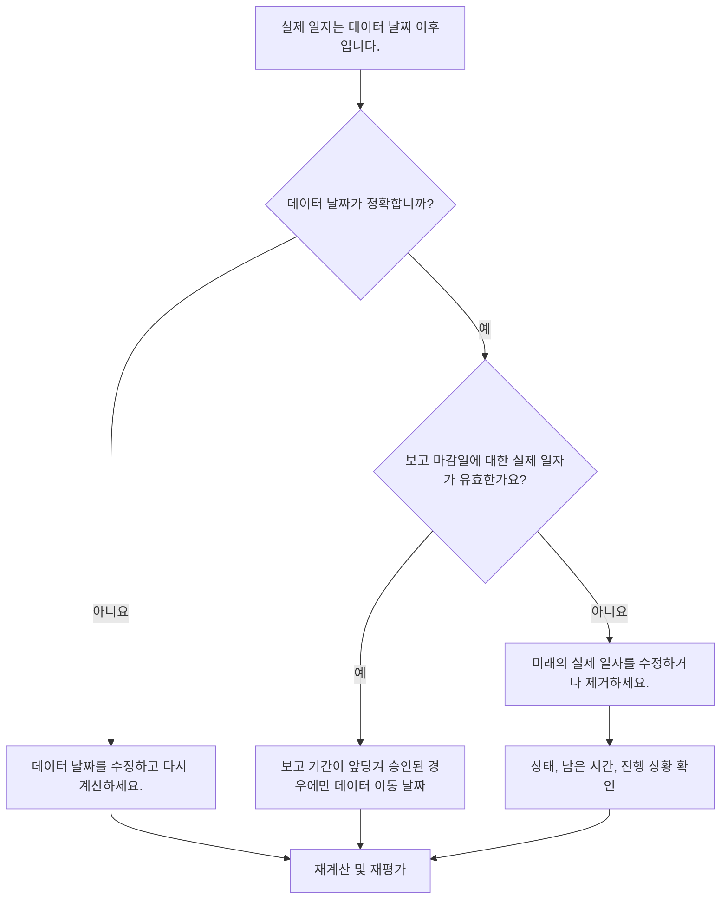

# Primavera P6의 데이터 날짜보다 실제 일자가 이후임 - 개선 가이드

## 목적

이 가이드는 스케줄러가 Primavera P6 데이터 날짜보다 실제 일자가 늦은 활동을 검토하고 수정하는 데 도움이 됩니다. 업데이트 경계 또는 그 이전에 실제 성능을 유지하여 깔끔한 업데이트 규율을 지원합니다.

## 시작하기 전에

조치를 취하기 전에 다음 정보를 수집하십시오.

- 이 측정항목에 대한 현재 평가 결과입니다.
- 최신 공정표 업데이트에 사용된 프로젝트 데이터 날짜입니다.
- 실제 일자가 데이터 날짜보다 이후인 활동 목록입니다.
- 실제 시작, 실제 완료, 활동 상태, 잔여 기간 및 완료율 필드입니다.
- 현장 보고서, 가져오기 파일, 작업표 또는 수동 업데이트와 같은 진행 업데이트 소스입니다.
- 프로젝트 업데이트 마감 규칙 및 보고 기간.
- 알려진 향후 작업 항목 또는 데이터 가져오기 문제.

## 결과 이해

강력한 결과는 실제 일자가 데이터 날짜보다 이후인 활동이 없다는 것입니다.

허용 가능한 결과는 여전히 0이어야 합니다. 데이터 날짜 이후의 실제 일자는 일반적으로 업데이트 오류 또는 잘못된 데이터 날짜를 나타냅니다.

약한 결과는 일정에 향후 실제 내용이 포함되어 있음을 의미합니다. 이렇게 하면 업데이트 기간이 실제로 해당 날짜에 도달하기 전에 일정 보고서가 완료되거나 시작된 것으로 작동할 수 있습니다.

## 개선목표

목표는 실제 일자가 데이터 날짜보다 이후인 미해결 활동이 0개입니다.

목표는 실제 일자가 잘못되었는지, 데이터 날짜가 잘못되었는지 또는 업데이트 가져오기 프로세스에서 향후 실제 일자를 허용하는지 확인하는 것입니다.

## 실천 계획

### 1단계: 주요 문제 식별

실제 시작, 실제 완료 또는 데이터 날짜보다 이후의 기타 실제 일자가 포함된 활동을 필터링하는 P6 레이아웃 또는 보고서를 만듭니다. 활동 ID, 활동 이름, WBS, 활동 상태, 실제 시작, 실제 완료, 시작, 완료, 잔여 기간, 완료율, 달력 및 데이터 날짜 참조를 포함합니다.

각 활동을 검토하고 질문하십시오.

- 프로젝트 데이터 날짜가 정확합니까?
- 실제 일자가 맞나요?
- 업데이트에 마감일 이후의 진행 상황이 포함되어 있습니까?
- 가져오기 파일이 미래의 실제 일자를 로드했습니까?
- 실제 일자를 변경해야 합니까, 아니면 데이터 날짜를 이동해야 합니까?
- 활동 상태가 수정된 실제 일자와 일치합니까?

### 2단계: 권장 수정사항 적용

데이터 날짜가 잘못된 경우 승인된 보고 기간에 따라 수정하고 공정표를 다시 계산합니다.

실제 일자가 잘못된 경우 실제 시작 또는 실제 완료를 적절한 날짜로 수정하세요. 작업이 데이터 날짜까지 실제로 시작되거나 완료되지 않은 경우 향후 실제 및 업데이트 상태, 잔여 기간 및 완료율을 올바르게 제거합니다.

문제가 가져오기에서 발생한 경우 가져오기 파일과 매핑을 검토하세요. 일정 보고서가 발행되기 전에 미래의 실제 일자가 차단되거나 확인되었는지 확인하십시오.

### 3단계: 일반적인 차단 요소 제거

일반적인 방해 요인으로는 보고 마감일 이후의 날짜를 다루는 진행 파일, 데이터 날짜를 확인하지 않고 입력한 수동 업데이트, 실제 일자와 예측 날짜 간의 혼동 등이 있습니다.

또 다른 방해 요인은 미래의 실제 데이터를 수용하기 위해 데이터 날짜를 옮기는 것입니다. 데이터 날짜는 승인된 업데이트 경계를 나타내야 하며 상태 오류를 숨기기 위해 임의로 변경해서는 안 됩니다.

### 4단계: 변경 사항 확인

수정 후 공정표를 다시 계산합니다. 측정항목을 다시 실행하고 데이터 날짜 이후에 실제 일자가 남아 있지 않은지 확인하세요.

완료된 활동 목록, 진행 중인 활동 목록, 획득가치 결과 및 일정 비교 보고서를 검토하여 수정으로 인해 다른 상태 불일치가 발생하지 않았는지 확인합니다.

## 개선 일정

### 1일차: 검토 및 진단

지표를 실행하고, 데이터 날짜를 확인하고, 결과를 잘못된 실제 일자, 잘못된 데이터 날짜, 가져오기 문제, 업데이트 컷오프 문제로 분리합니다.

### 2~3일: 우선순위 조치 구현

보고에 사용된 활동을 먼저 수정하세요. 실제 일자를 수정하고, 상태를 업데이트하고, 가져오기 문제를 해결하세요.

### 4~5일차: 초기 결과 모니터링

공정표를 다시 계산하고 진행 보고서, 완료된 활동 목록, 획득가치 출력 및 마일스톤 날짜를 검토합니다.

### 6일차: 최종 조정

책임 있는 분야, 현장 책임자 또는 프로젝트 통제 책임자와 함께 나머지 불확실한 항목을 해결하십시오.

### 7일차: 재평가 및 비교

평가를 다시 실행하고 결과를 목표 임계값과 비교합니다.

## 진행 상황 추적

간단한 추적기를 사용하여 수정 및 승인을 관리하세요.

| 날짜 | 취해진 조치 | 기대효과 | 결과/관찰 | 다음 단계 |
| --- | --- | --- | --- | --- |
| [날짜] | 데이터 날짜 이후의 실제 일자를 검토했습니다. | 미래의 실제 사항 식별 | [관찰 결과] | 소유자 지정 |
| [날짜] | 실제 시작 또는 실제 완료 수정 | 유효한 상태 경계 복원 | [관찰 결과] | 일정 재계산 |
| [날짜] | 가져오기 프로세스를 검토했습니다. | 미래의 실제 상황이 반복되는 것을 방지하세요. | [관찰 결과] | 측정항목 재평가 |

## 결과가 개선되지 않는 경우

결과가 개선되지 않으면 가져오기, 작업표 또는 수동 업데이트 워크플로를 통해 향후 실제 항목이 반복적으로 도입되는지 확인하세요. 업데이트 마감 절차를 검토하고 데이터 날짜가 모든 기여자에게 명확하게 전달되었는지 확인하세요.

해결되지 않은 항목이 중요, 거의 중요, 획득가치, 고객 보고, 지불 또는 인계 관련 작업에 영향을 미치는 경우 에스컬레이션합니다.

## 유지

보고서를 발행하기 전에 모든 업데이트 주기 동안 이 측정항목을 검토하세요. 이는 실제 일자, 데이터 날짜, 잔여 기간, 완료율 및 활동 상태 확인과 함께 표준 상태 확인의 일부여야 합니다.

## 요약 체크리스트

- [ ] 현재 결과가 검토되었습니다.
- [ ] 목표 임계값 확인됨
- [ ] 데이터 날짜 확인
- [ ] 확인된 주요 문제
- [ ] 미래의 실제 일자가 수정되었습니다.
- [ ] 활동 상태 확인됨
- [ ] 잔여 기간 및 진행 상황 확인
- [ ] 가져오기 또는 업데이트 워크플로가 검토됨
- [ ] 일정이 다시 계산되었습니다.
- [ ] 모니터링된 결과
- [ ] 평가가 반복됨
- [ ] 문서화된 다음 단계
## 관련 콘텐츠
- [Primavera P6의 데이터 날짜보다 실제 일자가 이후임 - 개요](01_overview_template.md)
- [블로그 템플릿](03_blog_template.md)
- [일정이란 무엇입니까?](../../10b_blogs_ko/01_WHAT%20A%20SCHEDULE%20IS/01_blog.md)
- [견고한 논리](../../10b_blogs_ko/02_ROBUST%20LOGIC/02_ROBUST%20LOGIC.md)
