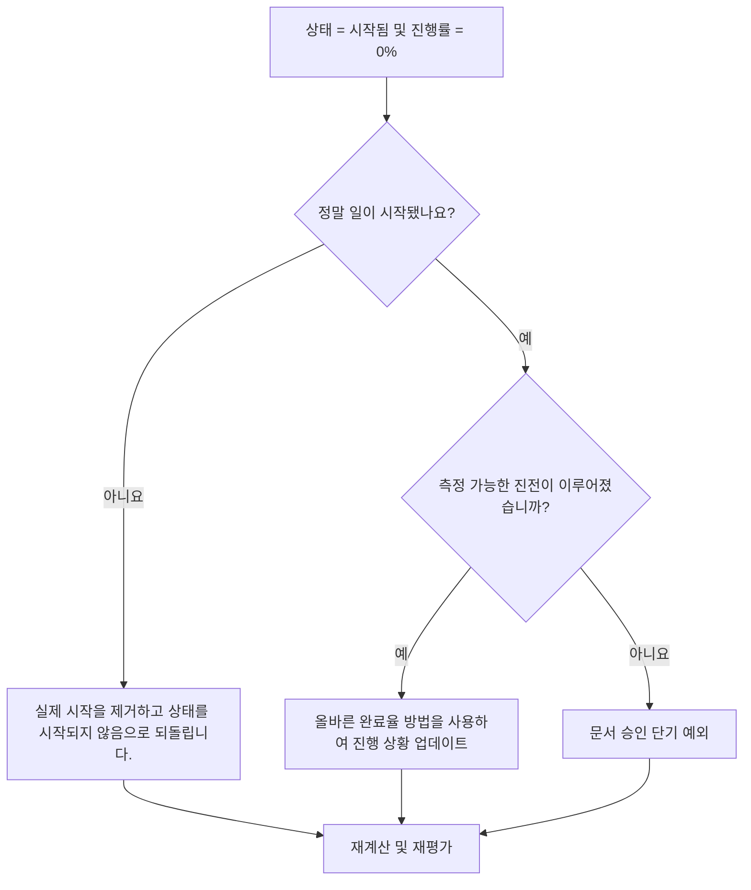

## 목적

이 가이드는 스케줄러가 활동 상태가 시작됨이지만 진행률이 0%인 활동을 검토하고 수정하는 데 도움이 됩니다. 실제 시작, 활동 상태, 완료율 및 잔여 기간을 정렬하여 더욱 깔끔한 Primavera P6 업데이트를 지원합니다.

## 시작하기 전에

조치를 취하기 전에 다음 정보를 수집하십시오.

- 이 측정항목에 대한 현재 평가 결과입니다.
- 활동 상태 = 시작됨 및 진행률 = 0%인 활동 목록입니다.
- 실제 시작, 실제 완료, 잔여 기간, 원래 기간 및 활동 상태.
- 완료율 유형 및 관련 진행률 필드입니다.
- 실제 완료율, 기간 완료율, 단위 완료율 및 활동 완료율입니다.
- 데이터 날짜 및 최신 업데이트 참고 사항.
- 실제로 작업이 시작되었는지, 어떤 진전이 있었는지를 현장에서 확인합니다.

## 결과 이해

강력한 결과는 시작됨 상태의 활동이 없고 진행률이 0%입니다.

허용 가능한 결과에는 업데이트 기간이 끝날 때 활동이 시작되었지만 아직 측정 가능한 진행 상황이 달성되지 않은 드물게 문서화된 사례가 포함될 수 있습니다. 이러한 경우는 제한되어야 하며 명확하게 설명되어야 합니다.

약한 결과는 일정에 시작 상태와 진행률 값이 일치하지 않는 활동이 포함되어 있음을 의미합니다. 이로 인해 오해의 소지가 있는 진행 보고서, 획득가치 문제 및 예측 혼란이 발생할 수 있습니다.

## 개선목표

목표는 활동 상태 = 시작됨 및 진행률 = 0%인 해결되지 않은 활동 0개입니다.

목표는 각 활동이 실제로 시작되었는지, 진행 상황이 누락되었는지, 활동을 시작되지 않음 상태로 되돌려야 하는지 확인하는 것입니다.

## 실천 계획

### 1단계: 주요 문제 식별

시작됨 상태 및 진행률 0%인 활동을 필터링하는 P6 레이아웃 또는 보고서를 만듭니다. 활동 ID, 활동 이름, WBS, 활동 상태, 실제 시작, 실제 완료, 원래 기간, 잔여 기간, 완료율 유형, 물리적 완료율, 기간 완료율, 단위 완료율, 활동 완료율, 시작, 완료 및 총 부동 시간을 포함합니다.

각 활동을 검토하고 질문하십시오.

- 실제로 작업이 시작됐나요?
- 작업이 시작되면 어떤 측정 가능한 진전이 이루어졌습니까?
- 실제 시작이 정확합니까?
- 어떤 완료율 유형이 사용됩니까?
- 올바른 필드에서 진행 상황이 누락되었습니까?
- 실제 작업이 시작되지 않은 채 관리상 활동이 시작되었습니까?

### 2단계: 권장 수정사항 적용

작업이 실제로 시작되지 않은 경우 잘못된 실제 시작을 제거하고 활동을 시작되지 않음으로 되돌립니다. 잔여 기간과 예측 날짜가 여전히 유효한지 확인하세요.

작업이 시작되고 진행된 경우 완료율 유형을 기준으로 올바른 진행률 필드를 업데이트하세요. 물리적 완료율에 물리적 진행률을 입력합니다. 기간 완료율의 경우 잔여 기간이 수행된 작업을 반영하는지 확인합니다. 단위 완료율의 경우 단위 진행 상황이 업데이트되었는지 확인하세요.

작업이 시작되었지만 측정 가능한 진전이 이루어지지 않은 경우 이유를 문서로 기록하십시오. 이는 아직 획득한 진행 상황이 없이 업데이트 마감 근처에 동원 시작이 기록되는 등 드물고 일시적이어야 합니다.

### 3단계: 일반적인 차단 요소 제거

일반적인 방해 요소에는 누락된 필드 수량, 진행률 값 없이 가져온 실제 시작, 완료율 유형에 대한 혼란, 측정 가능한 진행률이 제공되기 전에 작업이 시작된 것으로 표시하라는 압력 등이 포함됩니다.

또 다른 방해 요인은 실제 시작을 상태 사실이 아닌 계획 신호로 취급하는 것입니다. 실제 시작은 곧 시작하려는 의도가 아니라 실제 작업 시작을 나타내야 합니다.

### 4단계: 변경 사항 확인

수정 후 공정표를 다시 계산합니다. 측정항목을 다시 실행하고 남은 각 항목이 수정, 정당화 또는 후속 조치를 위해 할당되었는지 확인하세요.

진행 보고서, 획득가치 출력, 예측 보고서 및 진행 중인 활동 목록을 검토하여 수정으로 인해 새로운 불일치가 발생하지 않았는지 확인합니다.

## 개선 일정

### 1일차: 검토 및 진단

측정항목을 실행하고 데이터 날짜를 확인한 후 결과를 잘못된 시작, 누락된 진행률, 방법 완료율 문제 및 가능한 예외로 구분합니다.

### 2~3일: 우선순위 조치 구현

보고에 사용된 활동을 먼저 수정하세요. 잘못된 실제 시작을 제거하고 진행 값을 업데이트하거나 유효한 예외를 문서화하십시오.

### 4~5일차: 초기 결과 모니터링

공정표를 다시 계산하고 진행 보고서, 획득가치 출력, 진행 중인 활동 목록 및 예측 보고서를 검토합니다.

### 6일차: 최종 조정

책임 있는 분야, 현장 책임자 또는 프로젝트 통제 책임자와 함께 나머지 불확실한 항목을 해결하십시오.

### 7일차: 재평가 및 비교

평가를 다시 실행하고 결과를 목표 임계값과 비교합니다.

## 진행 상황 추적

간단한 추적기를 사용하여 수정 및 승인을 관리하세요.

| 날짜 | 취해진 조치 | 기대효과 | 결과/관찰 | 다음 단계 |
| --- | --- | --- | --- | --- |
| [날짜] | 진행률이 0%인 시작된 활동을 검토했습니다. | 상태 불일치 식별 | [관찰 결과] | 소유자 지정 |
| [날짜] | 잘못된 실제 시작을 제거했습니다. | 정확한 상태 복원 | [관찰 결과] | 일정 재계산 |
| [날짜] | 업데이트된 진행 값 | 시작 상태를 진행 상황에 맞춰 정렬 | [관찰 결과] | 측정항목 재평가 |

## 결과가 개선되지 않는 경우

결과가 개선되지 않으면 진행 값을 일치시키지 않고 실제 시작을 가져왔는지 또는 팀이 시작된 것으로 계산되는 항목에 대해 다른 규칙을 사용하고 있는지 확인하십시오. 업데이트 마감 절차와 완료율 방법을 검토하세요.

해결되지 않은 항목이 중요, 거의 중요, 획득가치, 고객 보고, 지불 또는 인계 관련 작업에 영향을 미치는 경우 에스컬레이션합니다.

## 유지

보고서를 발행하기 전에 모든 업데이트 주기 동안 이 측정항목을 검토하세요. 이는 실제 일자, 잔여 기간, 완료율 및 활동 상태 확인과 함께 표준 업데이트 유효성 검사의 일부여야 합니다.

## 요약 체크리스트

- [ ] 현재 결과가 검토되었습니다.
- [ ] 목표 임계값 확인됨
- [ ] 데이터 날짜 확인
- [ ] 확인된 주요 문제
- [ ] 잘못된 실제 시작이 제거되었습니다.
- [ ] 누락된 진행 상황이 업데이트되었습니다.
- [ ] 완료율 유형이 검토됨
- [ ] 문서화된 유효한 예외
- [ ] 일정이 다시 계산되었습니다.
- [ ] 모니터링된 결과
- [ ] 평가가 반복됨
- [ ] 문서화된 다음 단계
## 관련 콘텐츠
- [블로그 템플릿](03_blog_template.md)
- [일정이란 무엇입니까?](../../10b_blogs_ko/01_WHAT%20A%20SCHEDULE%20IS/01_blog.md)
- [견고한 논리](../../10b_blogs_ko/02_ROBUST%20LOGIC/02_ROBUST%20LOGIC.md)
