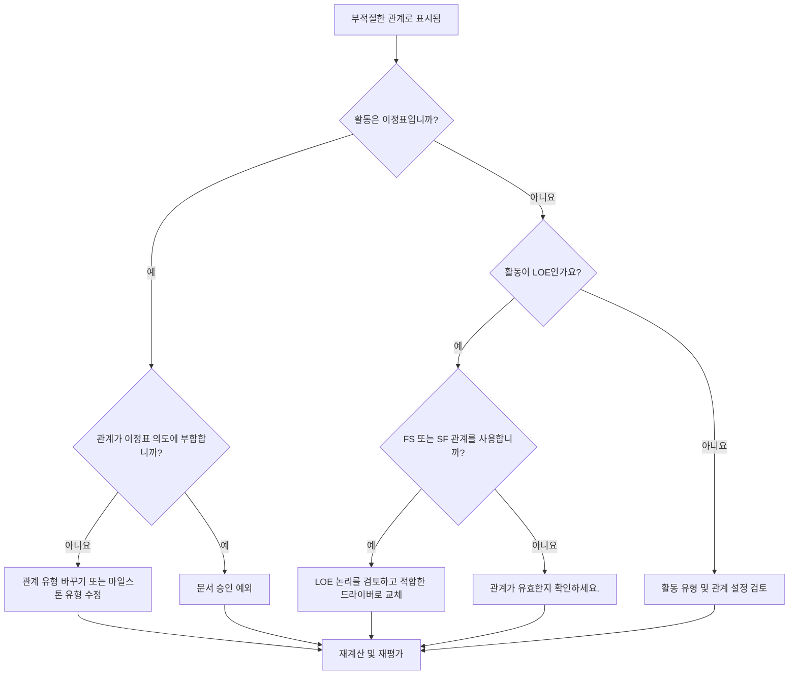

# Primavera P6의 부적절한 관계 - 개선 가이드

## 목적

이 가이드는 스케줄러가 Primavera P6의 완료 마일스톤, 시작 마일스톤 및 노력 수준(LOE) 활동과 관련된 부적절한 관계를 검토하고 수정하는 데 도움이 됩니다.

## 시작하기 전에

조치를 취하기 전에 다음 정보를 수집하십시오.

- 이 측정항목에 대한 현재 평가 결과입니다.
- 선행자, 후임자, 활동 유형 및 관계 유형별로 플래그가 지정된 관계 목록입니다.
- 활동 ID, 활동 이름, WBS, 활동 유형, 시작, 완료, 총 부동 및 중요 또는 가장 긴 경로 상태.
- 관계 유형, 지연, 선행 활동 유형 및 후속 활동 유형.
- 마일스톤 목적, LOE 목적 및 관련 보고 요구 사항.
- 데이터 날짜 및 최신 공정표 계산 출력.

## 결과 이해

강력한 결과는 해결되지 않은 부적절한 관계가 전혀 없다는 것입니다.

측정항목은 다음과 같은 경우에 플래그를 지정해야 합니다.

- SS 또는 SF 후임자로 마일스톤을 완료하세요.
- SS 전임자와 함께 마일스톤을 완료하세요.
- FF 또는 SF 이전 버전으로 Milestone을 시작하십시오.
- FS 또는 FF 후속 프로그램으로 Milestone을 시작하십시오.
- FS 관계가 있는 LOE.
- SF 관계가 있는 LOE.

드문 예외가 있을 수 있지만 공정표 검토 중에 이를 문서화하고 쉽게 설명할 수 있어야 합니다.

## 개선목표

목표는 해결되지 않은 부적절한 관계 0개입니다.

목표는 날짜를 강요하거나 약한 논리를 숨기지 않고 각 마일스톤과 LOE 관계가 의도한 일정 동작과 일치하도록 만드는 것입니다.

## 실천 계획

### 1단계: 주요 문제 식별

선행자 및 후임자 세부 정보와 함께 모든 마일스톤 및 LOE 활동을 표시하는 P6 레이아웃 또는 보고서를 만듭니다. 활동 유형, 관계 유형, 지연, 시작, 완료, 총 부동 및 중요 또는 최장 경로 표시기를 포함합니다.

표시된 각 관계를 검토하고 다음 사항에 대해 질문하십시오.

- 활동 유형이 올바른가요?
- 관계 유형이 마일스톤 또는 LOE의 목적과 일치합니까?
- 관계가 시작, 종료 또는 보고 날짜를 강제하려고 합니까?
- 일반적인 FS, SS 또는 FF 관계가 논리를 더 잘 표현합니까?
- 해당 관계는 승인된 예외인가요?

### 2단계: 권장 수정사항 적용

완료 마일스톤의 경우 논리가 완료를 주도하거나 응답하는지 확인합니다. 실제 완료 기반 종속성을 나타내지 않는 경우 SS 또는 SF 관계를 대체합니다.

시작 마일스톤의 경우 논리가 시작 이벤트를 지원하는지 확인합니다. 보고 날짜를 강제하는 데 사용되는 경우 FF, SF, FS 후임자 또는 기타 부적절한 관계를 교체하십시오.

LOE 활동의 경우 FS 또는 SF 관계가 LOE 드라이브 개별 작업을 잘못 만들고 있는지 검토합니다. LOE 활동은 일반적으로 다른 작업을 요약하거나 포괄하므로 해당 관계를 신중하게 처리해야 합니다.

계약, 고객 방식 또는 특별 일정 설계에 따라 관계가 유효한 경우 그 이유와 승인을 문서화합니다.

### 3단계: 일반적인 차단 요소 제거

일반적인 방해 요소에는 이전 일정에서 복사된 논리, 마일스톤 동작의 오해, SF 관계를 지름길로 사용, LOE 활동을 사용하여 개별 활동으로 주도되어야 하는 작업 제어 등이 포함됩니다.

또 다른 방해 요소는 관계 정리를 화장품으로 취급하는 것입니다. 이러한 링크는 유동, 주요 경로 보고, 마일스톤 날짜 및 공정표 신뢰성에 영향을 미칠 수 있습니다.

### 4단계: 변경 사항 확인

수정 후 공정표를 다시 계산합니다. 측정항목을 다시 실행하고 남은 각 항목이 수정, 정당화 또는 후속 조치를 위해 할당되었는지 확인하세요.

마일스톤 날짜, LOE 날짜, 총 여유, 중요 또는 최장 경로 및 주요 보고 출력을 검토하여 수정으로 인해 새로운 문제가 발생하지 않았는지 확인합니다.

## 개선 일정

### 1일차: 검토 및 진단

활동 유형 및 관계 패턴별로 지표 및 그룹 결과를 실행합니다.

### 2~3일: 우선순위 조치 구현

중요한, 거의 중요한, 계약, 인계, 고객 대면 마일스톤에 대한 관계를 먼저 수정하세요.

### 4~5일차: 초기 결과 모니터링

공정표를 다시 계산하고 유동, 주요 경로, 마일스톤 이동 및 LOE 동작을 검토합니다.

### 6일차: 최종 조정

스케줄러, 프로젝트 통제 책임자 또는 PMO 검토자와 함께 나머지 예외를 해결합니다.

### 7일차: 재평가 및 비교

평가를 다시 실행하고 결과를 목표 임계값과 비교합니다.

## 진행 상황 추적

간단한 추적기를 사용하여 수정 및 승인을 관리하세요.

| 날짜 | 취해진 조치 | 기대효과 | 결과/관찰 | 다음 단계 |
| --- | --- | --- | --- | --- |
| [날짜] | 부적절한 관계를 검토했습니다. | 관계 유형 문제 식별 | [관찰 결과] | 소유자 지정 |
| [날짜] | 수정된 이정표 관계 | 마일스톤 목적에 맞게 논리 조정 | [관찰 결과] | 일정 재계산 |
| [날짜] | 검토된 LOE 관계 | LOE가 개별 작업을 잘못 추진하는 것을 방지 | [관찰 결과] | 측정항목 재평가 |

## 결과가 개선되지 않는 경우

결과가 개선되지 않으면 가져오기, 로직 복사, 글로벌 변경 또는 외부 일정 통합을 통해 동일한 관계가 다시 도입되고 있는지 확인하세요.

해결되지 않은 항목이 계약상 중요 시점, 중요한 경로 보고, 고객 제출, 결제 이벤트 또는 인계 날짜에 영향을 미치는 경우 에스컬레이션합니다.

## 유지

각 업데이트 주기 동안과 기준 승인 전에 이 측정항목을 검토하세요. 이는 일정 가져오기, 조각 복사, 주요 재배열 및 마일스톤 개정 후에 특히 유용합니다.

## 요약 체크리스트

- [ ] 현재 결과가 검토되었습니다.
- [ ] 목표 임계값 확인됨
- [ ] 검토된 마일스톤 및 LOE 활동 유형
- [ ] 신고된 관계 유형이 선택됨
- [ ] 잘못된 관계가 수정되었습니다.
- [ ] 문서화된 유효한 예외
- [ ] 일정이 다시 계산되었습니다.
- [ ] 부동 및 중요 경로 검토
- [ ] 모니터링된 결과
- [ ] 평가가 반복됨
- [ ] 문서화된 다음 단계
## 관련 콘텐츠
- [01_overview_template](../14_unusual_relations/01_overview_template.md)
- [03_blog_template](../14_unusual_relations/03_blog_template.md)
- [일정이란 무엇입니까?](../../10b_blogs_ko/01_WHAT%20A%20SCHEDULE%20IS/01_blog.md)
- [견고한 논리](../../10b_blogs_ko/02_ROBUST%20LOGIC/02_ROBUST%20LOGIC.md)
