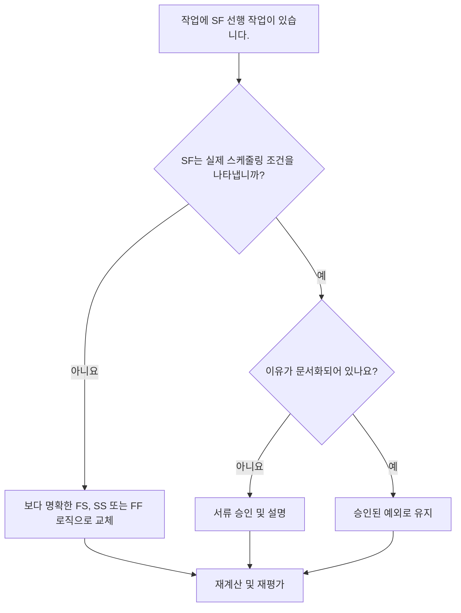

# Primavera P6에서 SF 선배들과 함께하는 업무 활동 - 개선 가이드

## 목적

이 가이드는 스케줄러가 Primavera P6에서 SF(Start-to-Finish) 선행 관계가 있는 작업 활동을 검토하고 수정하는 데 도움이 됩니다.

## 시작하기 전에

조치를 취하기 전에 다음 정보를 수집하십시오.

- 이 측정항목에 대한 현재 평가 결과입니다.
- SF 전임자가 하나 이상 있는 작업 활동 목록입니다.
- 활동 ID, 활동 이름, WBS, 활동 유형, 시작, 완료, 총 부동 및 중요 또는 가장 긴 경로 상태.
- 선행 활동 ID, 선행 활동 유형, 관계 유형 및 지연.
- 모든 제약조건, 달력, 예상 완료 조건 및 관련 업데이트 참고 사항.
- 데이터 날짜 및 최신 공정표 계산 출력.

## 결과 이해

강력한 결과는 SF 전임자 관계를 통해 해결되지 않은 작업 활동이 없다는 것입니다.

SF 관계는 선행 활동이 시작될 때까지 후속 활동을 완료할 수 없음을 의미합니다. 이는 일반적인 건설, 엔지니어링, 조달 또는 시운전 로직에서는 흔하지 않습니다. 대부분의 작업 관계는 실제 순서를 반영할 때 FS, SS 또는 FF 논리로 표현되어야 합니다.

약한 결과는 정당화하기 어렵거나 검토 없이 일정의 다른 부분에서 복사된 논리에 의해 작업 활동 완료가 제어될 수 있음을 의미합니다.

## 개선목표

목표는 작업 활동에 대한 해결되지 않은 SF 선행 관계가 0개입니다.

목표는 각 SF 관계가 유효한 스케줄링 모델인지 아니면 보다 명확한 논리로 대체되어야 하는지 확인하는 것입니다.

## 실천 계획

### 1단계: 주요 문제 식별

SF 전임자로 작업 활동을 필터링하는 P6 레이아웃 또는 보고서를 만듭니다. 선행자 및 후임자 ID, 활동 유형, 관계 유형, 지연, 시작, 완료, 총 부동, 제약조건 및 중요 또는 최장 경로 표시기를 포함합니다.

각 관계를 검토하고 질문하십시오.

- SF 관계가 표현하려는 현실은 무엇인가?
- 전임 시작이 실제로 후속 마무리를 제어해야 합니까?
- FS, SS 또는 FF 논리가 시퀀스를 더 명확하게 설명합니까?
- 날짜를 강제하는 데 지연이 사용됩니까?
- 관계가 임계 경로에 있습니까, 아니면 임계에 가까운 경로에 있습니까?
- SF를 사용하는 문서화된 이유가 있나요?

### 2단계: 권장 수정사항 적용

SF 관계가 실제 조건을 나타내지 않는 경우 시퀀스를 가장 잘 설명하는 관계 유형으로 바꿉니다. 선행 작업 완료 후 후속 작업이 시작되어야 하는 경우 FS를 사용하고, 시작이 연결된 경우 SS를, 마무리 정렬이 의도된 논리인 경우 FF를 사용합니다.

완료 날짜를 제어하기 위해 SF 관계가 추가된 경우 일정에 적절한 선행 작업, 마일스톤, 제약조건 검토 또는 활동 분할이 필요한지 검토하세요.

SF 관계가 유효한 경우, 필요한 이유와 승인한 사람을 문서로 기록하십시오. 이는 일반적인 일정 패턴이 아닌 드문 예외여야 합니다.

### 3단계: 일반적인 차단 요소 제거

일반적인 방해 요소로는 복사된 관계, 가져온 외부 논리, SF 동작에 대한 오해, 지연이 있는 SF를 사용하여 완료 날짜를 강제하는 등이 있습니다.

또 다른 방해 요인은 계산된 날짜가 적절해 보이기 때문에 관계를 떠나는 것입니다. 관계는 여전히 논리적으로 방어 가능해야 합니다.

### 4단계: 변경 사항 확인

수정 후 공정표를 다시 계산합니다. 메트릭을 다시 실행하고 나머지 각 SF 선행 작업이 수정, 정당화 또는 후속 조치를 위해 할당되었는지 확인합니다.

총 부동, 중요 또는 최장 경로, 영향을 받는 마일스톤 및 예측 출력을 검토하여 논리 변경으로 인해 새로운 문제가 발생하지 않았는지 확인합니다.

## 개선 일정

### 1일차: 검토 및 진단

지표를 실행하고, 데이터 날짜를 확인하고, 결과를 유효하지 않은 SF 관계, 가능한 예외, 소유자 입력이 필요한 항목으로 분리합니다.

### 2~3일: 우선순위 조치 구현

중요한, 거의 중요한, 계약 및 단기 활동에 대한 SF 관계를 먼저 수정합니다.

### 4~5일차: 초기 결과 모니터링

공정표를 다시 계산하고 여유시간, 주요 경로, 예측 날짜 및 마일스톤 이동을 검토합니다.

### 6일차: 최종 조정

스케줄러, 분야 책임자, 프로젝트 통제 책임자 또는 PMO 검토자와 함께 나머지 예외를 해결합니다.

### 7일차: 재평가 및 비교

평가를 다시 실행하고 결과를 목표 임계값과 비교합니다.

## 진행 상황 추적

간단한 추적기를 사용하여 수정 및 승인을 관리하세요.

| 날짜 | 취해진 조치 | 기대효과 | 결과/관찰 | 다음 단계 |
| --- | --- | --- | --- | --- |
| [날짜] | SF 선배들과 함께 과제 활동 검토 | 비정상적인 관계 논리 식별 | [관찰 결과] | 소유자 지정 |
| [날짜] | 유효하지 않은 SF 관계를 대체했습니다. | 논리 명확성 향상 | [관찰 결과] | 일정 재계산 |
| [날짜] | 문서화된 유효한 SF 예외 | 승인된 특수 로직 유지 | [관찰 결과] | 측정항목 재평가 |

## 결과가 개선되지 않는 경우

결과가 개선되지 않으면 SF 관계가 가져오기, 복사된 프래그넷, 글로벌 변경 또는 외부 일정 통합을 통해 다시 도입되고 있는지 확인하세요.

해결되지 않은 항목이 중요한 경로, 계약상 중요 시점, 고객 제출, 지불 이벤트 또는 단기 실행 작업에 영향을 미치는 경우 에스컬레이션합니다.

## 유지

모든 업데이트 주기 동안과 기준 승인 전에 이 측정항목을 검토하세요. 이는 일정 가져오기, 주요 재배열 및 논리 정리 연습 후에 특히 유용합니다.

## 요약 체크리스트

- [ ] 현재 결과가 검토되었습니다.
- [ ] 목표 임계값 확인됨
- [ ] SF 선행자 목록이 생성되었습니다.
- [ ] 중요하고 거의 중요한 항목의 우선순위 지정
- [ ] 잘못된 SF 관계가 수정되었습니다.
- [ ] 문서화된 유효한 예외
- [ ] 일정이 다시 계산되었습니다.
- [ ] 부동 및 중요 경로 검토
- [ ] 모니터링된 결과
- [ ] 평가가 반복됨
- [ ] 문서화된 다음 단계
## 관련 콘텐츠
- [Primavera P6에서 SF 선배들과 함께하는 업무 활동 - 개요](01_overview_template.md)
- [Primavera P6에서 SF 선배들과 함께하는 업무 활동](03_blog_template.md)
- [일정이란 무엇입니까?](../../10b_blogs_ko/01_WHAT%20A%20SCHEDULE%20IS/01_blog.md)
- [견고한 논리](../../10b_blogs_ko/02_ROBUST%20LOGIC/02_ROBUST%20LOGIC.md)
