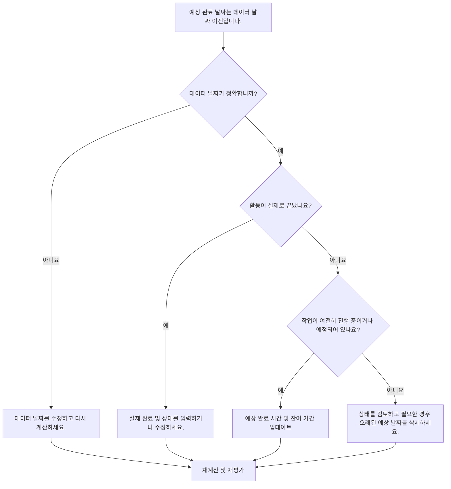

## 목적

이 가이드는 스케줄러가 예상 완료 날짜가 Primavera P6 데이터 날짜보다 빠른 활동을 검토하고 수정하는 데 도움이 됩니다. 예상 날짜를 현재 보고 경계에 맞게 유지하여 더욱 깔끔한 업데이트 규칙을 지원합니다.

## 시작하기 전에

조치를 취하기 전에 다음 정보를 수집하십시오.

- 이 측정항목에 대한 현재 평가 결과입니다.
- 최신 공정표 업데이트에 사용된 프로젝트 데이터 날짜입니다.
- 예상 완료 날짜가 데이터 날짜보다 빠른 활동 목록입니다.
- 활동 상태, 실제 시작, 실제 완료, 잔여 기간, 완료율, 시작, 완료 및 총 부동 시간.
- 수동 입력, 가져오기 파일, 현장 예측 또는 P6 업데이트 워크플로와 같은 예상 완료 소스입니다.
- 프로젝트 업데이트 차단 규칙 및 최신 진행 상황 노트.

## 결과 이해

강력한 결과는 데이터 날짜 이전에 예상 완료가 발생한 활동이 0인 것입니다.

데이터 날짜 이전의 예상 완료는 일반적으로 일정이 진행될 때 예측 또는 예상 완료 정보가 업데이트되지 않았음을 의미합니다. 또한 활동에 실제 완료, 수정된 잔여 기간 또는 수정된 상태가 있어야 함을 나타낼 수도 있습니다.

약한 결과는 일정에 현재 업데이트 경계를 기준으로 과거에 있는 예상 완료 날짜가 포함되어 있음을 의미합니다.

## 개선목표

목표는 데이터 날짜 이전에 완료가 예상되는 미해결 활동 0개입니다.

목표는 각 활동이 완료되었는지, 아직 진행 중인지, 시작되지 않았는지, 잘못 업데이트되었는지 확인하는 것입니다.

## 실천 계획

### 1단계: 주요 문제 식별

예상 완료 날짜가 데이터 날짜보다 빠른 활동을 필터링하는 P6 레이아웃 또는 보고서를 만듭니다. 활동 ID, 활동 이름, WBS, 활동 상태, 예상 완료, 실제 시작, 실제 완료, 잔여 기간, 완료율, 시작, 완료, 총 부동 및 달력을 포함합니다.

각 활동을 검토하고 질문하십시오.

- 데이터 날짜가 정확합니까?
- 활동이 실제로 데이터 날짜 이전에 완료되었습니까?
- 완료되면 실제 완료가 누락됩니까?
- 완료되지 않은 경우 예상 완료를 업데이트해야 합니까?
- 잔여 기간은 여전히 ​​남은 작업을 나타냅니까?
- 가져오기 또는 수동 업데이트로 인해 이전 예상 마감 값이 그대로 남아 있습니까?

### 2단계: 권장 수정사항 적용

데이터 날짜가 잘못된 경우 승인된 보고 기간에 따라 수정하고 공정표를 다시 계산합니다.

활동이 데이터 날짜 이전에 완료된 경우 실제 완료를 입력하거나 수정하고 활동 상태, 완료율 및 잔여 기간이 일치하는지 확인합니다.

활동이 여전히 활성 상태이거나 완료되지 않은 경우 예상 완료를 데이터 날짜 또는 그 이후의 유효한 날짜로 업데이트합니다. 잔여 기간을 확인하고 예측 날짜에 최신 필드 정보가 반영됩니다.

예상 마감이 가져오기를 통해 도입된 경우 오래된 예상 날짜가 반복적으로 로드되지 않도록 가져오기 파일과 매핑을 검토하세요.

### 3단계: 일반적인 차단 요소 제거

일반적인 방해 요소에는 오래된 현장 예측, 완료율을 업데이트하지만 예상 날짜는 아닌 진행률 가져오기, 예상 완료, 예측 완료 및 실제 완료 간의 혼동이 포함됩니다.

또 다른 방해 요인은 예정된 날짜가 적절해 보이기 때문에 예상 완료를 무시하는 것입니다. P6에서는 설정 및 작업 흐름에 따라 예상 날짜가 공정표 계산에 영향을 미칠 수 있으므로 오래된 값을 검토해야 합니다.

### 4단계: 변경 사항 확인

수정 후 공정표를 다시 계산합니다. 측정항목을 다시 실행하고 데이터 날짜 이전에 해결되지 않은 예상 완료 날짜가 남아 있지 않은지 확인하세요.

진행 중인 활동, 단기 예측, 총 여유 시간, 마일스톤 날짜 및 일정 비교 보고서를 검토하여 수정으로 인해 새로운 불일치가 발생하지 않았는지 확인합니다.

## 개선 일정

### 1일차: 검토 및 진단

측정항목을 실행하고 데이터 날짜를 확인한 후 결과를 완료된 작업, 오래된 예상 날짜, 잔여 기간 문제, 가져오기 문제로 구분합니다.

### 2~3일: 우선순위 조치 구현

보고에 사용된 활동을 먼저 수정하세요. 필요에 따라 실제 완료, 예상 완료, 잔여 기간, 완료율 또는 활동 상태를 업데이트합니다.

### 4~5일차: 초기 결과 모니터링

공정표를 다시 계산하고 미리보기 보고서, 진행 중인 활동 목록, 마일스톤 이동 및 여유시간 변화을 검토합니다.

### 6일차: 최종 조정

책임 있는 분야, 현장 책임자 또는 프로젝트 통제 책임자와 함께 나머지 불확실한 항목을 해결하십시오.

### 7일차: 재평가 및 비교

평가를 다시 실행하고 결과를 목표 임계값과 비교합니다.

## 진행 상황 추적

간단한 추적기를 사용하여 수정 및 승인을 관리하세요.

| 날짜 | 취해진 조치 | 기대효과 | 결과/관찰 | 다음 단계 |
| --- | --- | --- | --- | --- |
| [날짜] | 데이터 날짜 이전의 예상 완료를 검토했습니다. | 오래된 예상 날짜 식별 | [관찰 결과] | 소유자 지정 |
| [날짜] | 업데이트된 예상 완료 또는 실제 완료 | 상태를 업데이트 경계에 맞춰 정렬 | [관찰 결과] | 일정 재계산 |
| [날짜] | 가져오기 프로세스를 검토했습니다. | 반복되는 오래된 예상 날짜 방지 | [관찰 결과] | 측정항목 재평가 |

## 결과가 개선되지 않는 경우

결과가 개선되지 않으면 검증 없이 현장 시스템, 스프레드시트 또는 이전 업데이트 파일에서 예상 날짜를 가져오고 있는지 확인하십시오. 업데이트 워크플로를 검토하고 예상 완료 업데이트를 소유한 사람이 누구인지 확인하세요.

해결되지 않은 항목이 중요, 거의 중요, 고객 보고, 지불, 인계 또는 단기 실행 작업에 영향을 미치는 경우 에스컬레이션합니다.

## 유지

보고서를 발행하기 전에 모든 업데이트 주기 동안 이 측정항목을 검토하세요. 이는 데이터 날짜, 실제 일자, 잔여 기간, 완료율 및 활동 상태 확인과 함께 표준 상태 검증의 일부여야 합니다.

## 요약 체크리스트

- [ ] 현재 결과가 검토되었습니다.
- [ ] 목표 임계값 확인됨
- [ ] 데이터 날짜 확인
- [ ] 예상 완료 목록이 생성되었습니다.
- [ ] 실제 완료로 완료된 작업
- [ ] 오래된 예상 완료 날짜가 업데이트되었습니다.
- [ ] 잔여 기간 확인됨
- [ ] 활동 상태 및 완료율 확인
- [ ] 가져오기 또는 업데이트 워크플로가 검토됨
- [ ] 일정이 다시 계산되었습니다.
- [ ] 평가가 반복됨
- [ ] 문서화된 다음 단계
## 관련 콘텐츠
- [Primavera P6의 데이터 날짜 이전 예상 완료](03_blog_template.md)
- [일정이란 무엇입니까?](../../10b_blogs_ko/01_WHAT%20A%20SCHEDULE%20IS/01_blog.md)
- [견고한 논리](../../10b_blogs_ko/02_ROBUST%20LOGIC/02_ROBUST%20LOGIC.md)
