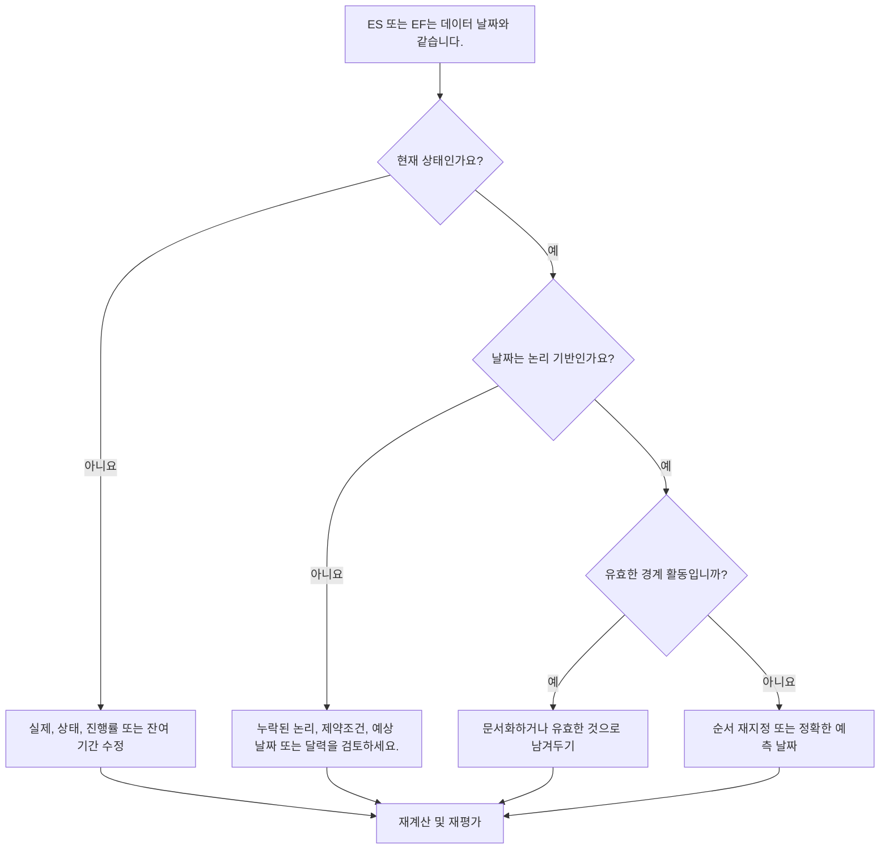

## 목적

이 가이드는 스케줄러가 조기 시작 또는 조기 완료가 정확히 Primavera P6 데이터 날짜에 해당하는 활동을 검토하는 데 도움이 됩니다. 실제 성과와 예측 작업 사이의 경계에서 작업이 수집되는 위치를 보여줌으로써 업데이트 주기 확인을 지원합니다.

## 시작하기 전에

조치를 취하기 전에 다음 정보를 수집하십시오.

- 이 측정항목에 대한 현재 평가 결과입니다.
- 최신 공정표 계산에 사용된 프로젝트 데이터 날짜입니다.
- 조기 시작 = 데이터 날짜인 활동 목록입니다.
- 조기 완료 = 데이터 날짜인 활동 목록입니다.
- 활동 상태, 실제 시작, 실제 완료, 잔여 기간, 시작, 완료, 총 부동 시간 및 달력.
- 전임자 및 후임자 관계 세부정보입니다.
- 제약조건, 예상 날짜 및 업데이트 참고 사항.

## 결과 이해

데이터 날짜의 조기 시작 또는 조기 완료를 통해 설명할 수 없는 활동이 없는 것이 강력한 결과입니다.

일부 활동, 특히 진행할 준비가 된 단기 작업이나 업데이트 경계에서 완료되는 작업 등 일부 활동은 합법적으로 데이터 날짜에 있을 수 있습니다. 문제는 날짜만이 아닙니다. 문제는 날짜가 유효한 상태, 논리, 업데이트 정보로 설명되는지 여부입니다.

약한 결과는 명확한 일정 이유 없이 데이터 날짜에 많은 활동이 수집되고 있음을 의미합니다.

## 개선목표

목표는 ES = 데이터 날짜 또는 EF = 데이터 날짜인 설명되지 않는 활동 0개입니다.

목표는 각 활동의 상태가 올바르게 지정되고, 논리적으로 주도되고, 올바른 업데이트 경계에서 예측되는지 확인하는 것입니다.

## 실천 계획

### 1단계: 주요 문제 식별

조기 시작이 데이터 날짜와 같거나 조기 완료가 데이터 날짜와 같은 활동을 필터링하는 P6 레이아웃 또는 보고서를 만듭니다. 활동 ID, 활동 이름, WBS, 활동 상태, 조기 시작, 조기 완료, 시작, 완료, 실제 시작, 실제 완료, 잔여 기간, 총 부동 시간, 달력, 제약조건, 선행 작업 및 후속 작업을 포함합니다.

각 활동을 검토하고 질문하십시오.

- 활동이 완료되었습니까, 진행 중입니까, 아니면 시작되지 않았습니까?
- 실제 시작 또는 실제 완료가 누락되었습니까?
- 활동이 데이터 날짜를 기준으로 논리적으로 이루어집니까?
- 제약조건, 예상 날짜 또는 달력이 활동을 데이터 날짜로 푸시합니까?
- 활동이 개방형입니까, 아니면 약하게 연결되어 있습니까?
- 업데이트 기간에 대한 데이터 날짜가 정확합니까?

### 2단계: 권장 수정사항 적용

상태가 불완전한 경우 로직을 변경하기 전에 실제 시작, 실제 완료, 잔여 기간, 완료율 및 활동 상태를 수정하세요.

선행 로직이 누락되었거나 주도되지 않아 데이터 날짜에 활동이 시작되는 경우 실제 작업 순서를 나타내는 관계를 추가하거나 수정합니다.

진행상황이 업데이트되지 않아 데이터 날짜에 활동이 종료되는 경우 업데이트 경계까지 작업이 완료되었는지 확인합니다. 완료되면 실제 완료를 입력하고, 작업이 남아 있으면 잔여 기간을 업데이트하고 완료를 예측합니다.

제약조건이나 예상 날짜로 인해 활동이 데이터 날짜로 밀려나는 경우 프로젝트 통제 절차에 따라 해당 활동을 제거, 수정 또는 문서화하세요.

### 3단계: 일반적인 차단 요소 제거

일반적인 방해 요인으로는 불완전한 실현, 개방형 시작, 개방형 종료, 논리 대신 사용되는 제약조건, 충분한 상태 검토가 없는 데이터 날짜 이동 등이 있습니다.

또 다른 방해 요인은 데이터 날짜의 활동이 무해하다고 가정하는 것입니다. 업데이트 경계에 있는 대규모 클러스터는 누락된 순서를 숨기거나 단기 예측을 실제보다 더 깔끔하게 보이게 만들 수 있습니다.

### 4단계: 변경 사항 확인

수정 후 공정표를 다시 계산합니다. 메트릭을 다시 실행하고 데이터 날짜의 나머지 각 활동이 현재 상태, 유효한 논리 또는 승인된 예외로 설명되는지 확인합니다.

수정 사항으로 인해 새로운 불일치가 발생하지 않았는지 확인하려면 총 여유 시간, 중요 경로 또는 최장 경로, 마일스톤 날짜, 단기 예측 보고서를 검토하세요.

## 개선 일정

### 1일차: 검토 및 진단

메트릭을 실행하고, 데이터 날짜를 확인하고, 결과를 데이터 날짜의 ES, 데이터 날짜의 EF, 상태 문제, 논리 문제, 제약조건 및 유효한 경계 활동으로 구분합니다.

### 2~3일: 우선순위 조치 구현

중요하고, 거의 중요하며, 단기적인 활동을 먼저 수정하십시오. 상태를 업데이트하고, 논리를 추가 또는 수정하고, 제약조건을 검토하세요.

### 4~5일차: 초기 결과 모니터링

공정표를 다시 계산하고 미리보기 출력, 여유시간 변화, 중요 시점 이동 및 데이터 날짜에 아직 남아 있는 활동을 검토합니다.

### 6일차: 최종 조정

책임 있는 분야, 현장 책임자 또는 프로젝트 통제 책임자와 함께 나머지 불확실한 항목을 해결하십시오.

### 7일차: 재평가 및 비교

평가를 다시 실행하고 결과를 목표 임계값과 비교합니다.

## 진행 상황 추적

간단한 추적기를 사용하여 수정 및 승인을 관리하세요.

| 날짜 | 취해진 조치 | 기대효과 | 결과/관찰 | 다음 단계 |
| --- | --- | --- | --- | --- |
| [날짜] | 데이터 날짜에 대한 ES/EF 검토 | 경계 클러스터링 식별 | [관찰 결과] | 소유자 지정 |
| [날짜] | 수정된 상태 또는 실제 일자 | 작업 상태를 업데이트 경계에 맞춥니다. | [관찰 결과] | 일정 재계산 |
| [날짜] | 논리 또는 제약조건 수정 | 설명되지 않는 데이터 날짜 클러스터링 감소 | [관찰 결과] | 측정항목 재평가 |

## 결과가 개선되지 않는 경우

결과가 개선되지 않으면 논리, 제약조건, 오래된 예상 날짜 또는 불완전한 업데이트 절차로 인해 활동이 반복적으로 데이터 날짜로 당겨지는지 확인하십시오.

해결되지 않은 항목이 중요, 거의 중요, 고객 보고, 인계, 지불 또는 단기 실행 작업에 영향을 미치는 경우 에스컬레이션합니다.

## 유지

보고서를 발행하기 전에 모든 업데이트 주기 동안 이 측정항목을 검토하세요. 이는 데이터 날짜 이동, 진행률 가져오기, 작업 순서 재지정 또는 주요 상태 변경 후 재계산 후에 특히 유용합니다.

## 요약 체크리스트

- [ ] 현재 결과가 검토되었습니다.
- [ ] 목표 임계값 확인됨
- [ ] 데이터 날짜 확인
- [ ] ES = 활동이 검토된 데이터 날짜
- [ ] EF = 활동이 검토된 데이터 날짜
- [ ] 상태 및 실제 일자 확인
- [ ] 잔여 기간 확인됨
- [ ] 논리 및 제약조건 검토
- [ ] 문서화된 유효한 경계 활동
- [ ] 일정이 다시 계산되었습니다.
- [ ] 평가가 반복됨
- [ ] 문서화된 다음 단계
## 관련 콘텐츠
- [데이터 날짜의 활동: Primavera P6의 조기 시작 및 조기 완료 확인](03_blog_template.md)
- [일정이란 무엇입니까?](../../10b_blogs_ko/01_WHAT%20A%20SCHEDULE%20IS/01_blog.md)
- [견고한 논리](../../10b_blogs_ko/02_ROBUST%20LOGIC/02_ROBUST%20LOGIC.md)
