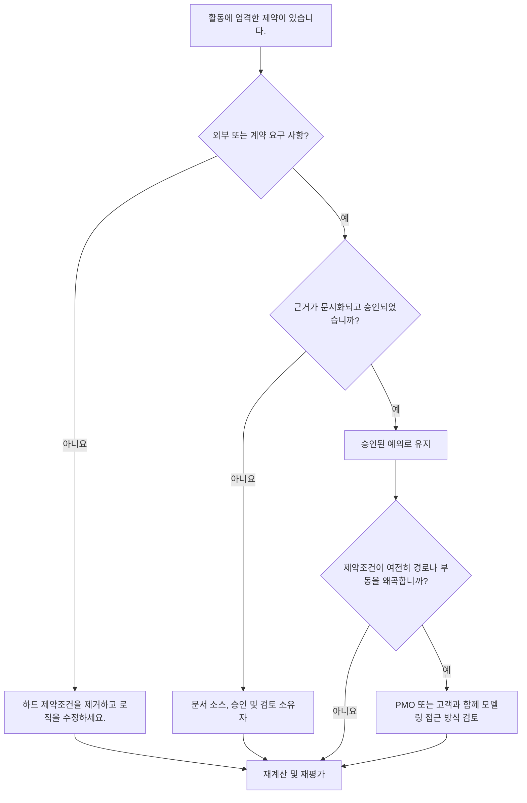

## 목적

이 가이드는 스케줄러가 Primavera P6의 엄격한 제약조건을 검토하고 줄이는 데 도움이 됩니다. 이는 활동 날짜, 특히 필수 시작 및 필수 완료를 강력하게 제어하는 ​​제약조건에 중점을 둡니다.

## 시작하기 전에

조치를 취하기 전에 다음 정보를 수집하십시오.

- 이 측정항목에 대한 현재 평가 결과입니다.
- 엄격한 제약이 있는 활동 목록입니다.
- 각 활동에 대한 제약 유형 및 제약 날짜.
- 활동 ID, 활동 이름, WBS, 활동 상태, 시작, 완료, 총 부동 및 중요 또는 가장 긴 경로 상태.
- 전임자 및 후임자 관계 세부정보입니다.
- 필요한 제약에 대한 계약, 고객, 허가, 접근, 규제 또는 인계 기준.
- 제약조건이 추가된 시기를 보여주는 기준 또는 이전 업데이트 비교입니다.

## 결과 이해

강력한 결과는 설명할 수 없는 엄격한 제약조건이 없다는 것입니다.

엄격한 제약조건은 일반 CPM 계산을 재정의하거나 크게 제한할 수 있습니다. 이는 계약 날짜, 액세스 창, 허가 릴리스, 규제 보류 지점 또는 소유자 지시 요구 사항에 대해 유효할 수 있지만 누락된 논리를 대체하여 사용해서는 안 됩니다.

약한 결과는 일정에 네트워크 논리 대신 예측을 제어할 수 있는 부과된 날짜가 포함되어 있음을 의미합니다.

## 개선목표

목표는 설명할 수 없는 하드 제약조건이 0개입니다.

목표는 불필요한 하드 제약조건을 제거하고 실제로 필요한 모든 제약조건을 문서화하는 것입니다.

## 실천 계획

### 1단계: 주요 문제 식별

엄격한 제약 유형이 있는 활동을 필터링하는 P6 레이아웃 또는 보고서를 만듭니다. 활동 ID, 활동 이름, WBS, 활동 상태, 시작, 완료, 제약 유형, 제약 날짜, 총 부동, 중요 또는 최장 경로 상태, 선행 작업 및 후속 작업을 포함합니다.

제한된 각 활동을 검토하고 다음 사항을 질문하십시오.

- 하드 제약조건의 원인은 무엇입니까?
- 계약상으로 필요한가요, 아니면 외부적으로 필요한가요?
- 누락된 선행자 또는 후속자 논리를 대체하는 것입니까?
- 일정에 따라 예측해야 하는 목표 날짜를 강요하는 것입니까?
- 총 유동량, 주요 경로 또는 마일스톤 보고에 영향을 줍니까?
- 그 이유가 문서화되고 승인되었습니까?

### 2단계: 권장 수정사항 적용

하드 제약조건이 외부적으로 필요하지 않은 경우 이를 제거하고 CPM 로직을 추가하거나 수정하세요. 날짜를 강요하는 대신 관계, 활동 순서, 달력 및 현실적인 기간을 사용하여 작업을 모델링하세요.

엄격한 제약조건이 필요한 경우 근거를 문서화하세요. 소스, 승인, 날짜, 책임 소유자 및 정상적인 논리로 모델링할 수 없는 이유를 캡처합니다.

목표 날짜를 유지하기 위해 제약조건을 사용하는 경우 더 유연한 제약조건, 마일스톤, 마감일 또는 보고 메모가 더 적절한지 검토하세요.

### 3단계: 일반적인 차단 요소 제거

일반적인 차단 요인에는 이전 기준에서 상속된 제약조건, 필수 날짜로 입력된 클라이언트 대상 날짜, 임시 제약조건을 남겨둔 복구 계획, 인터페이스 논리 누락 등이 있습니다.

또 다른 방해 요인은 날짜가 중요하기 때문에 엄격한 제약조건이 허용된다고 가정하는 것입니다. 중요한 날짜는 표시되어야 하지만 일정은 작업이 어떻게 도달하는지 설명해야 합니다.

### 4단계: 변경 사항 확인

수정 후 공정표를 다시 계산합니다. 측정항목을 다시 실행하고 나머지 엄격한 제약조건이 승인되고 문서화되었는지 확인하세요.

수정 사항으로 인해 예상치 못한 움직임이 발생하지 않았는지 확인하려면 총 여유, 중요 또는 최장 경로, 마일스톤 날짜 및 일정 비교 결과를 검토하세요.

## 개선 일정

### 1일차: 검토 및 진단

WBS, 제약 유형, 중요도 및 문서화된 기준별로 측정항목 및 그룹 결과를 실행합니다.

### 2~3일: 우선순위 조치 구현

중요하고, 거의 중요하고, 계약적이며, 단기적인 활동에서 불필요한 하드 제약조건을 먼저 제거하세요. 필요한 곳에 누락된 논리를 추가하세요.

### 4~5일차: 초기 결과 모니터링

공정표를 다시 계산하고 여유시간 이동, 주요 경로 변경 및 마일스톤 영향을 검토합니다.

### 6일차: 최종 조정

스케줄러, 프로젝트 통제 책임자, PMO 검토자 또는 고객 담당자와 함께 나머지 예외를 해결합니다.

### 7일차: 재평가 및 비교

평가를 다시 실행하고 결과를 목표 임계값과 비교합니다.

## 진행 상황 추적

간단한 추적기를 사용하여 수정 및 승인을 관리하세요.

| 날짜 | 취해진 조치 | 기대효과 | 결과/관찰 | 다음 단계 |
| --- | --- | --- | --- | --- |
| [날짜] | 하드 제약조건을 검토했습니다. | 부과된 날짜 통제 식별 | [관찰 결과] | 소유자 지정 |
| [날짜] | 불필요한 하드 제약을 제거했습니다. | 논리 기반 계산 복원 | [관찰 결과] | 일정 재계산 |
| [날짜] | 문서화된 승인된 하드 제약조건 | 정당한 예외 유지 | [관찰 결과] | 측정항목 재평가 |

## 결과가 개선되지 않는 경우

결과가 개선되지 않으면 가져오기, 복사된 단편, 기준 업데이트 또는 복구 일정 변경을 통해 엄격한 제약조건이 다시 도입되고 있는지 확인하세요.

해결되지 않은 항목이 중요한 경로, 계약상 중요 시점, 고객 보고, 지연 분석, 지불 이벤트 또는 인계 날짜에 영향을 미치는 경우 에스컬레이션합니다.

## 유지

모든 업데이트 주기 동안과 기준 승인 전에 이 측정항목을 검토하세요. 엄격한 제약조건은 특히 주요 재배치, 복구 계획 및 클라이언트 제출 준비 후에 표준 일정 상태 점검의 일부가 되어야 합니다.

## 요약 체크리스트

- [ ] 현재 결과가 검토되었습니다.
- [ ] 목표 임계값 확인됨
- [ ] 하드 제약조건 목록이 생성되었습니다.
- [ ] 제약조건 유형 및 날짜 확인
- [ ] 외부 근거 확정
- [ ] 불필요한 하드 제약조건이 제거되었습니다.
- [ ] 누락된 논리가 수정되었습니다.
- [ ] 승인된 예외 사항이 문서화됨
- [ ] 일정이 다시 계산되었습니다.
- [ ] 부동 및 중요 경로 검토
- [ ] 평가가 반복됨
- [ ] 문서화된 다음 단계
## 관련 콘텐츠
- [Primavera P6의 하드 제약조건](03_blog_template.md)
- [일정이란 무엇입니까?](../../10b_blogs_ko/01_WHAT%20A%20SCHEDULE%20IS/01_blog.md)
- [견고한 논리](../../10b_blogs_ko/02_ROBUST%20LOGIC/02_ROBUST%20LOGIC.md)
