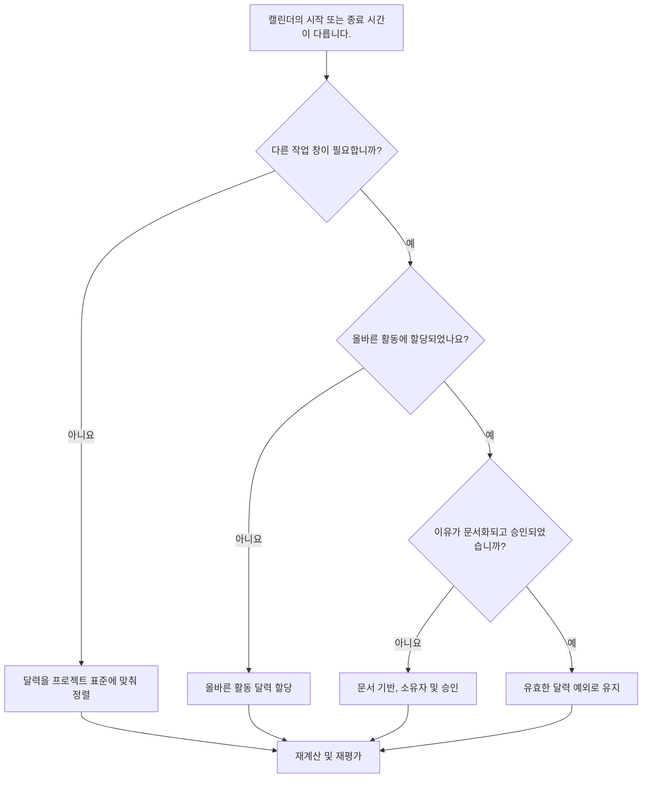

# Primavera P6에서 시작 및 종료 시간이 다른 달력 - 개선 가이드

## 목적

이 가이드는 스케줄러가 다양한 근무 시작 또는 종료 시간을 사용하는 Primavera P6 달력을 검토하는 데 도움이 됩니다. 달력의 시차가 의도적이고 승인되었으며 이해되었는지 확인하여 공정표 품질 점검을 지원합니다.

## 시작하기 전에

조치를 취하기 전에 다음 정보를 수집하십시오.

- 이 측정항목에 대한 현재 평가 결과입니다.
- 승인된 프로젝트 달력 표준 및 일반 일일 작업 창.
- 시작 시간, 종료 시간, 교대 근무 기간 또는 부분일 패턴이 다른 달력 목록입니다.
- 영향을 받는 각 달력에 할당된 활동입니다.
- 글로벌, 프로젝트 또는 자원 달력과 같은 달력 유형입니다.
- 영향을 받는 캘린더를 사용하는 중요하거나 거의 중요한 활동입니다.
- 야간 근무, 정전 근무, 출입 제한, 특별 근무 일정 등 비표준 달력의 각 이유입니다.

## 결과 이해

강력한 결과는 시작 또는 종료 시간이 다른 설명할 수 없는 달력이 없다는 것입니다.

작업이 실제로 다른 교대조, 액세스 창 또는 자원 가용성을 따르는 경우 달력 차이가 유효할 수 있습니다. 문제는 명확한 이유 없이 달력이 시간대별로 다른 경우입니다.

약한 결과는 일정에 날짜, 여유시간 및 논리 동작에 영향을 미치는 숨겨진 달력 가정이 포함될 수 있음을 의미합니다.

## 개선목표

대상은 시작 또는 종료 시간이 다른 설명할 수 없는 달력 0개입니다.

목표는 각기 다른 작업 창이 필요하고, 문서화되고, 올바른 활동에만 할당되는지 확인하는 것입니다.

## 실천 계획

### 1단계: 주요 문제 식별

P6에서 달력 검토 내보내기를 생성하거나 각 달력, 정상 근무일 시작 시간, 종료 시간, 일일 시간, 예외 및 할당된 활동을 나열하는 일정 평가 도구를 만듭니다.

각각의 비표준 달력을 검토하고 다음 사항을 질문하십시오.

- 프로젝트에 대해 승인된 표준 근무일은 언제입니까?
- 어떤 달력에서 다른 시작 또는 종료 시간을 사용합니까?
- 그 차이는 의도적인가, 우연인가?
- 각 달력을 사용하는 활동은 무엇입니까?
- 중요하거나 거의 중요한 활동이 영향을 받나요?
- 달력상의 차이가 문서화되고 승인되었습니까?

### 2단계: 권장 수정사항 적용

우연한 일정 차이가 발생한 경우 시작 시간, 종료 시간 및 일일 작업 기간을 승인된 프로젝트 표준에 맞춥니다.

달력상의 차이가 유효한 경우 그 이유를 문서로 기록하십시오. 일반적으로 유효한 사례에는 야간 근무, 주말 근무, 종료 기간, 소유자 액세스 제한, 환경 제한 또는 자원별 작업 기간이 포함됩니다.

활동이 잘못된 달력에 할당된 경우 달력 자체를 변경하기 전에 활동 달력 할당을 수정하십시오. 유효한 특수 달력이 너무 광범위하게 할당되면 여전히 문제가 발생할 수 있습니다.

### 3단계: 일반적인 차단 요소 제거

일반적인 차단에는 이전 일정에서 복사된 달력, 숨겨진 시간 설정이 있는 가져온 달력, 활동 달력으로 사용되는 리소스 달력 및 표준 날짜 레이아웃에 표시되지 않는 작은 시간 차이가 포함됩니다.

또 다른 방해 요소는 시간 없이 날짜만 검토하는 것입니다. P6에서는 시간이 활동 배치, 여유시간, 관계 동작 및 명백한 일일 날짜 이동에 영향을 미칠 수 있습니다.

### 4단계: 변경 사항 확인

달력 수정 후 공정표를 다시 계산합니다. 측정항목을 다시 실행하고 남은 일정 차이가 유효하고 문서화되어 있는지 확인하세요.

영향을 받은 활동 날짜, 총 여유 공간, 중요 또는 최장 경로, 관계 연결 및 단기 예측 보고서를 검토하여 수정으로 인해 예상치 못한 움직임이 발생하지 않았는지 확인합니다.

## 개선 일정

### 1일차: 검토 및 진단

달력, 작업 창, 달력 유형, 할당된 활동 및 중요도별로 지표 및 그룹 결과를 실행합니다.

### 2~3일: 우선순위 조치 구현

중요한 활동, 거의 중요한 활동, 단기 활동에 대한 우발적인 일정 시간 차이와 잘못된 활동 일정 할당을 먼저 수정하세요.

### 4~5일차: 초기 결과 모니터링

공정표를 다시 계산하고 부동 이동, 날짜 변경, 마일스톤 영향 및 예측 변경 사항을 검토합니다.

### 6일차: 최종 조정

스케줄러, 분야 소유자, 프로젝트 통제 책임자 또는 PMO 검토자와 함께 남은 달력 예외를 해결합니다.

### 7일차: 재평가 및 비교

평가를 다시 실행하고 결과를 목표 임계값과 비교합니다.

## 진행 상황 추적

간단한 추적기를 사용하여 수정 및 승인을 관리하세요.

| 날짜 | 취해진 조치 | 기대효과 | 결과/관찰 | 다음 단계 |
| --- | --- | --- | --- | --- |
| [날짜] | 캘린더 시작 및 종료 시간을 검토했습니다. | 비표준 작업 창 식별 | [관찰 결과] | 소유자 지정 |
| [날짜] | 프로젝트 표준에 맞춰 달력 정렬 | 실수로 인한 시차 제거 | [관찰 결과] | 일정 재계산 |
| [날짜] | 문서화된 유효한 달력 예외 | 정당한 작업 창 유지 | [관찰 결과] | 측정항목 재평가 |

## 결과가 개선되지 않는 경우

결과가 개선되지 않으면 가져오기, 일정 복사, 자원 할당 또는 기준 업데이트를 통해 비표준 달력이 다시 도입되고 있는지 확인하세요.

주요 경로, 고객 보고, 지불 일정, 중단 작업, 인계 날짜 또는 단기 실행에 영향을 미치는 경우 해결되지 않은 일정 차이를 에스컬레이션하세요.

## 유지

기준선 개발, 가져오기 예약 및 모든 주요 업데이트 주기 동안 이 측정항목을 검토하세요. 달력 시간 설정은 보고서가 발행되기 전에 표준 일정 상태 점검의 일부여야 합니다.

## 요약 체크리스트

- [ ] 현재 결과가 검토되었습니다.
- [ ] 목표 임계값 확인됨
- [ ] 프로젝트 달력 기준 확정
- [ ] 비표준 달력 시간 식별
- [ ] 할당된 활동을 검토했습니다.
- [ ] 심각하고 거의 치명적인 영향이 확인되었습니다.
- [ ] 우연한 달력 차이가 수정되었습니다.
- [ ] 유효한 달력 예외 사항이 문서화됨
- [ ] 일정이 다시 계산되었습니다.
- [ ] 날짜 및 여유시간 변경 사항이 검토되었습니다.
- [ ] 평가가 반복됨
- [ ] 문서화된 다음 단계
## 관련 콘텐츠
- [Primavera P6에서 시작 및 종료 시간이 다른 달력 - 개요](01_overview_template.md)
- [Primavera P6에서 시작 및 종료 시간이 다른 달력](03_blog_template.md)
- [일정이란 무엇입니까?](../../10b_blogs_ko/01_WHAT%20A%20SCHEDULE%20IS/01_blog.md)
- [견고한 논리](../../10b_blogs_ko/02_ROBUST%20LOGIC/02_ROBUST%20LOGIC.md)
