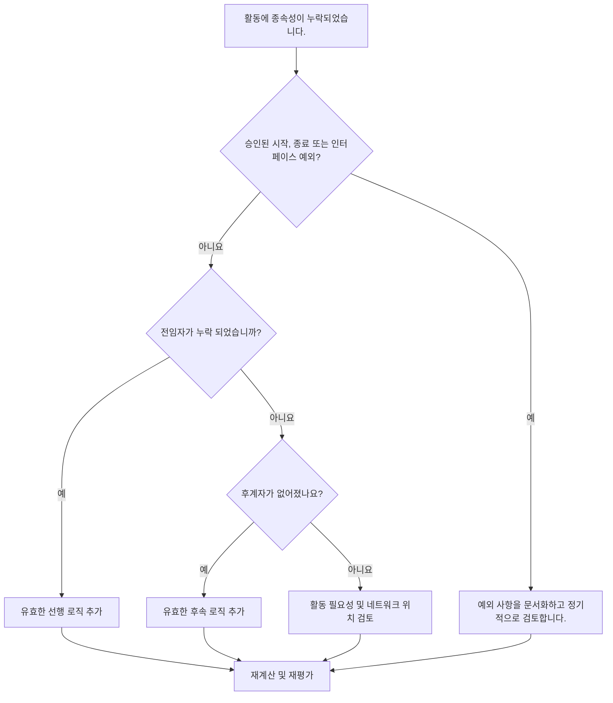

# Primavera P6에서 종속성 누락 - 개선 가이드

## 목적

이 가이드는 스케줄러가 Primavera P6에서 누락된 선행 작업 또는 후속 작업 논리를 식별하고 수정하는 데 도움이 됩니다. CPM 네트워크의 완성도를 높여 공정표 품질을 지원합니다.

## 시작하기 전에

조치를 취하기 전에 다음 정보를 수집하십시오.

- 이 측정항목에 대한 현재 평가 결과입니다.
- 선행 작업이 없는 활동 목록입니다.
- 후속 작업이 없는 활동 목록입니다.
- 선행자 논리나 후속자 논리가 없는 활동 목록입니다.
- 활동 ID, 활동 이름, WBS, 활동 유형, 활동 상태, 시작, 완료, 총 여유시간 및 달력.
- 승인된 프로젝트 시작, 프로젝트 종료, 외부 인터페이스 및 계약 예외 목록.
- 최신 업데이트 참고 사항 및 책임 있는 규율 또는 패키지 소유자.

## 결과 이해

강력한 결과는 종속성 논리가 누락된 해결되지 않은 활동이 없다는 것입니다.

승인된 프로젝트 시작 마일스톤, 최종 완료 마일스톤 또는 승인된 외부 인터페이스 마일스톤과 같은 일부 활동에는 합법적으로 선행 작업이나 후속 작업이 없을 수 있습니다. 이는 제한되고 문서화되어야 합니다.

약한 결과는 일정에 CPM 네트워크에 제대로 연결되지 않은 활동이 포함되어 있음을 의미합니다.

## 개선목표

목표는 종속성이 누락된 해결되지 않은 활동 0개입니다.

목표는 각 활동을 유효한 선행 작업 및 후속 작업 논리에 연결하거나 예외인 승인된 이유를 문서화하는 것입니다.

## 실천 계획

### 1단계: 주요 문제 식별

선행 작업이나 후속 작업이 없거나 둘 다 없는 활동을 필터링하는 P6 레이아웃 또는 보고서를 만듭니다. 활동 ID, 활동 이름, WBS, 활동 유형, 활동 상태, 시작, 완료, 총 부동, 달력, 제약조건, 선행 작업 및 후속 작업을 포함합니다.

각 활동을 검토하고 질문하십시오.

- 이 활동은 승인된 프로젝트 시작 또는 프로젝트 완료 항목입니까?
- 외부 인터페이스입니까, 소유자가 통제하는 날짜입니까, 아니면 계약상의 예외입니까?
- 이 활동을 시작하려면 어떤 작업이 이루어져야 합니까?
- 이 활동이 끝나거나 시작되느냐에 따라 어떤 작업이 달라지나요?
- 활동이 더 이상 사용되지 않거나, 중복되거나, 상태가 잘못되었습니까?
- 실제 종속성을 확인할 수 있는 소유자는 누구입니까?

### 2단계: 권장 수정사항 적용

공개 시작의 경우 활동을 시작하기 전에 필요한 실제 조건을 나타내는 선행 논리를 추가합니다. 여기에는 사전 작업, 승인, 접근, 조달, 설계 출시, 검사 또는 인계가 포함될 수 있습니다.

열린 마무리의 경우 활동에 따라 달라지는 것을 나타내는 후속 로직을 추가합니다. 여기에는 후속 작업, 테스트, 시운전, 이직, 종료 또는 완료 이정표가 포함될 수 있습니다.

선행 작업과 후속 작업이 없는 격리된 활동의 경우 해당 활동이 여전히 필요한지 확인합니다. 유효한 작업이라면 네트워크에 연결하세요. 더 이상 사용되지 않는 경우 프로젝트 관리 절차에 따라 제거하거나 닫으십시오.

### 3단계: 일반적인 차단 요소 제거

일반적인 차단 요인에는 복사된 활동, 불완전한 조각, 분야 간의 불분명한 핸드오프, 인터페이스 정보 누락, 순서가 알려지기 전에 활동을 로드하라는 압력 등이 있습니다.

또 다른 차단 요인은 메트릭을 전달하기 위해서만 자리 표시자 관계를 추가하는 것입니다. 관계는 인위적인 링크가 아닌 실제 종속성을 나타내야 합니다.

### 4단계: 변경 사항 확인

수정 후 공정표를 다시 계산합니다. 메트릭을 다시 실행하고 나머지 각 활동이 연결되었거나 승인된 예외로 문서화되었는지 확인합니다.

총 부동, 중요 또는 최장 경로, 마일스톤 날짜, 단기 예측 보고서를 검토하여 추가된 논리로 인해 예상치 못한 움직임이 발생하지 않았는지 확인하세요.

## 개선 일정

### 1일차: 검토 및 진단

누락된 선행 작업, 누락된 후속 작업, 격리된 활동, 유효한 예외 및 사용되지 않는 활동에 대한 지표 및 그룹 결과를 실행합니다.

### 2~3일: 우선순위 조치 구현

중요하고, 거의 중요하고, 계약적이며, 단기적인 활동을 먼저 수정하십시오. 적절한 경우 유효한 논리를 추가하고 더 이상 사용되지 않는 활동을 제거합니다.

### 4~5일차: 초기 결과 모니터링

공정표를 다시 계산하고 여유시간, 주요 경로, 예측 날짜 및 마일스톤 영향을 검토합니다.

### 6일차: 최종 조정

분야 리더, 패키지 소유자, 건설 관리자 또는 프로젝트 통제 리더십을 통해 나머지 종속성 문제를 해결하세요.

### 7일차: 재평가 및 비교

평가를 다시 실행하고 결과를 목표 임계값과 비교합니다.

## 진행 상황 추적

간단한 추적기를 사용하여 수정 및 승인을 관리하세요.

| 날짜 | 취해진 조치 | 기대효과 | 결과/관찰 | 다음 단계 |
| --- | --- | --- | --- | --- |
| [날짜] | 누락된 종속성을 검토했습니다. | 개방형 시작 및 개방형 종료 식별 | [관찰 결과] | 소유자 지정 |
| [날짜] | 선행 로직이 추가되었습니다. | 활동 시작 로직 개선 | [관찰 결과] | 일정 재계산 |
| [날짜] | 후속 로직 추가 | 활동 종료 연속성 향상 | [관찰 결과] | 측정항목 재평가 |

## 결과가 개선되지 않는 경우

결과가 개선되지 않으면 논리 없이 새 활동이 추가되는지, 가져온 단편이 불완전한지 또는 예외 규칙이 너무 느슨한지 확인하십시오.

해결되지 않은 항목이 중요 경로, 고객 보고, 지불 일정, 인계, 조달 또는 단기 실행에 영향을 미치는 경우 에스컬레이션합니다.

## 유지

모든 업데이트 주기 동안, 일정 가져오기 후, 기준 승인 전에 이 측정항목을 검토하세요. 누락된 종속성은 표준 일정 상태 확인의 일부여야 합니다.

## 요약 체크리스트

- [ ] 현재 결과가 검토되었습니다.
- [ ] 목표 임계값 확인됨
- [ ] 오픈 스타트 검토
- [ ] 열린 완료 검토
- [ ] 격리된 활동을 검토했습니다.
- [ ] 문서화된 유효한 예외
- [ ] 누락된 선행 로직이 추가되었습니다.
- [ ] 누락된 후속 로직이 추가되었습니다.
- [ ] 더 이상 사용되지 않는 활동이 해결되었습니다.
- [ ] 일정이 다시 계산되었습니다.
- [ ] 평가가 반복됨
- [ ] 문서화된 다음 단계
## 관련 콘텐츠
- [Primavera P6에서 종속성 누락 - 개요](01_overview_template.md)
- [Primavera P6에서 종속성 누락](03_blog_template.md)
- [일정이란 무엇입니까?](../../10b_blogs_ko/01_WHAT%20A%20SCHEDULE%20IS/01_blog.md)
- [견고한 논리](../../10b_blogs_ko/02_ROBUST%20LOGIC/02_ROBUST%20LOGIC.md)
